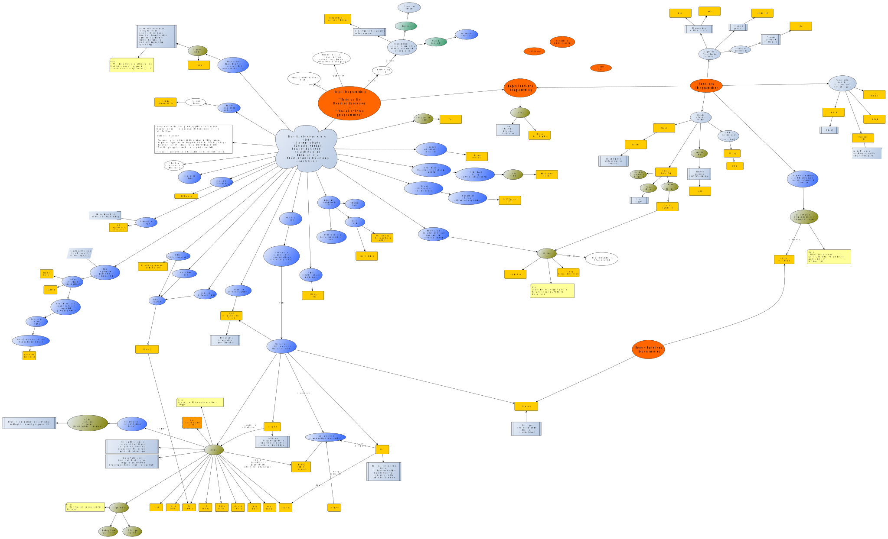

# Prolog Notes

Some notes taken while working on Prolog (most SWI-Prolog)

## A Tradition

_From [The Fifty-three Stations of the Tōkaidō](https://en.wikipedia.org/wiki/The_Fifty-three_Stations_of_the_T%C5%8Dkaid%C5%8D) by Utagawa Hiroshige, 1832._

## The Logic Programming Landscape

So many *modeling languages* which are also *programming languages*, all a bit different.

Missed in the above: 

- [αProlog](https://homepages.inf.ed.ac.uk/jcheney/programs/aprolog/) (Currently frozen?)
- [GOLOG](https://en.wikipedia.org/wiki/GOLOG) (Ancient, based on Situation Calculus. What's the relationship to LPS?)
- [MProlog](https://www.mimuw.edu.pl/~nguyen/mpl.pdf) (PDF) for [Modal Logic](https://plato.stanford.edu/entries/logic-modal/)
- NProlog: An extension of prolog with hypothetical implication. 
   - [part 1](https://www.sciencedirect.com/science/article/pii/0743106684900293)
   - [part 2](https://www.sciencedirect.com/science/article/pii/S0743106685800030)
- [HYPROLOG](http://akira.ruc.dk/~henning/hyprolog/) A Logic Programming Language with Abduction and Assumptions
- [LogicBlox](https://developer.logicblox.com/technology/)
- [Datalog](https://en.wikipedia.org/wiki/Datalog)
- [Logical Frameworks](https://en.wikipedia.org/wiki/Logical_framework)
- [Markov Logic Networks](https://en.wikipedia.org/wiki/Markov_logic_network) -- This seems to be hot right now
- Lambda-Prolog: [A pragmatic reconstruction of Lambda-Prolog](https://hal-enac.archives-ouvertes.fr/hal-00934033)
- There should be something here on implementation of more general theorem provers using the very restricted top-down 
  theorem prover (or rather, "enumerating consequence checker") of Prolog. And how do you direct search in a theorem prover anyway?
  The NP desert is not for the faint of heart.

## Notes on...

### Rule-based Systems

A general overview: [Rule-based Systems](other_notes/about_rule_based_systems)

### Are we working in the correct Logic?

Prolog seems to work in classical logic, but: [About the Logic](other_notes/about_the_logic/)

### Truth values

Prolog is two-valued, but: [About the Truth Values](other_notes/about_truth_values/)

### Depicting Terms

Prolog naming and concepts are confusing. My way to name & graphically represent terms: [Terms](other_notes/about_depicting_terms/) (needs review)

## More subjects, general and SWI-Prolog oriented

- [About the Byrd Box Model](other_notes/about_byrd_box_model) (rather complete)
- [SWI-Prolog data types](swipl_notes/about_swipl_data_types) (rather complete)
- [Exceptions](swipl_notes/about_exceptions) (rather complete)
- [Output formatting](swipl_notes/about_output_formatting) (rather complete)
- [How to load a library (the lynx library in this case)](swipl_notes/loading_lynx_library.md)
- [The use of the caret `^` in` bagof/3`, `setof/3`](swipl_notes/notes_on_the_caret_used_in_bagof_goals.md)
- [SWI-Prolog string modes](swipl_notes/swipl_string_modes.md)
- [`dif/2`](swipl_notes/about_dif) (rather complete)
- ["Difference Lists"](swipl_notes/about_difference_lists/)
- Questions on `maplist/N` are recurrent and popular (not only on Stack Overflow), so these page collect notes & examples:
   - [maplist_2_examples.md](maplist/maplist_2_examples.md): Examples and major explainer for [`maplist/2`](https://www.swi-prolog.org/pldoc/man?predicate=maplist%2f2)
   - [maplist_3_examples.md](maplist/maplist_3_examples.md): Examples for [`maplist/3`](https://www.swi-prolog.org/pldoc/doc_for?object=maplist/3)
   - [maplist_4_examples.md](maplist/maplist_4_examples.md): Examples for [`maplist/4`](https://www.swi-prolog.org/pldoc/doc_for?object=maplist/4)
- Linear "fold" in Prolog: [`foldl` and `foldr`](other_notes/about_foldl_and_foldr), Explainer and code

### Under construction

- [About DCGs](swipl_notes/about_dcgs)
- [About Prolog DB operations](swipl_notes/about_prolog_db_operations)

## Code grabbag

Some predicates which may be of general use can be found in the [Code grabbag](code/)

## External Resources

- [The first page of the SWI-Prolog manual has a large comment with pointers to resources](https://eu.swi-prolog.org/pldoc/doc_for?object=manual) ... sometimes I add something to that comment.
- [Extensive list at klaussinani's github account](https://github.com/klaussinani/awesome-prolog#resources)
- [The **Prolog Syntax Highlighting** file for KDE](https://cgit.kde.org/syntax-highlighting.git/tree/data/syntax/prolog.xml) (by Torsten Eichstädt), as used in the [Kate editor](https://docs.kde.org/trunk5/en/applications/katepart/highlight.html)
- [Bug Hunting Toolbox Wiki Page at SWI-Prolog Discourse Site](https://swi-prolog.discourse.group/t/bug-hunting-toolbox/710)
- [Frank Pfenning's Course on Logic Programming](http://www.cs.cmu.edu/~fp/courses/lp/) ([Lecture Notes as one PDF](http://www.cs.cmu.edu/~fp/courses/lp/lectures/lp-all.pdf) ... 324 pages). Hardcore!   

### On YouTube: "The Power of Prolog" by Markus Triska

Gotta watch them all: [List of uploads](other_notes/about_power_of_prolog_on_youtube/)
  
### Papers of Interest

A small selection: [List of papers](other_notes/about_papers_of_interest/)

### Packages of Interest

- https://github.com/shonfeder/tokenize - "A modest tokenization library for SWI-Prolog, seeking a balance between simplicity and flexibility."

