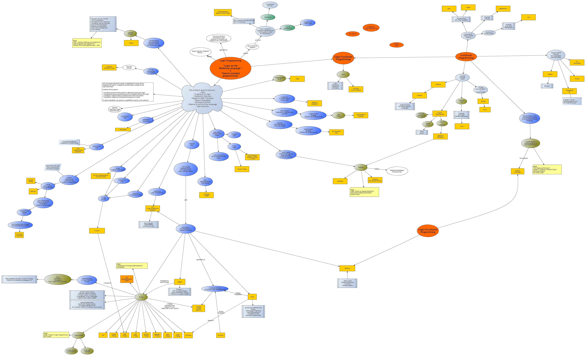

# prolog_notes
Some notes taken while working on Prolog

## The Logic Programming Landscape

## A Tradition

From [The Fifty-three Stations of the Tōkaidō](https://en.wikipedia.org/wiki/The_Fifty-three_Stations_of_the_T%C5%8Dkaid%C5%8D) by Utagawa Hiroshige, 1832.

## External Resources

- [The first page of the SWI-Prolog manual has a large comment with pointers to resources](https://eu.swi-prolog.org/pldoc/doc_for?object=manual)
- [Extensive list at klaussinani's github account](https://github.com/klaussinani/awesome-prolog#resources)

## Pages in this repository

### Code grabbag

Some predicates which may be of general use can be found in the [Code grabbag](code/README.md)

- [`vector_nth0/3`](code/vector_nth0.pl): Retrieve in a list on multiple positions, by index.
- [`splinter0/5`](code/splinter0.pl): Break a list into three parts based on index.
- [`replace0/5`](code/splinter0.pl): Replace in a list based on index.
- [`rotate_list/3`](code/rotate_list.pl): Rotate a list left or right.
- [`vector_replace0/4`](code/vector_replace0.pl): Replace in a list on multiple positions, by index.

### Notes on Prolog & SWI-Prolog

These are notes on specific subjects taken while working with Prolog in general and SWI-Prolog in particular.

- [Loading a library (the lynx library in this case)](swipl_notes/loading_lynx_library.md)
- [Use of the caret ^ in` bagof/3`, `setof/3`](swipl_notes/notes_on_the_caret_used_in_bagof_goals.md)
- [Predicates for printing & formatting](swipl_notes/output_formatting.md)
- [SWI-Prolog string modes](swipl_notes/swipl_string_modes.md)

And also

- [Tree of Types of SWI-Prolog](swi_prolog_types)

And also

- [`foldl` and `foldr`](foldl_foldr/)

### Notes on `maplist/N`

Questions on `maplist/N` are recurrent (not only on Stack Overflow), so these page collecte notes & examples:

- [maplist_2_examples.md](maplist/maplist_2_examples.md): Examples and major explainer for [`maplist/2`](https://www.swi-prolog.org/pldoc/man?predicate=maplist%2f2)
- [maplist_3_examples.md](maplist/maplist_3_examples.md): Examples for [`maplist/3`](https://www.swi-prolog.org/pldoc/doc_for?object=maplist/3)
- [maplist_4_examples.md](maplist/maplist_4_examples.md): Examples for [`maplist/4`](https://www.swi-prolog.org/pldoc/doc_for?object=maplist/4)

