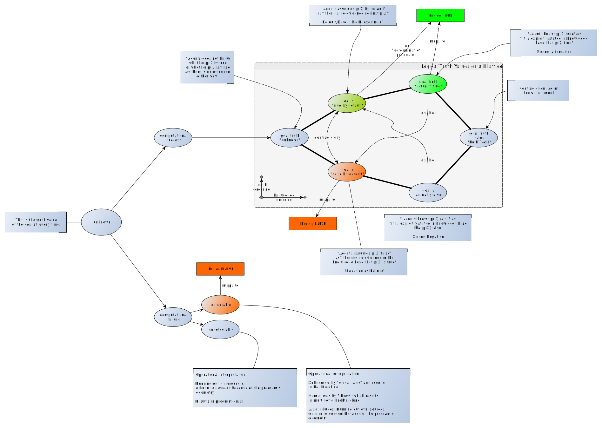

# prolog_notes

Some notes taken while working on Prolog

## The Logic Programming Landscape

Missed in the above: 

- [αProlog](https://homepages.inf.ed.ac.uk/jcheney/programs/aprolog/) (Currently frozen?)
- [GOLOG](https://en.wikipedia.org/wiki/GOLOG) (Ancient, based on Situation Calculus. What's the relationship to LPS?)
- [MProlog](https://www.mimuw.edu.pl/~nguyen/mpl.pdf) (PDF) for [Modal Logic](https://plato.stanford.edu/entries/logic-modal/)
- [HYPROLOG](http://akira.ruc.dk/~henning/hyprolog/) A Logic Programming Language with Abduction and Assumptions
- [Markov Logic Networks](https://en.wikipedia.org/wiki/Markov_logic_network) 
- [LogicBlox](https://developer.logicblox.com/technology/)
- [Datalog](https://en.wikipedia.org/wiki/Datalog)
- More on [Logical Frameworks](https://en.wikipedia.org/wiki/Logical_framework)

## Rule-based Systems

A very low-fidelity overview, but one needs general maps.

This an offshoot from this question on StackOverflow: [Forward and Backward Chaining](https://stackoverflow.com/questions/62376526/forward-and-backward-chaining). One error is that CHR does not do backtracking (it is "commited choice" - the backtracking is provided by the calling Prolog system). To be corrected!

## Truth Values

Once you think about it, you notice that Prolog is both cheating in pretending that it is working in two-valued logic and also deficient in modeling capabilities by keeping to two-valued logic. One day this may be extended! See also: [Paraconsistent Logic](https://plato.stanford.edu/entries/logic-paraconsistent/).

## Are we working in the correct Logic?

From _"Logic Programming with Strong Negation"_ (David Pearce, Gerd Wagner, FU Berlin, 1991), appears in [Springer LNAI 475](https://link.springer.com/book/10.1007/BFb0038689): Extensions of Logic Programming, International Workshop Tübingen, FRG, December 8–10, 1989 Proceedings):

> According to the standard view, a logic program is a set of definite Horn clauses. Thus, logic programs are regarded as syntactically restricted first-order theories within the framework of classical logic. Correspondingly, the proof theory of logic programs is considered as the specialized version of classical resolution, known as SLD-resolution. This view, however, neglects the fact that a program clause, a_0 <— a_1, a_2, • • •, a_n, is an expression of a fragment of positive logic (a subsystem of intuitionistic logic) rather than an implicational formula of classical logic. The classical interpretation of logic programs, therefore, seems to be a semantical overkill.
>
> It should be clear that in order to explain the deduction mechanism of Prolog one does not have to refer to the indirect method of SLD-resolution which checks for the refutability of the contrary. It is certainly more natural to view Prolog's proof procedure as a kind of natural deduction, as, for example, in [Hallnäs & Schroeder-Heister 1987] and [Miller 1989]. This also is more in line with the intuitions of a Prolog programmer. Since Prolog is the paradigm, logic programming
semantics should take it as a point of departure. 

See also: [Logic programming with strong negation and inexact predicates (1991)](http://citeseerx.ist.psu.edu/viewdoc/summary?doi=10.1.1.975.3445&rank=1), where we read:

> Akama [S.Akama (1987): Resolution in constructivism, Logique et Analyse, 120, 385-392] proposed to use constructive logic for the interpretation of logic programming. He showed how the resolution calculus for definite Horn clauses can be interpreted within constructive logic. In fact, he makes the point that in the definite Horn clause setting the differences between strong negation, intuitionistic negation and classical negation do not matter. We remark that this observation is not surprising since the language of definite Horn clauses can be viewed as a fragment of positive logic which forms a common subpart of constructive, intuitionistic and classical logic.

Further afield, an interesting note from [Answer Set Programming’s Contributions to Classical Logic](https://people.cs.kuleuven.be/~marc.denecker/ctc.pdf) (appears in Springer LNAI6565, 2011):

> Integrating classical logic and ASP is not a trivial task, as research on rule languages for the semantic web is now also discovering _[J. Pührer, S. Heymans, and T. Eiter. Dealing with inconsistency when combining ontologies and rules using dl-programs]_. Expanding the stable semantics to the syntax of FO (classical first-order logic) as in _[P. Ferraris, J. Lee, and V. Lifschitz. A new perspective on stable models]_ is obviously redefining FO, not integrating ASP and FO. Among subtle problems and tricky mismatches, one glaring difference clearly stands out: ASP uses the answer set as its basic semantic construct, whereas FO of course uses interpretations (or structures). There is a profound difference between the two concepts. As defined in _[M. Gelfond and V. Lifschitz. Classical negation in logic programs and disjunctive databases]_, an answer set is a set of literals that represents a possible state of belief that a rational agent might derive from the logic program. In other words, an answer set is subjective; it does not talk directly about the world itself, but only about the beliefs of an agent about this world. This conception of answer sets is not a philosophical afterthought, but is tightly connected with the view of negation as failure as a modal, epistemic or default operator, and therefore truly lies at the heart of ASP. By contrast, FO has a possible world semantics, in which each model of a theory represents a state of the world that is possible according to this theory. In other words, FO is concerned with objective forms of knowledge, that do not involve propositional attitudes such as the belief or knowledge of an epistemic agent, etc. Modal extensions of classical logic that can express such forms of subjective knowledge typically use [Kripke structures](https://plato.stanford.edu/entries/possible-worlds/) (or the special case of sets of possible worlds) as a semantic object.

Going all philosophical, I am unsure about the difference made above. A logic never talks about "the world itself" unless it is all facts or the world can be directly mapped to the objects subject of the logic (e.g. number theory, or the objects of a Herbrand basis). Any derivation performed is necessarily "just" the agent's belief otherwise.

## Depicting Terms

Being often confused by Prolog naming and concepts, my way to name & graphically represent terms (this is simpler than the one that went before)

Remember:

- Variables are clause-local.
- Terms are global.

It is possible to have [Attributed Variables](https://eu.swi-prolog.org/pldoc/man?section=attvar) so that goals are scheduled when variables are bound.

## Subjects

- [About Exceptions](swipl_notes/about_exceptions) (rather complete)
- [About the Byrd Box Model](swipl_notes/about_byrd_box_model) (rather complete)
- [About SWI-Prolog data types](swipl_notes/about_swipl_data_types) (rather complete)
- [SWI-Prolog datatypes](swipl_datatypes)
- [About output formatting in SWI-Prolog](swipl_notes/about_output_formatting) (semi-complete)
- [About DCGs](swipl_notes/about_dcgs) (just getting started)
- [About Prolog DB operations](swipl_notes/about_prolog_db_operations) (?)
- [About `dif/2`](swipl_notes/about_dif) (rather complete)

## External Resources

- [The first page of the SWI-Prolog manual has a large comment with pointers to resources](https://eu.swi-prolog.org/pldoc/doc_for?object=manual) ... sometimes I add something to that comment.
- [Extensive list at klaussinani's github account](https://github.com/klaussinani/awesome-prolog#resources)
- [The **Prolog Syntax Highlighting** file for KDE](https://cgit.kde.org/syntax-highlighting.git/tree/data/syntax/prolog.xml) (by Torsten Eichstädt), as used in the [Kate editor](https://docs.kde.org/trunk5/en/applications/katepart/highlight.html)
- [Bug Hunting Toolbox Wiki Page at SWI-Prolog Discourse Site](https://swi-prolog.discourse.group/t/bug-hunting-toolbox/710)
- [Frank Pfenning's Course on Logic Programming](http://www.cs.cmu.edu/~fp/courses/lp/) ([Lecture Notes as one PDF](http://www.cs.cmu.edu/~fp/courses/lp/lectures/lp-all.pdf) ... 324 pages). Hardcore!   

### On YouTube: "The Power of Prolog" by Markus Triska

Gotta watch them all: [List of uploads](other_notes/about_power_of_prolog_on_youtube/)
  
### Papers of Interest

A small selection: [List of papers](other_notes/about_papers_of_interest/)

### Packages of Interest

- https://github.com/shonfeder/tokenize - "A modest tokenization library for SWI-Prolog, seeking a balance between simplicity and flexibility."

## Pages in this repository

### Code grabbag

Some predicates which may be of general use can be found in the [Code grabbag](code/README.md)

- [`vector_nth0/3`](code/vector_nth0.pl): Retrieve in a list on multiple positions, by index.
- [`splinter0/5`](code/splinter0.pl): Break a list into three parts based on index.
- [`replace0/5`](code/splinter0.pl): Replace in a list based on index.
- [`rotate_list/3`](code/rotate_list.pl): Rotate a list left or right.
- [`vector_replace0/4`](code/vector_replace0.pl): Replace in a list on multiple positions, by index.

### About SWI Prolog

#### Difference List Explainer

An surprisingly large explainer on difference lists (or list differences). With illustrations. Contains code to
compute the length of a difference list.

- [Difference Lists](difflists/)
   
#### Notes on `maplist/N`

Questions on `maplist/N` are recurrent (not only on Stack Overflow), so these page collecte notes & examples:

- [maplist_2_examples.md](maplist/maplist_2_examples.md): Examples and major explainer for [`maplist/2`](https://www.swi-prolog.org/pldoc/man?predicate=maplist%2f2)
- [maplist_3_examples.md](maplist/maplist_3_examples.md): Examples for [`maplist/3`](https://www.swi-prolog.org/pldoc/doc_for?object=maplist/3)
- [maplist_4_examples.md](maplist/maplist_4_examples.md): Examples for [`maplist/4`](https://www.swi-prolog.org/pldoc/doc_for?object=maplist/4)

#### Linear `foldl` and `foldr` in Prolog

- [`foldl` and `foldr`](foldl_foldr/), Explainer and code

#### Various

These are notes on specific subjects taken while working with Prolog in general and SWI-Prolog in particular.

- [Loading a library (the lynx library in this case)](swipl_notes/loading_lynx_library.md)
- [Use of the caret ^ in` bagof/3`, `setof/3`](swipl_notes/notes_on_the_caret_used_in_bagof_goals.md)
- [Predicates for printing & formatting](swipl_notes/output_formatting.md)
- [SWI-Prolog string modes](swipl_notes/swipl_string_modes.md)

## A Tradition

From [The Fifty-three Stations of the Tōkaidō](https://en.wikipedia.org/wiki/The_Fifty-three_Stations_of_the_T%C5%8Dkaid%C5%8D) by Utagawa Hiroshige, 1832.

