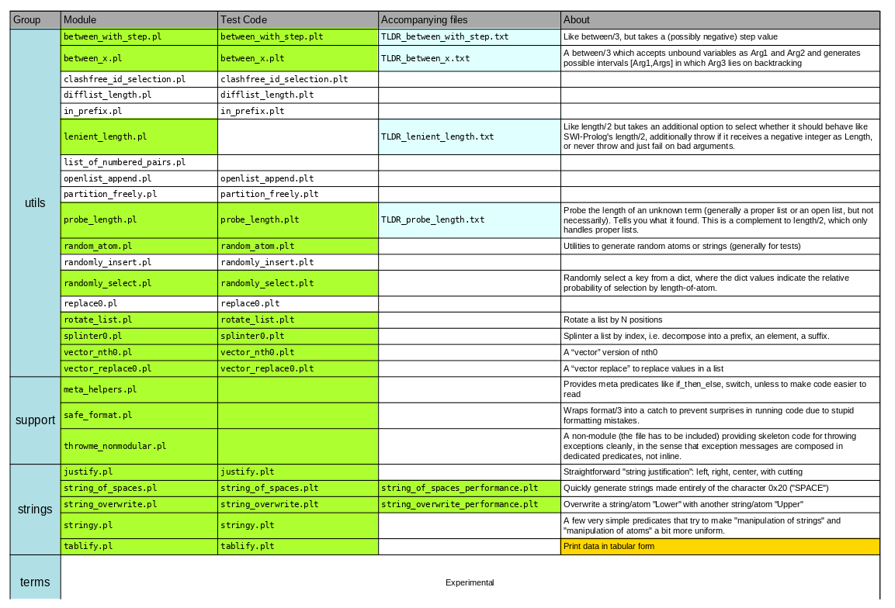

# Code grabbag

## Explainer

A file that is basically an explainer of how I organize & load modules and unit tests.

It is also a Prolog program, that when executed, does exactly that (for my setup).

[`load_and_test_script.pl`](load_and_test_script.pl)

**The ones NOT marked green are currently being updated** 

## String handling utilites

### Miscellaneous

- Code: [`stringy.pl`](heavycarbon/strings/stringy.pl)
- Unit tests: [`stringy.plt`](heavycarbon/strings/stringy.plt)

### Generate strings of spaces

- Code: [`string_of_spaces.pl`](heavycarbon/strings/string_of_spaces.pl)
- Unit tests: [`string_of_spaces.plt`](heavycarbon/strings/string_of_spaces.plt)

### Overwrite a string with another

- Code: [`string_overwrite.pl`](heavycarbon/strings/string_overwrite.pl)
- Unit tests: [`string_overwrie.plt`](heavycarbon/strings/string_overwrite.plt)

### Left/Right/Center justify a string

- Code: [`justify.pl`](heavycarbon/strings/justify.pl)
- Unit tests: [`justify.plt`](heavycarbon/strings/justify.plt)

### Display data in tabular form

- Code: [`tablify.pl`](heavycarbon/strings/tablify.pl)
- Unit tests: [`tablify.plt`](heavycarbon/strings/tablify.plt)
