# The Difference List

## References

- ["Difference List" wiki entry](https://swi-prolog.discourse.group/t/difference-list/959) at Prolog Discourse site.
- ["Difference Lists" by Frank Pfenning](https://www.cs.cmu.edu/~fp/courses/lp/lectures/11-diff.pdf) (PDF)
- [Applying "Difference Lists" to DCGs by Markus Triska](https://www.metalevel.at/prolog/dcg). "Difference Lists" are called "List Differences" here: _In the literature, you will also encounter the term "difference list". However, this terminology is misleading: We are not talking about—as the name may suggest—a special kind of list. The additional arguments are completely ordinary lists. It is their differences that matter especially in such cases._
- [Presentation on Difference Lists](https://www.cl.cam.ac.uk/teaching/0809/Prolog/Prolog08ML5R2.pdf) by David Eyers at University of Cambridge, for the [Prolog Course](https://www.cl.cam.ac.uk/teaching/0809/Prolog/).

## About 

In Prolog, it is cheap to prepend an item to a list (also called "pushing an item onto a list" if it is regarded
as a stack.  

However, in order to append efficiently, you need the difference list pattern. It is a "pattern" because
there is real data structure corresponding to a "difference list". Just a set of conventions.

### Note on monotonicty 

Note that the "difflistyness" of a term is not a monotonic property. If you had a predicate `is_difflist/1`,
then querying `is_difflist(X)` on the same `X` as computation proceeds may give you `true`, `true`, `true`,
`true`, `false`. The response may change from `true` to `false`, but once it's `false`, it stays `false`. At
which time you know this is no longer about pure logic and that you are actually asking `is_unconstrained_enough_to_be_difflist_at_this_point/1`.

Compare with `is_list/1` which may do the converse as computation proceeds: `false`, `false`, `false`, `true` (or
even better `unknown`, `unknown`, `unknown`, `true`, but Prolog has no `unknown` in spite of being all constructivist)
which should be properly named `is_constrained_enough_to_be_list_at_this_point/1`.

### Note on length

This code:

[difflist_length.pl](difflist_length.pl)

defines predicate `length_dl/3`, which relates a _Tip-Fin_ difflist with its length (which is the number of items on
the backbone between _Tip_ and _Fin_). If the difflist turns out to be a proper/closed list, it computes the length of
the closed list (i.e. behaves as [`length/2`](https://eu.swi-prolog.org/pldoc/doc_for?object=length/2)). If the difflist 
does not follow difflist structure conventions, it throws `domain_error`.

This code:

[difflist_length_sly.pl](difflist_length_sly.pl) _Just an experiment_

defines predicate `length_dl_sly/2`, which also relates a _Tip-Fin_ difflist with its length, but suing an inner predicate
which slyly first closes the list, employs the standard `length/2` to determine the length of the now closed list, then
throws an exception to both roll back to the non-closed difflist state and get the length value out of the state
that is being erased. It doesn't detect all cases of badly formed difflists though. 

## Naming and Graphing

First take a look at this page, which defines the symbols and the vocabulary used below: [Naming and Symbols](../naming_and_symbols/README.md).

From that page:

Four classical nouns: _Head_ and _Tail_, used when the `|` notation comes into play, as well as `Front` and `Back`,
which designate sides of a list:

```
Front  [H0,H1,H2 | T ]  Back
        |      |   |
        <------>   ^    A 3-item Head vs a Tail of arbitrary length
 
Front  [ H | T ]        Back
         |
        Tip             A One-Item Head (a Tip) vs a Tail of arbitrary length
```

Two non-classical nouns: _Tip_ and _Fin_, used when we talk of the very first and very last item of a list. 
Somettimes on wants to specicially talk about the `[|]` arity-2 nodes of the backbone, then it's the 
_Backbone Tip_ and _Backbone Fin_.

```
Front  [I0,I1,I2,I3,......,I(-3),I(-2),I(-1)]  Back
        ^                                 ^
        |__Tip (First Item)               |__Fin/End (Last Item)
```

The basis of a _List Difference_ or _Difference List_ or _Difflist_ is a list-like structure where the 
backbone _Fin_ does not reference a `[]` "to its left" but rather a fresh term. We call this structure 
an _Unterminated List_ or an _Open List_ (also called a _Partial List_). Transforming an _Open List_ into 
a _Closed List_ by constraining the
final fresh term to `[]` (or to any other closed list of length L >= 0) is called _Closing the List_. The structure,
now properly terminated in `[]`, it is a real list, alternatively called a _Closed List_. 

The difference list is generally represented by a pair of variables `A-B` where `A` references the backbone _Tip_ and
`B` references the fresh variable one past the backbone _Fin_ (and thus, `B` it is a fresh variable referencing the
fresh term in which the list backbone ends). Both `A` , as a special kind of _Backbone Tip_ and `B` need special
names: let's use _Open Tip_ and _Open Fin_.

A special case is the empty difference list, which consists of a single fresh term, named alike by the _Open Tip_
and the _Open Fin_ as `F-F = OTip-OFin`. Note that `OTip` references what would be the empty list if this were
a closed list. It is definitely not a "normal _Tip_".

## Difference List as Queue

If the difference list is ised in the role of a queue, you can see why it is "a difference of two lists":

- Items are appended at the _Open Fin_, the variable designating the _Open Fin_ is replaced by a new one
  at every append and "wanders rightwards".
- Items are dropped off the _Open Tip_, the variable designating the _Open Tip_ (and thus the rest of the 
  _Open List_ is replaced at every append and also "wanders rightwards"-
- What is actually _in_ the "difference of two lists"  is between the _Open Tip_ and the _Open Fin_.

## Simply appending to a Difference List

Consider this program, which exercises the difference list pattern, in short form and extensive form complete with
debugging output:

### (Very) Short Form

```Logtalk
% Starter. predicate. "Data" is a list to append to a difference list,
% "Result" is the result of the appending, and is supposed to be
% equal to Data after the call. But one cannot call "dl_do(Data,Data)"
% that would seize up the computation.

dl_do(Data,Result) :- dl_append_all(Data,Result-Result).

% The recursion. The first clause appends aother iten "X" from "Data",
% the second "closes" the difference list when the end of "Data" has been
% reached.

dl_append_all([X|Xs],DL) :- 
   dl_append(X,DL,DLlonger),
   dl_append_all(Xs,DLlonger).
   
dl_append_all([],_-[]). 

% Appending a single item to the difflist can be done in a single fact
% using assembling/disassembling.

dl_append(X,Tip-[X|NewFin],Tip-NewFin). 

% Unit tests

:- begin_tests(difflist).

test(one, true(R=[1,2,3])) :- dl_do([1,2,3],R).
test(two, true(R=[]))      :- dl_do([],R).
   
:- end_tests(difflist).

rt :- run_tests(difflist).
```

### Extensive Form, with Debug Output

It is so extensive that is is better in a separate file: [dl.pl](dl.pl).

Running it gives the following output. The integer shows the recursion depth (alternatively, the 
index of the input list item that is being currently copied). Note that the `dl_append` operation
destroy the "difflist" character of the term referenced by `DL` in the current stack frame.
The result of the appends is found in the _Tip_ of the closed difflist.

``` 
?- debug(dl),run_tests(difflist).
% PL-Unit: difflist 
% 0: DL before dl_append: Empty difflist: ∅
% 0: DL after dl_append: Unknown stuff: [1|_2716]-[1|_2716]
% 1: DL before dl_append: Nonempty difflist: [1|∅]
% 1: DL after dl_append: Unknown stuff: [1,2|_3096]-[2|_3096]
% 2: DL before dl_append: Nonempty difflist: [1,2|∅]
% 2: DL after dl_append: Unknown stuff: [1,2,3|_3518]-[3|_3518]
% 3: DL before closing: Nonempty difflist: [1,2,3|∅]
% 3: DL after closing: Closed difflist: [1,2,3]-[]
% 2: DL after dl_append_all: Closed difflist: [1,2,3]-[3]
% 1: DL after dl_append_all: Closed difflist: [1,2,3]-[2,3]
% 0: DL after dl_append_all: Closed difflist: [1,2,3]-[1,2,3]
.
% 0: DL before closing: Empty difflist: ∅
% 0: DL after closing: Closed difflist: []-[]
. done
% All 2 tests passed
true.
``` 

## Graphing the data structure

We here use the variable names from the extensive code version, [dl.pl](dl.pl).

We want to append three items to a newly constructed difference list.

### Construct initial difference list in `dl_do/2`

```
DL = I-I
```

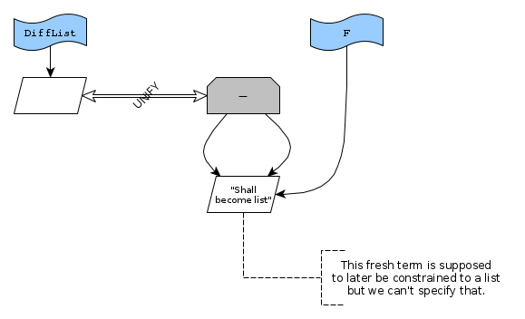

...results in

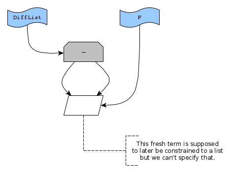

### Append first item inside `dl_append/3`

```
DL = Tip-Fin
```

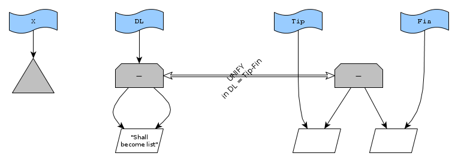

...results in

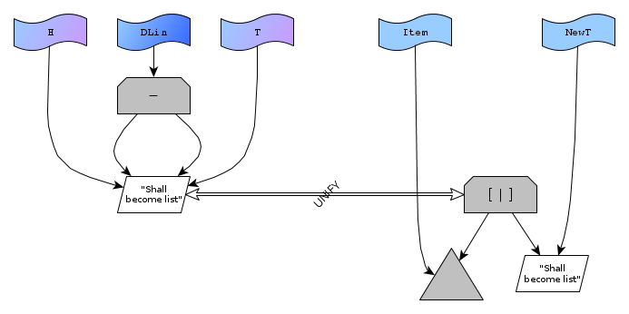

```
Fin = [X|NewFin]
```

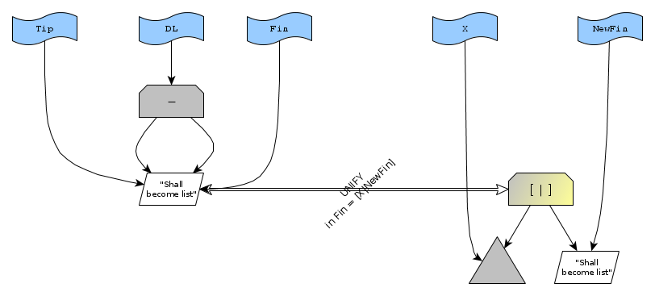

...results in

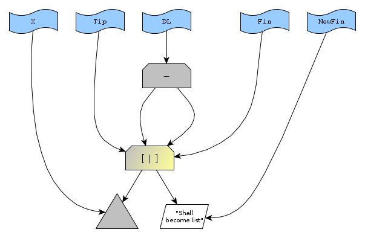

A this point, `Tip` and `Fin`, and thus `DL`, no longer form a difference list (the underlying structure no
longer matches the difflist conventions) but `Tip` and `NewFin` do, so that's what will be retained.

So construct new difflist according to the `Tip-Fin` convention.
`DLlonger` combines the open list rooted at `Tip` and the open fin at `NewFin`.

```
DLlonger = Tip-NewFin
```

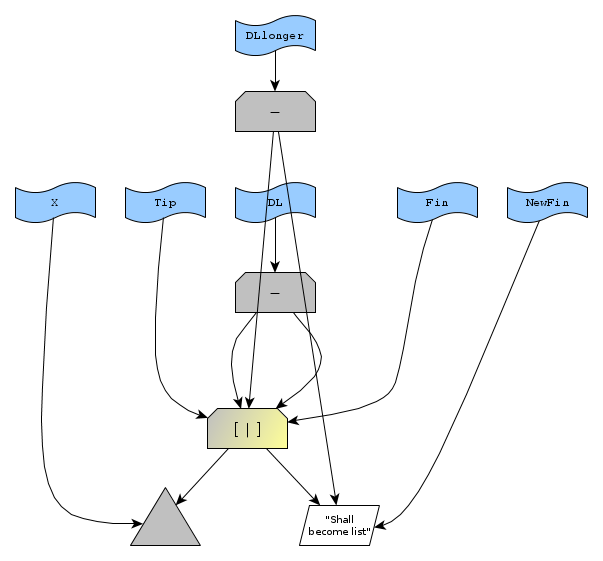

...or more cleanly


### Append second item inside `dl_append/3`

Now we are ready for a second round of appending.

```
DL = Tip-Fin
```

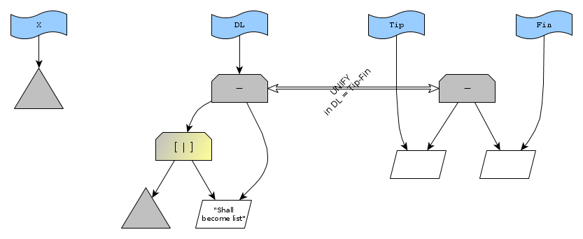

...results in

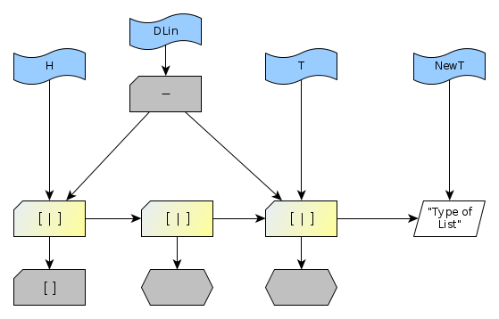

```
Fin = [X|NewFin]
```

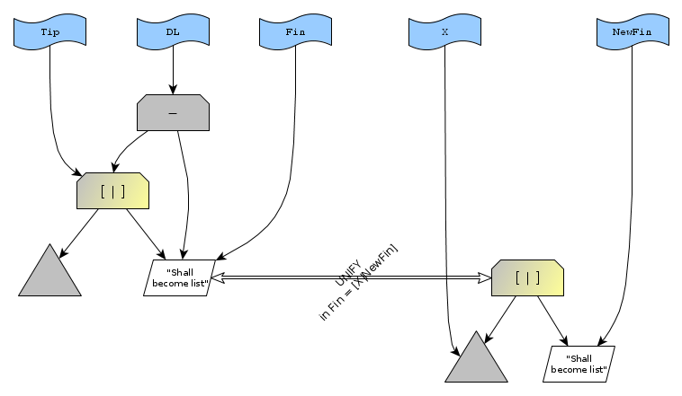

...results in


This destroys the "difflistyness" of `DL`. Now plant a `DLlonger` on top as the new 
structure following the difflist conventions:

```
DLlonger = Tip-NewFin
```

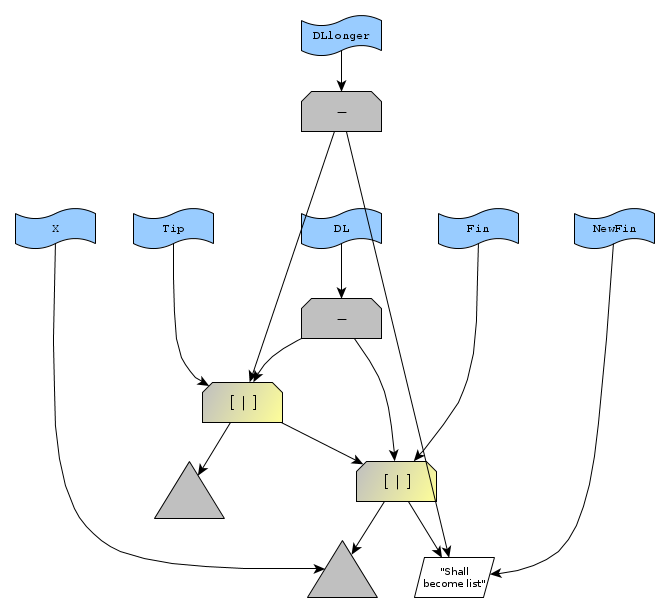

...or more cleanly

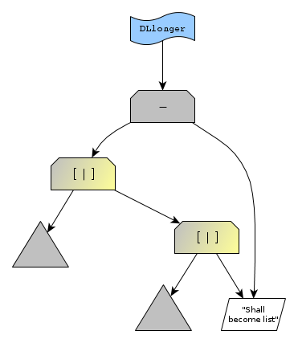

Ready for the next round!

### Append third item inside `dl_append/3`

And again

```
DL = Tip-Fin
```

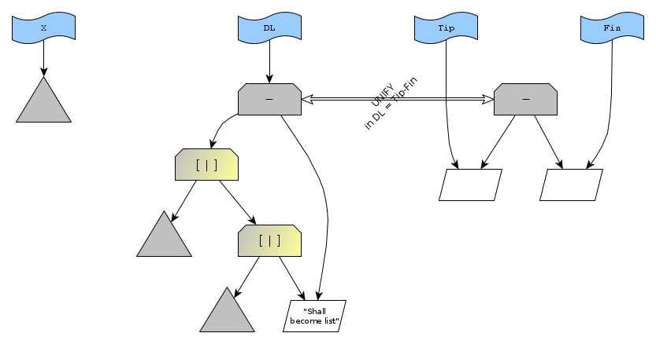

...results in

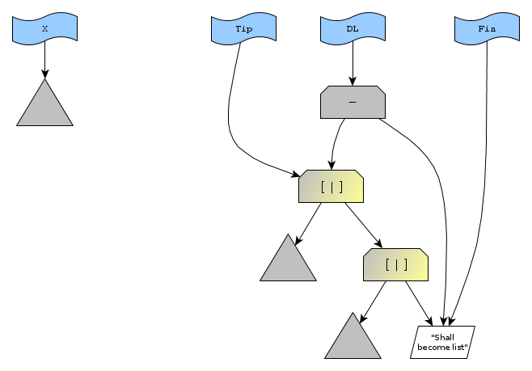

```
Fin = [X|NewFin]
```


...results in

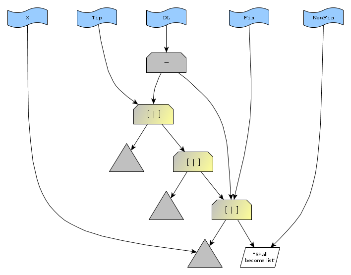

This destroys the "difflistyness" of `DL`. Now plant a `DLlonger` on top as the new 
structure following the difflist conventions:

```
DLlonger = Tip-NewFin
```

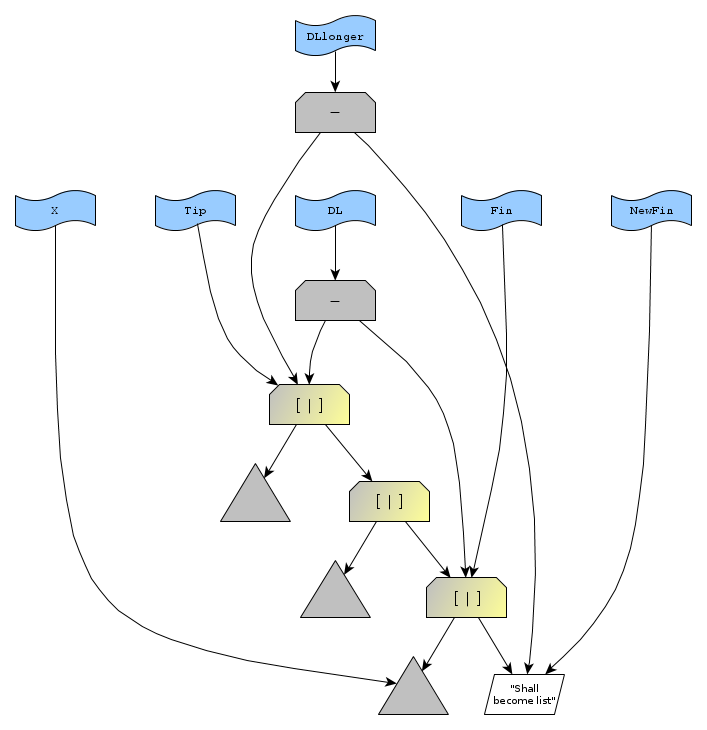

...or more cleanly


Ready for the next round! But there are no more items, so we will just close the open list.

### Close the open list inside `dl_close/1`

This is extremely straightforward. 

Disassembly of `DL`

```
DL = _Tip-Fin
```

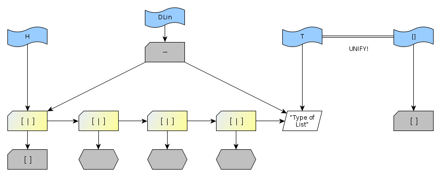

...results in

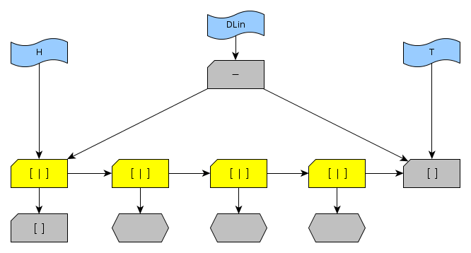

```
Fin=[]
```

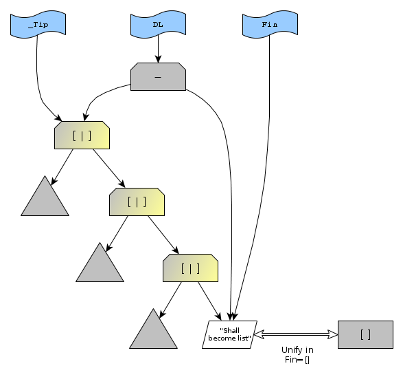

gives a closed list.

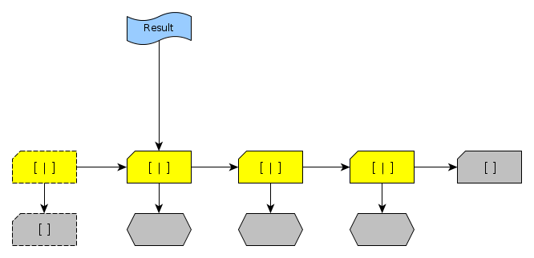

The list itself can be obtained from `_Tip`. 

In this case, the entry-point predicate `dl_do/2` has retained the 
reference to the the tip of the list in `I`, so once the point of predicate succeess is attained,
nothing further needs to be done!


