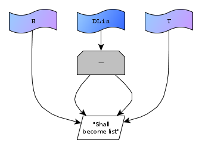
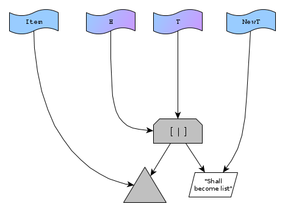
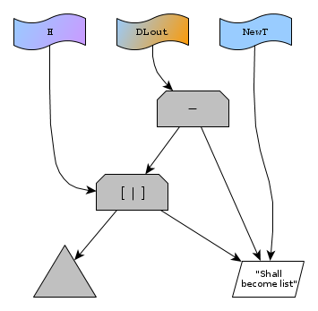

# The Difference List

- ["Difference List" wiki entry](https://swi-prolog.discourse.group/t/difference-list/959) at Prolog Discourse site.
- ["Difference Lists" by Frank Pfenning](https://www.cs.cmu.edu/~fp/courses/lp/lectures/11-diff.pdf) (PDF)
- [Applying "Difference Lists" to DCGs by Markus Triska](https://www.metalevel.at/prolog/dcg). "Difference Lists" are called "List Differences" here: _In the literature, you will also encounter the term "difference list". However, this terminology is misleading: We are not talking about—as the name may suggest—a special kind of list. The additional arguments are completely ordinary lists. It is their differences that matter especially in such cases._
- [Presentation on Difference Lists](https://www.cl.cam.ac.uk/teaching/0809/Prolog/Prolog08ML5R2.pdf) by David Eyers at University of Cambridge, for the [Prolog Course](https://www.cl.cam.ac.uk/teaching/0809/Prolog/).

"Difflist as a queue" is actually very illustrative of the "list difference" idea:

- Items are appended at the front of the tail, the variable of the tail "wanders rightwards"
- Items are dropped off the front of the head, the variable of the head "wanders rightwards"
- What is actually in the difflist is alwasy the list difference ... what is between tail var and head var.      

## Naming and Graphing

To clarify the concepts, I will introduce the following vocabulary and assorted symbols for a pictorial representation. This vocabulary is maybe a bit shifted relative to what is used "normally", but what is used "normally" is sometimes confusing and may hinder clearly expressing what is going on.

This is what we have:

### "Variable Name"

A _Variable Name_ is an indirect reference to a _Term_ (i.e. a "name" or a "stand-in"; you are supposed to use a
dictionary to find the corresponding _Term_). A _Variable Name_ appears in clauses or at the Prolog Toplevel.

A _Variable Name_ is represented by a syntactic element that stars with an uppercase latter: `X`.

When the discussed meaning shifts towards the relationship between the _Variable Name_ and the _Term_ it references,
one starts to use the words _Variable_ or _Logical Variable_, and the adjective-adorned expressions
_Fresh Variable_ and _Nonfresh Variable_.

A _Variable Name_ is always clause-local, and the _Term_ it references is always program-global.

#### "Fresh Variable"

The relationship between a _Variable Name_ and a _Term_ is called a _Fresh Variable_ when the designated term is 
a _Fresh Term_. One also talks about an _Unbound Variable_ (gives an imperative programming feel though.)

[`var(X)`](https://eu.swi-prolog.org/pldoc/doc_for?object=var/1) (where `X` is the syntactic element that 
represents the _Variable Name_) yields `true`. 

Note `var(X)` should really be called `fresh(X)`, because it is not asking whether `X` is a variable (we know that)
but whether this is a _Fresh Variable_. Asking `var(x)` is pointless and should be flagged by the compiler.

A _Fresh Variable_ is sometimes called a _free variable_. This is confusing, as a _free variable_ is a 
variable appearing a formula which is only known to _not be local_ (e.g. not scope-restricted by a lambda prefix).
It may be fresh or not. We will avoid the description _free variable_ except in the appropriate context (e.g. when
discussion [`bagof/3`](https://eu.swi-prolog.org/pldoc/doc_for?object=bagof/3)).

#### "Nonfresh Variable"

The relationship between a _Variable Name_ and a _Term_ is called a _Nonfresh Variable_ when the designated term is 
a _Nonfresh Term_. One also talks about a _Constrained Variable_ (my preferred description), a _Bound Variable_ 
(gives an imperative programming feel)

[`nonvar(X)`]8https://www.swi-prolog.org/pldoc/doc_for?object=nonvar/1) yields `true`. 
Again, `nonvar(X)` should really be `nonfresh(X)`.

### "Fresh Term"

A _Fresh Term_ is a term that is as yet unconstrained but can be "refined" or "further constrained" as
computation proceeds, to be replaced by a _Term_ that is _Not Fresh_, which we call a _Nonfresh Term_ or
_Constrained Term_.

A _Fresh Term_ expresses that "we know nothing about the form that the _Term_ should take on ... yet"

A _Fresh Term_ may or may not be named through a _Variable Name_.

Note that Prolog does not allow to express constraints on _Fresh Terms_, which is a pity.
In fact, such constraints have to be 
emulated by making the _Term_ a _Compound Term_ (very _Nonfresh_) and putting the _Fresh Term_ about which 
constraints have to be expressed somewhere into the _Compound Term_; this misses the point a bit and feels like working
in assembly language. Metainterpreters can help here.

### "Term"

A _Term_ is some structure managed by the Prolog Processor. The following classes can be distinguished, where
the _Fresh Term_ is a special case:

- _Atomic Term_: A _Term_ that is constrained to be some "atomic" value, which is a value without examinable
  inner structure. Example: The `integer` represented by `123`, The `atom` represented by `helloworld`. In SWI-Prolog,
  includes the empty list represented by `[]`.
- _Compound Term_: A _Term_ that is itself a tree of _Term_. It is certainly not a _Fresh Term_, but may
   contain _Fresh Terms_ as tree leaves. Actually one can construct _Compound Terms_ that are not trees but 
   directed acyclic graphs or that have cycles. It is generally best to avoid generating such nontree structures.
- _Fresh Term_: As described above.
- _Nonfresh Term_, also known as a _Constrained Term_. It is a _Term_ about which we know something rather than nothing.
   Takes the form of an _Atomic Term_ or a _Compound Term_.
- _Arbitrary Term_: any of the above.

#### Regarding "Compound Terms"

Every _Compound Term_ tree that is not a _Fresh Term_ leaf has a name, the "functor" (an atom) and N>=0
child nodes, where N is the arity of the node. You thus can have compound term of 0 arity (which are however not
atomic ... I think!)

If we are talking about the _Compound Term_ at the root of the tree, we say "the root compound term" 
and inscribe the functor/arity into the symbol.

Special case: the functor '[|]' with arity 2 is the root compound term of the list backbones (the list backbone
must however, be well-formed, i.e. terminate in the empty list eventually; a list is a non-local structure constraint!)
In Prologs other than SWI-Prolog the list backbone root compound term is the traditional `.`.

### Overview

This gives us the following overview, where the _Term_ subclass tree is in blue, the _Variable Name_, in green,
enters into a "designates" relationship with certain _Terms_, and _Fresh Variable_ or _Nonfresh Variable_ say
something about the "designates" relationship that a _Variable Name_ is currently in.


## Diagrams

We can now define a specific symbol for each concept


And thus ... diagrams! We also relax the vocabulary a bit now.

Example of a fresh term that has two names (which "are" thus both fresh variables). This occurs after executing

```
?- X=Y.
```


Example after the fresh term has been bound to an atomic term. This occurs after executing for example

```
?- X=Y, Y=foo.
```

Note that there is no way to perform an "unbind". The fresh term will be reinstated only when backtracking occurs.


Example of a compound term tree. This is build by running

```
?- X=foo(bar,Y).
```


Example of a list backbone, having arbitrary terms as list items, and the empty list atom terminating the list. 
Note that this is a tree structure.


Example of a list backbone that is "open-ended" as used in the "difference list" pattern. A fresh term is
terminating the list. 


## More Naming

Now we still need a convention for naming parts of a list, be it a real list or an open-ended list.

A list can take on a number of roles, and these roles can change instruction by instruction:

- Lists as lists: Just an ordered sequence of terms.
- Lists as arrays: A mapping of a monotonically increasing integer sequence to a term.
- Lists as sets: The list may not contain two indistinguishable (by some predicate) terms ("the same term")
- Lists as ordsets: In addition to being a set, there is an ordering relationship (often used for efficiency). See `library(ordsets)`.
- Lists as bags: The list may contain arbitrary terms, with arbitrary repetition.
- Lists as ordbags: In addition to being a bag, there is an ordering relationship (I have have never encoutered this, but it's a self-evident idea)
- Lists as stacks. On "pops" the first list item to remove it, or pushes a new list item "on top of" the first item (In Perl, this is called "shift" and "unshift").
- Lists as queues. One "removes" the last list item to remove it, or appends a new list item after the last item item (In Perl, this is called "pop" and "push" - the stack's front is at the end of a list (really, an array)).
- Lists as maps: Arbitrary Key-Value mappings are realized by storing Key-Value pairs in a list, generally joined into a compound term with the functor `-`. Thus, every item is a `-(K,V)` or more elegantly written, a `K-V`.

**Structure aliasing**

Prolog allows to specify a pattern for term structure. This is always unification, whereby variables, 
whether fresh or nonfresh, are bound to terms or subterms of terms, or terms are assembled from other terms:

```
% Unification means "make sure the LHS and RHS have the same structure / are the same term",
% but it can be regarded variously

X=1,Y=2,Z=[X,Y].  % Unification works as "assembly/aliasing": Assemble a list from two nonfresh variables
Z=[X,Y].          % Unification works as "assembly/aliasing": Assemble a list from two fresh variables
[1,2]=[X,Y].      % Unification works as "dis-assembly": Bind X to 1, Y to 2
                  % This is also called "destructuring" in languages that pattern match (Erlang, Clojure)
[1,Y]=[X,2].      % Unification works as "exchange": Bind X to 1, Y to 2
```

In fact, the LHS is mapped to the structure of the term on the RHS, and the RHS is mapped to the structure of the LHS.

In the above, there is a slight feel of after/before but this becomes more evident when considering calls:

Assembly before calling p or disassembly when Z is really a "returned value".

```
before(_).
after(_).
p(Z) :- ...

?- before([H|T]),p([H|T]),after([H|T]),
```

Disassembly when calling q or assembly when [H|T] is really a "returned value".

```
before(_).
after(_).
q([H|T]) :- ...

?- before(Z),p(Z),after(Z),
```

It really depends on whether the information content of the argument of `before/1` and `after/1` increases or
remains constant as computation progress (ah, an objective criterium).

The word *alias* sounds pretty good. 

**What the list contains**

_List Items_ or _List Elements_, also _List Members_.

**List sides**

_Front_ vs. _Back_: A list is inherently asymmetric. It has a _Front_ side, with the _Tip_ the first element, and
a _Back_ side, with the _End_ the last element.

The _Tip_ is the `car(L)` in traditional LISP.

```
Front  [I0,I1,I2,I3,......,I(-3),I(-2),I(-1)]  Back
        ^                                 ^
        |__Tip (First Item)               |__End (Last Item)
```

An empty list has a Front and Back, but no Tip or End.

**How the list is structured**

_Head_ vs. _Tail_

We use _Head_ and _Tail_ when talking about a list aliased by the `|` notation.

```
[H0,H1,H2 | T ]
 <------>   ^     A 3-item Head vs a Tail of arbitrary length
 
[H|T]             A One-Item Head (a Tip) vs a Tail of arbitrary length
```

The _Head_ corresponding to a 1-item Head is the `car(L)` in traditional LISP.
The _Tail_ corresponding to a 1-item Head is the `cdr(L)` in traditional LISP.

- _Prefix_ vs. _Suffix_ 

We use _Prefix_ and _Suffix_ when talking about item sequences at the _Front_ or _Back_

A subsequence internal to the list is just an "inner sequence".

```
[I0,I1,I2,I3,......,I(-3),I(-2),I(-1)]   A disjoint Prefix and Suffix
<---------->        <---------------->  
   Prefix                 Suffix
   
[I0,I1,I2,I3,I4,I5,I6]                   Non-disjoint )overlapping) Prefix and Suffix
<------------->
          <--------->  
```

## Special cases

- The empty difflist, same as the initial difflist. Both head and tail variables name the same fresh variable.

## Constructing a list by appending to it via a Difference List

In Prolog, it is cheap to prepend an item to a list (also called "pushing an item onto a list" if it is regarded
as a stack.  

However, in order to append efficiently, you need the difference list.

Consider this program, in which the unifications have been made more explicit than is usually the case in Prolog:

```logtalk
do(Data,Result) :- 
   DiffList = F-F,                    % Construct initial difflist where headvar H and tailvar T
                                      % designate the same fresh variable F.                
                                      % - Arbitrarily represented by a single term H-T.
                                      % - One could use two terms (and separate args) instead.
   append_all(Data,DiffList,Result).  % Let's go!

% ---
% Recurse over input list, appending to difflist
% ---

append_all([],DLin,Result) :-
   close_difflist(DLin,Result).

append_all([Item|Items],DLin,Result) :-
   append_to_difflist(Item,DLin,DLmed),
   append_all(Items,DLmed,Result).

% ---
% Close the difflist
% ---

close_difflist(DLin,Result) :-        
   DLin=H-T,                          % Destructure difflist term.
   T=[],                              % This "closes" the difflist and creates a real list.
   Result=H.                          % Done!

% ---
% Append an item to the difflist
% ---

append_to_difflist(Item,DLin,DLout) :-
   DLin=H-T,                          % Destructure difflist term.
   T=[Item|NewT],                     % Constrain the tail to a new unconstrained tail with one more item.
   DLout=H-NewT.                      % Construct a new difflist using our H-T convention.

% Test this!

:- begin_tests(do).
test(a) :- do([1,2,3],R), R=[1,2,3].
:- end_tests(do).

rt :- run_tests(do).
```

### Construct initial difference list in `do/2`

```
DiffList = F-F
```


Results in


### Append first item inside `append_to_difflist/3`

```
DLin = H-T
```


Results in



```
T=[Item|NewT]
```


Results in



After unification, the unconstrained-tail-list rooted at `H` has become longer by `Item`
(in effect, the list has been constrained some more -- you have uncovered new info
about the list -- ... but it still has an unconstrained tail).

```
DLout=H-NewT
```

Construct new difflist according to our `H-T` convention.
`DLout` combines the unconstrained-tail-list rooted at `H` and the new unconstrained tail `NewT`.




-------------

### Append second item inside `append_to_difflist/3`

Just about to unify `T` and `[Item|NewT]`.


After unification, the unconstrained-tail-list rooted at `H` has become longer by `Item` (in effect, the list has been constrained
some more ... but it still has an unconstrained tail).


Construct new difflist according to our `H-T` convention.
`DLout` combines the unconstrained-tail-list rooted at `H` and the new unconstrained tail `NewT`.


### Redux: Append third item inside `append_to_difflist/3`

Just about to unify `T` and `[Item|NewT]`.


After unification, the unconstrained-tail-list rooted at `H` has become longer by `Item` (in effect, the list has been constrained
some more ... but it still has an unconstrained tail).


Construct new difflist according to our `H-T` convention.
`DLout` combines the unconstrained-tail-list rooted at `H` and the new unconstrained tail `NewT`.


### Close the difflist inside `close_difflist/2`

To close the list and create a "real list", unify the "ion" with `[]`.


This leaves us with a "real list", correctly terminated and all.


Finally get rid of the first dummy element by deconstructing the list reachable by `H`.


This leaves us just with the correctly constructed list in `Result`, which is what we want.


