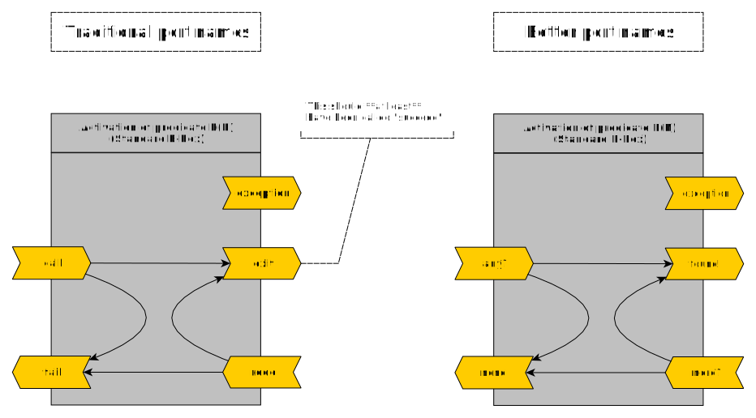
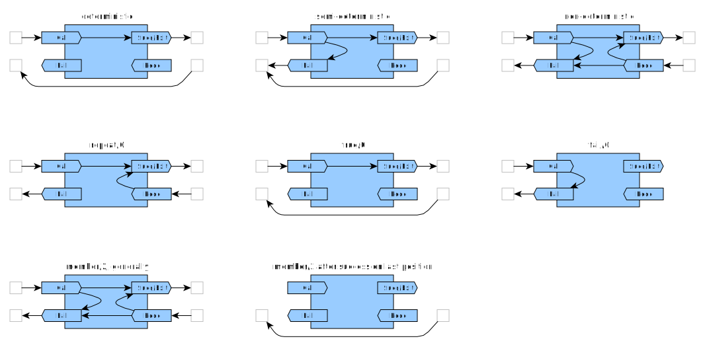

# About the "Byrd Box Model"

This is companion info to 

- [SWI-Prolog's page on the Byrd Box model](https://eu.swi-prolog.org/pldoc/man?section=byrd-box-model).
- One level up: [SWI-Prolog's page on the debugger](https://www.swi-prolog.org/pldoc/man?section=debugoverview)

See also 

- [SWI-Prolog's page on predicate descriptors](https://eu.swi-prolog.org/pldoc/man?section=preddesc) and
- a [related page for `pldoc` document generator](https://eu.swi-prolog.org/pldoc/man?section=modes)

## Generalities

The "Byrd Box Model", also called "Tracing Model" or "Procedure Box Model" or
"4-port Model" conceptualizes the calls to a predicate as a "box with 4 ports".

The model's idea is that the Prolog Processor traverses these ports during
program execution.

Debuggers use this model as conceptual basis when they generate trace output and
allow monitoring of "ports traversal events" either in general
([`leash/1`](https://eu.swi-prolog.org/pldoc/doc_for?object=leash/1))
or on a per-predicate basis
([`trace/1`](https://eu.swi-prolog.org/pldoc/doc_for?object=trace/1), [`trace/2`](https://eu.swi-prolog.org/pldoc/doc_for?object=trace/2)).
See also: [SWI-Prolog: Overview of the Debugger](https://eu.swi-prolog.org/pldoc/man?section=debugoverview).

The Byrd Box model has been described first in:

- **Understanding the control flow of Prolog programs**
  - Lawrence Byrd, 1980
  - Appears in: _Proceedings of the Logic Programming Workshop in Debrecen, Hungary_ (Sten Åke Tärnlund, editor)
  - ... this document does not seem to exist online.

An image of the original "box" appears in [Une sémantique observationnelle du modèle des boîtes pour la résolution de programmes logiques (version étendue)](https://arxiv.org/abs/0706.3159):


And later:

- **DECSystem-10 PROLOG USER'S MANUAL version 3.47, November 10, 1982**
  - D.L. Bowen (ed.), L. Byrd, F.C.N. Pereira, L.M. Pereira, D.H.D. Warren
  - p. 13 ff. "2.1 The Procedure Box Control Flow Model"
  - Can be downloaded from [CiteseerX](https://citeseerx.ist.psu.edu/viewdoc/summary?doi=10.1.1.300.8430)

And is described for example here:

- **Programming in Prolog, 5th edition**
  - Springer Verlag, 2003,
  - William F. Clocksin, Christopher S. Mellish
  - p. 194 ff.: "8.3 The Tracing Model"
- **[GNU Prolog - Debugging - The Procedure Box Model](http://gprolog.univ-paris1.fr/manual/gprolog.html#sec22)**

The Byrd Box Model is quite informal and leaves out a lot of detail. It says nothing about what
happens "around the box": cuts, selection of a clause, constraints. It doesn't mention the
special case of the clause head (that's a miss). In particular it says nothing about the
operations on the _term store_, which is, however, a crucial aspect. We will try to fill in some details then.

This text from **Specifying trace models with a continuation semantics** (see further below) is quite informative:

> The basic model for tracing Prolog executions is Byrd's box model, described in a rather informal way in
> \[_Lawrence Byrd's original paper_\]. As detailed in \[_G. Tobermann and C. Beckstein. What's in a trace: The box model revisited_\],
> Prolog debugging systems have quite different interpretations of what Byrd's box model is. It is not always clear
> whether theses differences come from a misinterpretation of the original model or from a will to improve it.
>
> In this article we propose a formal specification of Byrd's box model. One can conjecture that a formal specification
> would avoid misinterpretations. Indeed, people would have the formal framework to prove that their model conforms to the
> specification. Furthermore, people enhancing the model would then be able to state precisely what the enhancements are.
> Byrd's box model is often judged too low-level and it is sometimes stated that it should not be used in debuggers.
> Wether Byrd's trace is a proper output format for an end-user may indeed be discussed. A trace, however, can
> be the basis of automated tools, as we have shown for debugging or monitoring. In general, automated dynamic
> analysis needs an execution model to be based upon and Byrd's box model is a good candidate for Prolog.
>
> ...
>
> There is a large number of slightly different execution models for Prolog; see for example .... This means that there
> is no best model. It is therefore important to be able to easily specify variants of Byrd's box model. The validation
> of the formal specification becomes then an essential feature if one wants to reason about the generated trace.
> We show how this can be done in this article. We add the treatment of cut, unification and clause numbers to
> the basic specification of the trace.

## A Note on Vocabulary

(I always have problems with Prolog vocabulary)

From [Is this Prolog terminology correct? (fact, rule, procedure, predicate, …)](https://stackoverflow.com/questions/49898738/is-this-prolog-terminology-correct-fact-rule-procedure-predicate), based on the ISO Standard:

- *procedure*: A control construct, a built-in predicate, or a user-defined procedure. A procedure is either static or dynamic. A procedure is either private or public (see 7.5). In "Programming in Prolog (5th ed.)" (Clocksin & Mellish 2003), it is simply said on p. 188 that "The collection of clauses for a given predicate is called a procedure." ⇒ Conceptually near the **code**.
- *predicate*: An identifier together with an arity ⇒ Conceptually near the **specification** or the platonic predicate object (could even be uncomputable, I would say)
- *predicate indicator*: A compound term A/N, where A is an atom and N is a non-negative integer, denoting one particular procedure (see 7.1.6.6) ⇒ A structure manipulated by the machine.

When in doubt about having to choose between _procedure_ and _predicate_ I will use _predicate_.

## From the DECsystem-10 User Manual

Here is the image from the
[DECsystem-10 Prolog User's Manual](https://citeseerx.ist.psu.edu/viewdoc/summary?doi=10.1.1.300.8430), November 1982, page 13 ("Chapter 2: Debugging")

```text
                *--------------------------------------*
         Call   |                                      |   Exit
     ---------> +  descendant(X,Y) :- offspring(X,Y).  + --------->
                |                                      |
                |  descendant(X,Z) :-                  |
     <--------- +     offspring(X,Y), descendant(Y,Z). + <---------
         Fail   |                                      |   Redo
                *--------------------------------------*
```

The text says (some remarks in [] added):

> During debugging the interpreter prints out a sequence of goals [atomic goals] in various
> states of instantiation in order to show the state the program [process] has reached
> in its execution. However, in order to understand what is occurring it is
> necessary to understand when and why the interpreter prints out goals.
> As in other programming languages, key points of interest are procedure entry
> and return, but in Prolog there is the additional complexity of backtracking.
> One of the major confusions that novice Prolog programmers have to face is
> the question of what actually happens when a goal fails and the system suddenly
> starts backtracking. The Procedure Box model of Prolog execution views program
> control flow in terms of movement about the program text [that is not really the
> case, we are in 'box space', not in 'text space']. This model provides a
> basis for the debugging mechanism in the interpreter [more generally, the Prolog
> Processor], and enables the user to view the behaviour of his program in a consistent way.
>
> ...
>
> In terms of this model, the information we get about the procedure box is only
> the control flow through these four ports. This means that at this level we are
> not concerned with which clause matches, and how any subgoals are satisfied,
> but rather we only wish to know the initial goal and the final outcome. However,
> it can be seen that whenever we are trying to satisfy subgoals, what we are
> actually doing is passing through the ports of THEIR respective boxes. If we
> were to follow this, then we would have complete information about the control
> flow inside the procedure box. Note that the box we have drawn round the
> procedure should really be seen as an invocation box [i.e. an activation record on stack].
> That is, there will be a different box for each different invocation of the procedure.
> Obviously, with something like a recursive procedure, there will be many different Calls and
> Exits in the control flow, but these will be for different invocations.
> Since this might get confusing each invocation box is given a unique integer
> identifier.

## Adding Details

Let's call that box at the center of the model a _B-Box_ for short.

Consider the Prolog Processor (_PP_) running a Prolog program. The B-Box represents a
_activation record_ rather than a predicate or procedure. The latter is a specification,
an element of a Prolog program (essentially text), rather than an element of a
Prolog Processor's internal state. A predicate activation record is another name for a frame on
the Prolog Processor's execution stack, or a node in Prolog's search tree. Every B-Box
must first be instantiated by the PP before it can be called.

As a predicate can call other predicates, the B-Box model is
a recursive "boxes-in-boxes" model. The PP instantiates a B-Box in the context of a
surrounding B-Box, and deletes it when it backtracks out of the B-Box and calls it. Inside a B-Box
the same happens: it's B-Box instantiations, calls and deletions all the way down. Or
at least until you reach the B-Boxes that cannot be decomposed into smaller B-Boxes.
When you think about it, these must be either unifications or operations
not involving unification, like branching decisions, function evaluations or I/O.
More on that below.

The root B-Box, i.e. the one without any enclosing B-Box, would be the one enclosing the
B-Boxes of the original goal entered at the Prolog toplevel (that goal is a clause body).

A B-Box has _internal state_. Evidently there are the currently active sub-B-Boxes, but
there is also the index of the predicate clause that is currently being processed. This
index which will be incremented when the B-Box is asked for a "redo".

(In some papers on parallel implementations of Prolog, the predicate activation is seen
as an "agent" in and of itself, communicating over channels (the variables) with other agents,
an interesting view).

Execution flow can be considered as a token passing into one port of an instantiated
B-Box and out of another. In a picture chaining several B-Boxes, the token is transported
over "wires" linking the ports. Whenever the token goes through one of the ports, the
corresponding port traversal event is fired and may cause the tracer to print out messages
or query the user for interaction.

## The ports

### Traditional ports

Note that:

- Passing the execution token left-to-right generally "grows the stack" (unless optimization
removes stack frames).
- Passing the execution token right-to-left always "shrink the stack" as the activation record
just left behind may be dropped.

The traditional set of ports is the following:

- **`call`**: Incoming, left-to-right. The B-Box is created by the PP, then called (exactly
  once, actually) through this port. If this is the start of a clause body, there must have
  been a previous box that concluded successfully: the special B-Box performing the head unifications.
  Entering via `call` is equivalent to asking the predicate to constructively find
  solutions given the current values for its arguments (which can be found in the term store).

- **`exit`** (or better, **`succ`**) Outgoing, left-to-right: The predicate call
  succeeds, and the next B-Box can be instantiated and called. Which B-Box that is
  depends on the current state of the surrounding B-Box, which manages branching,
  B-Box instantiations and wiring. If this was the end of a clause body, the execution token
  is transferred to the surrounding B-Box instead. Exiting via `succ` is equivalent to
  the predicate stating that it constructively found a solution and that the witness (the constructed
  solution) is given by the current contents of the term store (which are named by
  the shared variables of the clause)

- **`redo`**: Incoming, right-to-left. The B-Box to the right has encountered
  failure or a collection of results via a meta-predicate like `bagof/3` is ongoing, or
  the user has asked for more solutions on the toplevel after a successful conclusion.
  Passing the execution token back into the B-Box via `redo` may:
  leads to the execution token being passed to `redo` ports of lower-level boxes or
  lead to advancing the B-Box counters to the next clause. If a new
  solution can be found, the term store is updated and the token is passed out via
  `exit`. If no new solution can be found, the token is passed out via `fail`.
  Entering via `redo` is equivalent to asking the predicate to constructively find
  more solutions than the one already found given the current contents of term store.

- **`fail`** Outgoing, right-to-left. The B-Box cannot provide any more solutions
  given current conditions. Setting up different terms in the term store for a
  reattempt is left to the predicate instantiation to the left. Exiting via `fail` is
  equivalent to the predicate stating that there are no
  more solution than the one given (which may be none at all) given the current contents
  of the term store.

### Traditional port names are confusing!

Note that the naming of the ports is ... less than ideal: The port for `exit` should really
be called `succeed`, in analogy to `fail`. Or maybe `succ` to keep it a 4-letter string.
(Debugger text alignment is important). I will use `succ` as alternative to `exit`.

What is confusing is that "failure" as the result of sending a token "to the left"
via the `redo` port may, to newcomers, sugest an action that is communicated to the predicate
to the right that said `redo` port and possibly the printing of `fail` at the Prolog Toplevel.
The leeway for initial confusions is large (which may be why there are papers complaining
that the Byrd Box Model is confusing to students; why not fix it?)

And thus, here is a port naming that sounds exceedingly better, at least to me:



### A trace example

From the paper **Specifying trace models with a continuation semantics** (see the end of this page for the reference).
This example apparently was in Lawrence Byrd's original paper, too:

A program

```prolog
p :- q, r.   r :- a, b.
q :- s.      s.
q :- t.      a.
```

A corresponding trace for `?- p.`

```text
[(call q), (call s), (exit s), (exit q), (call r), (call a),
 (exit a), (call b), (fail b), (redo a), (fail a), (fail r),
 (redo q), (redo s), (fail s), (call t), (fail t), (fail q),
 no]
```

Note that no ouput is emitted for a rule head match nor for a rule head mismatch nor even for a fact
match. This may make the trace harder to follow than is necessary.

### The exception port

ISO Standard Prolog specifies exceptions, so one would expect port like `throw` or
`exception` to be present on the B-Box, too. An execution token exiting via `exception`
will be passed to first enclosing B-Box that can _catch_ it (i.e. unify the thrown term in a
[`catch/3`](https://eu.swi-prolog.org/pldoc/man?section=exception)).

### Head unifications

Although left unmentioned in the original B-Box model, a rule head can be considered as
a special B-Box that performs a series of unifications. Its execution token comes from the
surrounding box through `call`, its `fail` passes the token back to the surrounding box,
and its `redo` is just short-circuited to `fail`.

### Non-traditional ports

**SWI-Prolog** provides `exception` port as well as the additional `unify` port
(see [Overview of the Debugger](https://eu.swi-prolog.org/pldoc/man?section=debugoverview)).
`unify` can be seen as an event or as the `exit` port of the special head B-Box:

> - `unify`: allows the user to inspect the result after unification of the head.
> - `exception`: shows exceptions raised by `throw/1` or one of the built-in predicates.

**Logtalk** additionally distinguishes the `unify` depending on whether the PP is currently
evaluating a rule or a fact
(see [Logtalk - Debugging - Procedure box model](https://logtalk.org/manuals/userman/debugging.html#procedure-box-model)):

> - `rule`: unification success between a goal and a rule head
> - `fact`: unification success between a goal and a fact
> - `exception`: predicate call throws an exception

## Time for graphics

An appoximate rendering of a clause for which the PP generate the head B-Box, and two additional B-Boxes
would thus be this (the `excpetion` port is not shown)


A variation in text, using some unicode characters from the [math bloc](https://en.wikipedia.org/wiki/Mathematical_operators_and_symbols_in_Unicode)

```none
DETERMINISTIC PREDICATE
(well-behaved: closing off the REDO port, i.e. "leaving no choicepoint")

             +---------------------+
     -------⊳|Call------⊳-----⊳Succ|------⊳
   from      |                     |      to
   prev      |                     |      next
   pred      |                     |      pred
     ⊲---+   |Fail             Redo|   +---
         |   +---------------------+   |
         |                             |
         +---⊲----no choicepoint----⊲--+

SEMI-DETERMINISTIC PREDICATE
(well-behaved: closing off the REDO port, i.e. "leaving no choicepoint")

             +---------------------+
     -------⊳|Call---+--⊳-----⊳Succ|------⊳
   from      |       |             |      to
   prev      |       ∇             |      next
   pred      |       |             |      pred
     ⊲---+---|Fail⊲--+             |   +---
         |   +---------------------+   |
         |                             |
         +---⊲----no choicepoint----⊲--+

NONDETERMINISTIC PREDICATE (succeeds maybe 0 times)
MULTI PREDICATE (succeeds at least once)
(well-behaved if it closes off the REDO port at the last solution, i.e. "leaves no choicepoint")

             +---------------------+
     -------⊳|Call---+--⊳--+--⊳Succ|------⊳
   from      |       |     |       |      to
   prev      |       ∇     ∆       |      next
   pred      |       |     |       |      pred
     ⊲---+---|Fail⊲--+--⊲--+---Redo|⊲--+---
         |   +---------------------+   |
         |                             |
         +---⊲----no choicepoint----⊲--+
```

## Predicate behaviour and well-behavedness <a name="well-behaved"></a>

See [SWI-Prolog: Deterministic/Semi-deterministic/Non-deterministic predicates](https://eu.swi-prolog.org/pldoc/man?section=testbody)

Note these case of predicate behaviour:

- A **deterministic** predicate always succeeds **exactly once**, a `redo` means pass-through to the preceding
  predicate activation or the clause head. If the predicate is _well-behaved_ it tells the Prolog Processor that there are
  no alternative solutions ("it leaves no choicepoints"). Programmatically, this is implemented by a cut at very the end
  of a clause. When backtracking, the Prolog Processor can then dispense with a `redo` call to this predicate and
  backtrack to the preceding predicate call (or hit the head of the clause). On the Prolog Toplevel, a well-behaved
  deterministic predicate will always only say `true.` and not accept a `;` for more solutions. Generally, predicates
  of this kind perform side-effects, I/O and control. The outcome "true" really means "success in computation", with failure
  indicated by a thrown exception instead of the outcome "false". Simplest example: [`true/0`](https://eu.swi-prolog.org/pldoc/doc_for?object=true/0).
- A **semi-deterministic** predicate **may succeed once or fail**. In case of success, behaviour and well-behaved behaviour
  are as described for the deterministic predicate. On the Prolog Toplevel, a well-behaved
  semi-deterministic predicate will either says `true.` or `false.` and not accept a `;` for more solutions.
  Example: [`memberchk/2`](https://eu.swi-prolog.org/pldoc/doc_for?object=memberchk/2).
- A **non-deterministic** predicate **may fail or succeed on first call, and succeed N>=0 times on `redo`**.
  This is the most general situation. The predicate may additionally provide **determinism on the last solution**,
  i.e. leave no choicepoints after the last success. Whether that is possible depends.
  Example: [`member/2`](https://eu.swi-prolog.org/pldoc/doc_for?object=member/2). That predicate may provide
  determinism on the last solution or not, for example for `member(1,[1,2,3,1])` it will, but it won't for
  `member(1,[1,2,3,4])` because there is no way that the predicate can know there are no further `1` in the
  list after the first one (which is objectively also the last one) without actually searching through the list.

In the B-Box model, a "well-behaved" predicate can be understood thus: when the token exits at `exit` and this
is know (by the predicate) to be the last solution, the `redo` port is "closed". When going leftwards during
backtracking, the token won't enter via `redo` but bypasses the B-Box entirely. This bypass operation may
certainly be chained, bypassing more B-Boxes towards the left. The bypass doesn't add functionality, but is
a representation of an optimization that the Prolog Process may choose to implement. In fact, the implementation
will probably just remove the predicate activation record from its stack, any `redo` will not
even be able to know that it has ever been there.

With the above, we can create a few illustrations.



## Term store operations

### An execution of elementary B-Boxes

The B-Box Model says nothing about _term store_ updates that take place as a B-Box is active. Let's add something about this,
introducing some radically new terminology never before seen in an introductory Prolog text. Hell yeah.

The _term store_ is the versioned global (or possibly thread-local) store that holds terms. The terms are named/denoted by
the clause-local variables. If a term is no longer named (and not used by a constraint) in any activation record currently on
the stack, it can evidently be dropped/garbage-collected as it has no influence on further processing.

If you flatten the recursively imbricated boxes of the B-Box Model, you will end up with a chain with two types
of elementary B-Boxes:

- _U-Boxes_: These are B-Boxes which perform a sequence of unifications on the global term store. Such B-Boxes modify the term
  store. Unification operations instantiate freshterms (uninstantiated terms) at leaf positions of term trees, or merge pairs
  of freshterms into single freshterms ("variable sharing"). This extends the term trees in the term store downwards (term
  trees newer shrink going leftward). The clause-local variables that appear to the LHS and RHS of any `=`
  name the positions of interest in those trees. In particular, clause head B-Boxes are U-Boxes.
- _V-Boxes_: These are B-Boxes which do **not** modify the term store, though they may consult it. They perform
  processing other than unification. What processing is this? Branching decisions, I/O and function evaluation,
  including comparison operation on term store elements fall under this.

Both of the above are essentially "elementary B-Boxes" whose inner structure can be disregarded.

### Term store updates and rollbacks

If you consider a (single-thread) Prolog program execution as a sequence of U-Boxes and V-Boxes, then the U-Boxes
look like (transactional) updates of the term store:

- If any of the unifications in the U-Box fails, term store updates are rolled back and the preceding V-Box is reactivated.
- If a V-Box fails, then the backtracking operation rolls the term store (which is versioned) back to the version that
  existed for the previous V-Box (or to one even earlier) and said previous V-Box is reattempted.


For non-elementary B-Boxes, updates on the term store may occur at any point "inside the box", just before leaving, just after
entering, and inside of any sub-B-Box. However the paths of the execution token inside a B-Box imply some invariants:

- Going from `call` to `fail`: No updates on the term store are retained. When exiting via `fail` the term
  store is back at the same version as it had when entering via `call`.
- Going from `call` to `succeed`: arbitrary updates (including none) may be performed on the term store.
- Going from `redo` to `succeed`: An arbitrary number of term store rollbacks may be performed, followed
  by an arbitrary number of updates.
- Going from `redo` to `fail`:  When exiting via `fail` the term store is back at the same version as
  it had when entering via `call`.

The above is a direct consequence of what sub B-Boxes and the U-Boxes do, no special handling is
required.

On the other hand, a "bypass" of the B-Box to implement "well-behavedness" demands a rollback of the term store
without intervention of the B-Box being bypassed. But this is easily done: the rollback must be to the version
valid at call time of the B-Box being bypassed.

We can now easily show where operations on the term story happen:


## More Reading

**Understanding the control flow of Prolog programs** (1980)

  - Lawrence Byrd, 1980
  - Appears in: _Proceedings of the Logic Programming Workshop in Debrecen, Hungary_ (Sten Åke Tärnlund, editor)
  - ... this document does not seem to exist online.
  
**What's in a Trace: The Box Model Revisited** (1993)

   - https://www.researchgate.net/publication/225203235_What's_in_a_trace_The_box_model_revisited
   - Gerhard Tobermann, Clemens Beckstein
   - appears in "Automated and Algorithmic Debugging, First International Workshop, AADEBUG '93, Linköping, Sweden, May 3-5, 1993, Proceedings" (Springer), pp. 171-187.

> The box model as introduced by Byrd describes the process of finding an answer to a query wrt a logic
> program by means of a chronological trace protocol. This protocol contains entries for primitive
> events associated with the execution of PROLOG procedures. Basic events are `call` (a procedure is
> being entered), `exit` (a procedure was left signaling a success), `redo` (another solution to
> the `call` associated with the procedure is sought for), and `fail` (there is no (other) solution).
>
> Byrd only gives an informal account of how to visualize procedural aspects of the execution of
> PROLOG programs. He e.g. does not explicitly consider goals with variables and does not show
> how to keep track of the evolution of bindings during the proof. The major reason for this - as we
> believe - is that he did not introduce the box model along with a formalization. His primary goal
> apparently was to use the model as a vehicle for teaching and explaining PROLOG.
>
> Our paper is an attempt to fill this gap: we intend to give a precise mathematical specification
> of PROLOG trace protocols that can be used as a guide line for a formal description and classification
> of debugging components of logic programming systems.

**A choice-point model of Prolog execution** (1993)
   
   - presented at ALP-UK Workshop on Logic Programming Support Environments, Edinburgh.
   - Tony Dodd, 1993
   - (this document does not seem to exist online)

This should about the complementary way of looking at Prolog program execution: as a search tree.

**Prolog without tears: An evaluation of the effectiveness of a non Byrd Box model for students** (1995)

   - http://citeseerx.ist.psu.edu/viewdoc/summary?doi=10.1.1.57.2456
   - Paul Mulholland, Human Cognition Research Laboratory, Open University, Milton Keynes
   - Psychology of Programming Interest Group, 1995, University of Edinburgh, Edinburgh.

> All existing tracers adopt the Byrd Box style model of execution which underpins the Spy tracer (Byrd, 1980).
> The results gained from the previous study suggest that certain principles of Prolog execution are difficult
> to represent within the Byrd box model, in particular backtracking. In order to combat these problems a
> choice-point model of execution was adopted (Dodd, 1993). The key feature of the choice-point model is
> that as each clause is entered, the interpreter "looks ahead" to see if any later clauses could match
> should the present route fail. If so, this is marked as a choice-point. Backtracking can then be shown
> as jumping back to the nearest choice-point. This model was combined with promising notational
> techniques found in existing tracers to develop two Prolog choice-point tracers: the Prolog Linear Tracer
> (Plater) and the Prolog Non-linear Tracer (Pinter). These also shared a new textual representation of
> binding, loosely based on the lozenge notation used in TPM (Eisenstadt & Brayshaw, 1990).

**Specifying Trace Models With a Continuation Semantics** (1999)

   - http://citeseerx.ist.psu.edu/viewdoc/summary?doi=10.1.1.39.8325
   - Erwam Jahier, Mireille Ducassé, Olivier Ridoux, 1999
   - appears in [Springer LNCS 2042](https://link.springer.com/chapter/10.1007/3-540-45142-0_10): 
     "LOPSTR 2000: Logic Based Program Synthesis and Transformation" pp. 165-181.
   - The preprint is named differently: 
     [Specifying Byrd's Box Model with a Continuation Semantics](https://www.researchgate.net/publication/220153715_Specifying_Byrd's_Box_Model_with_a_Continuation_Semantics)

> We give a formal specification of Byrd's box model and show how this specification can be extended to specify richer
> trace models. We also show how these specifications can be executed by a direct translation into λProlog, leading
> to a Prolog interpreter that performs execution traces. This interpreter can be used both to experiment various
> trace models and to validate the different event specifications. We have hence a formal framework to specify and
> prototype trace models.
   
**Observational semantics of the Prolog Resolution Box Model** (2007)

   - http://arxiv.org/abs/0711.4071
   - Pierre Deransart and Mireille Ducassé and Gérard Ferrand
               
> This paper specifies an observational semantics and gives an original presentation of the Byrd box model.
> The approach accounts for the semantics of Prolog tracers independently of a particular Prolog implementation. 
> Prolog traces are, in general, considered as rather obscure and difficult to use. The proposed formal presentation 
> of its trace constitutes a simple and pedagogical approach for teaching Prolog or for implementing Prolog tracers. 
> It is a form of declarative specification for the tracers. The trace model introduced here is only one example to 
> illustrate general problems relating to tracers and observing processes. Observing processes know, from observed processes, 
> only their traces. The issue is then to be able to reconstitute, by the sole analysis of the trace, part of the behaviour
> of the observed process, and if possible, without any loss of information. As a matter of fact, our approach highlights 
> qualities of the Prolog resolution box model which made its success, but also its insufficiencies. 

**Une sémantique observationnelle du modèle des boîtes pour la résolution de programmes logiques (version étendue)** (2007)

   - Research Report: This is an extended version of _"Observational semantics of the Prolog Resolution Box Model"_
   - https://arxiv.org/abs/0706.3159
   - Pierre Deransart and Mireille Ducassé and Gérard Ferrand 
      
> This report specifies an observational semantics and gives an original presentation of the Byrd's box model. 
> The approach accounts for the semantics of Prolog tracers independently of a particular implementation. Traces 
> are, in general, considered as rather obscure and difficult to use. The proposed formal presentation of a trace
> constitutes a simple and pedagogical approach for teaching Prolog or for implementing Prolog tracers. It 
> constitutes a form of declarative specification for the tracers. Our approach highlights qualities of the
> box model which made its success, but also its drawbacks and limits. As a matter of fact, the presented semantics
> is only one example to illustrate general problems relating to tracers and observing processes. Observing processes
> know, from observed processes, only their traces. The issue is then to be able to reconstitute by the sole analysis
> of the trace the main part of the observed process, and if possible, without any loss of information. 
