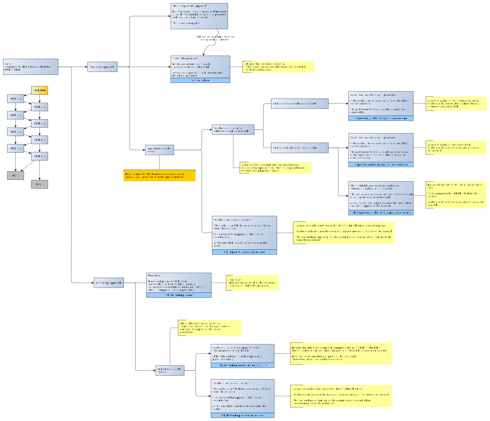

# Various Prolog implementations to compute numbers from the Fibonacci Series 

Several approaches at computing Fibonacci series in Prolog:

- [fibonacci_algorithms.pl](fibonacci_algorithms.pl) - Source
- [fibonacci_algorithms.plt](fibonacci_algorithms.plt) - [plunit](https://eu.swi-prolog.org/pldoc/doc_for?object=section%28%27packages/plunit.html%27%29) unit tests

The above has been run on SWI Prolog 8.3.9 (some SWI-Prolog specificities are in there).

TODO: Needs performance comparison (space and time and recursion depth)

Run the tests:

```
?- [fibonacci_algorithms],load_test_files([]),run_tests.
% PL-Unit: fibonacci .......... done
% All 10 tests passed
true.
```

More on this number series at Wikipedia: [Fibonacci numbers](https://en.wikipedia.org/wiki/Fibonacci_number)

Here is compressed explainer in SVG (you can zoom in!), showing how the algorithms can be organized.



The solution that caches `(x,fib(x))` using [`assertz/1`](https://eu.swi-prolog.org/pldoc/doc_for?object=assertz/1)
(as found at [Rosettacode.org](http://rosettacode.org/wiki/Fibonacci_sequence#Prolog) or
[This Stack Overflow question](https://stackoverflow.com/questions/16358747/why-this-dynamic-version-of-fibonacci-program-is-incredibly-faster-then-this-oth))
is not in the set of approaches because I feel doing things that way should be avoided.
