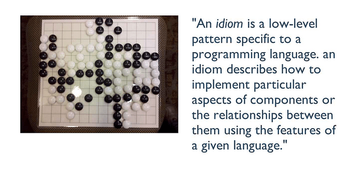
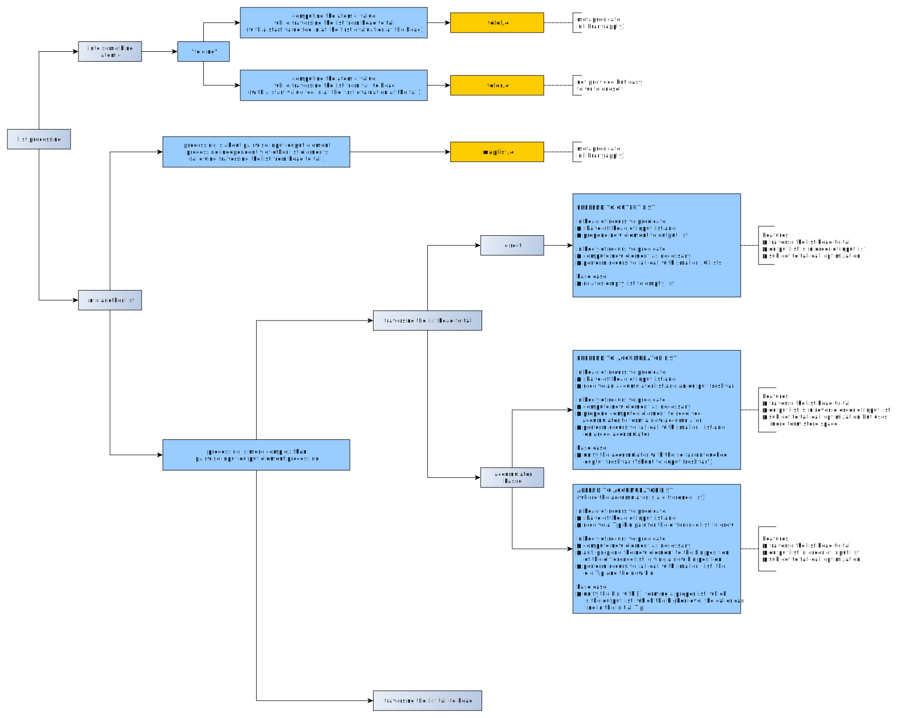
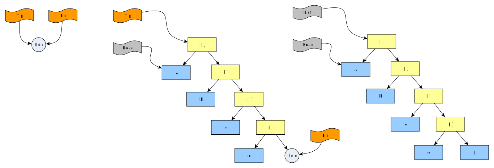

# List processing idioms

.

(The above image from Stuart Sierra's presentation [Functional Design patterns in Clojure](https://www.infoq.com/presentations/Clojure-Design-Patterns/) at 04:30).

Suppose you have an "input list" and an "output list", both of the same length, and with the ouput list to be constructed from the input list
according to some algorithm. The relation between the elements need not be pairwise.

It is also possible that both lists are given and that you want to check that "output list" is indeed the result of constructing input list.



The above in [graphml format](pics/list_processing_idioms.graphml), [PNG format](pics/list_processing_idioms.png).

We will not further consider the processing of a list into an "atomic" thing or structure. These are the "folding" operations. More on these [here](../about_foldl_and_foldr).

## TODO

- I missed list processing via DCGs; need to add some code to show how that is done..
- The applicaton which uses a Dict as accumulator-pattern also needs some illustration.
- And `foldl` is another nice example of accumulator usage, just doing it via a metacall

## Pairwise processing

If the processing is pairwise (on every position, the element of the input list is related to the element of 
the output list at the same position, completely independently of any other values present in the list),
then you do not need to write your own predicate. Use the metapredicate [maplist/3](https://eu.swi-prolog.org/pldoc/doc_for?object=maplist/3) 
is a good choice. For more on this, see [Examples for the Prolog predicate `maplist/3`](../../swipl_notes/about_maplist/maplist_3_examples.md).

For example, you want the output list to be the "powers of two" of the input list:

```logtalk
power2(In,Out) :- maplist([X,Y]>>(Y is X*X),In,Out).
```

Then:

```text
?- power2([0,1,2,3],Result).
Result = [0, 1, 4, 9].

?- power2([0,1,2,3],[0,1,1,1]).
false.
```

... or you can build a result of the actual input-output pairs

```logtalk
power2pairs(In,OutPairs) :- maplist([X,Y]>>(Y is X*X),In,Powers),maplist([X,Y,X-Y]>>true,In,Powers,OutPairs).
```

then

```text
?- power2pairs([0,1,2,3],OutPairs).
OutPairs = [0-0, 1-1, 2-4, 3-9].
```

## Non-Pairwise processing

The elements of the output list may have a more complicated relationship to the elements of the input list than just a 
pairwise relatiomnship. For example, at the ouput value at pos _i_ may be the sum of input values at position _j < i_. 

The examples below generate the output value at position _i_ as a pair of the input value at position _i_ and the integer _i_ itself. 

One can classify processing by the direction-of-processing first and foremost:

- Processing the input list head-to-tail
- Processing the input list tail-to-head
- Processing the input list head-to-tail-to-head
- ...and more 

Generally one wants to do head-to-tail processing, and more rarely tail-to-head processing. 

We will consider head-to-tail processing only (for now). The following can be identified:

- Head-to-tail processing
   - Direct: Prepend to ouput list
   - Accumulator based
      - Prepend to accumulator (the accumulator is a proper list)
      - Append to accumulator (the accumulator is a difference list)

(No ready-made meta-predicates exist for any of those. Would it make sense to have them?) 

Which approach is applicable to your processing evidently depends on the actual processing you want.

### Head-to-tail processing, direct

This is the usual case. 

**Write a predicate that performs a recursive call at last position and which:**

In the head:

- shaves-off the head of _Input_ list ;
- prepends new element (maybe as yet uncomputed, and thus via placeholder freshvar) to _Output_ list

In the body:

- computes new element as required ;
- performs a recursive tail-call with smaller-by-one _Input_ and _Output_ lists

In the base case, the empty list is simply related to the empty list.

```logtalk
head_to_tail_direct(In,Out) :- head_to_tail_direct_recursor(In,Out,0).

head_to_tail_direct_recursor([I|Is],[I-D|Os],D) :-
   succ(D,Dp),
   head_to_tail_direct_recursor(Is,Os,Dp).
   
head_to_tail_direct_recursor([],[],_).
```

The output list will be in the same order as the input list:

```text
?- head_to_tail_direct([a,b,c,d,e,f,g],Out).
Out = [a-0, b-1, c-2, d-3, e-4, f-5, g-6].
```

This recursion subject to [tail-call optimization](https://en.wikipedia.org/wiki/Tail_call)
(i.e. transformation by the compiler of the recursion, which would need space linear in list length, 
into a constant-space loop) because the last action taken is the recursive call. 
The _construction of the ouptut list_ is performed when the activation is entered using a placeholder variable,
and set after computation only. In fact, the structure of the ouput list emerges on the term store from the outside in
as recursion progresses. See also "[Tail recursion modulo cons](https://en.wikipedia.org/wiki/Tail_call#Tail_recursion_modulo_cons)".

As an (non-)alternative, the following is **not** subject to tail-call optimization although it does exactly the same. **Avoid!**

```logtalk
head_to_tail_direct_bad(In,Out) :- head_to_tail_direct_recursor_bad(In,Out,0).

head_to_tail_direct_recursor_bad([I|Is],Out,D) :-
   succ(D,Dp),
   head_to_tail_direct_recursor_bad(Is,Mid,Dp),
   Out = [I-D|Mid]. % perform prepending **after** return from the recursive call
   
head_to_tail_direct_recursor_bad([],[],_).
```

With `head_to_tail_direct_bad/2` you can exhaust the stack (although I'm not totally sure this shows an overflow
of the execution stack?):

```text
?- time((bagof(N,between(1,10000000,N),Bag), head_to_tail_direct_bad(Bag,Out))).
% 20,000,016 inferences, 2.167 CPU in 2.178 seconds (100% CPU, 9227555 Lips)
ERROR: Stack limit (1.0Gb) exceeded
ERROR:   Stack sizes: local: 2Kb, global: 0.7Gb, trail: 2Kb
ERROR:   Stack depth: 21, last-call: 29%, Choice points: 7
```

...whereas with `index_elements/2` things look much better:

```text
?- time((bagof(N,between(1,10000000,N),Bag), head_to_tail_direct(Bag,Out))).
% 40,000,014 inferences, 5.981 CPU in 6.017 seconds (99% CPU, 6687702 Lips)
Bag = [1, 2, 3, 4, 5, 6, 7, 8, 9|...],
Out = [1-0, 2-1, 3-2, 4-3, 5-4, 6-5, 7-6, 8-7, ... - ...|...].
```

### Head-to-tail processing, prepend-to-accumulator

Sometimes you want to generate the ouput list in reverse order of the input list 
(in particular, when programming [`reverse/2`](https://eu.swi-prolog.org/pldoc/doc_for?object=reverse/2))
or when your problem's structure demands that at each activation, previous results be used for computation.

**Write a predicate that performs a recursive call at last position and which:**

In the head:

- shaves-off the head of _Input_ list ;
- receives an _Accumulator_ list and an _Output_ freshvar (or a variable instantiated to the output list to verify)

In the body:

- computes a new element as required ;
- prepends the newly computed element to the received _Accumulator_ list to form a new _Accumulator_ list ;
- performs a recursive tail-call with smaller-by-1 _Input_ list and larger-by-1 _Accumulator_ list and the untouched _Ouput_ freshvar.

In the base case, the _Accumulator_ list is unified with the so-far-untouched _Output_ freshvar (the accumulator "shunted to output").
The final output thus becomes visible to the topmost caller.

```logtalk
head_to_tail_prepend_to_acc(In,Out) :- head_to_tail_prepend_to_acc_recursor(In,[],Out,0).

head_to_tail_prepend_to_acc_recursor([I|Is],Acc,Out,D) :-
   succ(D,Dp),
   head_to_tail_prepend_to_acc_recursor(Is,[I-D|Acc],Out,Dp).
   
head_to_tail_prepend_to_acc_recursor([],Shunt,Shunt,_).
```

The output list will be in reverse order as the input list:

```text
?- head_to_tail_prepend_to_acc([a,b,c,d,e,f,g],Out).
Out = [g-6, f-5, e-4, d-3, c-2, b-1, a-0].
```

This is subject to tail-call-optimization:

```text
?-  time((bagof(N,between(1,10000000,N),Bag), head_to_tail_prepend_to_acc(Bag,Out))).
% 40,000,015 inferences, 5.922 CPU in 5.953 seconds (99% CPU, 6754994 Lips)
```

### Head-to-tail processing, append-to-accumulator

This approach fixes the problem of the output list ending up in reverse order of the input list by using
an "accumulator to which it is efficient to append", i.e. the "difference list" idiom.

A difference list is represented by two variables:

- _Tip_, denoting the _tip_ of an "open list", i.e. the first list-cell.
- _Fin_, denoting the _fin_ of an "open list", i.e. the hole referenced by the second argument of the last list-cell.

In a "proper list" or "closed list", there is an empty list `[]` reserved symbol at the _fin_ position, (at least in SWI-Prolog).

Empty difference list vs, difference list holding 4 elements vs proper list holding 4 elements: 



An element is efficiently appended at the _fin_ position by binding the _fin_ to a new list-cell with a new "last element" and new "hole",
and using a new _Fin_ variable denoting this new hole in a fresh activation.

More on difference lists can be found [here](../../swipl_notes/about_difference_lists) (an update is needed though)

**Write a predicate that performs a recursive call at last position and which:**

In the head:

- shaves-off the head of _Input_ list ;
- receives an _Appendable Accumulator_ in the form of two variables _Tip_ and _Fin_ (note that there is no _Ouput_ variable as _Tip_ will 
  collapse to the desired _Output_ in the base case)

In the body:

- computes a new element as required ;
- **anti-prepends** (nearly the same as "appends" but the _Fin_ variable is on the _other_ side) the newly computed element to
  the _fin_ position of the difference list, obtaining a new _fin_ position in a fresh variable _NewFin_.
- performs a recursive tail-call with smaller-by-1 _Input_ list and a larger-by-1 appendable accumulator represented by
  an unchanged _Tip_ and the _NewFin_.

In the base case, the _Fin_ is unified with `[]`, thus transforming the open list rooted at _Tip_ into a closed list
rooted at _Tip_, which ist the desired output. The topmost caller will find this output in the _Tip_ or _Fin_ variables
of the initial difference list. Note that the "quality of being a difference list formed by _Tip_ and _Fin_" is not
preserved in the top caller. When the recursion is started  _Tip_ and _Fin_ designate the same "hole" and are indeed
a "difference list". On return, _Tip_ and _Fin_ of the top coaller both designate the same output list are are in no
way a "difference list".


```logtalk
% X must be fresh on call, and will be the desired output on return
% X is unified with "Out" only at the end -- in case "Out" wasn't fresh (case of verification)

head_to_tail_append_to_acc(In,Out) :- 
   head_to_tail_append_to_acc_recursor(In,X,X,0), 
   Out = X.                                       

head_to_tail_append_to_acc_recursor([I|Is],Tip,Fin,D) :-
   succ(D,Dp),
   Fin = [I-D|NewFin],                                     % "anti-prepend"
   head_to_tail_append_to_acc_recursor(Is,Tip,NewFin,Dp).
   
% This creates a proper list accessible at any "Tip" of the activation
% records on-stack, in particular at "X". The unificatoin could also be put into 
% the head directly (maybe save a few cycles then)

head_to_tail_append_to_acc_recursor([],_,Fin,_) :-
   Fin = []. 
```

The output list will be in reverse order as the input list:

```text
?- head_to_tail_append_to_acc([a,b,c,d,e,f,g],Out).
Out = [a-0, b-1, c-2, d-3, e-4, f-5, g-6].
```

This is subject to tail-call-optimization:

```text
?-  time((bagof(N,between(1,10000000,N),Bag), head_to_tail_append_to_acc(Bag,Out))).
% 40,000,015 inferences, 6.237 CPU in 6.265 seconds (100% CPU, 6413850 Lips)
```

**Going tipless**

In fact, unless the computation needs to have access to the whole list (which may well be necessary, but
let's suppose not), one doesn't need to pass _Tip_ in the recursive call at all. Instead of a "difference list",
we just need the _Fin_, designating at each activation the hole to fill with the next listbox:

```logtalk
% "TipFin" must be fresh on call, and will be the desired output on return
% TipFin is unified with "Out" only at the end -- in case "Out" wasn't fresh (case of verification)

head_to_tail_append_to_acc_without_tip(In,Out) :- 
   head_to_tail_append_to_acc_without_tip_recursor(In,TipFin,0),   
   Out = TipFin.                                                   

head_to_tail_append_to_acc_without_tip_recursor([I|Is],Fin,D) :-
   succ(D,Dp),
   Fin = [I-D|NewFin], % anti-prepend
   head_to_tail_append_to_acc_without_tip_recursor(Is,NewFin,Dp).
   
% This creates a proper list accessible at the topmost caller's "TipFin";
% The unification of the "hole" with "[]" is done in the head directly

head_to_tail_append_to_acc_without_tip_recursor([],[],_).
```

It sure works:

```text
?- head_to_tail_append_to_acc_without_tip([a,b,c,d,e,f,g],Out).
Out = [a-0, b-1, c-2, d-3, e-4, f-5, g-6].
```


## Non-Pairwise processing, tail-to-head of input list

(more to follow, in time...)
 
   
