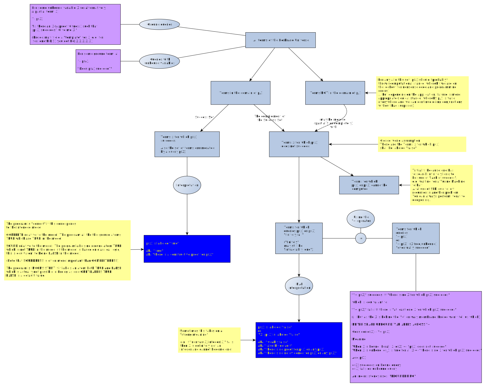
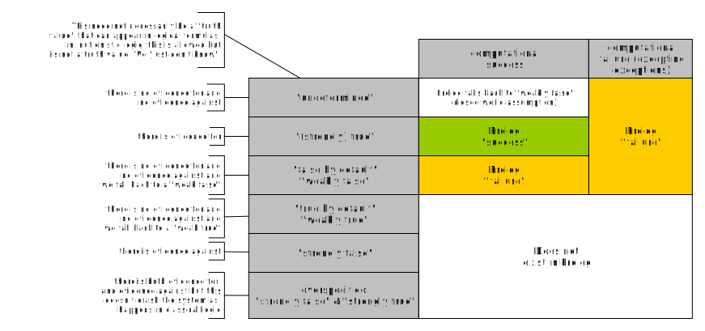
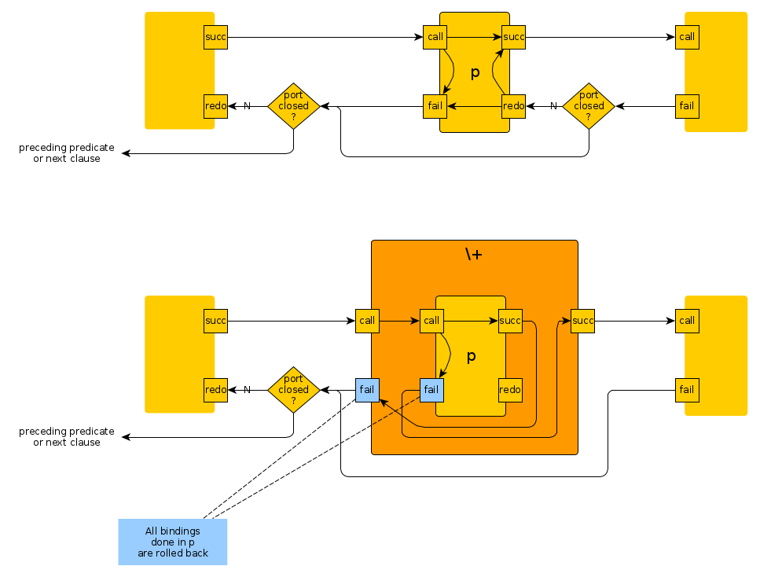
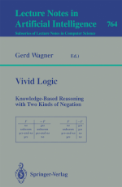

# Negation-as-Failure

These are comments relative to the [page for the `\+` operator](https://eu.swi-prolog.org/pldoc/doc_for?object=(%5C%2B)/1) in the SWI-Prolog manual.

The text needs to be cleaned up...

See also:

- the separate page on [floundering](floundering.md).
- the separate page on [double negation](double_negation.md). 

## TOC

- [Citations](#citations)
- [Interpretation](#interpretation)
- [The set "NAF"](#the_set_NAF)
- [Non-monotonicity](#non_monotonicity)
- [What's the meaning of this?](#meaning)
   - [Logic programming with extended logics](#extended_logics)
- [Implementing _\+_ with _->_ (and vice-versa)](#implementing_not_with_arrow)
- [Bibliography and further reading](#bibliography) 

## Citations<a name="citations"></a>

From [_The Art of Prolog_](https://mitpress.mit.edu/books/art-prolog-second-edition) (first edition, Leon Sterling and Ehud Shapiro, 1988)
p. 165-166 (Chapter 11.3, "Negation"):

> The cut is the basis of implementing a limited form of negation in Prolog called _negation as failure_. Program
> \[below\] is the standard definition of _not(Goal)_, which is true of _Goal_ fails. It uses the meta-varaible facility,
> and a system predicate _fail_ that fails (i.e. there are no clauses defined for it). A conjunction of
> cut and _fail_ is referred to as a _cut-fail_ combination. We assume that _not_ has been defined as a prefix operator.
>
> ```
> not X :- X,!,fail.
> not X.
> ```

From [_A Transformational Approach to Negation in Logic Programming_](https://www.sciencedirect.com/science/article/pii/074310669090023X) (Roberto Barbuti, Paolo Mancarella, Dino Pedreschi, Franoc Turini, 1990):

> Negation as failure has been thoroughly studied as a means to deal with negative information in logic programming
> \[Clark 1978, Sheperdson 1985, 1987\]. It is a meta-inference-rule allowing one to prove the negation of a ground goal,
> when the proof of the corresponding positive goal _finitely fails_. Starting from Clark’s paper \[Clark 1978\], a lot 
> of effort has been devoted to establishing results about soundness and completeness of this rule with respect to
> completed logic programs \[Clark 1978\]\[Jaffar & al. 1983\],\[Wolfram & al. 1984\], and to extending these results to subclasses of 
> _general logic programs_, i.e. programs containing negative literals in clause bodies.
> 
> The major drawback of a logic-programming system embodying negation as failure is that it does not allow a symmetric
> treatment of positive and negative knowledge. In fact, negation as failure can be used only to check universally
> quantified negative formulae, and by no means can it be used to compute solutions for existentially quantified
> negative ones. Indeed, in many applications, such as deductive databases and expert systems, it would be useful to 
> compute answers both for positive and negative queries in a homogeneous way.

From [_The Well-Founded Semantics for General Logic Programs_](https://www.researchgate.net/publication/2742259_The_Well-Founded_Semantics_for_General_Logic_Programs) (Allen Van Gelder, Kenneth A. Ross, John S. Schlipf, 1991):

> Definition. 
> 
> A _general logic program_ is a finite set of _general rules_, which may have both positive and negative subgoals.
> A general rule is written with its _head_, or conclusion on the left, and its subgoals (body), if any, to the 
> right of the symbol "←" which may be read "if." For example,
> 
> `p(X) ← a(X); not b(X).`
> 
> is a rule in which `p(X)` is the head, `a(X)` is a positive subgoal, and `b(X)` is a negative subgoal. This rule
> may be read as "`p(X)` if `a(X)` and not `b(X)`." A _Horn rule_ is one with no negative subgoals, and a _Horn logic program_
> is one with only Horn rules.
> 
> ⧠
>
> Lloyd has recently adopted the word "normal" instead of "general" to describe rules whose bodies consist
> of a conjunction of literals, and programs of such rules
> [Foundations of Logic Programming. Springer-Verlag, New York, 2nd edition, 1987](https://www.springer.com/gp/book/9783642831911).
> He reserves the word "general" to allow more involved constructs, such as
>
> `w(X) ← m(X,Y), not (m(Y,Z), not w(Z)).`
>
> where the first `not` applies to a conjunction rather than an atom. Although we avoid such constructs for
> simplicity of presentation, the well-founded semantics is easily generalized to such syntax, so we continue to
> use the word "general."

The [Flora-2 Manual](http://flora.sourceforge.net/docs/floraManual.pdf) (PDF), _Chapter 20: Negation_ (p 86 ff.) explains the
extensions of Flora-2/XSB relative to Prolog:

> Flora-2 supports three kinds of negation: a _Prolog-style negation_ `\+`; _default negation_ based
> on _well-founded semantics_, denoted `\naf`; and explicit negation `\neg`, which is analogous
> to what is called “classical” negation in \[Classical negation in logic programs and disjunctive databases\].

The manual describes the problem of `\+` in the context of `\naf` (note a different syntax whereby
variables are the tokens which start with a `?`, not the tokens with star with an uppercase letter):

> One major difference with other implementations of the well-founded default negation is that
> Flora-2 lets one apply it to formulas that contain variables. Normally, systems either require
> that the formula under `\naf` is ground or they interpret something like `\naf p(?X)` as meaning
> _“not exists `?X` such that `p(?X)` is true”_ — the so-called **Not-Exists semantics**. 

This is what Prolog does with `\+`.

> However, this is not the right semantics in many cases. The right semantics is usually 
> _“there exists `?X` such that `p(?X)` is not true.”_  This semantics is known as the **Exists-Not semantics**.
> Indeed, the standard convention for variables that occur in the rule body but not in the head is existential.
> For instance, if `?X` does not occur in the head of some rule, `p(?X)` in the body of that rule is
> interpreted as `∃?X p(?X)`. Negation should not be treated differently, i.e., `\naf p(?X)` should be
> interpreted as `∃?X \naf p(?X)`. Worse yet, if `?X` does occur in the rule head then it is confusing
> and error-prone to interpret `h(?X) :- \naf p(?X)` as `h(?X) :- \naf ∃?X p(?X)` using the Naf-Exists
> semantics. And without the Naf-Exists semantics, `\naf p(?X)` has no meaning, if `?X` happens to be non-ground.
>
> Flora-2 takes a different approach. For body-only variables that appear under `\naf` the
> semantics is Exists-Not. 

## Interpretation<a name="interpretation"></a>

Read `\+ p(X)` as 

- _there is no evidence for `p(X)`_ or 
- _there is no proof for `p(X)`_.

This is not the same as the "classical negation" (alias "strong negation") normally seen in logic. 
Instead it is a kind of default reasoning whereby everything that cannot be proven by the program
is assumed to have a special truth value "false by default" or "false unless proven differenty".
One then conflates this truth value with the classical truth value `false` (maybe an error?).
In literatue, the `\+` operator is sometimes written as `naf` (for negation-as-failure) or `~`.

Using this "negation as failure" or "default negation" is often sufficient. Modeling 
some problems, however, demands classical negation.

An example of when classical negation is useful,
from the _smodels_ manual ([Lparse 1.0 User's Manual](http://www.tcs.hut.fi/Software/smodels/lparse.ps.gz)), p.33:

Suppose that we want to check whether it is safe to cross railroad tracks This could be expressed by the rule:

```
safe :- \+ train.
```

The problem here is that we consider the crossing to be safe if we can't prove that a train is coming.
A more safe approach would be to declare the crossing safe only if we _can_ prove that the train is,
indeed, _not_ coming:

```
safe :- ¬train.
```

In this case, approaches other than Prolog may be needed: Full first-order theorem provers
like [Vampire](http://www.vprover.org/) or 
Answer-Set-Programming systems ("stable model semantics") like
[smodels](http://www.tcs.hut.fi/Software/smodels/) or [Potassco](https://potassco.org/doc/).

## The set "NAF"<a name="the_set_NAF"></a>

- A _positive logic program_ is a set of rules that has no negative subgoals (is this terminology in common use?)
- A _general logic program_ is a set of rules that have both positive and negative subgoals (this terminology _is_ in common use)

If we interprete Negation-as-Failure as defining the set of ground goals for which a Prolog program P
finitely fails after exhaustive, but unsuccessful proof search, then we can draw this tree of subset
relationships, which clarifies the relationship between "NAF" and the "Closed World Assumption".

In this diagram, we assume the program is a "positive program", i.e. it does not itself contain a
`\+` call. (Needs another diagram for that case, TODO). It is also unclear whether "impure" program
constructs can be used. Interaction computing is definitely proscribed.


An alternative image. I will have to decide which one to use...



The next in step would be a image that also includes proof that have `\+` itself in the proof tree, once, twice, etc ... 
(that's related to what is called "stratified" and "locally stratified" programs I suppose, to be continued!)

This gives another reading of `\+ Goal`, namely: _"does 'Goal' belong to the set NAF?"_. 

A Prolog program that uses the above principle is said to perform SLDNF proof search (SLD resolution
plus the neagtion as failure rule).

Pointers to pursue from "The Well-Founded Semantics for General Logic Programs"

- Apparently "Clarke's completed database" yields exactly the truth values of SLDNF. 
- The "Closed World Assumption" is due to Reiter (R. Reiter. On closed world databases. In Gallaire and Minker, 
  editors, Logic and Databases, pages 55{76. Plenum Press, New York, 1978.)
- The "generalized closed world assumption" was proposed by Minker to handle disjunctive 
  databases (J. Minker. On indefinite databases and the closed world assumption. In Sixth Conference
  on Automated Deduction, pages 292-308, New York, 1982. Springer-Verlag.) without producing the
  inconsistency typical of the closed world assumption. 

## Non-monotonicity<a name="non_monotonicity"></a>

Negation-as-failure is a "nonomontonic" computation of truth values in that, if the logic program
is expanded by adding positive facts (we can't add negative facts facts to a Prolog program)
some statements formerly `true` may flip to `false`:

```
:- dynamic(q/1).
q(1).
p(X) :- \+ q(X).
```

Then

```
?- p(1).
false.

?- p(2).
true.
```

But if we add a new (and positive) fact `q(2)`, non-monotonicity arises. Not all the statements formerly `true` stay `true`:

```
?- assertz(q(2)).
true.

?- p(2).
false.
```

In fact, in Prolog the problem of having a consistent program (a program that doesn't give both classical
truth values to a statement) is whisked away by only allowing programs that give the value `true` to statements.
All the remaining statements are assumed to be `default false`. However, as seen above, the `\+` allows
one to indirectly give the value `true` to statements by passing through the pool of `default false` statements.

Can we create a inconsistent program? One in which `p(2)` is both `true` and `false`?

```
q(1).
q(2).
p(2).
p(X) :- \+ q(X).
```

Actually not:

```
?- p(2).      
true ;        % p(2) is true, maybe there are other solutions
false.        % No.
```

No, we can't! The success `p(2)` "paints over" the failure of `p(2)` via `q(2)`.  
In Prolog, only success counts, and Prolog actively looks only for success, never for failure.
It's quite "asymmetric".

This can be an effect that is desired or not. See also:

- [Non-monotonic Logic](https://plato.stanford.edu/entries/logic-nonmonotonic/)
- [Logical Approaches to Defeasible Reasoning](https://plato.stanford.edu/entries/reasoning-defeasible/#LogiAppr)

## What's the meaning of this?<a name="meaning"></a>

I haven't found a discussion in literature concerning the "shift in meaning" that occurs due to `\+` but it must have been discussed somewhere.

Prolog only admits to to truth values "Prolog True" (signalled by a query that succeeds) and "Prolog False"
(signalled by a query that fails). Arguably there is also a potentially infinite number of out-of-band truth values
signalled by exceptions, but let's not consider these. 
There is an additonal peculiarity in that `fail`/ `failure` /`false` can also signal that the computation failed, for example
because a value was out-of-domain. Let's not consider this either (restricting ourselves to "modeling" rather
than "computation").

Let a "positive proof" be one which encounters no `\+` during proof search. 

Take the query `p`. Then:

The proof for `q` is based on positive proofs only:

- If `p` succeeds, the meaning is _"there is evidence for `p`, and `p` is strongly true"_, i.e. there is indeed at least one proof of `p`.
- If `p` fails the meaning is _"there is no evidence for `p`, and `p` is weakly false"_, i.e. all the attempts at proving `p` failed and we assume that `p` takes on truth value `false` as default (closed world assumption).

Suppose the proof for `p` involves a subgoal `q` wrapped by `\+`, and the proof of `q` is a positive proof. Then:

- If `q` succeeds, the meaning is _"there is evidence for `q`, and `q` is strongly true"_.
   - And thus `p` fails, but a reasonable meaning of that failure would be _"`p` is strongly false"_ (because `q` is strongly true).
   - This is different from the meaning of _"`p` is weakly false"_ that is assumed (and implemented: you can override a failed `p` with another proof that succeeds).
- If `q` fails, the meaning is _"there is no evidence for `q`, and `q` is weakly false"_.
   - And thus `p` succeeds, but a reasonable meaning of that success would be _"`p` is weakly true"_ (because `q` is strongly false).
   - Again, this is different from the meaning of _"`p` is strongly true"_ that is assumed (and implemented: you cannot override a successful `p` at all).
   
The "weakness" attribute (default assumption for a truth value) in Prolog only exists for the truth value `false`. However, it 
seems an application of `\+` should switch it from the subgoal's truth value to the complementary goal's truth value.

One could imagine a logic programming language with more truth values than "true" and "default false" to
make the above clearer, or even consistent. It wouldn't be Prolog though. 



### Logic programming with extended logics<a name="extended_logics"></a>

Belnap has a four-valued logic that abandons the pretense of classical logic at global consistency and determinate
truth values `true` or `false` for every statement (so the idea of having "proofs by contradiction" is no longer applicable,
but both the philosophy and the actual maintenance of large databases become viable). It uses the truth values
 `true`, `false`, `both`, `none` (arranged on a lattice).

On Belnap's 4-valued logic:

   - [Four-valued logic](https://en.wikipedia.org/wiki/Four-valued_logic) at Wikipedia
   - [An overview](http://www.filosofia.unimi.it/dagostino/wp-content/uploads/2017/05/Belnap.pdf) (PDF) by Marcello D’Agostino   
   - Belnap's original paper (paywalled): [A Useful Four-Valued Logic](https://link.springer.com/chapter/10.1007/978-94-010-1161-7_2) (Nuel D. Belnap Jr.), 1977 
     _appears in: Dunn J.M., Epstein G. (eds) Modern Uses of Multiple-Valued Logic. Episteme, vol 2. Springer, Dordrecht._ 
   - A variation of Belnap's logic: [A Constructive Four-Valued Logic](http://www.cs.cas.cz/tacl2017/abstracts/TACL_2017_paper_66.pdf) 
     (Yuanlei Lin and Minghui Ma)
   - [Some Useful 16-Valued Logics: How a Computer Network Should Think](https://link.springer.com/article/10.1007/s10992-005-0556-5)
     (Yaroslav Shramko, Heinrich Wansing), in: _Journal of Philosophical Logic volume 34, pages 121–153 (2005)_. 
     ([PDF at Research Gate](https://www.researchgate.net/publication/226314931_Some_Useful_16-Valued_Logics_How_a_Computer_Network_Should_Think)).
   
For logics able to deal with proofs that yield both `true` and `false` see:

   - [Paraconsistent Logic](https://plato.stanford.edu/entries/logic-paraconsistent/) at the Stanford Encyclopedia of Philosophy.
   - [Quantitative Deduction and its Fixpoint Theory](https://www.sciencedirect.com/science/article/pii/0743106686900038) (M.H van Emden)
     _appears in: The Journal of Logic Programming, Volume 3, Issue 1, April 1986, Pages 37-53_
   - [Paraconsistent logic programming](https://www.sciencedirect.com/science/article/pii/0304397589901266) (Howard A.Blair, V.S.Subrahmanian)
     _appears in: Theoretical Computer Science Volume 68, Issue 2, 30 October 1989, Pages 135-154_
   - Chapter 6.1 - Paraconsistent Logic Programming in 
     [Introduction to Annotated Logics: Foundations for Paracomplete and Paraconsistent Reasoning](https://www.springer.com/gp/book/9783319179117),
     (Jair M Abe, Seiki Akama,  Kazumi Nakamatsu), Springer Intelligent Systems Reference Library 88, 2015.
   
## A Byrd Box view of the `\+` operator<a name="byrd_box_view_of_not_operator"></a>

One can consider `\+ p` as a recabling of the Byrd Box for `p` as depicted below:



Note that there are no "redos" of the enclosed `p`: If `p` fails, we get out via the outer box's "success" port (traditionally
and awkwardly called the "exit" port) and the outer box is not re-entered by the "redo" path coming from the right. If `p` succeeds,
we get out via the "fail" port towards the left and that's it. In bot cases, we pass through a "fail" port and roll back any 
bindings that p may have performed.

## Implementing _\+_ with _->_ (and vice-versa)<a name="implementing_not_with_arrow"></a>

 `\+` and `->` are interchangeable:

On the one hand, as long as you can deal with calling the `If` part twice (otherwise you need the cut, too):

```
my_if_then_else(_If,_Then,Else) :- call(If),call(Else).
my_if_then_else(If,Then,_Else)  :- \+ call(If),call(Then). 
```

On the other hand:

```
my_if_then_else(Goal) :- call(Goal) -> fail ; true.
``` 

The `->/2` is subject to floundering, similarly to `\+` and may make the program unsound (see below). 

## Bibliography<a name="bibliography"></a>

- Wikipedia has a (short) page on [**Negation as Failure**](https://en.wikipedia.org/wiki/Negation_as_failure).

**Course by Marek Sergot** 

In the notes for a [Course by Marek Sergot: "491 Knowledge Representation"](https://www.doc.ic.ac.uk/~mjs/teaching/491.html), we find:

[Negation as failure (Normal logic programs)](https://www.doc.ic.ac.uk/~mjs/teaching/KnowledgeRep491/NBF_491-2x1.pdf) (PDF)

**On "Negation" in general**<a name="on_negation_in_general"></a>

- [**Negation**](https://plato.stanford.edu/entries/negation/) at the Stanford Encyclopedia of Philosophy
- _**A Natural History of Negation**_ by Laurence R. Horn, University of Chicago Press. Reissued, Stanford, CA: CSLI Publications, 2001. ([Book Presentation Page](http://web.stanford.edu/group/cslipublications/cslipublications/site/1575863367.shtml))

**Negation as Failure** (1978)<a name="negation_as_failure_1978"></a>

   - Keith Clark
   - 1978
   - http://www.doc.ic.ac.uk/~klc/neg.html

**Negation and Control in Prolog** (1986)<a name="negation_and_control_in_prolog"></a>
 
   - Lee Naish
   - Lecture Notes in Computer Science, N° 238, 1985, Springer-Verlag
   - [Book page](https://www.springer.com/gp/book/9783540168157)
   - [SpringerLink page](https://link.springer.com/book/10.1007/BFb0021681)


**Negation as Failure (I): A Comparison of Clark's Completed Data Dase and Reiter's Closed World Assumption** (1984)<a name="negation_as_failure_sheperdson_surveys"></a>

   - J.C. Sheperdson   
   - https://www.sciencedirect.com/science/article/pii/0743106684900232
   - Appears in: _The Journal of Logic Programming, vol 1, 1984, pages 51–81._
   
**Negation as Failure II** (1985)

   - J.C. Sheperdson
   - https://www.sciencedirect.com/science/article/pii/0743106685900184
   - Appears in: _The Journal of Logic Programming, vol 3, 1985, pages 185-202._

**A Kripke-like Model for Negation as Failure** (1989)

   - James Harland, Department of Computer Science, University of Edinburgh
   - https://www.researchgate.net/publication/2818956_A_Kripke-like_Model_for_Negation_as_Failure
   - Appears in: _Proceedings of the North American Conference on Logic Programming, 626-642, 1989._
   
> We extend the Kripke-like model theory given in 
> [D.A. Miller, A Logical Analysis of Modules in Logic Programming, Journal of Logic Programming 6:79-108, 1989].
> for a fragment of first-order hereditary Harrop formulae to include negated atoms in goals. This
> gives us a formal framework in which to study the role of Negation as Failure rule. The class of predicates
> for which Negation As Failure is applicable is discussed, as well as the predicates for which some other form of negation
> will need to be used. We show how the former class may be incorporated into the model theory, giving a 
> generalisation of the usual T^𝜔 construction. No restriction on the class of programs is needed for this approach; the
> construction may be used for programs which are not locally stratified [T. Przymusinski, On the Declarative Semantics of Deductive
> Databases and Logic Programs, Foundations of Deductive Databases and Logic Programming, (ed. J. Minker) 193-216, Morgan Kaufmann, 1988].
> This is accomplished by the use of a _success level_ and a _failure level_ of a goal, either or both of which may be infinite.
> The resulting T operator is not monotonic, which necessitates a slight departure from the standard
> procedure, but the important properties of the construction still hold.

**Logic Programming with Strong Negation** (1989)

   - David Pearce, Gerd Wagner, FU Berlin
   - Appears in: _[Springer Lecture Notes in Computer Science (LNCS) No. 475](https://link.springer.com/book/10.1007/BFb0038689): Extensions of Logic Programming (ELP 1989), International Workshop Tübingen, FRG, December 8–10, 1989 Proceedings_

**A Transformational Approach to Negation in Logic Programming** (1990)

   - Roberto Barbuti, Paolo Mancarella, Dino Pedreschi, Franoc Turini
   - Appears in: _The Journal of Logic Programming, Volume 8, Issue 3, May 1990, Pages 201-228_
   - https://www.sciencedirect.com/science/article/pii/074310669090023X
   
**Classical negation in logic programs and disjunctive databases** (1991)

   - Michael Gelfond, Vladimir Lifschitz
   - Appears in: _New Generation Computing volume 9, pages 365–385 (1991)_
   - https://link.springer.com/article/10.1007%2FBF03037169 
   - http://citeseerx.ist.psu.edu/viewdoc/summary?doi=10.1.1.56.7150 

This is about "stable models" and "Answer Set Programming". "Disjunctive Databases" are logic programming
languages which allow no function symbols but do allow clauses with heads in which an "or" logical connective appears.

Abstract:

> An important limitation of traditional logic programming as a knowledge representation tool, in
> comparison with classical logic, is that logic programming does not allow us to deal directly with
> incomplete information. In order to overcome this limitation, we extend the class of general logic
> programs by including classical negation, in addition to negation-as-failure. The semantics of
> such extended programs is based on the method of stable models. The concept of a disjunctive
> database can be extended in a similar way. We show that some facts of commonsense knowledge
> can be represented by logic programs and disjunctive databases more easily when classical negation
> is available. Computationally, classical negation can be eliminated from extended programs by a
> simple preprocessor. Extended programs are identical to a special case of default theories in the
> sense of Reiter.

**Logic Programming with Strong Negation and Inexact Predicates** (1991)

   - Gerd Wagner
   - https://academic.oup.com/logcom/article-abstract/1/6/835/943774 (Paywalled)
   - Appears in: _Journal of Logic and Computation, Volume 1, Issue 6, December 1991, pp 835–859_
   
A book chapter with the same name appears in the book ["Vidid Logic: Knowledge-Based Reasoning with Two Kinds of Negation""](https://link.springer.com/book/10.1007/3-540-57604-5) (Springer LNCS 764, 1994) edited by Gerd Wagner

   - https://link.springer.com/chapter/10.1007/3-540-57604-5_14 (Paywalled)   

**The Well-Founded Semantics for General Logic Programs** (1991)

   - Allen Van Gelder, Kenneth A. Ross, John S. Schlipf
   - https://www.researchgate.net/publication/2742259_The_Well-Founded_Semantics_for_General_Logic_Programs
   - Appears in: _Journal of the ACM, Vol. 38, No. 3, July 1991, pp. 620-650_
   - An early version of this paper appears as "Unfounded sets and well-founded semantics for general
     logic programs". In _ACM Symposium on Principles of Database Systems, pages 221-230, 1988._
   - See also:
      - A. Van Gelder. The alternating fixpoint of logic programs with negation. In _ACM Principles of Database Systems, pages 1–10, New York, 1989. ACM._

Abstract:

> A general logic program is a set of rules that have both positive and negative subgoals. 
> It is common to view a deductive database as a general logic program consisting
> of rules (Intensional Ddatabase, IDB) sitting above elementary relations (Extensional
> Database, EDB, facts). It is desirable to associate one Herbrand model with a program and think 
> of that model as the "meaning of the program," or its "declarative semantics." Ideally, queries
> directed to the program would be answered in accordance with this model.
> 
> Recent research indicates that some programs do not have a "satisfactory" _total_ model; for such programs,
> the question of an appropriate _partial_ model arises. We introduce _unfounded_ sets and _well-founded partial models_,
> and define the well-founded semantics of a program to be its well-founded partial model. If the
> well-founded partial model is in fact a total model, we call it the _well-founded_ model. We show that the
> class of programs possessing a total well-founded model properly includes previously studied classes of
> "stratified" and "locally stratified" programs. We also compare our method with other proposals in the
> literature, including Clark's "program completion," Fitting's and Kunen's 3-valued interpretations of it,
> and the "stable models" of Gelfond and Lifschitz.

**Vivid Logic: Knowledge-Based Reasoning with Two Kinds of Negation** (1994)
 
   - Gerd Wagner
   - Lecture Notes in Computer Science, N° 764, 1994, Springer-Verlag
   - [Book page](https://www.springer.com/gp/book/9783540576044)
   - [SpringerLink page](https://link.springer.com/book/10.1007/3-540-57604-5)
   


**Logic programming and negation: A survey** (1994)

   - Krzysztof R. Apt, Roland N. Bol
   - https://www.sciencedirect.com/science/article/pii/0743106694900248
   - Appears in: _The Journal of Logic Programming, Volumes 19–20, Supplement 1, May–July 1994, Pages 9-71_

**"Classical" Negation in Non-Monotonic Reasoning and Logic Programming** (1996) 

   - José Alferes, Luís Moniz Pereira, Teodor C. Przymusinski
   - http://citeseerx.ist.psu.edu/viewdoc/summary?doi=10.1.1.53.4127
   - Appears in: _Proceedings of the European Workshop on Logic in Artificial Intelligence (JELIA'96), Springer LNAI 1126, pp 143-163_

**A logical semantics for depth-first Prolog with ground negation** (1997)

   - James Andrews
   - https://www.sciencedirect.com/science/article/pii/S0304397596001387
   - Appears in: Theoretical Computer Science, Volume 184, Issues 1–2, 30 September 1997, Pages 105-143
   - _"This material was published earlier as a technical report and is the expanded version, including proofs, of a paper presented at the 1993 International Logic Programming Symposium (ILPS)."_
   
**How to Handle Negation in Prolog: Several Logical Approaches** (2008)

   - https://canbaskent.net/logic/early/prolog.pdf
   - Can Başkent
   - 2008-02-26
   
> Present paper surveys several formal and axiomatic methods to deal with the problem of negation in PROLOG. Furthermore, a brief philosophical
> account is also mentioned.

> The reason why the negation is problematic in Prolog is the fact that “it is not possible to express negative information with pure
> Horn clauses” as Prolog’s resolution works by utilizing Horn clauses. In other words, it has been remarked that “a logic program is
> a set of definite Horn clauses”.

The following approaches are proposed:

- Implement a four-valued logic with ordered truth values: F ≤ U ≤ T ≤ N, with U meaning "undefined" and F "floundering on negation", as 
  described by James Andrews in _"A logical semantics for depth-first Prolog with ground negation"_
- Extend programs with classical negation so that they include negative information explicitly. The author says _As a result, there will be two types of queries which do not succeed. One type does not succeed since it fails and the other does not succeed since its negation succeeds._ This means abandoning the Prolog model based on resolution and passing to the Answer-Set-Programming model based on Stable Models of Gelfond and Lifschitz.
- Extending the Models for Negation: As proposed by James Harland in _A Kripke-like Model for Negation as Failure_. 
