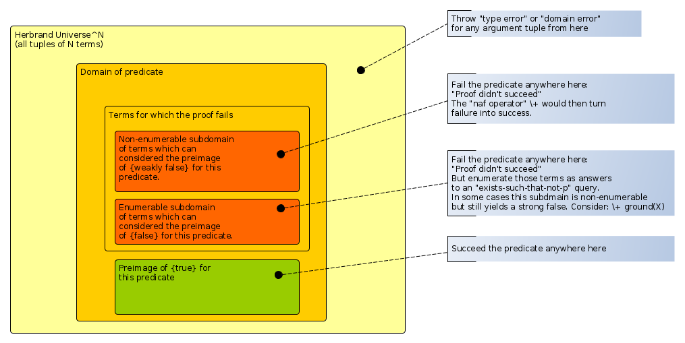

# Floundering

## What is about?

This is weirdly chosen vocabulary. "Floundering" might suggest that the Prolog Processor trashes around or
performs something repeatedly without progress:

From [The Free Dictionary](https://www.thefreedictionary.com/floundering), _to flounder_:

   1. To move clumsily or with little progress, as through water or mud.
   2. To act or function in a confused or directionless manner; struggle:
      _"Some ... floundered professionally, never quite deciding what they wanted to do"_ (Steve Olson).
     
In fact, "floundering" is all about the breakdown of the `\+` operator, which transforms finitely failed goals into success,
thus implementing "default negation" and approximating classical negation via an approach described as "negation as failure".
Note that the FOL operator/grapheme `¬` expresses that the formula that is tagged by `¬` is "objectively" or "platonically"
labeled "known false", whereas `\+` has the operational meaning that the interpreter can proceed successfully 
if the formula tagged by `\+` fails to be proven true (finitely, otherwise the proof mechanism won't return and we are in
trouble). These things are not the same!

From [_The Art of Prolog_ 1st ed.](https://mitpress.mit.edu/books/art-prolog) (Leon S. Sterling, Ehud Y. Shapiro, 1986), p. 166:

> The implementation of negation as failure using the cut-fail combination does not work correctly for nonground
> goals (...). In most standard implementations of Prolog, it is the responsibility of the programmer to ensure
> that negated goals are grounded before they are solved. This can be done either by a static analysis of the
> program, or by a runtime heck, using the predicate _ground_ (...)

In [_A basis for deductive database systems II_](https://www.sciencedirect.com/science/article/pii/074310668690004X) (J.W. Lloyd, R.W. Topor, 1986)

> Definition: Let _P_ be a general program \[i.e. a program of clauses admitting negative literals in bodies\],
> _G_ a general goal \[i.e. a conjunction of positive and negative literals\], and _R_ a safe computation rule \[i.e.
> one that will never select a non-ground negative literal - maybe by delaying them until ground
> using [`when/2`](https://eu.swi-prolog.org/pldoc/doc_for?object=when/2) \]. 
> We say the evaluation of _P ⋃ {G}_ via R **flounders** if at 
> some point in the evaluation a goal is reached which contains only nonground negative literals.

(Does this cover the case where there may be useless, because not-helping-with-the-grounding positive literals in the goal?)

The above also has these definitions:

> _Definition_. Let _P_ be a general program and _G_ a general goal _<- L1 ⋀ ... ⋀ Ln_.
> We say a general program clause _A <- L1 ⋀ ... ⋀ Ln_, in _P_ is **admissible** if every
> variable that occurs in the clause occurs either in the head _A_ or in a positive
> literal of the body _ L1 ⋀ ... ⋀ Ln_.
> 
> We say a general program clause _A <- L1 ⋀ ... ⋀ Ln_, in _P_ is **allowed** if every
> variable that occurs in the clause occurs in a positive literal of the body _L1 ⋀ ... ⋀ Ln_.
>
> We say _G_ is **allowed** if every variable that occurs in _G_ occurs in a positive literal of
> the body _L1 ⋀ ... ⋀ Ln_.
>
> We say _P ⋃ {G}_ is **allowed** if the following conditions are satisfied:
> (a) Every clause in _P_ is admissible.
> (b) Every clause in the definition of a predicate occurring in a positive literal in the body of _G_ or the body of a clause in _P_ is allowed.
> (c) _G_ is allowed.

In [Recognizing Non-Floundering Logic Programs and Goals](https://www.researchgate.net/publication/220180268_Recognizing_Non-Floundering_Logic_Programs_and_Goals) (Roberto Barbuti, Maurizio Martelli, 1990):

(with edited program syntax; note that the original text uses `¬`, the sign for classical negation, in Prolog code,
instead of `\+`, the Prolog operator for negation-as-failure. I'm using `\+` instead below.)

> The second aspect is related to a specific peculiarity of the proof procedure, i.e. the need to
> restrict the evaluation of negative literals to the ground ones, thus avoiding the floundering. (sic)
> Let us consider the following program P:
> 
> ```
> p(X).
> q(a).
> r(b).
> ```
> 
> and the goal `?- p(X), \+q(X).`.
> 
> Resolving with the first clause, the goal becomes `?- \+q(X).`. The attempt to prove the
> finite failure of `\+q(X)` does not succeed. The formula has not been proved, while
> 
> ∃X.p(X),¬q(X)
> 
> Is a logical consequence of _comp(P)_ (the Clarke completion of the program) since
> _p(b),¬q(b)_ is a logical consequence. This problem has not been widely investigated. It has been
> addressed in "A Basis of Deductive Database System II" (J.W. Lloyd, R.W. Topor) by
> introducing a special class of programs and goals called _allowed_ which satisfy
> a syntactic condition guaranteeing non-floundering. This condition is very strong, and this paper
> extends the concept of _allowedness_ using concepts and techniques used in abstract 
> interpretations. The idea is to have an algorithm that is able to check (sufficient condition)
> if a goal and a program will never flounder.

From [Logic programming and negation: A survey](https://www.sciencedirect.com/science/article/pii/0743106694900248),
(Krzysztof R.Apt, Roland N.Bol, 1994):

> One of the complications concerning SLDNF resolution (i.e. the Prolog proof search: SLD resolution with Negation as Failure)
> is so-called _floundering_ - a generation of a node which consists exclusively of nonground negative literals,
> because then selection of any literal ends the derivation in an abnormal way. In the definition here provided, 
> floundering is treated differently
> - it arises as soon as a nonground negative literal is selected. Clearly, this small change has no effect on 
> the theory of SLDNF resolution, since the original notion of floundering can be easily defined."

In [Efficiently Iplementing SLG Resolution](http://citeseerx.ist.psu.edu/viewdoc/summary?doi=10.1.1.49.5979) (Terrance Swift, David S. Warren, 1994), the following definition is provided in a footnote:

> A program _flounders_ if there is an atom \[an "atom" in the logical sense, i.e. a positive literal, i.e. a non-negated atomic Prolog goal\] 
> whose truth cannot be proven without making a call to a non-gound negative literal.

Some of the Prolog community say that **floundering** is the situation whereby a query cannot resolve its residual goals
(residual goals as used in constraint logic programming, `dif/2`, `when/2`, `freeze/2` etc.). I find this usage extremely
confusing and oblivious of Prolog history. Do not use it this way! (Via the Stack Overflow question [What is the approach for dealing with “residual goals” in Prolog?](https://stackoverflow.com/questions/66466729/what-is-the-approach-for-dealing-with-residual-goals-in-prolog/))

## An example

Consider the program:

```none
q(1).
p(X) :- \+ q(X).
```

Evidently if we ask 

> Is it true that `p(1)`?

```none
?- 
p(1).

false.
```

And if we ask (even though `d` is not mentioned anywhere):  

> Is it true that `p(d)`?

```none
?- 
p(d).

true.
```

The answer is: 

> Yes, because there is no evidence anywhere that `q(d)` is true_ (trying to prove `q(d)` failed)

However, if you use a query with an unbound variable:

```
?- 
p(X).

false.
```

The question is: 

> Is there any `X` such that `p(X)`_ i.e. such that `\+ q(X)`, i.e. such that there is no proof for `q(X)`? 

Note that this is a very weak question - it is highly likely that there is such an `X` (even in the actual domain of
`q/1`) unless `q/1` is true everywhere. 

The correct answer would be: 

> Yes, any `X` of the domain of `q/1` different from `1` is an answer 

This is not expressible in Prolog but _would_ be expressed by an enumeration if the domain for `p/1` were finite.
Prolog would generate all elements of the domain except `1`. 

However, the goal `\+ q(X)` with unbound `X` has a **different meaning than the intended one**. It asks: 

> Is there no `X` such that `q(X)`?

This is `false` because there is `q(1)`. 

Note that `1` is never returned as answer, because the query is made to fail if the proof succeeds with `1`.
And failure means no bindings will be retained.

**An inconsistency arises!**

This seems to happen whenever the goal wrapped by the neagtion-as-failure operator
`\+` contains unbound variables. These may or may not occur outside the wrapped goal, too.

As `\+` can be implemented using `->/2`, `->/2` is also subject to floundering.

Trivially:

```none
q(1).
p(X) :- q(X) -> fail ; true.
```

```
?- p(1).
false.

?- p(d).
true.

?- p(X).
false.
```

## A less abstract example

Still looking for a good example. A try:

```none
allergic_to(bart,penicillin).
allergic_to(lisa,penicillin).
allergic_to(homer,vancomycin).
can_take(Who,What) :- \+ allergic_to(Who,What).
```

Then:

```
?- can_take(bart,What).        % "Computer says no": bart can' take anything (wrong)
false.

?- can_take(bart,vancomycin).  % But not really (correct, although to be honest, we just don't have any data about this)
true.

?- can_take(bart,penicillin).  % Better don't give him that (correct)
false.

?- can_take(Who,penicillin).   % Nobody can take penicllin (wrong, as far as we know)
false.

?- can_take(homer,What).       % homer can take nothing either?
false.

?- can_take(homer,penicillin). % At this point the pharmacy gives up...
true.

?- can_take(Who,levofloxacin). % A "true" but no value for "Who". That's the sign of a bad `\+` in the proof tree. 
true.
```

## Mitigations 1

Maybe the Prolog processor should throw an exception when it finds a body subject to floundering, but in general this would 
only be doable at runtime.

The problem stems from the fact that Prolog basically relies on explicit enumerations over domains 
followed by tests (but for some reason, explicit domains have never been given explicit treatment in Prolog) 

Explicitly specifying the domain makes the problem go away because X is successively bound to an actual 
value, so the goal affected by the `\+` is ground:

```
?- member(X,[a,b,c]),p(X).
X = a ;
X = b ;
X = c.

?- member(X,[1,2,3]),p(X).
X = 2 ;
X = 3.
``` 

One could force the variable to be ground and in-domain:

```
q(1).
p(X) :- must_be(integer,X) -> \+ q(X).
                   
?- p(1).
false.

?- p(2).
true.

?- p(a).
ERROR: Type error: `integer' expected, found `a' (an atom)

?- p(X).
ERROR: Arguments are not sufficiently instantiated
```

Or one could "freeze" the negative goal using [`freeze/2`](https://eu.swi-prolog.org/pldoc/doc_for?object=freeze/2),
so that it is only run once the variable `X` is bound. 
In this example, although the call to `freeze/2` succeeds, the query ultimately fails:

```
q(1).
p(X) :- freeze(X, \+ q(X)),format("past freeze").
```

Then

```
?- p(X).
past freeze
freeze(X, \+q(X)).  <--- residual goal that has not been resolved yet

?- p(X),X=2.
past freeze
X = 2.

?- p(X),X=1.
past freeze
false.
```

If Prolog were more "modeling in logic" than "programming in logic" one could consider a symbolic 
answer describing the complement of q(X) relative to the domain of p/1, something like a list comprehension:

```
?- p(X).
setof(X,q(X),Xs), complement(Xs,domain(p/1),Result).
```

Or maybe like this:

```
q(1).                 

p(X) :- 
   ground(X),
   !,
   \+ q(X). 

p(X) :- 
   \+ ground(X),
   !,
   (not_domain(q/1,Enumerator)
    -> 
    (call(Enumerator,C),C=X)    % generate a candidate from the not-domain of q/1 which must unify with X
    ; 
    throw("not-domain for q/1 undefined")).

not_domain(q/1,
   [C]>>(
      between(1,100,C),
      \+ q(C))).
```

Then:

```
?- p(2).
true.

?- p(1).
false.

?- p(X).
X = 2 ;
X = 3 ;
X = 4 ;
X = 5 
....
```

Makes sense, and may be even usable in certain settings. 

We really identify certain domains over which a `q` either

- throws because the argument tuple makes no sense for `q`
- succeeds the proof / returns true because of positive knowledge about `q`:  truth-value-wise, the argument tuple is in the pre-image of `{true}` for `q`.
- fails the proof & returns nothing because there is nothing ("default negation"); turned into success with no data by the `\+` operator
- fails the proof & returns nothing because there is negative knowlegde about `q`:  truth-value-wise,
  the argument tuple is in the pre-image of `{false}` for `q`; turned into success with no data by the `\+` operator; this is the case where a
  a query for an `X` such that `\+ q(X)` makes sense.
    
Sadly the two last cases are indistinguishable in Prolog. Failure of establishing is a proof is just ... failure.  



## Mitigations 2

Here is an example for a floundering query:

```
% Complete list of rooms

room(green).
room(blue).
room(red).
room(white).

% Complete list of persons

person(jimmy).
person(ricky).
person(sally).
person(cindy).
person(nancy).
person(johnny).

% List of room occupations. 
% If this predicate is subject to a "closed world assumption", then
% a room is unoccupied exactly if it doesn't appear in the location/2
% fact list. If our knowledge can be considered incomplete, other rooms
% than those listed below may be occupied.

location(jimmy,red).
location(ricky,blue).
location(cindy,green).

% ---
% Goal based on positive logic
% ---

% If "Room" is nonvar: Is the room "Room" provably occupied?
% If "Room" is var: Is there any room "Room" such that "Room" is provably occupied? 

occupied(Room) :- 
   assertion((var(Room);room(Room))),
   location(_Person,Room). 

% ---
% Goal based on negation as failure.
% The second argument gives the "approach"
% ---

% If "Room" is nonvar, the question is:
%   "Is Room unoccupied (as far as we know)?"
%   or "Is there no evidence that the Room is occupied?"
   
not_occupied(Room,_) :-
   nonvar(Room),
   assertion(room(Room)),
   \+ location(_Person,Room).

% If "Room" is var, the question is:
%    "Is there any Room such that the room is unoccupied?"
%    or "Is there any Room such that there is no info that the room is occupied?"

% Approach 'x': Doesn't work, as the proof procedure answers the question "is there
% no room that is occupied?"

not_occupied(Room,x) :-
   var(Room),
   !,
   \+ location(_Person,Room).

% Approach 'a': You can only ask about a *specific* room. If no specific "Room"
%               has been given, the negated goal is delayed until the "Room" has
%               been instantiated.

not_occupied(Room,a) :-
   var(Room), % this test applies only "now", "Room" can be instantiated later 
   !,
   when(
      ground(Room),
      (format("Querying with ~q~n",[Room]), \+ location(_Person,Room))
   ).
  
% Approach 'b': We will enumerate them all. This works nicely for a small number
%               of rooms, less well for infinitely large domain.

not_occupied(Room,b) :-
   var(Room),
   !,
   room(Room),
   \+ location(_Person,Room).
```

Then:

Approach `x` "flounders" and erroneously fails:

```
?- not_occupied(R,x).
false.
```

Approach `a` optimistically succeeds and spits out a residual constraint. 
This actually means that the answer hasn't been fully computed yet and the success is dubious:

```
?- not_occupied(R,a).
when(ground(R),(format("Querying with ~q~n",[R]),\+location(_108418,R))).
```

Approach `a` where `R` is instantiated "later" (presumably, when more is known) succeeds properly:

```
?- not_occupied(R,a),R=white.
Querying with white
R = white.
```

Or fails properly:

```
?- not_occupied(R,a),R=red.
Querying with red
false.
```

Note that the unfrozen goal is refrozen on backtracking (in fact, the situation before the unfreezing is restored, very cool)

```
?- not_occupied(R,a),format("=>~n"),member(R,[white,red,green]).
=>
Querying with white
R = white ;
Querying with red
Querying with green
false.
```

Enumerating the "room" domain and testing each element also works:

```
?- not_occupied(R,b).
R = white.
```

## Mitigations 3

In [The execution algorithm of Mercury, an efficient purely declarative logic programming language](https://www.sciencedirect.com/science/article/pii/S0743106696000684) (Zoltan Somogyi, Fergus Henderson, and Thomas Conway, The Journal of Logic Programming, Volume 29, Issues 1–3, October–December 1996, Pages 17-64), we read:

> _3.6. If-Then-Else and Negation_
>
> The if-then-else and negation constructs in most variants of Prolog and nonlogical 
> and unsound: they can cause the system to compute answers which are inconsistent with the
> program viewed as a logical theory. Some existing logic programming
> systems such as [NU-Prolog](https://www.researchgate.net/publication/220282520_The_NU-Prolog_Deductive_Database_System) \[link added\]
> and [Gödel](https://en.wikipedia.org/wiki/G%C3%B6del_(programming_language)) \[link added\] provide logical and sound replacements for
> these Prolog constructs. Unfortunately, these systems enforce safety via run-time
> groundness checks. This effect can increase the run-time of a program by an arbitrarily large factor;
> if the goals checked for groundness include large terms, the checks can be prohibitively expensive.
>
> The real requirements for the safety of a negated goal is that the negated goal
> not export any bindings to the rest of the computation. The Mercury mode system
> can ensure this at compile time, removing the need for any run-time checks. The
> mode system also allows increased flexibility by allowing the negated goal to contain
> unbound variables that are instantiated by the goal, as long as these variables are
> not visible outside the negation. For example, if one wants to test whether two
> lists are disjoint, one may use the goal `not (member (E, Xs), member (E, Ys))`,
> where the variable `E` occurs only inside the negation.
>
> The rules for if-then-elses are somewhat different. Since `(Cond -> Then; Else)`
> is logically equivalent to `(Cond, Then; not Cond, Else)`, the condition may export
> its bindings to the then part of the if-then-else, but not to the else part or to the
> rest of the computation.

"Not exporting the bindings of a negated goal to the rest of the computation" is
what today's Prolog's do. Thus the usage of `\+ \+` to perform a keep-no-bindings
proof. But what about floundering queries?

In [What is failure? An approach to constructive negation](https://link.springer.com/article/10.1007/BF01185404) (paywalled),
(Wlodzimierz Drabent, Acta Informatica 32, 27–59, January 1995)

> _Abstract._ A standard approach to negation in logic programming is negation as failure.
> Its major drawback is that it cannot produce answer substitutions to negated
> queries. Approaches to overcoming this limitation are termed _constructive negation_.
> This work proposes an approach based on construction of failed trees for some instances of a negated 
> query. For this purpose a generalization of the standard notion of a failed tree is needed.
> We show that a straightforward generalization leads to unsoundness and present a correct one.
> The method is applicable to arbitrary normal programs. If finitely failed trees are concerned then
> its semantics is given by Clark completion in 3-valued logic (and our approach is a proper extension
> of SLDNF-resolution). If infinite failed trees are allowed then we obtain a method for the
> well-founded semantics. In both cases soundness and completeness are proved.

[A basis for deductive database systems II](https://www.sciencedirect.com/science/article/pii/074310668690004X) 
(J.W.Lloyd, R.W.Topor, The Journal of Logic Programming Volume 3, Issue 1, April 1986, Pages 55-67)

> _Abstract:_ This paper is the third in a series providing a theoretical basis for deductive database systems.
> A deductive database consists of closed typed first order logic formulas of the form _A <- W_, where _A_ is
> an atom and _W_ is a typed first order formula. A typed first order formula can be used as a query, and a closed
> typed first order formula can be used as an integrity constraint. Functions are allowed to appear in formulas.
> Such a deductive database system can be implemented using a PROLOG system. The main results of this paper 
> are concerned with the nonfloundering and completeness of query evaluation. We also introduce an alternative query
> evaluation process and show that corresponding versions of the earlier results can be obtained. Finally, we summarize
> the results of the three papers and discuss the attractive properties of the deductive database system approach
> based on first order logic.

[Recognizing Non-Floundering Logic Programs and Goals](https://www.researchgate.net/publication/220180268_Recognizing_Non-Floundering_Logic_Programs_and_Goals)
(Roberto Barbuti, Maurizio Martelli, International Journal of Foundations of Computer Science Vol. 1 No. 2: 151-163, 1990)

> _Abstract:_ The introduction of negation in Logic Programmin using the Negation as Failure Rule (K.L. Clark,
> "Negation as Failure", 1978) causes some problems regarding the completeness of the SLDNF-Resolution proof procedure.
> One of the causes of incompleteness arises when evaluating a non-ground negative literal. This is solved by
> forbidding these evaluations. Obviously, there is the possibility of having only non-ground negative literals in the goal
> (the floundering of the goal). There is a class of programs and goals (allowed) that has been pvoed to have the non-floundering 
> property. In this paper an algorithm is proposed which recognizes a wider class of programs with this property and which
> is based on abstract interpretation techniques.
