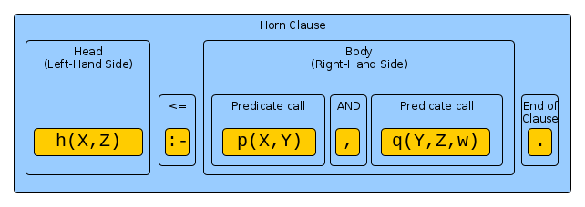

You are presented with this line in Prolog:

````
h(X,Z) :- p(X,Y) , q(Y,Z,w) .
````

How to read this?

First off:

- the `X`, `Y`, `Z` are _variables_ because they are identifiers starting with an uppercase letter.
- the `h`, `p`, `q` are _predicate identifiers_ used in `predicate calls`:
   - they starting with a lowercase letter (constant names)
   - and depend on arguments `q(.,.)`
   - they appear at the line's top level, are not inside predicate calls themselves: `p(X,Y)`, not `q(p(X,Y),Y)`.
- the `w` is a constant

The present line can be read in isolation of anything else in the logic program. Now of the elements
are determined by their context. In other languages this is not the case: the meaning of `p(x)` depends on what `x` has
been set to somewhere else in the code. Not so here.

The line can be separated into the following parts:




