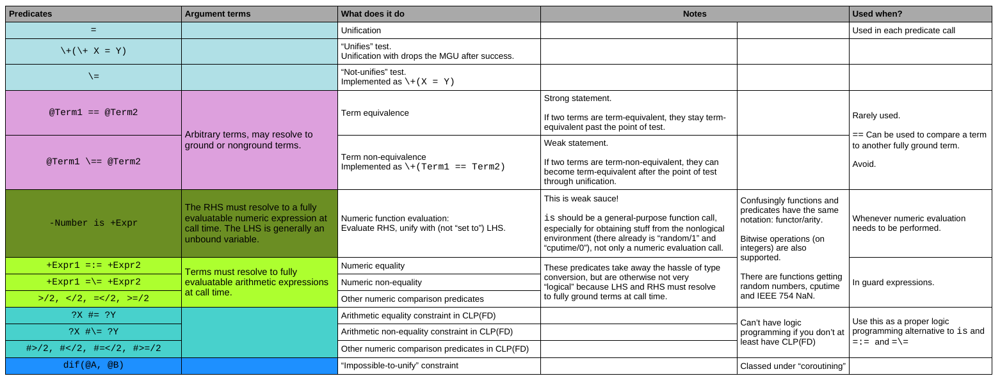

# Prolog's comparison predicates

- WORK IN PROGRESS.
- EXAMPLES & TEST CASES TO BE ADDED
- LOTS OF CLARIFICATIONS NEEDED

## Overview



## Sources

I'm going with the [SWI Prolog manual](https://eu.swi-prolog.org/pldoc/doc_for?object=manual) at this point and also
copying text from there.

**Good stuff**

- Stackoverflow: [Using \==/2 or dif/2](https://stackoverflow.com/questions/13757261/using-2-or-dif-2/13770020)
- [Notation of Predicate Descriptions](https://www.swi-prolog.org/pldoc/man?section=preddesc)
- [Type, mode and determinism declaration headers](https://www.swi-prolog.org/pldoc/man?section=modes)
- [Defining (mathematical) function in Prolog](https://stackoverflow.com/questions/18419975/defining-mathematical-function-in-prolog)

## Vocabulary

The vocabulary is a bit confusing. Needs review

- Predicate (whch may not behave like a predicate at all)
- Constraint
- Operator
- **Functions**: Functions are terms that can appear in the argument of (the predicates) `is/2`, `=:=/2`, `>/2`, etc.
  They reduce to a value. The notation of functions and predicates is, however, the same: `functor/arity`. 
  See [list of functions](https://eu.swi-prolog.org/pldoc/man?section=functions).
- (two terms are) identical
- (two terms are) equivalent
- (two terms are) equal
- (two terms can) unify
- a variable or term is 
   - constrained
   - instantiated
   - refined with additional contraints.
- a term is bound to a variable
- a term with variables can be "resolved" (must resolve to something) by looking up the value of variables at the point of computation
- Terms are ground or must resolve to a fully ground term
- LHS = "left hand side" (also called operand)
- RHS = "right-hand side" (also called operand)
- operator - sometimes its is the predicate, sometimes something which has been efoined with `op`
- the point of use of a predicate / point of of computation / call time
- guard expression: "Test whether to proceed with this predicate or use another alternative"
- arithmetic vs. numeric: The SWI Prolog manual (and maybe the ISO spec?) calls the predicates dealing with expressions and evaluation "arithmetic"; should really be "numeric".

## Structuring the problem

- Testing for "equality" vs. testing for "inequality" (according to some specific definition of equality)
   - Equality testing is slow because it's in fact an AND expression that must be checked for being TRUE and
     has to be traversed to the end (A eq B <=> A1 eq B1 & A2 eq B2 & A3 eq B3 ... )
   - Inequality testing is "fail fast" because it's on fact an OR expression that must be checked for being FALSE
     and can be exited as soon as a TRUE is found (A neq B <=> A1 neq B1 | A2 neq B2 | A3 new B3 ...)
- Constraints like "dif" that stay active once set up vs. "point of computation" tests like `==`
- Tests can only return TRUE or FALSE (or possibly throw an ERROR) but cannot return "I DON'T KNOW AT THIS POINT".
   - "Not knowing" would correctly imply goal suspension and going on with the computation, hoping to find out more.
      - "Set aside for later"
      - Goal is run again once variables are instantiated more. If it fails at that point, to where does backtracking
        track back?
      - This is a real problem constraint. "Go ahead with the search but check that the constraint is fulfilled by
        any new assignment".
   - Anything obtained through NAF is problematic "point in time knowledge" subjet to revision
   - Maybe predicates should be able to return a third truth value! (That would be hacky!)
   - What tests for equality/inequality stay TRUE (or stay FALSE) as computation progresses? E.g. moving `==`
     around in a clause will cause its truth value to change.  

## TOC

- [`=`: Unification](#-unification--)
- [`\=`: Negation of `=` using negation-as-failure](#-negation-of--using-negation-as-failure)
- [`is`: Evaluate, then unify](#is-evaluate-then-unify)
- [`==` and `\==`: Term equivalence and non-equivalence](#-and--term-equivalence-and-non-equivalence)
- [`=:=` and `=\=`: Arithmetic equality and inequality tests](#-and--arithmetic-equality-and-inequality-tests)
- [`#=` and `#\=`: Arithmetic equality/inequality constraints over the integers](#-and--arithmetic-equalityinequality-constraints-over-the-integers)
- [`dif`: Impossible-to-unify constraint](#dif-impossible-to-unify-constraint)  

## `=`: Unification  <a name="unification"></a>

**Found under**

- [Comparison and unification of terms](https://eu.swi-prolog.org/pldoc/man?section=compare)
- ...[Predicate `=/2`](https://eu.swi-prolog.org/pldoc/doc_for?object=(%3D)/2) 

**Description**

> `?Term1 = ?Term2`
> Unify `Term1` with `Term2`. True if the unification succeeds. 
>
> For behaviour on cyclic terms see the Prolog flag 
> [occurs_check](https://eu.swi-prolog.org/pldoc/man?section=flags#flag:occurs_check). 
> It acts as if defined by the following fact: `=(Term, Term).`

**Can be read as**

"To continue past this point, first unify the terms on the LHS and RHS"

**Intention**

Given two terms `A` and `B`, fully or partially constrained, try to find a _most general unifier_ (a variable substitution) which constrains any variables appearing in `A` and `B` so that the  `A` and `B` are the same term after the substitution has been applied. If this succeeds, continue with the proof search, assuming the suitably constrained variables. If no variable substitution can be found, the terms `A` and `B` are dissimilar: a solution cannot be found by proceeding,  `A = B` cannot be made true. Unification fails, and backtracking to an anterior point of the computation will happen.

Unification is applied at every predicate call by matching the parameters on the caller's side with the arguments appearing in the head of the called predicate. This can be used to "broadcast" values constructed in the called predicate to all predicates on the stack that use a common variable (TBD: example): information is returned from callee to caller. Compare with simple pattern matching against the head, which communicates information only from caller to callee.

Prolog may be more about _unification_ than proof search because unification is _the_ operation that constructs complex data structures on the heap.

- More on [Unification](https://en.wikipedia.org/wiki/Unification_(computer_science))
- More on [Occurs check](https://en.wikipedia.org/wiki/Occurs_check)

**Examples**

TBD. Examples on cyclical terms.

Two syntax trees describing variables `Left` and `Right` are unified, leading to then being considered as equal past the point of unification, with other variables being constrained in the same process:

```logtalk
Left  = f(h(X),X,g(K)),        format("Left  = ~w\n",[Left]),  % Left unified with complex term
Right = f(h(a),Z,g(l(X,Z,H))), format("Right = ~w\n",[Right]), % Right unified with complex term
format("Unifying...\n"),
Left = Right,
format("Both terms are exactly the same now!\n"),
format("Left  = ~w\n",[Left]),
format("Right = ~w\n",[Right]).
```

```logtalk
Left  = f(h(_2934),_2934,g(_2938))
Right = f(h(a),_2982,g(l(_2934,_2982,_2984)))
Unifying...
Both terms are exactly the same now!
Left  = f(h(a),a,g(l(a,a,_2984)))
Right = f(h(a),a,g(l(a,a,_2984)))

Left = Right, Right = f(h(a), a, g(l(a, a, H))),
X = Z, Z = a,
K = l(a, a, H).
```

You cannot unify values of different type!

Integer vs. Float:

```logtalk
?- 1 = 1.0.
false.
```

or

```logtalk
?- I=1, integer(I), F=1.0, float(F), F=I.
false.
```

String vs. Atom:

```logtalk
?- "string vs. atom" = 'string vs. atom'.
false.
```

## `\=`: Negation of `=` using negation-as-failure

**Found under**

- [Comparison and unification of terms](https://eu.swi-prolog.org/pldoc/man?section=compare)
- ...[Predicate `\=`](https://eu.swi-prolog.org/pldoc/doc_for?object=(%5C%3D)/2)

**Description**

> Equivalent to `\+(Term1 = Term2)`.
>
> This predicate is logically sound if its arguments are sufficiently instantiated. In other cases,
> such as `?- X \= Y.`, the predicate fails although there are solutions. This is due to the incomplete
> nature of `\+/1`.
> 
> To make your programs work correctly also in situations where the arguments are not yet sufficiently
> instantiated, use `dif/2` instead.


**Can be read as**

"is there no evidence that terms X and Y can be unified (at this point in time)?

(alternatively, "if there is any way that terms X and Y can be unified, fail!"). 

**Examples**

```Logtalk
?- 1 \= 1.0.
true.
```

```Logtalk
?- X \= Y.
false.
```

We don't know whether X and Y cannot be unified. They could be the same! So the answer to _"is there no evidence that terms X and Y can be unified (at this point in time)"_ is indeed false.

### NAF of NAF unification

There is a subtle difference between 

- "unify the terms on the left and right and proceed if that succeeds.
- "test whether the terms on the left and right unify, and procced if yes" and

One may want to drop information collected during the successful unification in the second case!

Here is the trick how to Test/Unify something and proceed on success without retaining information about the  unification:

Retain MGU information:

```Logtalk
?- Left=f(G,1), Right=f(1,H),
   format("%> Left = ~w, Right = ~w, G = ~w, H = ~w\n",[Left,Right,G,H]),
   Left = Right, 
   format("%> Left = ~w, Right = ~w, G = ~w, H = ~w\n",[Left,Right,G,H]).

%> Left = f(_13862,1), Right = f(1,_13876), G = _13862, H = _13876
%> Left = f(1,1), Right = f(1,1), G = 1, H = 1

Left = Right, Right = f(1, 1),
G = H, H = 1.
```

Drop MGU information:

```Logtalk
?- Left=f(G,1), Right=f(1,H),
   format("%> Left = ~w, Right = ~w, G = ~w, H = ~w\n",[Left,Right,G,H]),
   \+( Left \= Right ), 
   format("%> Left = ~w, Right = ~w, G = ~w, H = ~w\n",[Left,Right,G,H]).

%> Left = f(_15796,1), Right = f(1,_15810), G = _15796, H = _15810
%> Left = f(_15796,1), Right = f(1,_15810), G = _15796, H = _15810

Left = f(G, 1),
Right = f(1, H).
```

## `is`: Evaluate, then unify

This is really not a predicate, it is a special instruction to trigger evaluation (reduction?) of a function 
on the right-hand side and unify the (always numeric?) result with the left-hand side.

**Description** 

> `-Number is +Expr`: True when _Number_ is the value to which _Expr_ evaluates. 
> Typically, `is/2` should be used with unbound left operand. If equality is to be
> tested, `=:=/2` should be used. 

**Found under**

- [Arithmetic](https://eu.swi-prolog.org/pldoc/man?section=arith)
- ...[General purpose arithmetic](https://eu.swi-prolog.org/pldoc/man?section=arithpreds)
- ......[Predicate `is`](https://eu.swi-prolog.org/pldoc/doc_for?object=(is)/2)
  
**Can be read as**

"Evaluate the RHS and unify with the LHS"

**Note**

- A "force evaluation" instruction should be used for more than just numeric terms! String operations, obtaining data 
  from non-logical sources (`CurrentTime is time()`, `Data is read(Source)`) or even side-effects in obvious manner
  (`BytesWritten is writeBytes(Sink,String)`) should all be used that way instead of pretending rather disingeneously that
  such operations are "prediates". `is` is the gateway drug to function calls!
- Use `#=` to state constraints between numeric variables instead, what is generally what you want to do.

**Example**

Evaluate RHS and unify with LHS, i.e. 12

```Logtalk
?- 12 is 2*6.  
true.
```

Same as above but now we have different types on the LHS and RHS, so unification fails!

```Logtalk
12.0 is 2*6.
false.
```

Generally one evals the RHS and unifies with an unbound variable on the LHS. This looks like assignment:

```Logtalk
?- Result is 2*6.
Result = 12.
```

This should really work but doesn't. Why? Historical reasons! Maybe this will change someday.

```Logtalk
?- Result is "Hello," + 1 + " World".
ERROR: Type error: ...
```

## `==` and `\==`: Term equivalence and non-equivalence

**TL;DR**

- For `\==/2`:  This is probably not what you want:  Use `dif/2` instead of `\==/2` to keep the program declarative.
- For `==/2`: This is a stronger statement than unification. Is it really what you want? You may want `=/2` (unification) or even `\+(\+(X=Y))` (to dump any unifier in case of unification success), instead of `==`.

**Found under**

- [Comparison and Unification of terms](https://eu.swi-prolog.org/pldoc/man?section=compare)
- ...[Standard Order of Terms](https://eu.swi-prolog.org/pldoc/man?section=standardorder)
- ......[Predicate `==/2`](https://eu.swi-prolog.org/pldoc/doc_for?object=(%3D%3D)/2)
- ......[Predicate `\==`](https://eu.swi-prolog.org/pldoc/doc_for?object=(%5C%3D%3D)/2)

> `@Term1 == @Term2`:
> 
> True if `Term1` is equivalent to `Term2`. A variable is only identical (should be "equivalent"?) to a sharing variable.

The negation is implemented using negation-as-failure:

> `@Term1 \== @Term2`:
>
> Equivalent to `\+(Term1 == Term2)`.

Note the `@` mode of the declaration, indicating that `==` does not constrain (does not instantiate) the passed terms any further. In fact, it cannot. If the equivalence test fails, no additional constraints can persist. If the equivalence test
passes, the terms are the same module variable names.

Note that this is a "non-logical" predicate: It doesn't say anything about the problem constraints, it examines the
state of the computation at the moment of the call. It is a predicate for control and branch management. It could be 
of some use in a meta-interpreter.

The results for the exact same LHS and RHS may vary depending on the state of the computation:

```Logtalk
?- LHS=f(g(X)), 
   RHS=f(g(Y)), 
   LHS\==RHS,  % not equivalent at this point
   X=Y,
   LHS==RHS.   % equivalent at this point
   
LHS = RHS, RHS = f(g(Y)),
X = Y.
```

Or even simpler, program result changes by rearranging the predicate calls (this should not be the case in a 
"pure" logic program)

```Logtalk
? LHS \== RHS, LHS = RHS.
LHS = RHS.

? LHS = RHS, LHS \== RHS.
false.
```

**Performance considerations**

If one is looking for speed, then it would be resasonable to expect `Term1 \== Term2` to be faster than `Term1 \= Term2`. It can fail fast when comparing terms that are highly likly to be different and does not need to build a unifier. 

If one can ensure that at the point of use of `\==`, further refinement of terms would not change the success of `\==` result when moving forwards in the computation / rightwards in the clause (which all depends on the terms being sufficiently grounded at the time of the test), then the use `\==` is certainly justified. 

On the other hand `==` is a really strong statement. Whatever refinement happens if `Term1 == Term2` is true, it will remain true. But it's not very useful.

**Examples**

Two nonground, unrelated variables are *not* equivalent:

```Logtalk
?- X==Y.
false.
```

If they are ground to the same term, they *are* equivalent:

```Logtalk
?- X=a, Y=a, X==Y.
X = Y, Y = a.
```

If they are ground to different terms, they are *not* equivalent:

```Logtalk
?- X=a, Y=b, X==Y.
false.
```

If they are set to a sharing variable, they *are* equivalent:

```Logtalk
?- X=A, Y=A, X==Y.
X = A, A = Y.
```

```Logtalk
A=B, X=A, Y=B, X==Y.
A = B, B = X, X = Y.
```

Similarly:

```Logtalk
?- A=f(X), B=f(X), A==B.
A = B, B = f(X).
```

```Logtalk
?- A=f(X), B=f(Y), A==B.
false.
```

```Logtalk
?- A=f(X), B=f(Y), X=Y, A==B.
A = B, B = f(Y),
X = Y.
```

```Logtalk
?- A=f(X), B=A, A==B.
A = B, B = f(X).
```

This is not unification! Although the following two terms unify, they are clearly not equivalent:

```Logtalk
?- f(g(X),A) = f(B,h(Y)).
A = h(Y),
B = g(X).

?- f(g(X),A) == f(B,h(Y)).
false.
```

On the other hand, if two terms are equivalent, then they will unify with a trivial MGU consisting in variable renaming.

This is not about arithmetic equivalence either!

```Logtalk
?- 1.0 =:= 1.  % These terms are "arithmetically equivalent"
true.

?- 1.0 == 1.   % But these same terms are NOT "term-equivalent"
false.
```

Here we can see the effect [copy_term/2](https://www.swi-prolog.org/pldoc/doc_for?object=copy_term/2): After copying into a fresh variable `Y`, the "in" (`X`) and "out" (`Y`) terms are term-non-equivalent because the variables are disjoint:

```
?- X=f(a,B),copy_term(X,Y),X\==Y.
X = f(a, B),
Y = f(a, _21790).
```

## `=:=` and `=\=`: Arithmetic equality and inequality tests

**Found under**

- [Arithmetic](https://eu.swi-prolog.org/pldoc/man?section=arith)
- ...[General purpose arithmetic](https://eu.swi-prolog.org/pldoc/man?section=arithpreds)
- ......[Predicate `=:=`](https://eu.swi-prolog.org/pldoc/doc_for?object=(%3D%3A%3D)/2)
- ......[Predicate `=\=`](https://eu.swi-prolog.org/pldoc/doc_for?object=(%3D%5C%3D)/2)

> `+Expr1 =:= +Expr2`
>
> True if expression `Expr1` evaluates to a number equal to `Expr2`.
    
>`+Expr1 =\= +Expr2`
>
> True if expression `Expr1` evaluates to a number non-equal to `Expr2`.

Evaluation is performed on both the LHS and RHS, then the two sides are compared "by value", disregarding any differences in type on LHS and RHS. Any variables appearing in the expressions must be fully constrained to numeric values at the point of evaluation. 

**Examples**

Everything must be known at the time of evaluation:

```Logtalk
?- 2*2 =:= X.
ERROR: Arguments are not sufficiently instantiated

?- X=4.0, 2*2 =:= X.
X = 4.0.

?- cos(X) =\= sin(X).
ERROR: Arguments are not sufficiently instantiated

% Ok, then!

?- X=pi, cos(X) =\= sin(X).
X = pi.
```

Sadly `=:=` is a bit fussy. It shouldn't even worry about X here:

```Logtalk
?- X*0+1 =:= 1.0.
ERROR: Arguments are not sufficiently instantiated
```

However it can deal with subexpressions:

```Logtalk
?- X=(1+1), X*2 =:= 4.0.
X = 1+1.
```

"is" can do that too:

```Logtalk
?- X=(1+1), Y is X*2.
X = 1+1,
Y = 4.
```

Differences in [arithmetic type](https://eu.swi-prolog.org/pldoc/man?section=artypes) don't matter.

```Logtalk
?- 4 =:= 4.
true.

?- 4 =:= 4.0.
true.
```

This works even for [rational numbers](https://www.swi-prolog.org/pldoc/man?section=rational):

```Logtalk
?- X=1/7, X =:= 2/14.
X = 1/7.
```

Evaluation occurs on both sides

```Logtalk
?- 1*10 =:= 2+3+5.
true.

?- sqrt(2.0) =:= sqrt(4.0/2)
true.
```

The constant "epsilon" is the [machine epsilon](https://en.wikipedia.org/wiki/Machine_epsilon) and reveals floating point limitations:

```Logtalk
?- 1.0 =:= 1.0 + 0.5*epsilon.
true.
```

## `#=` and `#\=`: Arithmetic equality/inequality constraints over the integers

**Found under**

- [library(clpfd): CLP(FD): Constraint Logic Programming over Finite Domains](https://eu.swi-prolog.org/pldoc/man?section=clpfd)
- ...[Arithmetic Constraints](https://eu.swi-prolog.org/pldoc/man?section=clpfd-arith-constraints)
- ......[Predicate `#=`](https://eu.swi-prolog.org/pldoc/doc_for?object=%23%3D%20/%202)
- ......[Predicate `#\=/2`](https://eu.swi-prolog.org/pldoc/doc_for?object=%23%5C%3D%20/%202)

**Description**

> `?X #= ?Y`
> 
> The arithmetic expression `X` equals `Y`. This is the most important arithmetic constraint
> ([section A.9.2](https://eu.swi-prolog.org/pldoc/man?section=clpfd-arith-constraints)), subsuming
> and replacing both `(is)/2` and `(=:=)/2` over integers.

> `?X #\= ?Y`
> 
> The arithmetic expressions _X_ and _Y_ evaluate to distinct integers. When reasoning over integers, 
> replace `(=\=)/2` by `#\=/2` to obtain more general relations. 

See _declarative integer arithmetic_ ([section A.9.3](https://eu.swi-prolog.org/pldoc/man?section=clpfd-integer-arith)).

See [CLP(FD) and CLP(ℤ): Prolog Integer Arithmetic](https://www.metalevel.at/prolog/clpz) in Markus Triska's "The Power of prolog"

## `dif`: Impossible-to-unify constraint 

**Found under**

- [constraint logic programming](https://www.swi-prolog.org/pldoc/man?section=clp)
- ...[coroutining](https://www.swi-prolog.org/pldoc/man?section=coroutining)
- ......[predicate dif/2](https://eu.swi-prolog.org/pldoc/doc_for?object=dif/2)

**Description**

> `dif(@A, @B)`
>
> The `dif/2` predicate is a constraint that is true if and only if _A_ and _B_ are different terms.
> If _A_ and _B_ can **never unify**, `dif/2` succeeds deterministically. If _A_ and _B_ are **identical**, it fails
> immediately. Finally, if _A_ and _B_ **can unify**, goals are delayed that prevent _A_ and _B_ to become equal. 
> It is this last property that makes `dif/2` a more general and more declarative alternative for `\=/2` and 
> related predicates.
> 
> This predicate behaves as if defined by `dif(X, Y) :- when(?=(X,Y), X \== Y)`. See also `?=/2`. The
> implementation can deal with cyclic terms.
> 
> The `dif/2` predicate is realised using attributed variables associated with the module `dif`. It is an autoloaded
> predicate that is defined in the library `library(dif)`.

