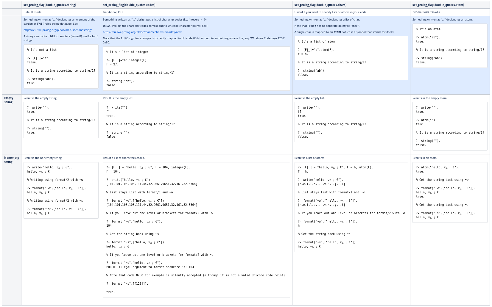

# SWI Prolog strings modes: How is something enclosed by double quotes `"` interpreted?

(This page is also reachable via http://bit.ly/2TtLV0H_prolog)

This is an SWI-Prolog specific extension to ISO-conforming Prolog: 

- ISO-conforming Prolog maps program text between an opening and closing `"` to a _list_ of character codes
  (i.e. integers >= 0).
- SWI Prolog has a dedicated data type _string_, and maps program text between an opening and closing `"`  to 
  a _string_ instance, by default. However, default behaviour can be changed by setting the flag `double_quotes`.

The flag `double_quotes` and a host of others are described in section
[Environment Control (Prolog flags)](https://www.swi-prolog.org/pldoc/man?section=flags) of the SWI-Prolog manual.

- [Description for the flag `double_quotes`](https://eu.swi-prolog.org/pldoc/man?section=flags#flag:double_quotes)
- [Introduction and motivation for the _string_ data typ](https://eu.swi-prolog.org/pldoc/man?section=flags#flag:double_quotes)
- There is also a library to set whether lists of integers are printed out as strings: 
  [portray_text](https://www.swi-prolog.org/pldoc/doc/_SWI_/library/portray_text.pl). This makes sense only if strings 
  are lists of integers, i.e. when one is ISO-conforming mode, which is no longer the SWI-Prolog way.

Another SWI-Prolog specific extension:

- The "empty list", written `[]`, is not an atom (in particular, not the atom `'[]'`) in SWI-Prolog. 
  See: [Lists are special](https://www.swi-prolog.org/pldoc/man?section=ext-lists).

Here is the table of tested behaviours. 

For now this is just a screenshot as there is some trouble exporting it properly from the wiki.

