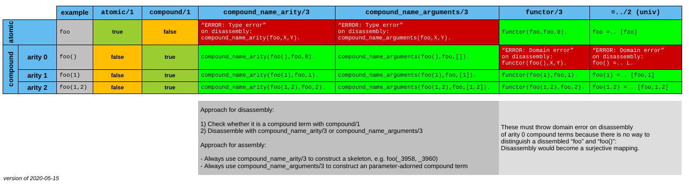

# SWI-Prolog datatypes

A tree depicting the built-in "base types" one may encounter in SWI Prolog (which are 
similary to the types of other Prolog). As there is no way to construct types from the base types 
these are the only one there are.

- [graphml file](swi_prolog_types.graphml). The editabel diagram. Edited with the free 8but not open) Java-based
[yEd](https://www.yworks.com/products/yed) editor (but you have to switch off antialiasing otherwise it feels like driving
an ocean liner).
- [PNG file](swi_prolog_types.png). Awkward to use. 4205 x 3055, 8-bit/color RGB.
- [SVG file](swi_prolog_types.svg). **Best**. Can be visualized in a browser.

For a description see this SWI-Prolog wiki entry: [SWI-Prolog datatypes](https://eu.swi-prolog.org/datatypes.txt)

For the type-testing predicates see this SWI-Prolog manual page: [Verify Type of a Term](https://eu.swi-prolog.org/pldoc/man?section=typetest)

## Notes

- There is a question on Stack Overflow about this: [What are the data types in Prolog?](https://stackoverflow.com/questions/12038009/what-are-the-data-types-in-prolog)
- [Logtalk](https://logtalk.org/) has actual datatypes and OO-style message handlers. This is achieved by setting up Prolog Modules around terms, which have the characteristics of objects (Prolog need a proper hierarchical Module system pronto though)

## Terms can appear in Roles

- Role of a Skeleton. These are terms whose arguments are all different variables. Created by `functor/3`. 
- Role of a Predicate
  - Predicate of various arities, arity 0 is allowed! (as in `foo :- bar.`)
  - Role of a predicate with arguments partially filled-in: This is called a "Closure" (not quite the same as a "Closure" of functional programming)
- Role of a Goal, used in Meta-calling.
  - Simple goal: A predicate name and the parameters which which it shall be called 8as in `p(X,Y,12,"Hello")`. 
  - Complex Goal: May be a conjunction, disjunction, implication, may even include cuts.
- Role of an (Arithmetic) Function 
  - These appear on the right side of the `is/2^ predicate.
  - Constants are atoms.
  - Functions are compound terms of arity >= 1. 
  - Might be of interest to have extension to allow functions other-than-arithmetic and in other places than on the right side of `is/2`, while not going fully "logic-functional" as for the [Curry](https://en.wikipedia.org/wiki/Curry_%28programming_language%29) language.
- Role of an arbitrary tree structure
- Role of Lambda Expressions. Lambda Expressions are used to "wra around" other predicates to make meta-calling convenient. See: [`library(yall)`](https://www.swi-prolog.org/pldoc/man?section=yall)
   - "Lambda Prolog" Lambda expressions are something else...

What roles do compound terms of arity 0 take on (which are not atoms, compare `a` and `a()`)?

## Disassembling the term

Résumé:

