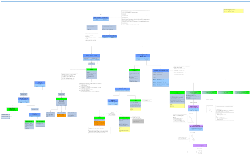

# About SWI-Prolog datatypes

## SWI Prolog datatype tree image

An image depicting the built-in "datatypes" one may encounter in SWI Prolog (which are 
similary to the types of other Prolog). As there is no way to define new datatypes from these
base datatypes ([algebraically](https://en.wikipedia.org/wiki/Algebraic_data_type) or
otherwise), these are the only one there are.



- [graphml file](swi_prolog_type_tree/swi_prolog_type_tree.graphml). **The editable diagram
  in [graphml](http://graphml.graphdrawing.org/) format.** 
  Edited with the free (but not open) Java-based [yEd](https://www.yworks.com/products/yed) editor
  (Note that you have to switch off antialiasing if you use it, otherwise it feels like driving
   an ocean liner).
- [PNG file](swi_prolog_type_tree/swi_prolog_type_tree.png). **The diagram in PNG format**, a bit
  awkward to use. PNG image data, 6704 x 4147, 8-bit/color RGB, non-interlaced.
- [SVG file](swi_prolog_type_tree/swi_prolog_type_tree.svg). **The diagram in SVG format**. Best! 
  Can be visualized in a browser and easily panned & zoomed. **Use this**.

## Code

This is Prolog code which follows the datatype tree above to "tag" the elements of a term.

Contains Unit Test code to be run with `rt(_).`.

Examples (all run with `once/1` to close the open choicepoint):

```logtalk
?- once(tag(X,S)).
S = var(X).

?- once(tag(100,S)).
S = int(100).

?- once(tag(100.1,S)).
S = float(100.1).

?- once(tag(1/3,S)).
S = compound(/, [gnd], [int(1), int(3)]).

?- once(tag(d{x:1,y:1,z:Z},S)).
S = dict(d, [nongnd], [atom(x)-int(1), atom(y)-int(1), atom(z)-var(Z)]).

?- once(tag([1,X,2],S)).
S = lbox([list, nongnd], int(1), lbox([list, nongnd], var(X), lbox([list, gnd], int(2), emptylist))).

?- once(tag(p(X,[1,2]),S)).
S = compound(p, [nongnd], [var(X), lbox([list, gnd], int(1), lbox([list, gnd], int(2), emptylist))]).
```

## Reading

- For a description of data types, see this SWI-Prolog wiki entry:
  [SWI-Prolog datatypes](https://eu.swi-prolog.org/datatypes.txt)

- For the type-testing predicates see this SWI-Prolog manual page:
  [Verify Type of a Term](https://eu.swi-prolog.org/pldoc/man?section=typetest)

## Notes

- There is a question on Stack Overflow about this: [What are the data types in Prolog?](https://stackoverflow.com/questions/12038009/what-are-the-data-types-in-prolog)
- [Logtalk](https://logtalk.org/) has actual datatypes and OO-style message handlers. This is achieved by setting up Prolog Modules around terms, which have the characteristics of objects (Prolog need a proper hierarchical Module system)
- Type tests seems to be non-logical but they are if one considers them to have a hidden additional argument: A term representing the "current computational state" of the system. That view probably doesn't help much.

### Better type tests

[Type tests in Prolog](https://www.youtube.com/watch?v=ZIv0G4b1xBQ) (3 Apr 2019) on Youtube by Markus Triska.

The above presents predicates `atom_si/1`, `integer_si/1`,  `list_si/1`  (`si` standing for "sufficiently instantiated") which make more sense than the current type test predicates. Instead of failing silently on fresh variables, they throw a `type_error`.

Also introduced are `must_be/2` and `can_be/2` which test whether the computational state allows one to assert that some term is of some type (and will stay that way) or whether there still is the possibility that some term is of some type (even though that may change)

Indeed, what should `atom(_)` do?

- Say "I don't know!" is a possibility. Prolog is based on classical logic though, so there is no space for that. The nearest to "I don't know" is throwing an error.
- Freeze until more is known about `_`. But there won't be more info on `_`, ever.
- Start generating possible atoms. Although atoms are enumerable, there are still infinitely many of them.
- Generate a _template_ that can only be instantiated to an atom. That would be a "typed fresh term". Such a concept does not exist, but something rather near to it can be observed when you do `length(L,3)`: You get a template for things that fulfill `length(L,3)`, namely a list of 3 fresh variables (but the list _contents_ is not further templated)
- Fail silently? That's illogical, but that's what happens.

In SWI Prolog there is a [`must_be/2`](https://www.swi-prolog.org/pldoc/doc_for?object=must_be/2) in [`library(error)`](https://www.swi-prolog.org/pldoc/man?section=error). (But where is `can_be/2`?) 

However, that predicate is not satisfying. Although it throws if it has to work on a fresh variable, it also throws if the answer should simply be "no". 

See also:

- https://www.quora.com/If-prolog-were-being-invented-today-with-no-concern-for-backward-compatibility-or-the-existing-standardization-how-would-it-differ-from-standard-prolog?share=1 where Markus Triska writes:

> Currently, we have to slowly move to better type tests, using `must_be/2`, `can_be/2`, `atom_si/1` etc. It will
> take many years to propagate these predicates to application programmers, an errand that could have easily
> been avoided.

- https://stackoverflow.com/questions/24017420/which-meanings-of-type-are-used-in-the-standard

- https://stackoverflow.com/questions/27306453/safer-type-tests-in-prolog

The arity-1 predicates `atom_si/1`, `integer_si/1`,  `list_si/1` etc. are proposed instead of arity-2 predicates like `has_type/2`, `must_be/2` etc.

- https://swi-prolog.discourse.group/t/must-be-2-and-is-of-type-2-types/1539

An example of for [`must_be/2`](https://www.swi-prolog.org/pldoc/doc_for?object=must_be/2)

```
% Define catcher terms here for legibility!

type_err_catcher(error(type_error,_)).
inst_err_catcher(error(instantiation_error,_)).

:- begin_tests(must_be).

% ---
% Old school testing for atom-icity
% Silently fails on fresh variable (instead of throwing).
% ---

test(oldschool_yes)           :- atom(foo).
test(oldschool_no, fail)      :- atom(1/137).
test(oldschool_unknown, fail) :- atom(_).

% ---
% must_be/2: Likes to throw too much.
% Test "must_be_no" had better fail instead of throwing.
% ---

test(must_be_yes)                :- must_be(atom,foo).
test(must_be_no, throws(C))      :- type_err_catcher(C), must_be(atom,1/137).
test(must_be_unknown, throws(C)) :- inst_err_catcher(C), must_be(atom,_).

% doesn't run backwards either

test(must_be_fwd_only, throws(C)) :-
   inst_err_catcher(C),
   bagof(X, must_be(X,foo), _Types).

% ---
% is_of_type/2: Behaves old-school-ish
% ---

test(is_of_type_yes)           :- is_of_type(atom,foo).
test(is_of_type_no, fail)      :- is_of_type(atom,1/137).
test(is_of_type_unknown, fail) :- is_of_type(atom,_).

% doesn't run backwards

test(is_of_type_fwd_only, throws(C)) :-
   inst_err_catcher(C),
   bagof(X, is_of_type(X,foo), _Types).

:- end_tests(must_be).

rt :- run_tests(must_be).
```

## Terms can appear with various Roles

- **Role of a Skeleton**. These are terms whose arguments are all different variables. Created by `functor/3`. 
- **Role of a Predicate**
  - Predicates of various arities, arity 0 is allowed! (as in `foo :- bar.`)    
- **Role of a Goal**, as argument to meta-predicates which call the Goal
  - **Simple Goal**: A predicate name and the parameters which which it shall be called. As in `p(X,Y,12,"Hello")`. 
  - **Complex Goal**: May be a conjunction, disjunction, implication, may even include cuts.
  - **Closures**: Predicates with arguments partially filled-in (filling them in from the left only): This is not
    quite the same as a "closure" of functional programming. For example, if you have 
    predicate `foo/5`, a corresponding closure might be `foo(1,2)`: a term indicating the name of the predicate
    and its two leftmost arguments, which have to be completed to 5 arguments before a clal can be issued.  
  - **Lambda Expressions**: Lambda Expressions are used to "wrap around" other predicates to make
    meta-calling convenient. See: [`library(yall)`](https://www.swi-prolog.org/pldoc/man?section=yall)
    - "Lambda Prolog" Lambda expressions are something else...  
- **Role of an (Arithmetic) Function** 
  - These appear on the right side of the `is/2^ predicate.
  - Constants are atoms.
  - Functions are compound terms of arity >= 1. 
  - Might be of interest to have extension to allow functions other-than-arithmetic and in other places than
    on the right side of `is/2`.
- **Role of arbitrary data** in the form of a tree or list structure. Cyclic terms allow directed, single-rooted graphs.

## Disassembling the term

Résumé:


## On Type testing

See this '92 paper collection: https://mitpress.mit.edu/books/types-logic-programming

[Covington et al.](https://arxiv.org/abs/0911.2899) says on page 30:

> Develop your own ad hoc run-time type and mode checking system. Many problems during development (especially if the program is large and/or there are several developers involved) are caused by passing incorrect arguments. Even if the documentation is there to explain, for each predicate, which arguments are expected on entry and on successful exit, they can be, and all too often they are, overlooked or ignored. Moreover, when a “wrong” argument is passed, erratic behavior can manifest itself far from where the mistake was made (and of course, following Murphy’s laws, at the most inconvenient time).
>
> In order to significantly mitigate such problems, do take the time to write your own predicates for checking the legality of arguments on entry to and on exit from your procedures. In the production version, the goals you added for these checks can be compiled away using goal_expansion/2.

The above is fun, but is not a scalable approach. What does exist? (How is it done in Logtalk? How in Lambda Prolog?)

### plspec

There is `plspec`, a "spec" approach inspired by the "spec" approach of Clojure (Clojure being a Scheme for the JVM that
has no type checking; although there is "Typed Clojure" it does not seem to be liked or used. Clojure specs provides the possibility to add annotations to perform runtime checks on precondition, postconditions and invariants). 

- Paper: [plspec – A Specification Languagefor Prolog Data](https://www3.hhu.de/stups/downloads/pdf/plspec.pdf)
- https://github.com/wysiib/plspec

### Typed Prolog

Among others...

- Paper: [Towards Typed Prolog](https://citeseerx.ist.psu.edu/viewdoc/summary?doi=10.1.1.456.7365) _Tom Schrijvers, Vitor Santos Costa, Jan Wielemaker, and Bart Demoen_ (2008)
- https://eu.swi-prolog.org/pack/list?p=type_check (This probably is the corresponding pack, but it is dead) 

