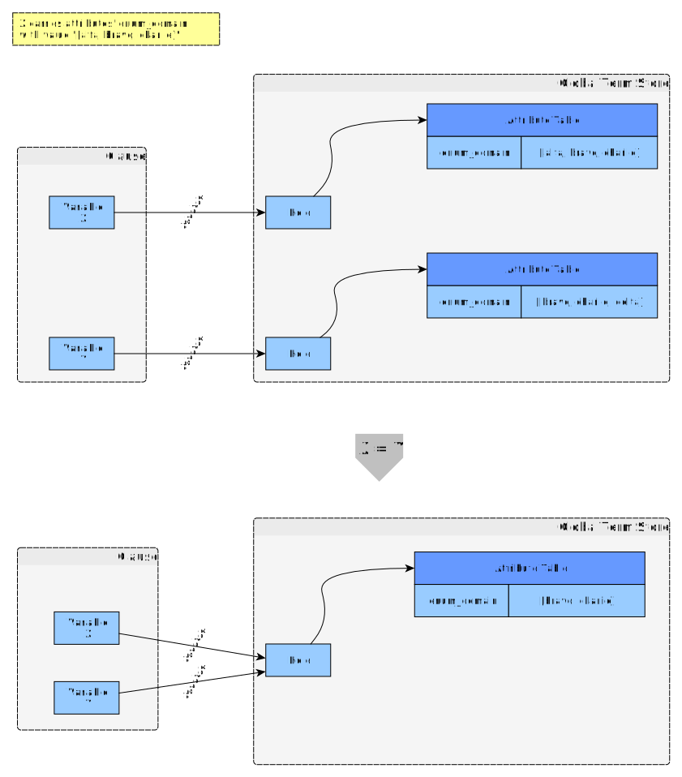
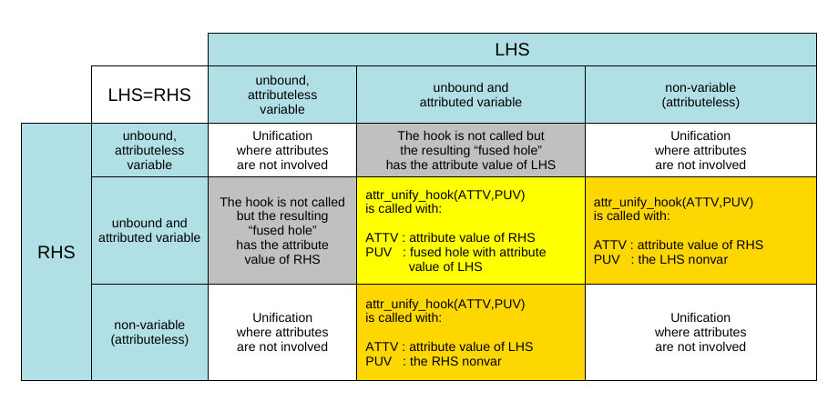

# Attributed Variables

These are some additions to the page on "Attributed Variables" of the SWI-Prolog manual

Note that the pages should be the same but the comments differ (!?)

- [Attributed variables at eu.swi-prolog.org](https://eu.swi-prolog.org/pldoc/man?section=attvar) 
- [Attributed variables at www.swi-prolog.org](https://eu.swi-prolog.org/pldoc/man?section=attvar) 

## Diagram showing how to think about the structure involved

This diagram explains what's going on in the example application of attributed variables.
The attribute values are [ordsets](https://eu.swi-prolog.org/pldoc/man?section=ordsets) and unification
means the new attribute value on the leftover unbound variable is set to the
intersection of the ordsets on the original unbound variables. 

(And that's all there is to it.)

- [graphml](merging_attributed_variables/merging_attributed_variables.graphml)
   - [SVG](merging_attributed_variables/merging_attributed_variables.svg)
   - [PNG](merging_attributed_variables/merging_attributed_variables.png)

## Matrix showing when `attr_unif_hook` is triggered

It is triggered at unification, but how do the Left-Hand-Side and Right-Hand-Side of the unification have to look?

- [ODS](when_is_the_hook_triggered/when_is_the_hook_triggered.ods)
   - [PDF](when_is_the_hook_triggered/when_is_the_hook_triggered.pdf)
   - [PNG](when_is_the_hook_triggered/when_is_the_hook_triggered.png)

The different cases are also tested in `enum_domain.plt` below.

## Rewritten example code

The example given in the SWI-Prolog manual is too compressed for me.

Here is the example rewritten for more clarity (IMHO) and with lots of more comments, and debug printouts
and separate `get`/`set` predicates for the attribute in question.

Indeed shoehorning an imperative `get` and `set` into a single predicate `domain/2`, as done in the
example, is just a step too far for me. It doesn't help here, we are working in imperative mode
in any case. Better be straightforward.

Additionally, the hook predicate updates a global variable to indicate that it has been called (and with
what arguments), so that test cases can easily verify that it has, indeed, been called, and that it 
has been called only once.

- Code: [`enum_domain.pl`](enum_domain.pl)
- Test cases: [`enum_domain.plt`](enum_domain.plt) (note that Github won't correctly syntax-highlight .plt files, it thinks those are gnuplot files)

## SWI-Prolog manual code subtlety

The example application in the manual has a subtle unfelicity (with no deleterious consequences) 
in that the unification `Y = Value` assigns one of the allowed values for attribute `domain`  (held in `Value`) 
to an unbound variable (`Y`) that itself carries the attribute `domain`. This works but needlessly
triggers itself a call to `attr_unify_hook/2` from within `attr_unif_hook/2`.

One would need to to remove attribute `domain` from `Y` first.
