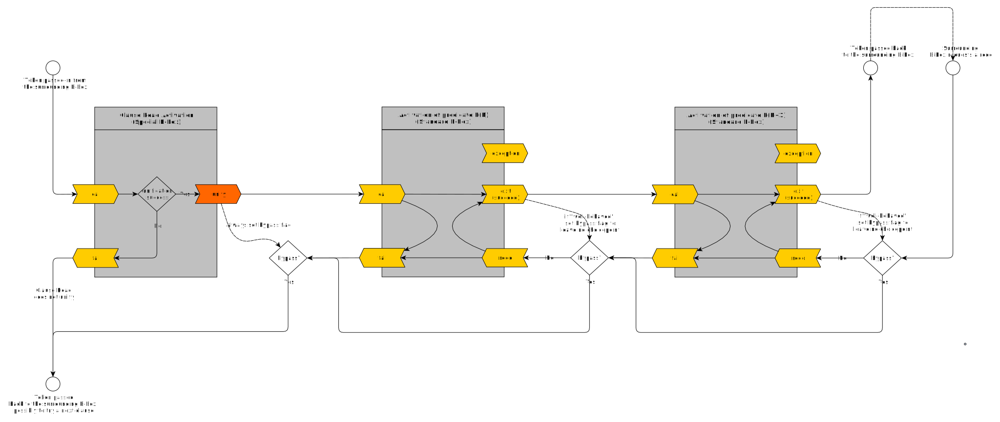
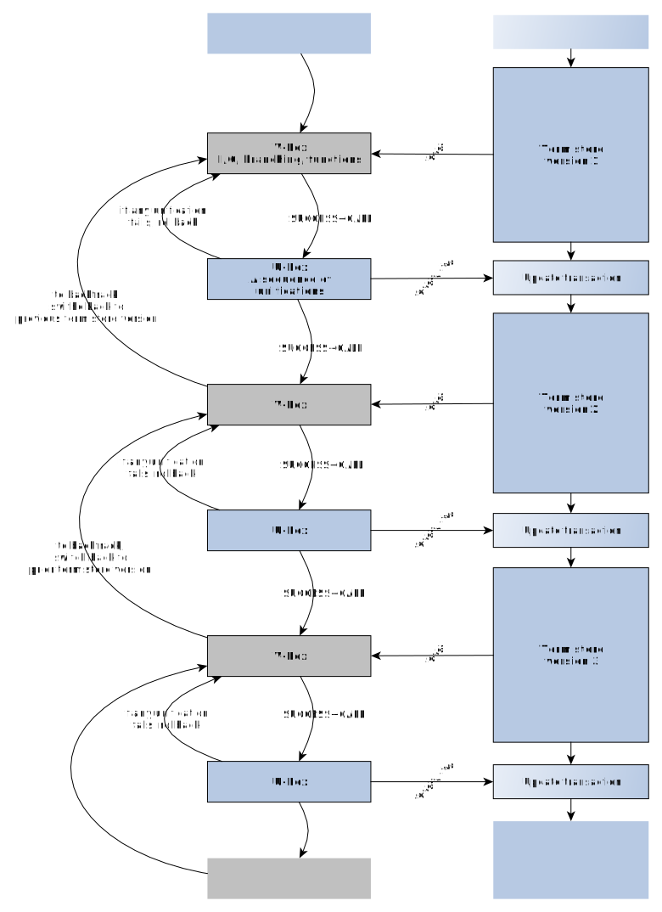

# About the "Byrd Box Model"

## Generalities

The "Byrd Box Model", also called "Tracing Model" or "Procedure Box Model" or 
"4-port Model" conceptualizes the calls to a predicate as a "box with 4 ports".

The model's idea is that the Prolog Processor traverses these ports during
program execution.

Debuggers use this model as conceptual basis when they generate trace output and
allow monitoring of "ports traversal events" either in general 
([`leash/1`](https://www.swi-prolog.org/pldoc/doc_for?object=leash/1))
or on a per-predicate basis
([`trace/1`](https://www.swi-prolog.org/pldoc/doc_for?object=trace/1), [`trace/2`](https://www.swi-prolog.org/pldoc/doc_for?object=trace/2)).

The Byrd Box model has been described first in:

- Understanding the control flow of Prolog programs, 1980.
  - Lawrence Byrd.
  - Appears in: "Proceedings of the Logic Programming Workshop in Debrecen, Hungary." (this document does not seem to exist online)

And later:

- DECSystem-10 PROLOG USER'S MANUAL version 3.47, November 10, 1982
  - D.L. Bowen (ed.), L. Byrd, F.C.N. Pereira, L.M. Pereira, D.H.D. Warren
  - p. 13 ff. "2.1 The Procedure Box Control Flow Model"
  - Can be downloaded from [CiteseerX](https://citeseerx.ist.psu.edu/viewdoc/summary?doi=10.1.1.300.8430)

And is described for example here:

- Programming in Prolog, 5th edition
  - Springer Verlag, 2003,
  - William F. Clocksin, Christopher S. Mellish
  - p. 194 ff.: "8.3 The Tracing Model"
  
and here:

- [GNU Prolog - Debugging - The Procedure Box Model](http://gprolog.univ-paris1.fr/manual/gprolog.html#sec22)

The Byrd Box Model leaves out a lot of detail - being a model, that's the idea.
The Byrd-Box model says nothing about what happens "around the box": cuts, selection of a 
clause, constraints. It doesn't mention the special case of the clause head (that's
a miss). In particular it says nothing about the operations on the _term store_, which is, 
however, a crucial aspect. We will try to fill in some details then.  

## A Note on Vocabulary

(I always have problems with Prolog vocabulary)

From [Is this Prolog terminology correct? (fact, rule, procedure, predicate, …)](https://stackoverflow.com/questions/49898738/is-this-prolog-terminology-correct-fact-rule-procedure-predicate), based on the ISO Standard:

- *procedure*: A control construct, a built-in predicate, or a user-defined procedure. A procedure is either static or dynamic. A procedure is either private or public (see 7.5). In "Programming in Prolog (5th ed.)" (Clocksin & Mellish 2003), it is simply said on p. 188 that "The collection of clauses for a given predicate is called a procedure."
- *predicate*: An identifier together with an arity.
- *predicate indicator*: A compound term A/N, where A is an atom and N is a non-negative integer, denoting one particular procedure (see 7.1.6.6)

## From the DECsystem-10 User Manual

Here is the image from the 
[DECsystem-10 Prolog User's Manual](https://citeseerx.ist.psu.edu/viewdoc/summary?doi=10.1.1.300.8430), November 1982, page 13 ("Chapter 2: Debugging")

```text
                *--------------------------------------*
         Call   |                                      |   Exit
     ---------> +  descendant(X,Y) :- offspring(X,Y).  + --------->
                |                                      |
                |  descendant(X,Z) :-                  |
     <--------- +     offspring(X,Y), descendant(Y,Z). + <---------
         Fail   |                                      |   Redo
                *--------------------------------------*
```

The text says (some remarks in [] added):

> During debugging the interpreter prints out a sequence of goals [atomic goals] in various
> states of instantiation in order to show the state the program [process] has reached
> in its execution. However, in order to understand what is occurring it is
> necessary to understand when and why the interpreter prints out goals.
> As in other programming languages, key points of interest are procedure entry
> and return, but in Prolog there is the additional complexity of backtracking.
> One of the major confusions that novice Prolog programmers have to face is
> the question of what actually happens when a goal fails and the system suddenly
> starts backtracking. The Procedure Box model of Prolog execution views program
> control flow in terms of movement about the program text [that is not really the
> case, we are in 'box space', not in 'text space']. This model provides a
> basis for the debugging mechanism in the interpreter [more generally, the Prolog
> Processor], and enables the user to view the behaviour of his program in a consistent way.
>
> ...
>
> In terms of this model, the information we get about the procedure box is only
> the control flow through these four ports. This means that at this level we are
> not concerned with which clause matches, and how any subgoals are satisfied,
> but rather we only wish to know the initial goal and the final outcome. However,
> it can be seen that whenever we are trying to satisfy subgoals, what we are
> actually doing is passing through the ports of THEIR respective boxes. If we
> were to follow this, then we would have complete information about the control
> flow inside the procedure box. Note that the box we have drawn round the
> procedure should really be seen as an invocation box [i.e. an activation record on stack].
> That is, there will be a different box for each different invocation of the procedure.
> Obviously, with something like a recursive procedure, there will be many different Calls and
> Exits in the control flow, but these will be for different invocations.
> Since this might get confusing each invocation box is given a unique integer
> identifier.

## Adding Details 

Let's call that box at the center of the model a _B-Box_ for short.

Consider the Prolog Processor (_PP_) running a Prolog program. The B-Box represents a
_activation record_ rather than a predicate or procedure. The latter is a specification,
an element of a Prolog program (essentially text), rather than an element of a
Prolog Processor's internal state. A predicate activation record is another name for a frame on
the Prolog Processor's execution stack, or a node in Prolog's search tree. Every B-Box
must first be instantiated by the PP before it can be called.

As a predicate can call other predicates, the B-Box model is
a recursive "boxes-in-boxes" model. The PP instantiates a B-Box in the context of a 
surrounding B-Box, and deletes it when it backtracks out of the B-Box and calls it. Inside a B-Box
the same happens: it's B-Box instantiations, calls and deletions all the way down. Or
at least until you reach the B-Boxes that cannot be decomposed into smaller B-Boxes.
When you think about it, these must be either unifications or operations
not involving unification, like branching decisions, function evaluations or I/O.
More on that below. 

The root B-Box, i.e. the one without any enclosing B-Box, would be the one enclosing the
B-Boxes of the original goal entered at the Prolog toplevel (that goal is a clause body).

A B-Box has _internal state_. Evidently there are the currently active sub-B-Boxes, but
there is also the index of the predicate clause that is currently being processed. This
index which will be incremented when the B-Box is asked for a "redo". 

(In some papers on parallel implementations of Prolog, the predicate activation is seen 
as an "agent" in and of itself, communicating over channels (the variables) with other agents,
an interesting view).

Execution flow can be considered as a token passing into one port of an instantiated
B-Box and out of another. In a picture chaining several B-Boxes, the token is transported
over "wires" linking the ports. Whenever the token goes through one of the ports, the
corresponding port traversal event is fired and may cause the tracer to print out messages 
or query the user for interaction.

## The ports

### Traditional ports

Note that:

- Passing the execution token left-to-right generally "grows the stack" (unless optimization
removes stack frames).
- Passing the execution token right-to-left always "shrink the stack" as the activation record
just left behind may be dropped.

The traditional set of ports is the following:

- **`call`**: Incoming, left-to-right. The B-Box is created by the PP, then called (exactly
  once, actually) through this port. If this is the start of a clause body, there must have
  been a previous box that concluded successfully: the special B-Box performing the head unifications.
  
- **`exit`**: Outgoing, left-to-right (and it should really be called **`succeed`**): The predicate call
  succeeds, and the next B-Box can be instantiated and called. Which B-Box that is
  depends on the current state of the surrounding B-Box, which manages branching,
  B-Box instantiations and wiring. If this was the end of a clause body, the execution token
  is transferred to the surrounding B-Box instead.

- **`redo`**: Incoming, right-to-left. The B-Box to the right has encountered 
  failure or a collection of results via a meta-predicate like `bagof/3` is ongoing, or
  the user has asked for more solutions on the toplevel after a successful conclusion.
  Passing the execution token back into the B-Box via `redo` may:
  leads to the execution token being passed to `redo` ports of lower-level boxes or
  lead to advancing the B-Box counters to the next clause. If a new
  solution can be found, the term store is updated and the token is passed out via
  `exit`. If no new solution can be found, the token is passed out via `fail`. 

- **`fail`** Outgoing, right-to-left. The B-Box cannot provide any more solutions
  given current conditions. Setting up different terms in the term store for a
  reattempt is left to the predicate instantiation to the left.

Note that the naming of the ports is less than ideal: The port for `exit` should really
be called `succeed`, in analogy to `fail`. I will use `succeed` as alternative to `exit`.

### The exception port

ISO Standard Prolog specifies exceptions, so one would expect port like `throw` or
`exception` to be present on the B-Box, too. An execution token exiting via `exception`
will be passed to first enclosing B-Box that can _catch_ it (i.e. unify the thrown term in a 
[`catch/3`](https://eu.swi-prolog.org/pldoc/man?section=exception)). 

### Head unifications

There is no mention in the model of the special B-Box performing head unifications. That
B-Box can be considered a series of unifications which must pass. Its execution token 
comes from the surrounding box through `call`, its `fail` passes the token back to the
surrounding box, and its `redo` is just short-circuited to `fail`. 

### Non-traditional ports

**SWI-Prolog** provides `exception` port as well as the additional `unify` port 
(see [Overview of the Debugger](https://www.swi-prolog.org/pldoc/man?section=debugoverview)).
`unify` can be seen as an event or as the `exit` port of the special head B-Box: 

> - `unify`: allows the user to inspect the result after unification of the head.
> - `exception`: shows exceptions raised by `throw/1` or one of the built-in predicates. 

**Logtalk** additionally distinguishes the `unify` depending on whether the PP is currently
evaluating a rule or a fact
(see [Logtalk - Debugging - Procedure box model](https://logtalk.org/manuals/userman/debugging.html#procedure-box-model)):

> - `rule`: unification success between a goal and a rule head
> - `fact`: unification success between a goal and a fact
> - `exception`: predicate call throws an exception

An appoximate rendering of a clause for which the PP generate the head B-Box, and two additional B-Boxes 
would thus be this (the `excpetion` port is not shown)



## Well-behavedness

See [SWI-Prolog: Deterministic/Semi-deterministic/Non-deterministic predicates](https://www.swi-prolog.org/pldoc/man?section=testbody)

Note these case of predicate behaviour:

- A **deterministic** predicate always succeeds exactly once, a `redo` will lead to failure. If the predicate is _well-behaved_ it tells the PP
  that there are no alterntive solutions and there is no point asking for more ("it leaves no choicepoints").
  On the Prolog Toplevel, a well-behaved deterministic predicate will always only say `true.` and not accept a `;` for more solutions.
  Example: [`true/0`](https://eu.swi-prolog.org/pldoc/doc_for?object=true/0).
- A **semi-deterministic** predicate may succeed once or else fail. A `redo` will lead to failure. Similarly to above,
  if the predicate is _well-behaved_ it tells the PP that there are no alterntive solutions.
  On the Prolog Toplevel, a well-behaved semi-deterministic predicate will either says `true.` or `false.` and not accept a `;` for more solutions.
  Example: [`memberchk/2`](https://eu.swi-prolog.org/pldoc/doc_for?object=memberchk/2).
- A **non-deterministic** predicate gives nothing away. It demands that the PP call `redo` unconditionally.
  If there are no solutions after all, it will `fail`. This is the behaviour of predicates that have a search space that does not allow 
  to directly determine whether more solutions exist without actually looking for them. Example: `member/2` having a nonempty list left to
  traverse when it found the (objectively) last solution. These predicates accept `;` 
  on the toplevel but then may say `false`.
- A bit more vaguely, a predicate which **provides determinism on the last solution** may succeed several times but, on the last solution, 
  behaves like a well-behaved **deterministic** predicate. Example: [`member/2`](https://eu.swi-prolog.org/pldoc/doc_for?object=member/2). 

In the B-Box model, a "well-behaved" predicate can be understood thus: the token always exits at `succeed` but, when going leftwards during
backtracking, the token does not enter `redo` - it bypasses the B-Box entirely (and this bypassing may certainly be chained, bypassing 
more B-Boxes to the left). This implies there must be some kind of "switch" for the token path that is set by the B-Box at `succeed` time,
which is indicated in teh diagram above.

## Term Store Operations

### An execution of elementary B-Boxes

The B-Box Model does not talk about the term store updates that take place as a B-Box is active. The term
store is the versioned global (or thread-local) store holding terms, said terms being named/denoted by the
clause-local variables. If a term is no longer named (and not used by a constraint) in any predicate
activation record on the stack, it can evidently be garbage-collected as it has no influence on further
processing.

If you flatten the recursively imbricated boxes of the B-Box Model, you will end up with a chain with two types
of boxes:

- _U-Boxes_: These are boxes which perform a sequence of unifications on the global term store. That modifies the term
  store. Unification operations instantiate uninstantiated terms (fresh terms) at leaf positions of term trees or merge pairs
  of fresh terms into single fresh terms. This extends the term trees in term store downwards (term trees newer
  shrink going forward in computation). The clause-local variables that appear to the left and right of any `=` 
  name the positions of interest in those trees. In particular, clause head B-Boxes are U-Boxes.  
- _V-Boxes_: These are boxes which do not change the global term store, though they may consult it. They perform
  processing other than unification. What processing is this? Branching decisions, I/O and function evaluation,
  including comparison operation on term store elements fall under this.

Both of the above are essentially "elementary B-Boxes" whose inner structure can be disregarded.

### Term Store updates and rollbacks

If you consider a (single-thread) Prolog program execution as a sequence of U-Boxes and V-Boxes, then the U-Boxes
look like (transactional) updates of the term store:

- If any of the unifications fails, term store updates are rolled back and the preceding V-Box is reactived.
- If that V-Box fails, then backtracking rolls the term store back to the version that existed for the
  previous V-Box (or to one even earlier) and said previous V-Box is reattempted.



For non-elementary B-Boxes, updates on the term store may occur at any point "inside the box", however
the paths of the execution token implies some invariants:

- Going from `call` to `fail`: No updates on the term store are retained. When exiting via `fail` the term
  store is back at the same version as it had when entering via `call`.
- Going from `call` to `succeed`: arbitrary updates (including none) may be performed on the term store.
- Going from `redo` to `succeed`: An arbitrary number of term store rollbacks may be performed, followed
  by an arbitrary number of updates.
- Going from `redo` to `fail`:  When exiting via `fail` the term store is back at the same version as
  it had when entering via `call`.

The above is a direct consequence of what sub B-Boxes and the U-Boxes do, no special handling is
required. On the other hand, a bypass of the B-Box due to determinism or semi-determinism indicates
that a forced rollback of the term store to the version valid at call time must be performed, 
at least in this model.

## See also

- [SWI-Prolog: Overview of the Debugger](https://eu.swi-prolog.org/pldoc/man?section=debugoverview)

