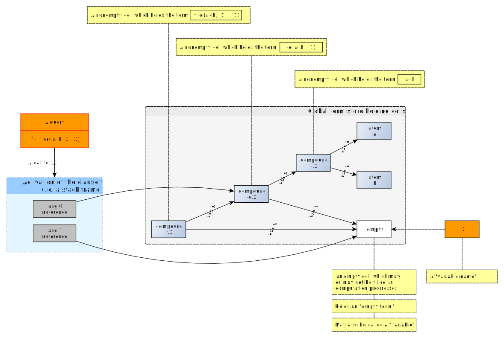
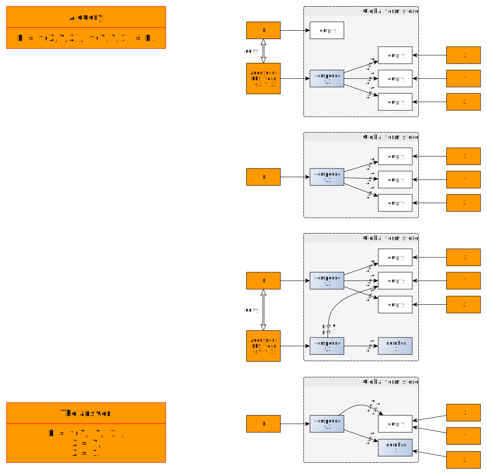

# The concept of the Prolog "variable"

The noun "variable" is used confusingly in the Prolog universe. 

Let's attempt to clarify (hopefully).

## Variable names

"Variable names" are clause-local or goal-local names found in source code and user-readable representations. They may be "anonymous":

```
f(X) :- g(X,_).
```

They may be generated on demand by predicates like [`print/1`](https://eu.swi-prolog.org/pldoc/doc_for?object=print/1):

```
?- print(f(X) :- g(X,_)).
f(_1668):-g(_1668,_1674)
```

## Terms and cells

A variable name appearing in a clause or goal designates (or "denotes") a _cell in a "global term store" at runtime.
The term store is _global_ as the currently clause may access any cell therein as long as the activation (stack frame)
contains a reference to said cell.  

Consider the clause:

```
f(X,Y) :- g(X,Z),h(Z,Y).
```

It uses variables names `X`, `Y` and `Z`. At runtime, the activation of the clause (the stack frame) is initialized with
references into the global term store for the arguments passed in: one for `X` and one for `Y`. A new reference into the 
global term store for the fresh variable `Z` is added. The actual variable names used in source code, `X`, `Y`, `Z`
are of no relevance and actually unknown to the activation. 

Cells form directed graphs that are a concrete representation of terms.

A term is generally considered to have tree structure (a "tree of terms", the definition being recursive). Inner nodes of
the tree are _compound terms_ and leaf nodes are either _atomic terms_ or _empty terms_. An _empty term_ leaf is printed
as a variable name. Empty terms are distinguishable: 

Example: Create a list with 5 empty terms, with the list denoted by the variable name `L`. Denote the empty terms at
position 0 with `E0` and position 1 with `E1` (SWI Prolog will actually reause those names when printing out
`L`, but there is no deep reason for that). The empty terms designated by `E0` and `E1` are distinguishable:

```
?- length(L,5), nth0(0,L,E0),nth0(1,L,E1),E0\==E1.
L = [E0, E1, _124792, _124798, _124804].
```

The _same_ empty term may appear in several distinct leaf positions ("the variable is shared") and cycles may even be
constructed. In that case, the term can no longer be considered a tree  but must be considered a directed graph, possibly cyclic.

If there is sharing of subterms (entire subtrees referenced from multiple places) inside the term graph, there is in
principle no way to find out from Prolog that this is the case.

One can consider each node of a term graph to be represented by a (either shared or unique) cell in the global term store.
Inner nodes are cells with (possibly 0) children. Leaf nodes (or rather, nodes the the edge of the graph) are cells with 
no children. 

An empty term is represented by an _empty cell_ (a "hole", not to be confused with an Haskell [type holes](https://wiki.haskell.org/GHC/Typed_holes)). 
The idea is that this represents an as-yet-undefined datum. The cell may be filled using unification as computation
proceeds. The empty term is "instantiated" (or "refined"). This represents accumulation of information about the problem to 
solve. Prolog does allow one to "uninstantiate" an instantiated, previously empty term except when backtracking.



Fluidly, one talks about "the term `X`" when one really wants to talk about "the (possibly empty) term designated by the 
variable name `X` at a given step of the computation". Indeed, whatever can be found inside the parentheses of a 
predicate call may be called a "term".

Also, "term" may be used to designate the full graph reachable from a given node/cell but sometimes it is used to
designate a single node of a term graph. Watch out for context!

Note this important unification behaviour of empty cells:

When unifying two empty cells, the cells are merged and one cell disappears:

```
?- print(X),nl,print(Y),nl,X=Y,print(X),nl,print(Y),nl.
_7780
_7784
_7780
_7780
X = Y.
```

When unifying an empty cell and a nonempty cell, the empty cell disappears:

```
?- print(X),nl,X=a,print(X).
_9280
a
X = a.
```

Another example:



## The "variable"

Fluidly, the noun "variable" may be used for:

- An _empty cell_ in the term store. In particular the designation [_Attributed Variable_](https://eu.swi-prolog.org/pldoc/man?section=attvar)
uses "variable" in that sense. The predicate name [`var/1`](https://eu.swi-prolog.org/pldoc/doc_for?object=var/1) makes sense under this 
interpretation: Checking whether what is inside the parentheses is a "variable" means checking whether it is an empty cell.
- A _variable name_ as found in source code, which may designate an empty or nonempty cell at runtime (as in "the variable `X` in `var(X)`")
- A _variable name_ printed out at runtime, like `X` or `_124`, which always designates an empty cell (otherwise the content of the cell would be
printed). Empty cells do not have a name by themselves.

If the variable name designates an empty cell, one talks about _an unbound variable_ or an _uninstantiated variable_. 

There is also the _fresh variable_ (always uninstantiated at first), which is a newly introduced variable name.

If the variable name designates a cell holding structure (a nonempty term), one talks about _a bound variable_ or an
_instantiated variable_ or one says that _the variable is bound to a term_ (note the direction; **not** _term is bound to a variable_).

Compare with the entry for 
[variable](http://www.cse.unsw.edu.au/~billw/prologdict.html#variable) and 
[`var`](http://www.cse.unsw.edu.au/~billw/prologdict.html#termtype) in 
Bill Wilson's Prolog dictionary.

## The predicates `var(X)` and `nonvar(X)`

When you ask `var(X)` you are actually asking whether the variable name `X` _currently_ (at query time, a non-logical concept)
designates an empty cell.

The predicate would be less confusing if named `unbound(X)`.

If the text within the parentheses of the `var(.)` call is not a variable name, the answer is immediately `false`. 
The compiler should warn about a call that always fails when it sees source text like `var(foo)`.

 Due to the fact that an empty cell can be filled, but not unfilled, if `var(X)` succeeds at computation
step _t_, it may fail at step _t+n_. Conversely, if it fails at computation step _t_, it will keep failing at step _t+n_.

Similarly, when you ask `nonvar(X)` you are actually asking whether the variable name `X` _currently_ designates anything other
than an empty cell. This is the complement of `var(X)`: exactly one of `var(X)` or `nonvar(X)` is true for any `X`.  

Again, if the text within the parentheses of the `nonvar(.)` call is not a variable name, the answer is immediately `true`.

## _Free_ variables

The definition given by the SWI-Prolog reference manual for
[`var/1`](https://eu.swi-prolog.org/pldoc/doc_for?object=var/1) uses the adjective _free_, which is something else
entirely and should not be used: a variable is _free_ in a formula (of logic or a lambda expression) if it does not appear
in a quantifier (or a lambda prefix) closing over the formula.

