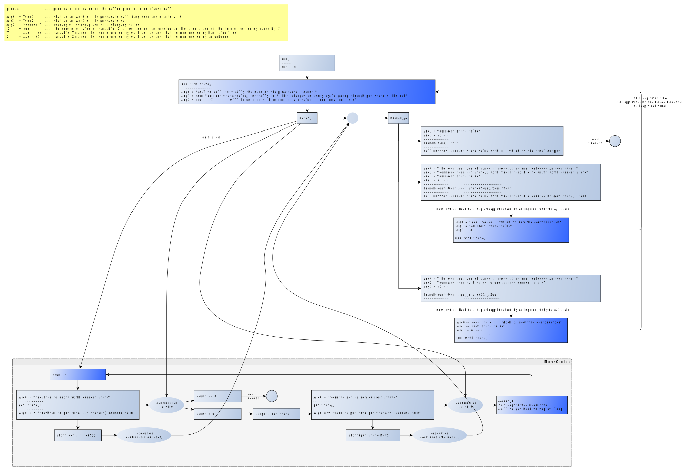

# Continuations

In the SWI-Prolog manual: [Delimited Continuations](https://eu.swi-prolog.org/pldoc/man?section=delcont)

From \[DCP13\]: 

> Delimited continuations enable the definition of new high-level language features at the program level (e.g. in libraries)
> rather than at the meta-level as program transformations. As a consequence, feature extensions based on delimited 
> continuations are more light-weight, more robust with respect to changes and do nort require pervasive changes to existing code bases.

# Reading

- \[DCP13\]: [Delimited continuations for Prolog](https://www.swi-prolog.org/download/publications/iclp2013.pdf) (Preprint PDF), 2013
   - Tom Schrijvers, Bert Demoen, Benoit Desouter, Jan Wielemaker
   - Reference [here](https://www.cambridge.org/core/journals/theory-and-practice-of-logic-programming/article/delimited-continuations-for-prolog/DD08147828169E26212DFAF743C8A9EB)
   - (The PDF wrongly indicates the year "2003")

# More Reading

- [The Essence of Functional Programming (invited talk)](https://dl.acm.org/doi/10.1145/143165.143169) (downloadble PDF)
   - Philip Wadler
   - in [POPL 92: 19th ACM Symposium on Principles of Programming Languages](https://dl.acm.org/doi/proceedings/10.1145/143165)   
- [Handlers of algebraic effects](https://link.springer.com/chapter/10.1007%2F978-3-642-00590-9_7)
   - Gordon Plotkin , Matija Pretnar 
   - in ESOP 2009: Programming Languages and Systems, Springer LNCS 5502, pp 80-94
   - downloadable [here](http://citeseerx.ist.psu.edu/viewdoc/summary?doi=10.1.1.143.9808)
- The theory and practice of first-class prompts
   - Matthias Felleisen
   - in POPL 88 pp. 180-190
- Abstracting control
   - Danvy, O. and Filinski, A.
   - in LFP 90 pp. 151-160
      
- Wikipedia: [`setjmp.h`](https://en.wikipedia.org/wiki/Setjmp.h)
- Wikipedia: [Continuation](https://en.wikipedia.org/wiki/Continuation) (as usual, Prolog is not listed as supporting this)
- Wikipedia: [`call-with-current-continuation`](https://en.wikipedia.org/wiki/Call-with-current-continuation)
- Wikipedia: [Monad](https://en.wikipedia.org/wiki/Monad_(functional_programming))

# Monads vs Continuations vs Effect Handlers

...

# Example: Effect handler for state

In \[1\]: "Effect handlers are an elegant way to add many kinds of side-effectful operations to a language and \[are\] far less instrusive than monads ... the effect handler decouples the syntax of the new operations from their semantics"

Code: [state_monad.pl](state_monad.pl)

Diagram it, more or less:

