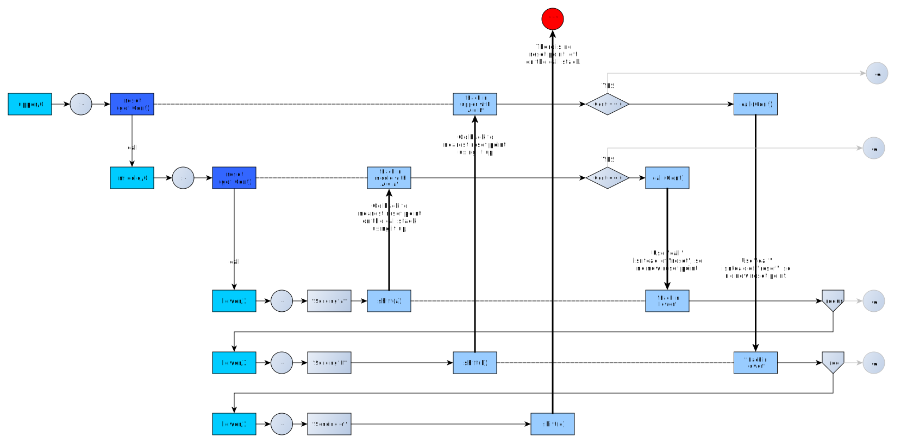
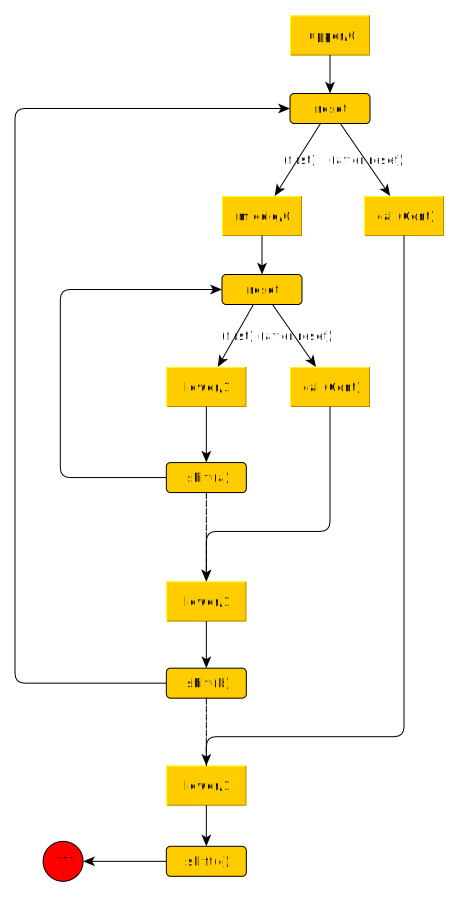
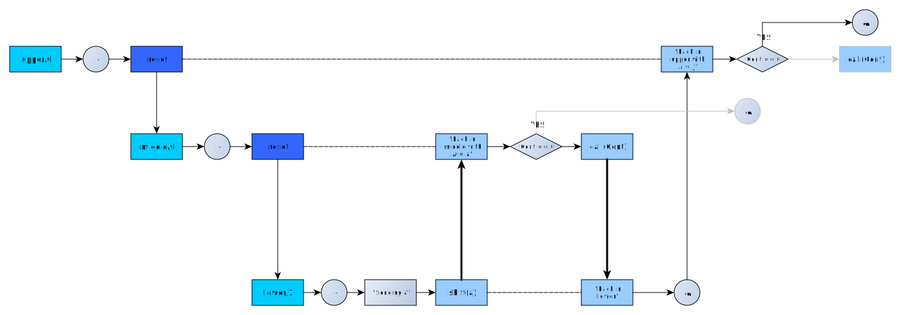
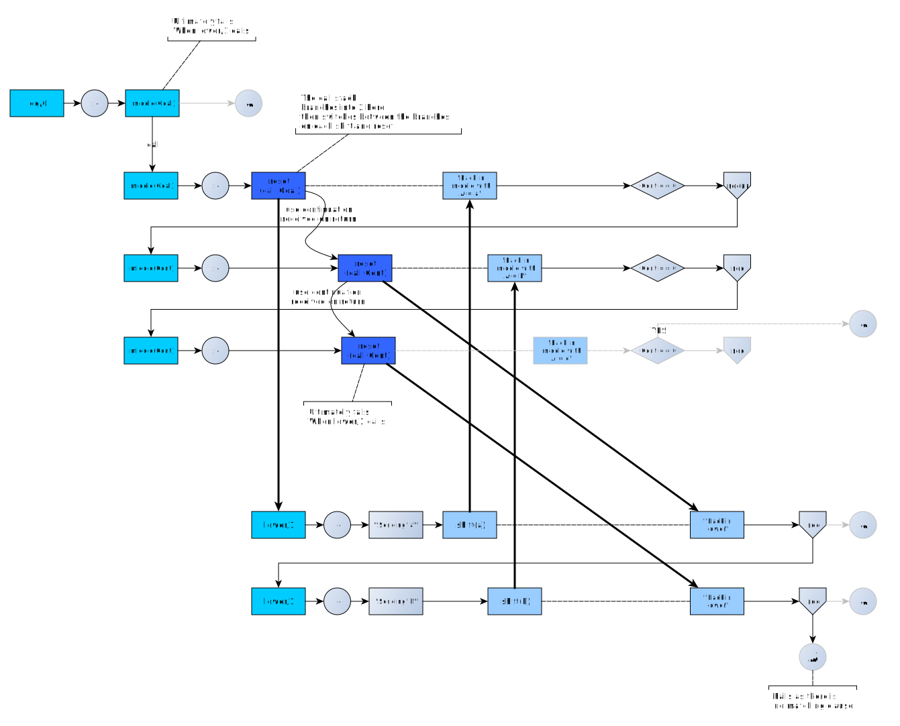

# Delimited Continuations

This is additional material for the page [Delimited Continuations](https://eu.swi-prolog.org/pldoc/man?section=delcont) of the SWI-Prolog manual.

## TOC

   - [Errata](#errata)
   - [Reading](#reading)
      - [Some Wikipedia entries](#some_wikipedia_entries)
      - ["Delimited continuations for Prolog" (2013)](#delimited_continuations_for_prolog)
      - ["Delimited continuations in Prolog: semantics, use, and implementation in the WAM" (2013)](#delimited_continuations_for_prolog_2)
      - ["Call with current continuation patterns" (2001)](#call_with_current_continuation_patterns)
      - ["Abstracting Control" (1990)](#abstractin_control)
      - ["Capturing the Future by Replaying the Past - Functional Pearl" (2018)](#capturing_the_future_by_replaying_the_past)
   - [Similar ideas](#similar ideas)
      - [Similarity of `reset`/`shift` to `catch`/`throw`](#reset_shift_vs_catch_throw)
      - [Relationship between `call/cc` and `reset/3`](#call_cc_vs_reset)
   - [Empirical research](#empirical_research)
      - [The "continuation" term is a compound term](#the_continuation_term_is_a_compound_term)
      - [Calling `shift/1` is not like backtracking](#calling_shift_is_not_like_backtracking)
      - [There is proper backtracking over the goal called by `reset/3`](#there_is_proper_backtracking_over_the_goal_called_by_reset)
      - [The `reset` point behaves as a resource on the call stack](#the_reset_point_behaves_as_a_resource_on_the_call_stack)
      - [Correct switching using (tail) recursion to generate new reset points](#correct_switching_using_recursion-to_generate_new_reset_points)
      - [Correct switching using a "failure-driven loop" in the "lower" predicate](#correct_switching_using_failure_driven_loop)
      - [Weirdness: Using a failure-driven loop in the "upper" predicate](#using_failure_driven_loop_in_the_upper_predicate)
      - [Edge cases](#edge_cases)
   - [Examples](#examples)
      - [Hands-on testing](#hands_on_testing)
      - [Simple patterns](#simple_patterns)
      - [Iterator inspired by _Schrijvers et al., 2013_](#iterator_from_schrijvers_et_al)
      - [Effect handler inspired by _Schrijvers et al., 2013_](#effect_handler_from_schrijvers_et_al)
   - [Adapting the patterns from "Call with current continuation patterns"](#adapting_the_patterns_from_call_cc_patterns)

## Errata<a name="errata" />

The manual says:

> Delimited continuation for Prolog is described in [Schrijvers et al., 2013](https://eu.swi-prolog.org/pldoc/man?section=bibliography#DBLP%3Ajournals/tplp/SchrijversDDW13) (preprint PDF).

   - The link for "Schrijvers et al., 2013" just leads to the bibliography page where one is stranded because there are no live links to continue.
   - The link for "preprint PDF" leads to a preprint of the ISO Standardization effort for the C language. Shurely some mistake?
   
The correct link to the paper is:

   - **Delimited continuations for Prolog**: https://www.swi-prolog.org/download/publications/iclp2013.pdf
   
The PDF says it has been written in 2003, but it has really been written in 2013. It's a preprint. 

It has been [published](https://www.cambridge.org/core/journals/theory-and-practice-of-logic-programming/article/delimited-continuations-for-prolog/DD08147828169E26212DFAF743C8A9EB) in _Theory and Practice of Logic Programming_ in 2013.

## Reading<a name="reading" />

### Some Wikipedia entries<a name="some_wikipedia_entries" />

   - [Call-with-current-continuation](https://en.wikipedia.org/wiki/Call-with-current-continuation)
   - [Coroutine](https://en.wikipedia.org/wiki/Coroutine)
   - [Continuation](https://en.wikipedia.org/wiki/Continuation) (as usual, Prolog is not listed as supporting this; well, it _isn't_ in the ISO Standard)
   - [setjmp.h](https://en.wikipedia.org/wiki/Setjmp.h)
   - [COMEFROM instruction](https://en.wikipedia.org/wiki/COMEFROM) ( a `reset/3` is like a special label on the call stack which captures all `shift/1`
     calls under that match the `Ball` term - it resembles a `COMEFROM`, the opposite of a `GOTO`)
   
### "Delimited continuations for Prolog" (2013)<a name="delimited_continuations_for_prolog" />

As given in the SWI-Prolog manual.

   - https://www.swi-prolog.org/download/publications/iclp2013.pdf
   - Tom Schrijvers, Bart Demoen, Benoit Desouter, Jan Wielemaker
   - 2013
   - Appears in: [Theory and Practice of Logic Programming, 13(4-5), 533-546. doi:10.1017/S1471068413000331](https://www.cambridge.org/core/journals/theory-and-practice-of-logic-programming/article/delimited-continuations-for-prolog/DD08147828169E26212DFAF743C8A9EB)

From that paper:

> Delimited continuations enable the definition of new high-level language features at the program level (e.g. in libraries)
> rather than at the meta-level as program transformations. As a consequence, feature extensions based on delimited 
> continuations are more light-weight, more robust with respect to changes and do not require pervasive changes to existing code bases.

The [publication page of that paper](https://www.cambridge.org/core/journals/theory-and-practice-of-logic-programming/article/delimited-continuations-for-prolog/DD08147828169E26212DFAF743C8A9EB) has a lot of live links to the the references.

### "Delimited continuations in Prolog: semantics, use, and implementation in the WAM" (2013)<a name="delimited_continuations_for_prolog_2" />

Technical Report. This is an excellent resource, IMHO better than the one above.

   - https://biblio.ugent.be/publication/5646080
   - Tom Schrijvers, Bart Demoen, Benoit Desouter
   - March 13, 2013

Abstract:

> An implementation of a delimited continuations, known in the functional programming world, is shown in the context of the
> WAM, and more particular in hProlog. Three new predicates become available to the user: reset/3 and shift/1 for delimiting
> and capturing the continuation, and call continuation/1 for calling it. The underlying low-level built-ins and modifications 
> to the system are described in detail. While these do not turn continuations into first-class Prolog citizens, their 
> usefulness is shown in a series of examples. The idea behind this implementation can be adapted to other Prolog
> implementations. The constructs are compared with similar ones in BinProlog and Haskell. Their interaction with other 
> parts of Prolog is discussed.

Section 7.6:

> **7.6 The Origin of Delimited Continuations**
>
> Felleisen introduced reset and shift (“prompt applications”) using the untyped lambda-calculus [The theory and practice of first-class prompts, 1988]. 
> He defined the semantics via translation to a stack-machine, but did notprovide an actual implementation. 
> One of his examples was a yield-mechanism on a tree. Felleisen already pointed out the relation of
> continuations to stream-programming, although he did not distinguish yield as a separate operator.
> Dubaet al. added first-class continuations to the statically typed ML language [Typing first-class continuations in ML, POPL '91].  
> Flattet al.implementeda production version in Scheme [Adding delimited and composable control to a production programming environment, 2007]

### "Call with current continuation patterns" (2001)<a name="call_with_current_continuation_patterns" />

   - https://www.researchgate.net/publication/228576802_Call_with_current_continuation_patterns
   - Darrell Ferguson, Dwight Deugo
   - September 2001

The paper explores patterns in Scheme that employ `call-with-current-continuation` (aka. `call/cc`), not patterns in Prolog that use `reset/shift`
but once one notices the relationship between `call/cc` and `reset` that becomes less important. Plus it provides an excellent intro.

Patterns explored:

   1. Loop
   1. Escape from recursion
   1. Loop via continuations
   1. Escape from and reentry into recursion
   1. Coroutines
   1. Non-blind backtracking
   1. Multitasking

In particular the chapter on _Non-blind Backtracking_ on pages 20 ff. seems to apply to `reset/shift` operations:

> In [FHK84: Friedman, Haynes, Kohlbecker: "Programming with Continuations" (In P. Pepper, editor,
> Program Transformation and Programming Environments), 1984.] the concept of _devils_, _angels_ 
> and _milestones_ is presented. 
>
> A devil will return us to the context in which the last milestone 
> was created. The devil will pass to the continuation the value that was passed to it. Now this
> value is used as if it were the result of the original milestone expression, possibly allowing
> us to follow a different path.

...sounds like `shift`.

> An angel will send the computation forward to the last encounter with a devil. Again, the
> value passed to the angel will be given to the devil’s continuation allowing us to return to
> the context of the devil with this value replacing the value returned by the devil. This will
> allow us to move to more advanced states. 

...sounds like calling the continuation obtained from a `reset`. Although we cannot
pass a value "forwards" to the point where the `shift` occurred via the continuation
obtained from `reset`, we _can_ bind to some value an unbound variable communicated to the
point of `reset` via the term shifted by `shift`.

> A milestone will record the current context to be used by any encountered devils.

...sounds like `reset`.

> As a metaphor, we can take the example given in the introduction of this pattern language. 
> We begin by reading the first paper and we reach a point where we realize that
> we need further knowledge. We set a milestone (remembering where we were in this first
> paper) and begin reading the references and other material. When we feel that we have
> sufficient knowledge to continue with the original paper, we return to that paper (equivalent
> to invoking a devil). Possibly, we didn’t read all the references and other related material
> before we went back to this original paper. If this is the case, after finishing the original
> paper we decide to go back to reading the remaining references and other material. This is
> equivalent to invoking an angel.

### "Abstracting Control" (1990)<a name="abstractin_control" />

   - http://citeseerx.ist.psu.edu/viewdoc/summary?doi=10.1.1.43.8753
   - Olivier Danvy, Andrzej Filinski
   - appears in _Proceedings of the 1990 ACM Conference on LISP and Functional Programming_

This one introduces `shift` and `reset` operations but it's a very technical paper (I don't get it ... yet).

We read:

> `Shift` abstracts the current context as an ordinary, composable procedure and `reset` delimits the scope of such a context.
> `Shift` also differs from `escape`  by not duplicating the current continuation. (...) While the effects of these operators are
> very similar to operators control and prompt of [Felleisen 88: The Theory and Practice of First-Class Prompts], there is a 
> significant semantical difference between `shift`/`reset` and `control`/`prompt`: the context abstracted by `shift` is determined
> statically by the program text, while `control` captures the context up to the nearest dynamically enclosing `prompt`.
> In general, this leads to different behavior.
> 
> Programming with continuations has appeared as an intriguing possibility offered by control operators such as Landin's `J`, Reynolds's `escape`,
> and `call-with-current-continuation` in Scheme. Such first-class continuations are more general than MacLisp's `catch`/`throw` mechanism
> and ML's `exceptions` since they allow a previous scope to be restored, just like applying a functional value reestablishes
> an earlier environment. First-class continuations have been investigated mainly as powerful, but unstructured devices requiring a
> deep intuition and operational skill [Friedman, Haynes, & Kohlbecker 84] [Haynes & Friedman 87]. However, some progress has
> been made towards a more declarative view of them, based on a category-theoretical duality between values and continuations [Filinski 89].

Ok, this needs more study.

### "Capturing the Future by Replaying the Past - Functional Pearl" (2018)<a name="capturing_the_future_by_replaying_the_past" />

   - https://hal.inria.fr/hal-01929178/document
   - https://arxiv.org/abs/1710.10385
   - James Koppel, Gabriel Scherer, Armando Solar-Lezama
   - Proceedings of the ACM on Programming Languages, ACM, 2018, 2 (ICFP), pp.1- 29.

> Delimited continuations are the mother of all monads! So goes the slogan inspired by Filinski’s 1994 paper,which showed that 
> delimited continuations can implement any monadic effect, letting the programmer usean effect as easily as if it was built 
> into the language. It’s a shame that not many languages have delimited continuations. Luckily, exceptions and state are also
> the mother of all monads! In this Pearl, we show how to implement delimited continuations in terms of exceptions and state,
> a construction we call _thermometer continuations_. While traditional implementations of delimited continuations require
> some way of "capturing" an intermediate state of the computation, the insight of thermometer continuations is to reach this 
> intermediate state by replaying the entire computation from the start, guiding it using a recording so that the same thing
> happens until the captured point. Along the way, we explain delimited continuations and monadic reflection, show how the
> Filinski construction lets thermometer continuations express any monadic effect, share an elegant special-case for 
> nondeterminism, and discuss why our construction is not prevented by theoretical results that exceptions and state cannot
> macro-express continuations.

## Similar ideas<a name="similar ideas" />

### Similarity of `reset`/`shift` to `catch`/`throw`<a name="reset_shift_vs_catch_throw" />

Note the similarity between exception handling and delimited continuations. This is not an accident:

   - `catch(:Goal, +Catcher, :Recover)` ([`catch/3`](https://eu.swi-prolog.org/pldoc/man?predicate=catch/3)) and
   - `throw(+Exception)` ([`throw/1`](https://eu.swi-prolog.org/pldoc/doc_for?object=throw/1))
    
vs 
    
   - `reset(:Goal, ?Ball, -Continuation)` ([`reset/3`](https://eu.swi-prolog.org/pldoc/doc_for?object=reset/3)) and
   - `shift(+Ball)` ([`shift/1`](https://eu.swi-prolog.org/pldoc/doc_for?object=shift/1))

Indeed, the exception handling operations are a specialization of the delimited continuation operations whereby the `Recover`
goal is called if `Goal` calls `shift/1` with an exception term. The `Continuation` is discarded.

Similarly, if the call stack contains several points where `reset/3` was called (i.e. there are nested `reset/3` calls)
and the currently executing procedure calls ` shift/1` with a term `T`, then execution flow goes to the nearest `reset/3`
call point that has a unifying `Ball` - in the same way as as execution flow goes to the nearest `catch/3` that 
unifies `Catcher` with `E`, where `E` is the term thrown by `throw/1`.

### Relationship between `call/cc` and `reset/3`<a name="call_cc_vs_reset" />

The Scheme function `call/cc` is called with a "receiver" function that takes one continuation argument.
`call/cc` invokes the receiver with the continuation which continues after `call/cc`. The receiver function
is meant to call that continuation to "get out" of some nested computation. 

The counterpart is `reset(Goal, Ball, Continuation)`. It actually creates a continuation "behind the scenes" which
can be retrieved and called by a `shift/1` called from `Goal` (the argument to `shift/1` just needs to match `Ball` 
to retrieve the appropriate continuation somewhere on the call stack). So unlike for `call/cc` the continuation 
at the `call/cc` point stays invisible. However, you get the continuation for the `shift/1` point for free. With
`call/cc` you have to pass through some hoops to obtain it.

## Empirical research<a name="empirical_research" />

### The "continuation" term is a compound term<a name="the_continuation_term_is_a_compound_term" />

At least in the current implementation. If you run the following on a continuation `Cont`:

```
compound_name_arity(Cont,Name,Arity),
format("The continuation has name '~q' and ~d arguments ~q\n",[Name,Arity]).
```

you get:

```
The continuation has name 'call_continuation' and 1 arguments
```

which is why a valid continuation is guaranteed distinguishable from 0.

It is actually an atomic goal: a call to `call_continuation/1` with 1 argument prefilled. That predicate is not documented but
it evidently calls the continuation.

This is also why `reset/3` can take both an atomic goal on the first round and a continuation returned by a previous `reset/3`.

### Calling `shift/1` is not like backtracking<a name="calling_shift_is_not_like_backtracking" />

It's just continuing with the "instruction stream" at another place.
Variables that have been bound during the procedure called by `reset/3` _stay_ bound after a `shift/1`:

```
:- debug(changee).

changee :-
   debug(changee,"Changee says the variable is ~q",[N]),
   reset(changer(N),changed_it,_),
   debug(changee,"Changee now says the variable is ~q",[N]).
   
changer(N) :-
   N = foo,            % bind the passed N to 'foo'
   shift(changed_it).
```

And so:

```
?- changee.
% Changee says the variable is _10566
% Changee now says the variable is foo
true.
```

### There is proper backtracking over the goal called by `reset/3`<a name="there_is_proper_backtracking_over_the_goal_called_by_reset" />

See further below for more on this.

```
:- debug(multi).
 
multi :-   
   debug(multi,"Calling 'possible' through 'reset'",[]),
   reset(possible,mine,_),
   debug(multi,"Back in 'multi'",[]).
       
possible :-
   debug(multi,"In 'possible'",[]).
   
possible :-   
   debug(multi,"In alternate 'possible'",[]).
```

And so:

```
?- multi.
% Calling 'possible' through 'reset'
% In 'possible'
% Back in 'multi'
true ;
% In alternate 'possible'
% Back in 'multi'
true.
```

### The `reset` point behaves as a resource on the call stack<a name="the_reset_point_behaves_as_a_resource_on_the_call_stack" />

The `reset` point behaves as a resource: You can only emerge from it (via `shift/1`) once.

Here is a faulty program that _calls_ the continuation instead of performing another `reset/3` with the
continuation. There are two "reset points" on the stack. The first call uses up one, the second
call uses up the other. The third call has nowhere to go:

```none
upper :-
   reset(middle,A,Cont),
   format("Back in upper with A = ~q\n",[A]),
   ((Cont == 0) -> true ; call(Cont)).

middle :-
   reset(lower([a,b,c,d]),A,Cont),
   format("Back in middle with A = ~q\n",[A]),
   ((Cont == 0) -> true ; call(Cont)).

lower([X|Xs]) :-
   format("Sending ~q\n",[X]),
   shift(X),
   format("Back in lower\n",[]),
   lower(Xs).
```

And so:

```
?- upper.
Sending a
Back in middle with A = a
Back in lower
Sending b
Back in upper with A = b
Back in lower
Sending c
ERROR: reset/3 `c' does not exist
ERROR: In:
ERROR:   [14] shift(c)
ERROR:   [13] lower([c,d]) at user://1:18
```

Illustrated, a bit informally (I have no real formal way to depict this):



Or even more informally, the call stack:



This works for limited cases of course:

```
upper :-
   reset(middle,A,Cont),
   format("Back in upper with A = ~q\n",[A]),
   ((Cont == 0) -> true ; call(Cont)).

middle :-
   reset(lower([a,b,c,d]),A,Cont),
   format("Back in middle with A = ~q\n",[A]),
   ((Cont == 0) -> true ; call(Cont)).

lower([X|_Xs]) :-
   format("Sending ~q\n",[X]),
   shift(X),
   format("Back in lower\n",[]).
```

And so:

```
?- upper.
Sending a
Back in middle with A = a
Back in lower
Back in upper with A = _6052
true.
```



### Correct switching using (tail) recursion to generate new reset points<a name="correct_switching_using_recursion-to_generate_new_reset_points" />

To switch continually between two branches of the call stack (created at the first `reset/3` call),
you need to use recursion to perform new `reset/3` calls:

```none
go :- middle(lower([a,b])).
  
middle(Goal) :-
   reset(Goal,A,Cont),
   format("Back in middle with A = ~q\n",[A]),
   ((Cont == 0) -> true ; middle(Cont)).

lower([X|Xs]) :-
   format("Sending ~q\n",[X]),
   shift(X),
   format("Back in lower\n",[]),
   lower(Xs).
```

And thus:

```none
?- go.
Sending a
Back in middle with A = a
Back in lower
Sending b
Back in middle with A = b
Back in lower
false.
```



### Correct switching using a "failure-driven loop" in the "lower" predicate<a name="correct_switching_using_failure_driven_loop" />

Alternatively, using backtracking (failure-driven loop) in `lower/1`.
Note that backtracking into `shift/1` means that we backtrack out of the 
corresponding `reset/3`!

```none
go :- middle(0,lower([a,b])).

middle(Count,Goal) :-
   (true;(format("B/T out of reset with Count = ~d\n",[Count]),fail)),
   reset(Goal,A,Cont),
   format("Back in middle with A = ~q, Count = ~d\n",[A,Count]),
   CountP is Count+1,
   ((Cont == 0) -> true ; middle(CountP,Cont)).

lower(L) :-
   member(X,L),
   format("Sending ~q\n",[X]),
   shift(X),
   format("Back in lower\n",[]),
   fail.
```

And thus:

```
?- go.
Sending a
Back in middle with A = a, Count = 0
Back in lower
B/T out of reset with Count = 1
Sending b
Back in middle with A = b, Count = 0
Back in lower
B/T out of reset with Count = 1
B/T out of reset with Count = 0
false.
```

### Weirdness: Using a failure-driven loop in the "upper" predicate<a name="using_failure_driven_loop_in_the_upper_predicate" />

This one just backtracks over the goal called by `reset/3`. Here, 
we still emerge only once from a `reset/3` - it's just that backtracking into 
`reset/3` emerges from the preceding `shift/1`. This is actually amazing. 

```none
go :- middle(lower([a,b])).

middle(Goal) :-
   reset(Goal,A,Cont),                                 % Backtracking into this, we emerge from the shift
   format("Back in middle with A = ~q\n",[A]),
   ((Cont == 0) -> true ; fail).                       % Failure-driven loop if Cont \== 0

lower(L) :-
   format("Calling member\n"),
   member(X,L),    
   format("Sending ~q\n",[X]),
   (true;(format("B/T out of shift(~q)\n",[X]),fail)),
   shift(X),                                           % Called twice; brings us back to the reset/3 point
   format("Back in lower\n"),                          % Never reached
   fail.
```

And thus:

```none
?- go.
Calling member
Sending a
Back in middle with A = a
B/T out of shift(a)
Sending b
Back in middle with A = b
B/T out of shift(b)
false.
```

### Edge cases<a name="edge_cases" />

**There is nothing to do for the continuation of `shift/1` itself:**

```
?- reset(shift(mine),mine,C).
C = call_continuation([]).

?- reset(shift(mine),mine,C), call(C).
C = call_continuation([]).
```

The above brings about the idea that in case a predicate calls `shift/1` on the last position, one 
could have `reset/3` just yield 0 on the continuation parameter place instead of `call_continuation([])`
but this brings unknown complications for little gain: [issue#788](https://github.com/SWI-Prolog/swipl-devel/issues/708).

**There is something to do if there is a `true` following the `shift/1`, namely, succeed:**

```
?- reset((shift(mine),true),mine,C).
C = call_continuation(['$cont$'(<clause>(0x23a5510), 15, '<inactive>', user, 125, '<inactive>', true)]).

?- reset((shift(mine),true),mine,C), call(C).
C = call_continuation(['$cont$'(<clause>(0x23a5510), 15, '<inactive>', user, 125, '<inactive>', true)]).
```

**There is something to do if there is a `false` following the `shift/1`, namely, fail:**

```
?- reset((shift(mine),false),mine,C).
C = call_continuation(['$cont$'(<clause>(0x23a5510), 15, '<inactive>', user, 125, '<inactive>', false)]).

?- reset((shift(mine),false),mine,C), call(C).
false.
```

## Examples<a name="examples" />

### Hands-on testing<a name="hands_on_testing" />

   - [`jumping_around.pl`](/swipl_notes/about_continuations/code/exercise/jumping_around.pl): jumping around between `reset/3` points
     on the call stack by emitting the appropriate `shift/1` calls. 
   - [`trial.pl`](/swipl_notes/about_continuations/code/exercise/trial.pl): The predicate-to-call takes a list, the elements of
     which are then "generated" (i.e. emitted) one-by-one by an "iterator" and printed to stdout by the `with_write/1` "master".
     However, certain elements make the from_list/1 goal behave in unruly ways. Basically tests what happens at the `reset/3` point.

### Simple patterns<a name="simple_patterns" />

   - [`looping.pl`](/swipl_notes/about_continuations/code/exercise/looping.pl): in an unexiting development, we can build a
     loop that calls `reset/3` to activate a 
     loop-worker-predicate on each loop passage instead of just *calling* the predicate.
     directly. To make things more interesting, we can store the continuations of 
     loop-worker-predicate obtained from `reset/3` and call them for finalization at the end.   
   - [`appender_observer.pl`](/swipl_notes/about_continuations/code/exercise/appender_observer.pl): an appender-observer pair communicating
     via an open list.
   - [`producer_consumer_master.pl`](/swipl_notes/about_continuations/code/producer_consumer/producer_consumer_master.pl): a producer-consumer
     (coroutine) example with a central "master" that dishes out the `reset/3` calls. There seems no way to make the
     producer and consumer subroutines look symmetric using `reset`/`shift` and not having a "master" makes the code
     and unholy mess, so ... we have a "master"!

### Iterator inspired by _Schrijvers et al., 2013_<a name="iterator_from_schrijvers_et_al" />

   - [iterator](/swipl_notes/about_continuations/code/iterator): An implementation of "iterators" (which are apparently
     "generators", which are "semi-coroutines") that generate output on behalf of a "master predicate".
     The "master predicate" sends the output to a user-selectable destination (in this case, stdout).
      - [`iterator.pl`](/swipl_notes/about_continuations/code/iterator/iterator.pl)
      - [Illustration](/swipl_notes/about_continuations/code/iterator/pics/iterator_and_master_coroutine.svg)
      
### Effect handler inspired by _Schrijvers et al., 2013_<a name="effect_handler_from_schrijvers_et_al" />
      
   - [effect handler](/swipl_notes/about_continuations/code/effect_handler): An implementation of an "effect handler" (state handler?)
     keeping track of state on behalf of client code. State (now behind the curtain) is accessed by get/set commands
     which are terms passed to `shift/1`. This comes with two examples: a Markov Network visitor and a counter-to-zero.
     This works only for a single "thread" of client code. Once you have producer/consumer coroutines accessing
     the same state, the "get" no longer works and you need to use [global variables](https://eu.swi-prolog.org/pldoc/man?section=gvar)
     or something similar.

## Adapting the patterns from "Call with current continuation patterns"<a name="adapting_the_patterns_from_call_cc_patterns" />

As said earlier, the paper 

   - **Call with current continuation patterns**
      - https://www.researchgate.net/publication/228576802_Call_with_current_continuation_patterns
      - Darrell Ferguson and Dwight Deugo
      - September 2001.

explores patterns in Scheme that employ `call-with-current-continuation` (aka. `call/cc`), not patterns in Prolog that use `reset/shift`.

Let's try to recode them!

   - [Loop](/swipl_notes/about_continuations/adaptations/loop.md) 
   - Escape from recursion (TBD)
   - Loop via continuations (TBD)
   - Escape from and reentry into recursion (TBD)
   - Coroutines (TBD)
   - Non-blind backtracking (TBD)
   - Multitasking (TBD)

