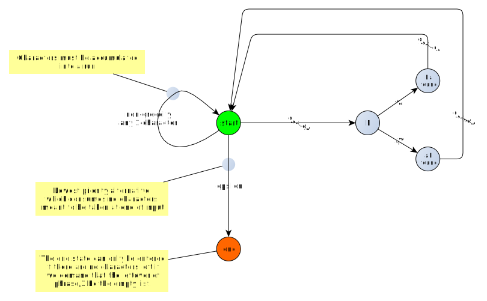
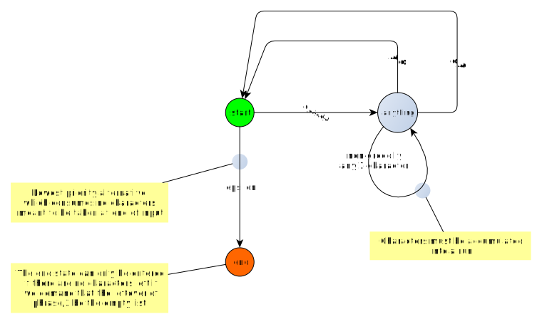

# Example: Count occurrences of 'ab' and 'ba' in a string

DCGs are actually too powerful for this example, but the string
can be recognized by a regular expression, i.e. a (nondeterministic)
finite state machine.

But this will allow us to compare it to a regex approach.

Write in in Perl first. The problem is extracting the counts of
`ab` and `ba`. It's done in a loop, with the same regular 
expression applied repeatedly to the ever-smaller tail of the
input string:

[fsm_perl.pl](fsm_perl.pl)

Run it on the command line:

```
$ perl fsm_perl.pl abbaayybbaba
'abbaayybbaba' contains 1 'ab' and 3 'ba': ab-ba-ayyb-ba-ba

$ perl fsm_perl.pl abbaabbaba
'abbaabbaba' contains 2 'ab' and 3 'ba': ab-ba-ab-ba-ba

$ perl fsm_perl.pl abbayyabbaba
'abbayyabbaba' contains 2 'ab' and 3 'ba': ab-ba-yy-ab-ba-ba
```

Playing manual regex-to-FSM compiler, we come up with this FSM:

[]

This is evidently non-deterministic FSM. "Minimally anything"
means that characters, including `a` and `b` are consumed
unless going down the path to `F` leads to `ab found` or
`ba found`. Operationally, this means the path via `F` has
to be tested first. If it fails, the FSM processor backtracks 
and takes the `minimally anything` path instead.

We can also get rid of the intermediate `F` state:

[]


