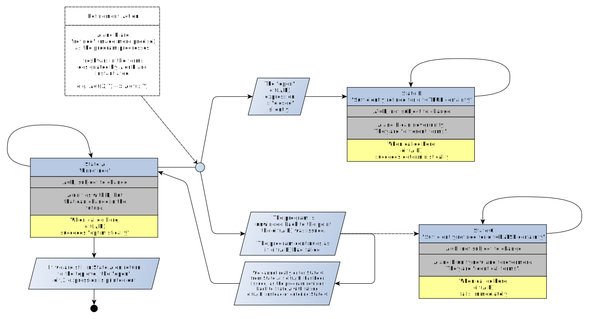
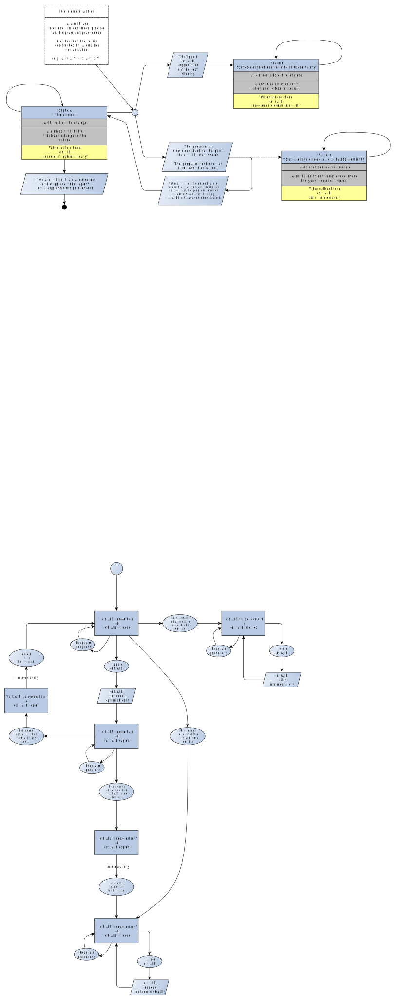

# About `dif/2`

A description of predicate `dif/2` can be found [here](https://eu.swi-prolog.org/pldoc/doc_for?object=dif/2), but it is a bit short!

Consider the call `dif(A,B)`.

A program that issues this call is in one of three states when this happens (it can start in any of the three states):

- **State A: "Unrefined"** - In this state, `A` and `B` would unify (i.e. `A=B` would succeed). But `A` and `B` are still 
  sufficiently unconstrained/unrefined that subsequent program operations can change that situation: `A=B`, if issued
  later, might succeed or fail. (The way to test `A=B` without retaining any changes to `A` nor `B` is the call `\+ \+ A=B`
  or `\+ A\=B`)
- **State B: "Sufficiently refined for dif=TRUE certainty"** - In this state, `A` and `B` won't unify, and no subsequent
  operation can change this. Once the program has switched to State B, it will stay there.
- **State C: "Sufficiently refined for dif=FALSE certainty"** - In this state, `A` and `B` will unify, and no subsequent
  operation can change this. In fact, `A` and `B` are identical. (They may be nonground, and in that case, any variables
  in the terms appears on the some positions and are shared.) Once the program has switched to State C, it will stay there.
  
The behavious of `dif/2` in all three states is:

- **State A**: `dif(A,B)` succeeds "optimistically". If we are still in State A on return to the toplevel, the "open" `dif/2` expression is printed out.
- **State B**: `dif(A,B)` succeeds deterministically.
- **State C**: `dif(A,B)` fails immediately.

The interesting case occurs if a `dif(A,B)` has been issued in State A and the program subsequently switches to State C.

In that case, an unwinding of the program progress back to the point where the `dif(A,B)` occured is performed (any side-effects stay,
of course, side-effected). The idea is to pretend nothing ever happened and to continue as if `dif(A,B)` had failed.

Here is a "naive" state diagram ("naive" in that "it's not really a state diagram"). The correct state diagram is further below.



## Let's try some examples

First a predicate `check/2` which prints out information about the situation:

```logtalk
check(X,Y) :- 
   ((\+ \+ (X=Y)) -> writeln("They unify") ; true),          % \+ \+ ensures consequence-less unification attempt ("unify in pocket universe")
   ((X\=Y)        -> writeln("They don't unify") ; true),    % X\=Y is already consequence-less
   ((X==Y)        -> writeln("They are identical") ; true),  % Term equivalence/identity (not unification, A and B are not refined by ==)
   ((X\==Y)       -> writeln("They are different") ; true).  % Term difference/non-identity
```

Issue a `dif(A,B)` in State A. Note that the Prolog Toplevel prints the open `dif/2` expression at the end (it seems to have been modified though?)

```
?- A=f(x,X),B=f(Y,y),writeln("State A: Unrefined"),check(A,B),dif(A,B),writeln("END OF GOAL").
State A: Unrefined
They unify
They are different
END OF GOAL
A = f(x, X),
B = f(Y, y),
dif(f(Y, X), f(x, y)).
```

Issue a `dif(A,B)` in State B. 

```
?- A=f(x),B=f(y),writeln("State B: Sure that 'dif'"),check(A,B),dif(A,B),writeln("END OF GOAL").
State B: Sure that 'dif'
They don't unify
They are different
END OF GOAL
A = f(x),
B = f(y).
```

Issue a `dif(A,B)` in State C. 

```
?- A=f(x),B=f(x),writeln("State C: Sure that 'nondif'"),check(A,B),dif(A,B),writeln("END OF GOAL").
State C: Sure that 'nondif'
They unify
They are identical
false.
```

Issue a `dif(A,B)` in State A, then make `A` and `B` identical, switching to State C.

```
?- A=f(x,X),B=f(Y,y),writeln("State A: Unrefined"),check(A,B),dif(A,B),X=y,Y=x,writeln("END OF GOAL").
State A: Unrefined
They unify
They are different
false.
```

The end of the goal is never reached! 

This is philosophically interesting, as the very action that made `A` and `B` identical has been rolled back.

A failing `dif/2` really means either:

- I'm in State C already and `A` and `B` are identical terms, or
- Optimistically succeeding would cause a situation where `dif(A,B)` would fail. I know this from another timeline (under assmption of a 
  deterministic program w/o access to oracles, i.e. `A` is not set from input channel or something.) So, better give up immediately.

## Corrected state diagram

The fact that "we never reach State C from State A if `dif(A,B)` is open" means that a corrected state diagram must consider
whether `dif(A,B)` is "open" or "closed" as an orthogonal state variable. We thus get a new diagram. In the diagram below,
"rollback" transitions, which can happen between any state, have been left out for clarity. Also, transition to a terminal
state is not indicated.



## An example with repeated attempts using `between/3`

```
?- between(1,5,X),dif(A,B),format("Optimistically progressing with ~q\n",[X]),format("Setting dif(A,B) to certainly false\n"),A=B.
Optimistically progressing with 1
Setting dif(A,B) to certainly false
Optimistically progressing with 2
Setting dif(A,B) to certainly false
Optimistically progressing with 3
Setting dif(A,B) to certainly false
Optimistically progressing with 4
Setting dif(A,B) to certainly false
Optimistically progressing with 5
Setting dif(A,B) to certainly false
false.

?- between(1,5,X),dif(A,B),format("Optimistically progressing with ~q\n",[X]),format("Setting dif(A,B) to certainly true\n"),A=x,B=y.
Optimistically progressing with 1
Setting dif(A,B) to certainly true
X = 1,
A = x,
B = y ;
Optimistically progressing with 2
Setting dif(A,B) to certainly true
X = 2,
A = x,
B = y ;
Optimistically progressing with 3
Setting dif(A,B) to certainly true
X = 3,
A = x,
B = y ;
Optimistically progressing with 4
Setting dif(A,B) to certainly true
X = 4,
A = x,
B = y ;
Optimistically progressing with 5
Setting dif(A,B) to certainly true
X = 5,
A = x,
B = y.
```
  
## Example, with implication

This is unexpected:

```logtalk
magic_of_dif_above(A,B,W) :- 
   magic_of_dif(A,B,W) -> format("Yes\n",[]) ; format("No\n",[]).

magic_of_dif(A,B,W) :-
   A=f(_),
   B=f(y),
   % At this point, we cannot say for sure whether it will
   % turn out that A==B or not. It could go either way.
   (dif(A,B)
    -> 
    proceed_hoping_that_dif_will_turn_true(A,B,W)
    ;
    try_again(A,B)).
      
try_again(A,B) :-    
   format("Trying again after dif(A,B) collapsed to 'false'\n",[]);
   format("Post optimistic valus: A=~q, B=~q\n",[A,B]).
   
proceed_hoping_that_dif_will_turn_true(A,B,W) :- 
   format("Proceeding, hoping that dif/2 will turn true\n"), 
   format("Optimistic valus: A=~q, B=~q\n",[A,B]),
   ((W==make_equal) 
    -> 
    (A=f(y),format("Never get here\n",[]))           % dif(A,B) collapses to false
    ;
    (A=f(x),format("inequality confirmed\n",[]))).   % dif(A,B) confirmed to be true   
```

Calling `magic_of_dif/3` with the instruction to make `A` and `B`  equal reveals that the else branch of `->/2` is not taken:

```
?- magic_of_dif(A,B,make_equal).
Proceeding, hoping that dif/2 will turn true
Optimistic valus: A=f(_12650), B=f(y)
false.
```

Alternatively, called from another predicate:

```
?- magic_of_dif_above(A,B,make_equal).
Proceeding, hoping that dif/2 will turn true
Optimistic valus: A=f(_15702), B=f(y)
No
true.
```

The "happy path" would be to confirm `dif(A,B)`, its optimism rewarded:

```
?- magic_of_dif(A,B,_).
Proceeding, hoping that dif/2 will turn true
Optimistic valus: A=f(_13388), B=f(y)
inequality confirmed
A = f(x),
B = f(y).
```

Alternatively, called from another predicate:

```
?- magic_of_dif_above(A,B,_).
Proceeding, hoping that dif/2 will turn true
Optimistic valus: A=f(_14542), B=f(y)
inequality confirmed
Yes
A = f(x),
B = f(y).
```
