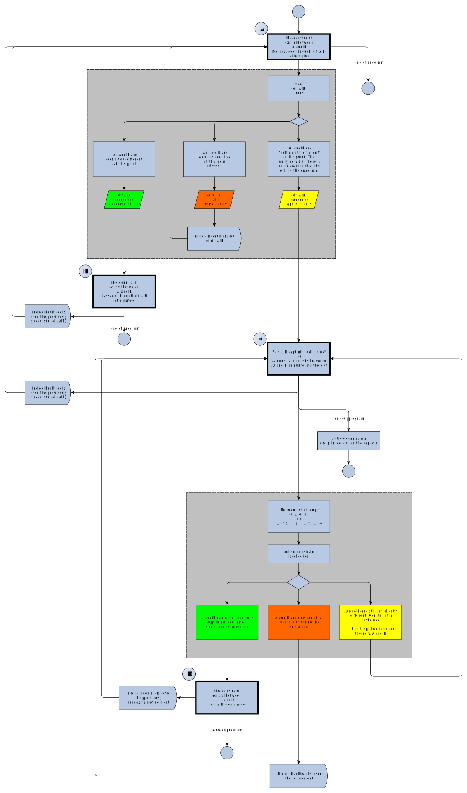

# About `dif/2`

A description of predicate `dif/2` can be found [here](https://eu.swi-prolog.org/pldoc/doc_for?object=dif/2), but it is a bit short!

Let's try add some explanations.


**TL;DR** After a `dif(A,B)` (i.e. downstack from `dif(A,B)`), any unification involving `A` or `B` or subterms thereof that would make `A` and `B` identical (`A == B`) will FAIL (and this applies to clause heads, too). If `A` and `B` are already identical at call time, `dif(A,B)` fails at once.


First, some history.

From: [Indexing `dif/2`](https://arxiv.org/abs/1607.01590), Ulrich Neumerkel and Stefan Kral, 2016-06-06:

> The very first Prolog, sometimes called _Prolog 0_ (Colmeraueret al. 1973) already supported `dif/2`.
> Unfortunately, the popular reimplementation _Prolog I_ (Battani and Meloni 1973) omitted `dif/2`and
> other  coroutining  features.  This  system  was  the  basis  for  Edinburgh  Prolog (Pereira et al. 1978)
> which led to ISO-Prolog (ISO/IEC 13211-1 1995). After _Prolog I_, `dif/2` was reintroduced in 
> _Prolog II_, independently reinvented in _MU-Prolog_ (Naish 1986). and soon implementation schemes to
> integrate `dif/2` and coroutining into efficient systems appeared (Carlsson 1987; Neumerkel 1990).
> The  major  achievement was that the  efficiency of general Prolog programs not using `dif/2`
> remained unaffected within a system supporting `dif/2`. In this manner `dif/2` survived in major
> high-performance implementations like _SICStus_. However, it still has not gained general acceptance
> among programmers. We believe that the main reason for this lack of acceptance is that `dif/2` does
> not directly deliver the abstraction that is actually needed. Its direct use leads to clumsy and
> unnecessarily inefficient code. Its combination with established control constructs often leads to
> unsound results. New, pure constructs are badly needed

Consider the call `dif(A,B)`.

A program that issues this call is in one of three states when it does so:

- **Possibly different** - In this state, `A` and `B` would unify, i.e. `A=B` would succeed. 
  However, `A` and `B` are still sufficiently "unrefined" (or "unconstrained" to use another adjective), that subsequent program
  operations may change that situation. `A=B`, if issued later, might fail. Example: `A=f(X),B=f(Y)`. Note that `\+ A==B`.
- **Different** - In this state, `A` and `B` won't unify and no subsequent operation will change this.
  When or once the program is in state "different", it will stay there (unless it sufficiently backtracks). 
  Example: `A=f(x),B=f(y)`. Note that `\+ A==B`.
- **Identical** - In this state, `A` and `B` will unify and term identity `A==B` will actually succeed: the `A` and `B` are identical.
  No subsequent operation can change this. `A` and `B` may be nonground, and in that case, any variables in the terms appear in
  the same position and are shared. When or once the program is in state "identical", it will stay there (again,
  unless it sufficiently backtracks). Example: `A=f(x),B=f(x)` or `A=f(C),B=f(C)`. Note that `A==B`. 
  
The behavious of `dif/2` in all three states is the following:

- **Possibly different**: `dif(A,B)` succeeds "optimistically" and a `dif/2` constraint is activated, to watch for changes to `A` or `B`. If
  we are still in **possibly different** on return to the Prolog Toplevel (i.e. when the program terminates), the still-active constraints 
  (which do not necessarily resemble what was stated in the `dif/2` call but are equivalent) are printed out. We will never know whether
  `A` and `B` were _actually_ different.  
- **Different**: `dif(A,B)` succeeds deterministically.
- **Identical**: `dif(A,B)` fails immediately.

The interesting case occurs if a `dif(A,B)` has been issued in state **possibly different** and a refinement of `A` or `B` (through unification, 
either in a goal or a head) occurs during processing. The refinement may also involve just a subterm of `A` or `B`.

When `A` or `B` are involved in unification, the active `dif/2` constraint is checked. It may be that the constraint is violated:
The unifcation made `A` and `B` identicial, `dif(A,B)` cannot be sustained, and we guessed guess wrong by optimistically 
continuing at `dif(A,B)`. This is resolved by **failing the unification which violated the constraint**. A way to think about this is that,
past a successful `dif(A,B)`, Prolog makes sure that `A` stays different from `B` and fails every attempt that tries to make them
identical: `dif(A,B)` should be read _"fail any attempts to make A and B identical past this point"_: `fail_making_identical(A,B)`

One could also consider `dif(A.B)` as injecting code directly after any unification that happens "downstack" (i.e. in the "future") and involves the nonground terms denoted by `A` and `B` (or even one of their nonground subterms). That code makes a test for disequality right after unification.



- [PNG](about_dif_states.png)
- [graphml](about_dif_states.graphml)

The above is still too complex and can be whittled down. To be corrected.

## Let's try some examples

First a predicate `check/2` which prints out information about the current situation. Note that the way to test `A=B` without retaining any
changes to either `A` or `B` is the call `\+ \+ A=B` or equivalently `\+ A\=B`.

```logtalk
check(X,Y) :- 
   ((\+ \+ (X=Y)) -> writeln("> They unify") ; true),          % \+ \+ ensures consequence-less unification ("unify in pocket universe")
   ((X\=Y)        -> writeln("> They don't unify") ; true),    % X\=Y is already consequence-less
   ((X==Y)        -> writeln("> They are identical") ; true),  % Term equivalence/identity (not unification, A and B are not refined by ==)
   ((X\==Y)       -> writeln("> They are different") ; true).  % Term difference/non-identity
```

Issue a `dif(A,B)` in state _possibly different_. Note that the Prolog toplevel prints the active constraintat the end (suitable rearranged;
the `f` function symbol is used in `dif/2` constraint expressions throughout):

```text
?- A=g(x,X),B=g(Y,y),writeln("possibly different"),check(A,B),dif(A,B),writeln("END OF GOAL").
possibly different
> They unify
> They are different
END OF GOAL
A = g(x, X),
B = g(Y, y),
dif(f(Y, X), f(x, y)).
```

Issue a `dif(A,B)` in state _different_:

```text
?- A=g(x),B=g(y),writeln("different"),check(A,B),dif(A,B),writeln("END OF GOAL").
different
> They don't unify
> They are different
END OF GOAL
A = g(x),
B = g(y).
```

Issue a `dif(A,B)` in state _identical_:

```text
?- A=f(x),B=f(x),writeln("identical"),check(A,B),dif(A,B),writeln("END OF GOAL").
identical
> They unify
> They are identical
false.
```

Issue a `dif(A,B)` in state _possibly different_, then make `A` and `B` identical, attempting to switch to state _identical_, which causes an backtrack:

```text
?- A=g(x,X),B=g(Y,y),writeln("possibly different"),check(A,B),dif(A,B),X=y,Y=x,writeln("END OF GOAL").
possibly different
> They unify
> They are different
false.
```

The end of the goal is never reached.

## The dif/2 is constrained even if the variables go out of scope

```prolog
% Set up a constraint on "superterms" involving X and Y

q  :- p( X, Y), X=x, writeln("X is now x"), Y=y, writeln("Y is now y, which should have failed").
r  :- p( X,_Y), X=y, writeln("X is now y, so the constraint is resolved affirmatively").
s  :- p(_X,_Y), writeln("the constraint remains unresolved"). % actually not printed...

% Construct superterms A and B of which X and Y are subterms, and set up a dif/2 constraint betwen A and B

p(X,Y) :- A = f(X,y), B = f(x,Y), dif(A,B), writeln("dif/2 passed").
```
Then

```text
?- q.
dif/2 passed
X is now x
false.

?- r.
dif/2 passed
X is now y, so the constraint is resolved affirmatively
true.

?- s.
dif/2 passed
the constraint remains unresolved
true. % I expected SWI Prolog to print the still-open constraint here
```

## More examples

### Trying with if-then-else

 See [`->/2`](https://www.swi-prolog.org/pldoc/doc_for?object=(-%3E)/2) 
 
```text
?- (writeln("It begins"); (writeln("Backtracked to before ->"),fail)), % print when forwarding and backtracking
   (dif(X,Y) -> writeln("YES") ; writeln("NO")),
   X=1,
   (writeln("Past X=1"); (writeln("Backtracked to before Y=1"),fail)),  % print when forwarding and backtracking
   (Y=1 ; (writeln("Y=1 failed"),fail)),                                % Y=1 fails, so print on second attempt
   writeln("END").
It begins
YES
Past X=1
Y=1 failed
Backtracked to before Y=1
Backtracked to before ->
```

### `dif/2` constraint working on head unification

```prolog
find_a_way :- dif(X,Y), findo(X,Y).

findo(x,_) :- writeln("find(x,_)").
findo(a,a) :- writeln("find(a,a)"). 
findo(_,y) :- writeln("find(_,y)"). 
```

Then:

```text
?- find_a_way.
find(x,_)
true ;
find(_,y)
true.
```

### Trying with if-then-else, again

```logtalk
doimply(WhatDo) :-
   X=k(_),
   Y=k(m),
   (dif(X,Y) 
    -> 
    optimistically_proceed(X,WhatDo)
    ;
    dif_has_failed(X)),
   format("END OF CLAUSE (X=~q, Y=~q)\n",[X,Y]). 

doimply(_) :-
   writeln("doimply/1 alternative").

optimistically_proceed(X,WhatDo) :- 
   writeln("Optimistic branch"),   
   ((WhatDo==eq) 
    -> 
    (X=k(m),writeln("dif(X,Y) constraint violation: never get here"))
    ;
    (X=k(u),writeln("dif(X,Y) late confirmation"))). 

    
dif_has_failed(X,Y) :-    
   format("We must be in state 'different': X=~q, Y=~q\n",[X,Y]).
```

The "happy path" would be to confirm `dif(A,B)`, its optimistic attitude rewarded:

```text
?- doimply(_).
Optimistic branch
dif(X,Y) late confirmation
END OF CLAUSE (X=k(u), Y=k(m))
true ;
doimply/1 alternative
true.
```

Calling `doimply/1` with the instruction to make `X` and `Y`  equal to elicit "late failure":

```text
?- doimply(eq).
Optimistic branch
doimply/1 alternative
true.
```

### An example with repeated attempts using `between/3`

```text
?- between(1,6,B),dif(3,B).
B = 1 ;
B = 2 ; 
B = 4 ;
B = 5 ;
B = 6.
```

### Constructing a more deterministic `member/2`

This approach appears in [Indexing `dif/2`](https://arxiv.org/abs/1607.01590):

```logtalk
% A normal member/2 which may generate more solutions than needed

membern(X, [E|Es]) :-
   ( X = E
   ; membern(X, Es)
   ).

% A more deterministic member/2 (practically a memberchk/2) which tries to 
% not generate redundant solutions

memberd(X, [E|Es]) :-
   ( X = E
   ; dif(X, E),
     memberd(X, Es)
   ).  
```

And so:

```text
?- membern(1, [1,2,3]).
true ;
false.

?- memberd(1, [1,2,3]).
true ;
false.   % leftover choicepoint
```

Is `1` in `[1,X]`? 

```text
?- membern(1, [1,X]).
true ;   % yes it's a member
X = 1 ;  % redundant answer
false.
   
?- memberd(1, [1,X]).
true ;   % choicepoint is unnecessarily left open
false.
```

Is `1` in `[X,1]`? 

```text
?- membern(1, [X,1]).
X = 1 ;
true ;
false.   % redundant

?- memberd(1, [X,1]).
X = 1 ;
dif(X, 1) ; % dif(1,X) still open (and printed) and there is success for second element of list
false.      % no more solutions

?- bagof(X,memberd(1, [X,1]),Bag).
Bag = [1, _19152],    % solutions
dif(_19152, 1).       % dif(_,1) still open
```
  
## Beware of mixing `dif/2` and cuts.

Jan Wielemaker writes:

> The general rule of thumb is that constraints and cuts (and thus if-then-else and negation) do 
> not play together. It only works if all relevant constraints are resolved before committing.
> That is in general hard to predict. Constraint solvers have in general incomplete propagation 
> and thus may have pending constraints even in cases where all constraints can be resolved. At
> debug time, [call_residue_vars/2](https://eu.swi-prolog.org/pldoc/doc_for?object=call_residue_vars/2)
> can be used to verify there are no pending constraints. The
> implementation is fairly costly in terms of additional bookkeeping that, for example, protects
> constraints against garbage collection. This may prohibit usage at runtime.

## Addendum

According to [this discussion](https://swi-prolog.discourse.group/t/surprising-dif-2-behaviour/2317), anonymous variables
in the term passed to `dif/2` will lead to non-printing at the toplevel:

```text
% Unsure whether dif: succeeds

?- dif((p(1) :- q),(_B:-_C)),format("Hey\n").
Hey
dif(f(_B, _C), f(p(1), q)).

% Still unsure whether dif: succeeds. But doesn't print the dif/2 expression

?- dif((p(1) :- q),(_:-_)),format("Hey\n").
Hey
true.

% Sure that dif/2 won't succeed

?- dif((p(1) :- q),(p(1):-q)),format("Hey\n").
false.
```
## Further explorations

### The paper "Indexing `dif/2`

**[Indexing `dif/2`](https://arxiv.org/abs/1607.01590): Ulrich Neumerkel, Stefan Kral, 2016-06-06**

> Many Prolog programs are unnecessarily impure because of inadequate means to express syntactic inequality.
> While the frequently provided built-in `dif/2` is able to correctly describe expected answers, its direct
> use in programs often leads to overly complex and inefficient definitions --- mainly due to the lack of
> adequate indexing mechanisms. We propose to overcome these problems by using a new predicate that subsumes
> both equality _and inequality via reification. Code complexity is reduced with a monotonic, higher-order 
> if-then-else construct based on `call/N`. For comparable correct uses of impure definitions, our approach 
> is as determinate and similarly efficient as its impure counterparts.

### `library(reif)`

[Reification with `library(reif)`](https://www.metalevel.at/prolog/metapredicates) and the [YouTube video](https://youtu.be/-nlI33r-P70?t=675)

Code for `library(reif)`: http://www.complang.tuwien.ac.at/ulrich/Prolog-inedit/swi/reif.pl 

### Discourse thread 

This discussion: https://swi-prolog.discourse.group/t/dif-2-call-as-implication-premiss-is-the-implications-else-part-run-should-it-be/2486/26

### Reification

The idea is that the predicate always succeeds but the result of the `dif/2` is obtained as an atom (e.g. `dif`/`equal`)
unified with a third parameter.

Peter Ludemann writes in [this discussion](https://swi-prolog.discourse.group/t/dif-2-call-as-implication-premiss-is-the-implications-else-part-run-should-it-be/2486)

> Here’s a simple “reified” version of `dif/2` (it requires its arguments to be fully ground rather than sufficiently ground):

```logtalk
%! test(X, Y, Result) is det.
% Result is 'dif'   when X and Y become ground and are not unifiable
% Result is 'equal' when X and Y become ground and are unifiable

test(X, Y, dif) :-
    when((ground(X),ground(Y)), X\=Y).
test(X, Y, equal) :-
    when((ground(X),ground(Y)), X==Y).

my_dif(X, Y) :- test(X, Y, dif).
```

> And running it gets:

```text
?- test(X, Y, Result), X=1, Y=1.
X = Y, Y = 1,
Result = equal.

?- test(X, Y, Result), X=1, Y=2.
X = 1,
Y = 2,
Result = dif ;
false.
```

> You could then rewrite your `if-then-else` to not have a cut but instead have both the condition and 
> its inverse – that is: `if cond then A else B becomes (cond & A) | (~cond & B)`.

```text
?- ( test(X, Y, dif), writeln(different) ; test(X, Y, equal), writeln(equal) ), X=1, Y=1.
different
equal
X = Y, Y = 1.

?- ( test(X, Y, dif), writeln(different) ; test(X, Y, equal), writeln(equal) ), X=1, Y=2.
different
X = 1,
Y = 2 
```
