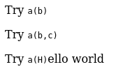
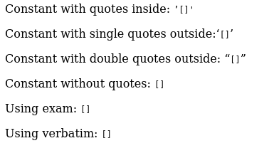

# SWI-Prolog Latex-based documentation

There are two documentation systems:

- `pldoc` to document code directly in the source, similar to Doxygen, Javadoc etc. This is the same system used for the SWI-Prolog manual website
   - [pldoc](https://eu.swi-prolog.org/pldoc/doc_for?object=section(%27packages/pldoc.html%27))
- The manual documentation itself is based on LaTeX. The .doc files in the distribution are LaTeX.   

There needs to be an example page in the manual.

## Random LaTeX links

- http://applied-r.com/latex-line-and-page-breaks/
- https://tex.stackexchange.com/questions/7453/what-is-the-use-of-percent-signs-at-the-end-of-lines-why-is-my-macro-creat
- https://en.wikibooks.org/wiki/LaTeX/Special_Characters
- https://tex.stackexchange.com/questions/83930/what-are-the-different-kinds-of-boxes-in-latex

## Problems

- The quotes are crazy double backticks as intro generally works but double single quotes as outro behaves differently depending on
  context (within parentheses etc.)
- The processor doesn't understand dashes like `\textemdash.`: https://tex.stackexchange.com/questions/53413/what-is-the-latex-command-for-em-dash  

## How to modify the doc.

- Fork SWI-Prolog repository to your github account (Fork A)
- Clone that fork to your machine. Documentation is _edited_ there. (Clone A)
- Files of interest are:   
   - `$CLONE_A_DIR/man/builtin.doc` - LaTeX for builtin predicates
   - `$CLONE_A_DIR/man/extensions.doc` - LaTeX for SWI-Prolog extensions  
- Clone the SWI-Prolog repository to your machine, including git modules. Documentation is _built_ here. (Clone B)
- When done editing, copy the relevant files from Clone A to Clone B.
- Build Clone B, including PDF documentation.
- Check the results: HTML documentation and PDF
   - `$CLONE_B_DIR/build/man/SWI-Prolog-8.3.14.pdf`   
   - `$CLONE_B_DIR/build/man/Manual/extensions.html`
   - `$CLONE_B_DIR/build/man/Manual/builtin.html`
- Commit and push your well-manicured changes to Fork A.
- Create a pull request for Fork A.

The `swiprologpull.sh` installation script in [compiling](/compiling) helps doing the above.

Changing the bibliography, however, is hairy. Some [notes on this](bibliography)   

## LaTeX style elements

### Labeling

```
\chapter{Built-in Predicates}
\label{sec:builtin}
```

gives: "4 Built-in Predicates"

```
\section{Exception handling}
\label{sec:exception}
```

gives: "4.10 Exception handling"

```
\subsection{The exception term}
\label{sec:exceptterm}
```

gives: "4.10.3 The exception term"

These are not in the TOC, they seem to be too deep:

```
\subsubsection{Throwing exceptions from applications and libraries}
\label{sec:throwsfromuserpreds}
```

Note that referencing drops the "sec":
 
``` 
\label{sec:argmode}
```

but to reference you need to use:
 
``` 
\secref{argmode}
```

### Referencing other sections by name

These are replaced by a link and a text like "section 8.1".

```
\chapref{modules}
\secref{attvar}
```

For example, `\secref{attvar}` generates a live link to `https://eu.swi-prolog.org/pldoc/man?section=attvar`
 
### Bibliography entries

Take bibliography entry `Demoen:CW350`

It is found in:

- The master "BIB" file, which contains BIB entries (and is input to the BBL file). This is what is being maintained first!
   - `man/pl.bib`
- The documentation (.doc) files proper. They contain references. For example:
   - `man/intro.doc`  `\cite{Demoen:CW350}`
   - `man/attvar.doc`  `\cite{Demoen:CW350}`   
- The BBL file, which is the result of piping the BIB file and TEX file through one round of pdflatex and bibtex. It contain bibitem entries
  (For some reason, much too few; and if that is the case, the PDF won't be generated)
   - `man/gen/swipl.bbl` --- actually a copy of man/SWI-Prolog-<version>.bbl
- The bibliography file (.doc) which contains TeX `\bibitem` entries:
   - `man/biblio.doc`  `\bibitem[Demoen, 2002]{Demoen:CW350}`

Here is a filter to count entries in the BIB file:

```
#!/usr/bin/perl

my $counters = {};

while ($line = <>) {
   if ($line =~ '^@(\w+)\{') {
      my $code = $1;
      if (exists $$counters{$code}) {
         $$counters{$code}++;
      }
      else {
         $$counters{$code}=1;
      }
   }
}

for $key (sort keys %$counters) {
   print "$key : $$counters{$key}\n";
}
```

### Text style

Boldface:

```
\textbf{no}
```

Emphasis. Looks better than boldface and expresses what one wants to do:

```
\emph{no} 
```

### Quoting / Quotation marks / Guillements

Use _backtick_ twice at the start and _quote_ twice at the end.

```none
``test''

``test``

(``test'')

`test'

`test`

(`test')
```

This results in:

`
 
```
\term{x}{y}
```

Note that `\term{x}` will not work. A character is forcefully grabbed from the subsequent text and put into parentheses.

A little test:

```
Try \term{a}{b}

Try \term{a}{b,c}

Try \term{a}

Hello world
```

yields:




Note that the typesetting is a bit surprising:

```
\term{dotlists}{true}
```


### Line break or line fuse

- `%`   to break at the end of the line
- `\\`  to fuse two lines

### Align a list with a terminating line break

```
++& Argument must be ... \\ 
```

### Constants

```
\const{type_error}
\const{'[]'}
```

It is not 100% clear what to label as constant. For example, are these constants?

```
\const{'[]'}   - the atom '[]'
\const{[]}     - the empty list
```

Especially for the empty list, there should be a special construct like `\emptylist`

Use `\exam` for example code. Currently renders the same, but is semantically different.

A little test

```
Constant with quotes inside: \const{'[]'}

Constant with single quotes outside: `\const{[]}'

Constant with double quotes outside: ``\const{[]}''

Constant without quotes: \const{[]}

Using exam: \exam{[]}

Using verbatim: \verb$[]$
```

yields:



### Character

```
\chr{+}
```

Different semantics than `\const{}` I would say.

### Verbatim quote 

For code etc. The documentation uses the `$` marker:

```
\verb$:=$
```

Stack Overflow says:

https://tex.stackexchange.com/questions/2790/when-should-one-use-verb-and-when-texttt

> ... you use \verb where you need to write a small piece of inline verbatim material that contains characters
> TeX treats (or rather, is currently treating) as special. `\texttt` is for when you just want typewriter font.

### Example code

```
\exam{findall(X, Goal, 1)}
```

### Footnote

```
\footnote{The ISO standard dictates that}
```

Stylistically, I feel the manual overdoes footnotes. A lot of footnotes belong right into the text.

### Predicate indicator, functor

```
\functor{.}{2}
```

### Predicate indicator with or without link

With link:

```
\predref{=..}{2}
\predref{.}{3}
\predref{=}{2}
```

The following suppresses predicate reference generation:

```
\nopredref{find_postal_code}{4}
```

However, just writing the predicate indicator directly, as in `member/2`, will create a link to the page of the predicate (if that page exists).

If you use

```
\functor{x}{2}
```

no links are created.

There is no notation for "dict functions". Should be fixed.

### Special prolog flag link

```
\prologflag{occurs_check}
```

### Predicate argument

Italicized in the text

```
\arg{x}
```

### Predicate declarations at the top of pages

(does it work with arity 0?)

```
\predicate[ISO]{write_canonical}{1}{+Term}
\predicate[semidet]{write_length}{3}{+Term, -Length, +Options}
\predicate[ISO]{write_term}{3}{+Stream, +Term, +Options}
\predicate{setarg}{3}{+Arg, +Term, +Value}
\predicate[deprecated]{current_stream}{3}{?Object, ?Mode, ?Stream}
\infixop[ISO]{=}{?Term1}{?Term2}
```

These are linkified and a reference is inserted into the TOC.


### Jargon

```
\jargon{ground}
```

The text is italicized. No references to a glossary are inserted (that's ok, it would overload the text, 
but there should be a construct for that: `\glossaryjargon{}`)

### A not very beautiful list of "term items"

```
\begin{description} 
\termitem{x}{y} 
\end{description}
```

### Itemoization

```
    \begin{itemize}

    \item source_file/2 describes the owner relation.
    \item predicate_property/2 describes the source location (of the
          first clause).
    \item clause_property/2 provides access to both source and ownership.
    \item source_file_property/2 can be used to query include relationships
          between files.
    \end{itemize}
```

### A file

```
\file{SWI-Prolog.h}.
```

### Special symbols

```
\Scons{}   ---> rendered as [|]
\Snil{}    ---> rendered as []
```

### Tables

An example

```
\begin{table}
\begin{center}
\begin{tabular}{lcc}
\hline
\bf Mode & \prologflag{double_quotes} & \prologflag{back_quotes} \\
\hline
Version~7 default & string & codes \\
\cmdlineoption{--traditional} & codes & symbol_char \\
\hline
\end{tabular}
\end{center}
    \caption{Mapping of double and back quoted text in the two
             modes.}
    \label{tab:quote-mapping}
\end{table}
```

## A list of descriptions

The descriptions are written in bold

```
begin{description}
    \item [ A DCG literal ]  Although represented as ...
\end{description}
```

## Style notes

Jan says:

> Please do not build a story in code blocks using comments. Instead, use should code blocks and normal running text in 
> between. That looks a lot better, notably in the PDF version where long code blocks causes poor page layout.

## ASCII graphics

Yes, these are still a thing. At least they are stylistically uniform:

A `[fontsize=\small]` suffix after `\begin{code}` is not recognized and written verbatim. There is some package missing for that.

Also, you can only use ASCII, not Unicode. That's a catastrophe, because it also means code with unicode cannot be processed.

```none
\begin{code}
   Traditional list               SWI-Prolog 7 list

       '.'                              '[|]'
      /   \                             /   \
     1    '.'                          1   '[|]'
         /   \                             /   \
        2    '.'                          2   '[|]'
            /   \                             /   \
           3   '[]'                          3     []

           terminated with                   terminated with
           the atom '[]',                    a special constant
           indistinguishable from text       which is printed as []
\end{code}
```

But better:

https://stackoverflow.com/questions/3175105/inserting-code-in-this-latex-document-with-indentation

https://ctan.org/texarchive/macros/latex/contrib/listings

https://tex.stackexchange.com/questions/29816/algorithm-over-2-pages

https://en.wikibooks.org/wiki/LaTeX/Source_Code_Listings

## Figures

```
\begin{figure}
\begin{code}
...
\end{code}
    \caption{Reusing top-level bindings}
    \label{fig:topevelvars}
\end{figure}
```

## Problem with stuff floating around on pages

It happens in the PDF that a figure floats on top of a multi-page code listing. BAD!


