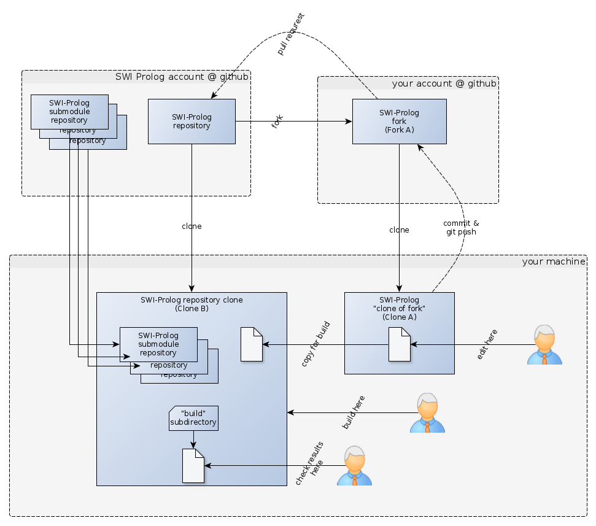
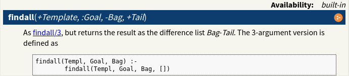
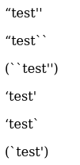
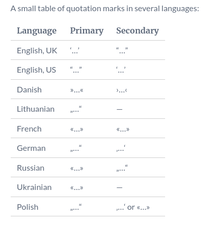

# SWI-Prolog Latex-based documentation

## About 

There are two documentation systems:

- `pldoc` to document code directly in the source, similar to [Doxygen](https://en.wikipedia.org/wiki/Doxygen),
   [Javadoc](https://en.wikipedia.org/wiki/Javadoc) etc. This is the same system used for the SWI-Prolog manual website
   See the manual page on [pldoc](https://eu.swi-prolog.org/pldoc/doc_for?object=section(%27packages/pldoc.html%27)).
- The manual documentation itself is based on LaTeX. The .doc files in the distribution are LaTeX.   
- HTML is generated by a Prolog script: `build/home/library/latex2html/latex2html.pl`

## Random LaTeX links

- [What is the use of percent signs (%) at the end of lines? (Why is my macro creating extra space?)](https://tex.stackexchange.com/questions/7453/what-is-the-use-of-percent-signs-at-the-end-of-lines-why-is-my-macro-creat)
- [What are the different kinds of boxes in (La)TeX?](https://tex.stackexchange.com/questions/83930/what-are-the-different-kinds-of-boxes-in-latex)
- [Wikibooks: LaTeX/Special Characters](https://en.wikibooks.org/wiki/LaTeX/Special_Characters)
- [Applied R: Latex Line and Page Breaks](http://applied-r.com/latex-line-and-page-breaks/)

## Problems encountered

- The quotes are crazy. "double backticks" as intro generally works but "double single quotes" as outro behaves differently depending on
  context (whether the quoted expression appears within within parentheses etc.)
- The processor doesn't understand dashes like `\textemdash.`: [What is the LaTeX command for “em dash” (—)?](https://tex.stackexchange.com/questions/53413/what-is-the-latex-command-for-em-dash)  
- Page layout in the PDF is a problem. Someone knowledgeable with TeX needs to check that. It happens in the PDF that a figure floats right on top of (i.e. it is printed on top of) a multi-page code listing. BAD!
- Code blocks in the PDF have a font that's just too large (ugly, and sometimes the text overflows on the right). I haven't managed to reduce the font though.
- ASCII graphics don't take unicode characters (the TeX processor barfs). This is literally hell!
- `pllib(library)` markup should linkify the result.
- The PDF should have live links, as is done in papers.
- The LaTeX `include{filename}` command doesn't work properly. Actually the filename is subject to macro expansion even when enclosed in `{}`, so predref's are appearing in the pathname if there is an underscore in the pathname etc. Jesus Christ!

**Maybe these should be exploited for ASCII graphics improvements**

- [Inserting code in this LaTeX document with indentation](https://stackoverflow.com/questions/3175105/inserting-code-in-this-latex-document-with-indentation)
- [listings – Typeset source code listings using LaTeX](https://ctan.org/texarchive/macros/latex/contrib/listings)
- [Algorithm over 2 pages](https://tex.stackexchange.com/questions/29816/algorithm-over-2-pages)
- [LaTeX/Source Code Listings](https://en.wikibooks.org/wiki/LaTeX/Source_Code_Listings)


## Use the new example infrastructure

It has its own git repository. Code is written in "pldoc", i.e. markup: https://github.com/SWI-Prolog/plweb-examples

Jan says: 

> In general I'd like to see more examples being moved to the new example infrastructure. The new infrastructure 
> allows for more sophisticated display and search of examples.

## How to modify the doc.

### My way:



- Fork SWI-Prolog repository to your github account (Fork A)
- Clone that fork to your machine. Documentation is _edited_ there. (Clone A)
- Files of interest are:   
   - `$CLONE_A_DIR/man/builtin.doc` - LaTeX for builtin predicates
   - `$CLONE_A_DIR/man/extensions.doc` - LaTeX for SWI-Prolog extensions  
- Clone the SWI-Prolog repository to your machine, including git modules. Documentation is _built_ here. (Clone B)
- When done editing, copy the relevant files from Clone A to Clone B.
- Build Clone B, including PDF documentation.
- Check the results: HTML documentation and PDF
   - `$CLONE_B_DIR/build/man/SWI-Prolog-8.3.14.pdf`   
   - `$CLONE_B_DIR/build/man/Manual/extensions.html`
   - `$CLONE_B_DIR/build/man/Manual/builtin.html`
- Commit and push your well-manicured changes to Fork A.
- Create a pull request for Fork A.

The `swiprologpull.sh` installation script in [compiling](/compiling) helps doing the above.

### There is an arguably simpler way

https://www.swi-prolog.org/howto/SubmitPatch.txt

## Style notes

Do not put descriptions intto code blocks (ASCII graphics). Jan says:

> Please do not build a story in code blocks using comments. Instead, use should code blocks and normal running text in 
> between. That looks a lot better, notably in the PDF version where long code blocks causes poor page layout.

## LaTeX style elements
  
**See also: file [`man/pl.sty`](https://github.com/SWI-Prolog/swipl-devel/blob/master/man/pl.sty) in the distribution.**

- [Predicate banners (predicate descriptions) at the top of pages](predicate_banners)
- [Line break or line fuse](line_break_or_fuse)
- [Section levels, numbering and labeling](section_levels)
- [Referencing other sections by name](referencing)
- [Bibliography entries](bibliography_entries)
- [Text styles](text_styles)
- [Quoting / Quotation marks / Guillements](quoting)
- [How to write compound terms](compound_terms)
- [How to write predicate indicators](predicate_indicators)
- [Predicate arguments](predicate_arguments)
- [Constants](constants)
- [Special symbols](special_symbols)
- [Single characters](single_characters)
- [Verbatim quote](verbatim_quote)
- [Example code](example_code)
- [Footnote](footnotes)
- [Special "prolog flag" link](prolog_flag_link)
- [Jargon](jargon)
- [A list of "descriptions"](list_of_descriptions)
- [A list of "term items"](list_of_term_items)
- [Align a list with a terminating line break](align_list_with_terminating_line_break)
- [A file](file)
- [Tables](tables)
- [ASCII graphics](ascii_graphics)
- [Figures](figures)
- [Referencing libraries](referencing_libraries)
   
   
### Predicate banners (predicate descriptions) at the top of pages<a name="predicate_banners" />



Examples:

```
\predicate[ISO]{write_canonical}{1}{+Term}
\predicate[semidet]{write_length}{3}{+Term, -Length, +Options}
\predicate[ISO]{write_term}{3}{+Stream, +Term, +Options}
\predicate{setarg}{3}{+Arg, +Term, +Value}
\predicate[deprecated]{current_stream}{3}{?Object, ?Mode, ?Stream}
\infixop[ISO]{=}{?Term1}{?Term2}
```

(does it work with arity 0? ... nope)

The above are linkified and a reference is inserted into the TOC. 

The "marker" can take on multiple values ... should one do that, as in `[ISO,semidet]`? Probably not. 

For ISO predicates and "simple" predicates, the det/semidet/nondet/multi annotatin is not added.

For details on the notations, see [Predicate Descriptions](https://www.swi-prolog.org/pldoc/man?section=preddesc)


### Line break or line fuse<a name="line_break_or_fuse" />

- `%`   to break at the end of the line
- `\\`  to fuse two lines


### Section levels, numbering and labeling<a name="section_levels" />

How does section numbering look like?

The following gives: _"4 Built-in Predicates"_ in the TOC

(The label is "sec" but should it be "chap" as in `\chapref{modules}`)?

```
\chapter{Built-in Predicates}
\label{sec:builtin}
```

The following gives: _"4.10 Exception handling"_ in the TOC

```
\section{Exception handling}
\label{sec:exception}
```

The folowing gives: _"4.10.3 The exception term"_ in the TOC

```
\subsection{The exception term}
\label{sec:exceptterm}
```

The following are not in the TOC, they seem to be too deep:

```
\subsubsection{Throwing exceptions from applications and libraries}
\label{sec:throwsfromuserpreds}
```


### Referencing other sections by name<a name="referencing" />
 
To label the section, define the "section" label:
 
``` 
\label{sec:argmode}
```

but to reference it, drop the `sec`:
 
``` 
\secref{argmode}
```

`\secref{attvar}` generates a live link to `https://eu.swi-prolog.org/pldoc/man?section=attvar`

The label of the live link is a text like "section 8.1".
 
 
 
 
 
### Bibliography entries<a name="bibliography_entries" />

Take bibliography entry `Demoen:CW350`

It is found in:

- The master "BIB" file, which contains BIB entries (and is input to the BBL file). This is what is being maintained first!
   - `man/pl.bib`
- The documentation (.doc) files proper. They contain references. For example:
   - `man/intro.doc`  `\cite{Demoen:CW350}`
   - `man/attvar.doc`  `\cite{Demoen:CW350}`   
- The BBL file, which is the result of piping the BIB file and TEX file through one round of pdflatex and bibtex. It contain bibitem entries
  (For some reason, much too few; and if that is the case, the PDF won't be generated)
   - `man/gen/swipl.bbl` --- actually a copy of man/SWI-Prolog-<version>.bbl
- The bibliography file (.doc) which contains TeX `\bibitem` entries:
   - `man/biblio.doc`  `\bibitem[Demoen, 2002]{Demoen:CW350}`

Here is a filter to count entries in the BIB file:

```
#!/usr/bin/perl

my $counters = {};

while ($line = <>) {
   if ($line =~ '^@(\w+)\{') {
      my $code = $1;
      if (exists $$counters{$code}) {
         $$counters{$code}++;
      }
      else {
         $$counters{$code}=1;
      }
   }
}

for $key (sort keys %$counters) {
   print "$key : $$counters{$key}\n";
}
```

**Changing the bibliography is hairy**. Some [notes on this](bibliography) 


### Text styles<a name="text_styles" />

Boldface:

```
\textbf{no}
```

Emphasis. Looks better than boldface and expresses what one wants to do:

```
\emph{no} 
```


### Quoting / Quotation marks / Guillements<a name="quoting" />

Use _backtick_ twice at the start and _quote_ twice at the end.

```none
``test''

``test``

(``test'')

`test'

`test`

(`test')
```

This results in the following output in the PDF:



Seems fussy and looks incorrect and weirdly context-dependent. There is probably some _include_ that is missing.
Also, there should probably be a special construct for that like `\quoting{}`. 

Here is how it _should_ look, from https://www.scribbr.com/language-rules/quotation-marks/



See also: https://www.overleaf.com/learn/latex/Typesetting_quotations


### How to write compound terms<a name="compound_terms" />

To write compound terms like `x(y)`
 
```
\term{x}{y}
```

Note that `\term{x}` will not work. A character is forcefully grabbed from the subsequent text and put into parentheses.

A little test:

```
Try \term{a}{b}

Try \term{a}{b,c}

Try \term{a}

Hello world
```

yields:


Typesetting is a bit surprising:

```
\term{dotlists}{true}
```

yields


### How to write predicate indicators<a name="predicate_indicators" />


Just writing the predicate indicator directly, as in `member/2`, will create a link to the page of the predicate (if that page exists).

Jan says:

> Note that `.doc` files are translated into `.tex` using `man/doc2tex.pl`, which notably translates `name/arity` 
> into links using `\predref{name}{arity}` and ensures that difficult to write atoms such as `=\=`, if they appear
> in `{}`, e.g., `{=\=}` is translated into some `\urldef` sequence. So, anywhere outside code blocks you write 
> simply `{=\=}` and it will be rendered correctly. Typically you pass these atoms to one of the other macros.
> at is precisely why this exists as you cannot pass `\verb$=\=$` to a macro in LaTeX.


The following suppresses predicate reference generation, which is needed becaue there is no predicate `find_postal_code` to link to:

```
\nopredref{find_postal_code}{4}
```

You can also write them like this, which is needed if there are special sequences involved and you want klinks to be created:

```
\predref{=..}{2}
\predref{.}{3}
\predref{=}{2}
```

But if you write them like this, no links are created:

```
\functor{.}{2}
```

Note that there is no notation for "dict functions". Should be fixed.


### Predicate arguments<a name="predicate_arguments" />

Italicized in the text

```
\arg{x}
```


### Constants<a name="constants" />

```
\const{type_error}
\const{'[]'}
```

It is not 100% clear what to label as constant. For example, are these constants?

```
\const{'[]'}   - the atom '[]'
\const{[]}     - the empty list
```

Especially for the empty list, there should be a special construct like `\emptylist`

Use `\exam` for example code. Currently renders the same, but is semantically different.

A little test

```
Constant with quotes inside: \const{'[]'}

Constant with single quotes outside: `\const{[]}'

Constant with double quotes outside: ``\const{[]}''

Constant without quotes: \const{[]}

Using exam: \exam{[]}

Using verbatim: \verb$[]$
```

yields:


### Special symbols<a name="special_symbols" />

```
\Scons{}   ---> rendered as [|]
\Snil{}    ---> rendered as []
\Snot      ---> rendered as \+
\Sne       ---> rendered as \= 
```

Many more are listed in file `man/pl.sty` in the distribution.


Jan says: 

> Please do not use the \Sxxx macros directly. They are inserted automatically from {xxx} input.

Does that mean `{[]}` is transformed to \Snil{}? It's just an escape, too. Fo HTML it's the same.

Note on markup:

After some reflection:

- For the traditional atom [], we use: Verbatim with quotes inside: \verb$'[]'$ (to make it visibly "quoted")
- For the SWI-Prolog 7 symbol [], we use: \Snil{} without quotes rather than constant without quotes: \const{[]}
- For [|] there is \Scons{} but it should be quoted, being an atom


### Single characters<a name="single_characters" />

```
\chr{+}
```

Different semantics than `\const{}` I would say.


### Verbatim quote<a name="verbatim_quote" />

For code etc. The documentation uses the `$` marker:

```
\verb$:=$
```

Stack Overflow says:

https://tex.stackexchange.com/questions/2790/when-should-one-use-verb-and-when-texttt

> ... you use \verb where you need to write a small piece of inline verbatim material that contains characters
> TeX treats (or rather, is currently treating) as special. `\texttt` is for when you just want typewriter font.


### Example code<a name="example_code" />

```
\exam{findall(X, Goal, 1)}
```


### Footnote<a name="footnotes" />

```
\footnote{The ISO standard dictates that}
```

Stylistically, I feel the manual overdoes footnotes. A lot of footnotes belong right into the text.


### Special "prolog flag" link<a name="prolog_flag_link" />

```
\prologflag{occurs_check}
```


### Jargon<a name="jargon" />

```
\jargon{ground}
```

The text is italicized. No references to a glossary are inserted (that's ok, it would overload the text, 
but there should be a construct for that: `\glossaryjargon{}`)


### A list of "descriptions"<a name="list_of_descriptions" />

```
begin{description}
    \item [ A DCG literal ]  Although represented as ...
\end{description}
```


### A list of "term items"<a name="list_of_term_items" />

Not very beautiful though:


```
\begin{description} 
\termitem{x}{y} 
\end{description}
```


### A list of "items"<a name="list_of_items" />

```
\begin{itemize}

\item source_file/2 describes the owner relation.
\item predicate_property/2 describes the source location (of the
     first clause).
\item clause_property/2 provides access to both source and ownership.
\item source_file_property/2 can be used to query include relationships
     between files.
\end{itemize}
```


### Align a list with a terminating line break<a name="align_list_with_terminating_line_break" />

```
++& Argument must be ... \\ 
```


### A file<a name="file" />

```
\file{SWI-Prolog.h}.
```


### Tables<a name="tables" />

An example

```
\begin{table}
\begin{center}
\begin{tabular}{lcc}
\hline
\bf Mode & \prologflag{double_quotes} & \prologflag{back_quotes} \\
\hline
Version~7 default & string & codes \\
\cmdlineoption{--traditional} & codes & symbol_char \\
\hline
\end{tabular}
\end{center}
    \caption{Mapping of double and back quoted text in the two
             modes.}
    \label{tab:quote-mapping}
\end{table}
```


### ASCII graphics<a name="ascii_graphics" />

Yes, these are still a thing. At least they are stylistically uniform:

A `[fontsize=\small]` suffix after `\begin{code}` is not recognized and written verbatim. There is some package missing for that.

You can only use ASCII, not Unicode. That's a catastrophe, because it also means code with unicode cannot be processed.

```none
\begin{code}
   Traditional list               SWI-Prolog 7 list

       '.'                              '[|]'
      /   \                             /   \
     1    '.'                          1   '[|]'
         /   \                             /   \
        2    '.'                          2   '[|]'
            /   \                             /   \
           3   '[]'                          3     []

           terminated with                   terminated with
           the atom '[]',                    a special constant
           indistinguishable from text       which is printed as []
\end{code}
```


### Figures<a name="figures" />

A figure around code:

```
\begin{figure}

\begin{code}
...
\end{code}

    \caption{Reusing top-level bindings}
    \label{fig:topevelvars}
\end{figure}
```


### Referencing libraries<a name="referencing_libraries" />

For example: 

```
pllib(error)
```

is transformed into `library(error)`, but not linkified. 

