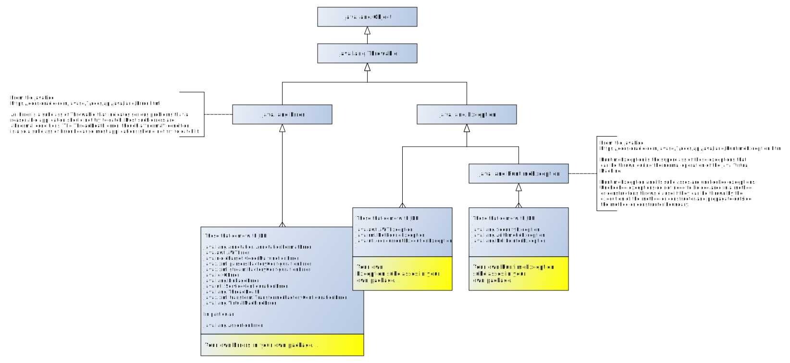

# SWI-Prolog Exceptions

_References to the SWI-Prolog manual pages and more are collected at the tail end of this page._

## Throwing exceptions 

Predicate [`throw/1`](https://www.swi-prolog.org/pldoc/doc_for?object=throw/1) takes a single argument, the _exception term_:

```text
throw(+Exception).
```

User predicates are free to choose the structure of their exception terms (i.e. they can define their own conventions) but _should_
adhere to the ISO-Standard if possible, in particular for libraries.

SWI-Prolog built-in predicates throw exception terms as specified by the ISO standard unless the exception does not fit any of
the ISO standard error term definitions.

In particular [`assertion/1`](https://eu.swi-prolog.org/pldoc/doc_for?object=assertion/1) throws a non ISO standard 
exception term `error(assertion_error(Reason,Culprit),Context)`. 

Another non-ISO standard exception term is thrown by [`dict_pairs/3`](https://eu.swi-prolog.org/pldoc/doc_for?object=dict_pairs/3)
(and probably other dict-handling predicates): `error(duplicate_key(Key),Context)`.

Note that the above exceptions terms use a non-standard formal term but retain the structure of the ISO standard exception term.

## "It actually works"

As the page for [`throw/1`](https://eu.swi-prolog.org/pldoc/doc_for?object=throw/1) says:

> ISO demands that `throw/1` make a copy of `Exception`, walk up the stack to a `catch/3` call, backtrack 
> and try to unify the copy of `Exception` with `Catcher`.

It not only "makes a copy", but "makes a copy that survives backtracking to the catch point" as otherwise
one would never see the values bound to the variables that can be found in the catcher term. It's quite "un-Prolog-y" in fact.

See also: [Salvaging a term out of a dropped search branch](../about_salvaging_a_term_out_of_a_dropped_search_branch)

## Catch with backtrace

How do we get a backtrace and how does the exception term have to look to get one?

The backtrace is filled in according to SWI-Prolog conventions because the ISO Standard has nothing to say about this. 

SWI-Prolog wants the second argument of the `error/2` term (given in the ISO standard as `Imp_def`) to look
like `context(Location,Message)`. If `Location` is fresh and the catch is performed
by [`catch_with_backtrace/3`](https://eu.swi-prolog.org/pldoc/doc_for?object=catch_with_backtrace/3) (which happens
either explicity in code or at the latest possible time at the Prolog Toplevel), `Location`
is filled with a backtrace (as implemented by `library(prolog_stack)`  in file `swipl/lib/swipl/library/prolog_stack.pl`).
The `Message` is generally a cleartext message (string or atom).

Take this program:

```prolog
call0(ExceptionTerm) :- 
   call1(ExceptionTerm).
   
call1(ExceptionTerm) :- 
   call2(ExceptionTerm).
   
call2(ExceptionTerm) :- 
   throw(ExceptionTerm).
```

Enable debugging to keep the compiler from optimizing-away stack frames. 

```text
?- debug.
```

Let's study the behaviour of "backtrace generation" by `catch_with_backtrace/3` with various forms of `ExceptionTerm`. We will let the
exception be caught at the Prolog Toplevel, which uses that predicate.

### Non-ISO-standard exception term without placeholder

No backtrace is generated, there is minimal printing at toplevel:

```text
?- call0("deep in a search tree").
ERROR: Unhandled exception: "deep in a search tree"
```

### Quasi-ISO-standard exception term `error(_,_)`

An exception term that looks like `error(_,_)` matches the ISO Standard basic format, although the requirements
regarding the formal term on the first position have to be followed too for full compliance.

The second argument is set to `context(B,_)` where `B` contains a backtrace.

The toplevel tries validly to print something in the first line, but has to admit that it found an `Unknown error term`:

```text
[debug]  ?- call0(error("deep in a search tree",Context)).

ERROR: Unknown error term: "deep in a search tree"
ERROR: In:
ERROR:   [13] throw(error("deep in a search tree",_4126))
ERROR:   [12] call2(error("deep in a search tree",_4156)) at user://1:14
ERROR:   [11] call1(error("deep in a search tree",_4186)) at user://1:11
ERROR:   [10] call0(error("deep in a search tree",_4216)) at user://1:8
ERROR:    [9] <user>
   Exception: (13) throw(error("deep in a search tree", _3266)) ? Exception details
==
```

Asking for "exception details" using `m` reveals that `Context` has been filled in with a 
term `context(prolog_stack(Frames),_)` as the exception term looks as follows:

```text
error("deep in a search tree",
      context(
         prolog_stack([
            frame(13,call(system:throw/1),throw(error("deep in a search tree",_4126))),
            frame(12,clause(<clause>(0x1a7ef30),4),call2(error("deep in a search tree",_4156))),
            frame(11,clause(<clause>(0x1a9ccd0),4),call1(error("deep in a search tree",_4186))),
            frame(10,clause(<clause>(0x1a368c0),4),call0(error("deep in a search tree",_4216))),
            frame(9,clause(<clause>(0x18f7450),3),'$toplevel':toplevel_call(user:user: ...))]),_4082))
```

### Quasi-ISO-standard exception term with SWI-Prolog context term `error(_,context(_,_))`

The same as above, we just have SWI-Prolog specific `context/2` subterm already in the
ISO-standard specific `error/2` term. 

We can put a generic message in the second argument of `context/2`. In this example, a String:

```text
[debug]  ?- call0(error("deep in a search tree",context(_,"get me outta here"))).
ERROR: Unknown error term: "deep in a search tree" (get me outta here)
```

### ISO-standard exception term with SWI-Prolog context term `error(IsoFormal,context(_,_))` 

As above, backtrace and all, except that now error message generation is correct as it is based on the 
list of valid ISO formal terms:

```text
[debug]  ?- call0(error(instantiation_error,context(_,"get me outta here"))).
ERROR: Arguments are not sufficiently instantiated (get me outta here)
ERROR: In:
ERROR:   [13] throw(error(instantiation_error,context(_3028,"get me outta here")))
ERROR:   [12] call2(error(instantiation_error,context(_3064,"get me outta here"))) at user://1:14
ERROR:   [11] call1(error(instantiation_error,context(_3100,"get me outta here"))) at user://1:11
ERROR:   [10] call0(error(instantiation_error,context(_3136,"get me outta here"))) at user://1:8
ERROR:    [9] <user>
```

## Throwing ISO-Standard exceptions 

### The ISO-Standard exception term

The ISO Standard stipulates that the exception term be of the form `error(Formal, Context)`.

- The `Formal` term is the formal description of the error, specifying the error class and error context information. 
  It may be an atom or variously a compound term of arity 1,2 or 3. The ISO Standard lists the admissible `Formal` terms in chapter
  7.12.2 pp. 62-63 ("Error classification").
  
- The `Context` term, if set (i.e. if not a fresh variable), gives additional context information to help the programmer
  in debugging or to allow error-handling routines to decide what to do next. The structure of `Context` is left unspecified
   y the ISO Standard.

The `Context` is generally of the form `context(Name/Arity, Message)`, where `Name/Arity` is the predicate indicator of the 
built-in predicate that raises the error, and `Message` provides an additional description of the error.

Any part of this structure may be a fresh variable if no appropriate information exists.

We thus have the following term hierarchy:

```prolog
thrower(FormalFunctor,FormalArgs,PredInd,Msg) :-
    compound_name_arguments(Formal,FormalFunctor,FormalArgs),  % Formal = FormalFunctor(FormalArgs...) (very variable)
    compound_name_arguments(Context,context,[PredInd,Msg]),    % Context = context(PredInd,Msg)
    compound_name_arguments(Exception,error,[Formal,Context]), % Exception = error(Formal,Context)
    throw(Exception).
```

- The ISO-Standard document "ISO/IEC 13211-1, 1st edition 1995-06-01" lists the error terms in Chapter 7.12, pages 61 ff.
- The following page substantially _is_ the ISO Standard text: https://www.deransart.fr/prolog/exceptions.html 
- Ulrich Neumerkel lists the various error classes [here](http://www.complang.tuwien.ac.at/ulrich/iso-prolog/error_k).
  The context is a discussion leading up to the second corrigendum of the ISO standard.

### Using `library(error)` 

ISO-Standard exceptions can be thrown with [`library(error)`](https://www.swi-prolog.org/pldoc/man?section=error).
It exports predicates which (as terms) look exactly like the ISO-Standard `Formal` part of the corresponding exception term.

The following predicates exist (in order of appearance in the ISO Standard):

  - [instantiation_error/1](https://eu.swi-prolog.org/pldoc/doc_for?object=instantiation_error/1)
     - `instantiation_error(+FormalSubTerm)` 
     - the `FormalSubTerm` is not currently exploited as the standard demands the `Formal` be the atom `instantiation_error` only
  - [uninstantiation_error/1](https://eu.swi-prolog.org/pldoc/doc_for?object=uninstantiation_error/1)
     - `uninstantiation_error(+Culprit)`      
     - appears in Corrigendum 2: ISO/IEC 13211-1:1995/Cor.2:2012(en)
  - [type_error/2](https://eu.swi-prolog.org/pldoc/doc_for?object=type_error/2)
     - `type_error(+ValidType,+Culprit)`
  - [domain_error/2](https://eu.swi-prolog.org/pldoc/doc_for?object=domain_error/2)
      - `domain_error(+ValidDomain,+Culprit)`
  - [existence_error/2](https://eu.swi-prolog.org/pldoc/doc_for?object=existence_error/2)
      - `existence_error(+ObjectType,-Culprit)`
  - [existence_error/3](https://eu.swi-prolog.org/pldoc/doc_for?object=existence_error/3) (**not** ISO)
      - `existence_error(+ObjectType,+Culprit,+Set)`
      - the third argument `Set` makes this a non-ISO exception. `Set` goes into the `Formal` like this: `Formal=existence_error(ObjectType,Culprit,Set)`
  - [permission_error/3](https://eu.swi-prolog.org/pldoc/doc_for?object=permission_error/3)
      - `permission_error(+Operation,+PermissionType,+Culprit)`
  - [representation_error/1](https://eu.swi-prolog.org/pldoc/doc_for?object=representation_error/1)
      - `representation_error(+Flag)`
  - [resource_error/1](https://eu.swi-prolog.org/pldoc/doc_for?object=resource_error/1)
      - `resource_error(+Resource)`
  - [syntax_error/1](https://eu.swi-prolog.org/pldoc/doc_for?object=syntax_error/1)
      - `syntax_error(+ImplDepAtom)`
      
Note that there is no facility for **catching standard errors**, which is done by
a successful unification of the a thrown term with a "catcher" term passed to
[`catch/3`](https://www.swi-prolog.org/pldoc/doc_for?object=catch/3). 

If you want to decorate the exceptoin with more context information, take a look
at [Adding context to errors: prolog_exception_hook](https://eu.swi-prolog.org/pldoc/man?section=excepthook), 
which allows to do that before the jump to the approriate `catch/3` is performed.

The generator for user-readable error messages based on the exception term can be found 
in `boot/messages.pl`, where there is code like this:

```prolog
iso_message(resource_error(Missing)) -->
    [ 'Not enough resources: ~w'-[Missing] ].
iso_message(type_error(evaluable, Actual)) -->
    { callable(Actual) },
    [ 'Arithmetic: `~p'' is not a function'-[Actual] ].
iso_message(type_error(free_of_attvar, Actual)) -->
    [ 'Type error: `~W'' contains attributed variables'-
      [Actual,[portray(true), attributes(portray)]] ].
```

You may be able to change the printing of messages based on exception. See
[4.10.4 Printing messages](https://eu.swi-prolog.org/pldoc/man?section=printmsg) and
in particular [Predicate message_hook/3](https://eu.swi-prolog.org/pldoc/doc_for?object=message_hook/3).

### List of the ISO-Standard exception term

> Most errors defined in this part of ISO/IEC 13211 occur because the arguments of the goal fail to satisfy a particular
> condition; they are thus detected before execution of the goal begins, and no side effect will have taken place.
> The exceptional cases are: Syntax Errors, Resource Errors, and System Errors.

**Style**

Note that the ISO standard formal term tries ot express what _should be the case_ or _what is the expected correct state_, and 
not what _is the problem_.

For example:

- If a variable is found to be uninstantiated but should be instantiated, you get a
  formal term equal to `instantiation_error`: The problem is not that there is an 
  unwanted instantiation, but that the correct state is the one with an instantiated variable.
- In case a variable is found to be instantiated but should be uninstantiated (because 
  it will be used for output), you get a formal term equal to `uninstantiation_error(Culprit)`: 
  The problem is not that there is lack of instantiation, but that the correct state is the one 
  which `Culprit` (or one of its subterms) is "more uninstantiated" than is the case.
- If you try to disassemble an empty list with compound_name_arguments/3, you get a formal 
  `type_error(compound,[])`. The problem is not that `[]` is (erroneously) a 
  compound term, but that a compound term is expected and `[]` doesn't belong to that class.

In order of appearance in the ISO-Standard:

#### Instantiation Error

An argument or one of its components is uninstantiated, but an instantiated argument or component is required instead.
In effect, "I need more data".

```
Formal = instantiation_error
```

The `Formal` is just the atom `instantiation_error`. One cannot communicate to the caller
which argument is the one that failed, and one _has_ to use `Context` to do that.
This exception is pointlessly deficient in information carrying capacity and the specification needs improvement!

Thrown with [instantiation_error/1](https://eu.swi-prolog.org/pldoc/doc_for?object=instantiation_error/1). The argument passed
to `instantiation_error/1` is just for future extensions and remains unused.

Note that this exception is often used to express something completely different:

```
?- atom_length(X,12).
ERROR: Arguments are not sufficiently instantiated
ERROR: In:
ERROR:   [10] atom_length(_1192,12)
ERROR:    [9] <user>
```

The exception says that "arguments are not sufficiently instantiated", which is true on a low level. But what
it actually should say is that `atom_length/2` _cannot work in the direction +Length->-Atom_, which is the
real high-level message that should be given. But there isn't even an ISO exception to express that.

#### Uninstantiation error

An argument or one of its components is instantiated, and an uninstantiated argument or argument component is required.  
In effect, "I need some space for output".

Note that the atom expresses what is _lacking_ (an "uninstantiation" is lacking), not what _is the problem or what is the matter_ 
(that would mean the atom be `required_uninstantiation_error` or something similar). Again, unusual.

```
Formal=uninstantiation_error(Culprit)
```

- `Culprit` is the argument or one of its components which caused the error.

Thrown with [uninstantiation_error/1](https://eu.swi-prolog.org/pldoc/doc_for?object=uninstantiation_error/1).

#### Type Error

An argument or one of its components is instantiated but incorrect.

```
Formal=type_error(ValidType,Culprit)
```

- `ValidType` is an atom chosen from
 `[atom, atomic, byte, callable, character, compound, evaluable, in_byte, in_character, integer, list, number, predicate_indicator, variable]`.
- `Culprit` is the argument or one of its components which caused the error.

Thrown with [type_error/2](https://eu.swi-prolog.org/pldoc/doc_for?object=type_error/2)

_Personal Note:_ The "list" is the odd one in the above, because "list" is not a type but a convention on how a term is supposed to look
like non-locally. It would make more sense to generate a "Domain Error" if an argument turns out to not be a list.  
epecially as there is already a "non_empty_list" Domain Error. Oh well!

#### Domain Error

An argument's type is correct but the value is outside the domain for which the procedure is defined. ("Domain Error occurs when the value is not a a member of an implementation defined or implementation-dependent set.")


_Personal Note:_ This exception lacks the possibility to properly express being outside the allowed subdomain
if that subdomain is spanned by several arguments instead of just one.

```
Formal=domain_error(ValidDomain,Culprit)
```

- `ValidDomain` is an atom chosen from
 `[character_code_list, close_option, flag_value, io_mode, non_empty_list, not_less_than_zero, operator_priority, operator_specifier, prolog_flag, read_option, source_sink, stream, stream_option, stream_or_alias, stream_position, stream_property, write_option]`.
- `Culprit` is the argument or one of its components which caused the error.

Thrown with [domain_error/2](https://eu.swi-prolog.org/pldoc/doc_for?object=domain_error/2)

#### Existence Error

An object on which an operation is to be performed does not exist. 

```
Formal=existence_error(ObjectType,Culprit)
```

- `ObjectType` is an atom chosen from `[procedure, source_sink, stream]`.
- `Culprit` is the argument or one of its components which caused the error.

Thrown with [existence_error/2](https://eu.swi-prolog.org/pldoc/doc_for?object=existence_error/2).

SWI-Prolog has a non-ISO-conformant extension with an enlarged `Formal`

```
Formal=existence_error(ObjectType,Culprit,Set)
```

Thrown with [existence_error/3](https://eu.swi-prolog.org/pldoc/doc_for?object=existence_error/3).
 
#### Permission Error

The runtime system (or the thread) is lacking permission to perform a specific operation.

```
Formal=permission_error(Operation,PermissionType,Culprit)
```

- `Operation` is an atom chosen from `[access, create, input, modify, open, output, reposition]`.
- `PermissionType` is an atom chosen from `[binary_stream, flag, operator, past_end_of_stream, private_procedure, static_procedure, source_sink, stream, text_stream]`
- `Culprit` is the argument or one of its components which caused the error.

Thrown with [permission_error/3](https://eu.swi-prolog.org/pldoc/doc_for?object=permission_error/3).

_Personal Note:_ The intended semantics of the atoms listed are not clear at all. Recommendation: Don't stick closely to this over-specification.

#### Representation Error

An implementation-defined limit has been breached. 

```
Formal=representation_error(Flag)
```

- `Flag` is an atom chosen from `[character, character_code, in_character_code, max_arity, max_integer, min_integer]`.

Thrown with [representation_error/1](https://eu.swi-prolog.org/pldoc/doc_for?object=representation_error/1).

#### Evaluation Error

The operands of an evaluable functor are such that the operation has an exceptional value or event.

```
Formal=evaluation_error(Error)
```

- `Error` is an atom chosen from `[float_overflow, int_overflow, undefined, underflow, zero_divisor]`.

Thrown with [representation_error/1](https://eu.swi-prolog.org/pldoc/doc_for?object=representation_error/1).

_Personal Note:_ This does not seem to cover all of the IEEE 754 exceptional cases.

#### Resource Error

The runtime system has insufficient resources to complete execution. A resource error
may happen for example when a calculation on unbounded integers has a value which
is too large.

```
Formal=resource_error(Resource)
```

- `Resource` denotes an implementation-dependent atom.

Thrown with [resource_error/1](https://eu.swi-prolog.org/pldoc/doc_for?object=resource_error/1).

#### Syntax Error

A sequence of characters which are being input as a read-term do not conform to an acceptable syntax. "Being input as a read-term" means
this error is thrown by predicates like [`read/1`](https://www.swi-prolog.org/pldoc/doc_for?object=read/1) which are about
deserializatoin of terms.

```
Formal=syntax_error(ImplDepAtom)
```

- `ImplDepAtom` denotes an implementation-dependent atom.

Thrown with [syntax_error/1](https://eu.swi-prolog.org/pldoc/doc_for?object=syntax_error/1). 

#### System Error

Can happen at any point of computation. The conditions for a System Error and the actions taken by a Prolog runtime 
after occurrence are implementation-dependent. A System Error may happen for example 

- in interactions with the operating system (for example, a disc crash or interrupt), or
- when a goal `throw(T)` has been executed and there is no active goal `catch/3`. 

The `Formal` is a parameterless atom (which means one has the same problems as for `instantiation_error`).

```
Formal=system_error
```

There is no corresponding `library(error)` predicate. "System Error" should not be thrown from user code. The counterpart in the Java world would be [Error](https://docs.oracle.com/en/java/javase/14/docs/api/java.base/java/lang/Error.html).

## Examples

Here we throw an exception using the appropriate exception-throwing predicates from `library(error)` 
Note they are not called `throw_type_error/2` etc. just `type_error/2` etc, which may cause some
confusion on reading. We catch the exception in the catcher term _C_ which unifies with anything.
`C` is then printed by the Prolog toplevel.

```prolog
?- catch(type_error(type,term),C,true).
C = error(type_error(type, term), _2844).
```

```prolog
?- catch(domain_error(type,term),C,true).
C = error(domain_error(type, term), _3974).
```

```prolog
?- catch(existence_error(type,term),C,true).
C = error(existence_error(type, term), _5108).
```

```prolog
?- catch(permission_error(action,type,term),C,true).  % 3 args!
C = error(permission_error(action, type, term), _1314).
```

```prolog
?- catch(instantiation_error(term),C,true). % noargs! The term is not passed along currently
C = error(instantiation_error, _7032).
```

```prolog
?- catch(syntax_error(term),C,true). % 1 args!
C = error(syntax_error(term), _8162).
```

## Some problems with the ISO-Standard exception terms

### Non-uniformity

The ISO-Standard exception terms are not "uniform": they are compound terms of arity 3-1 (including non-compound terms, i.e. atoms)

What would be nice (or at least nicer than is the standard now) is to have error terms like these:

```
error(type_error         ,[~list of mandatory args~],[~list of free args~]).
error(instantiation_error,[~list of mandatory args~],[~list of free args~]).
```

Instead we get variability in number of arguments, together with straight-jacketed terms: 

```
error(permission_error(Arg0,Arg1,Arg2), Context). % 3-argument compound term on first position
error(type_error(Arg0,Arg1), Context).            % 2-argument compound term on first position
error(syntax_error(Arg0), Context).               % 1 argument compound term on first position
error(instantiation_error, Context).              % atom (not 0-argument compound term) on first position
```

### Overspecified `Formal`

We can't append any other information to the ISO-Standard `Formal` term, even though one might be interested in
the name of the variables involved in the exception, or want to transmit some informative message for the user. 
Only the `Context` term can be used.

The ISO-Standard stipulates that atoms chosen from a restricted set must appear in certain positions of `Formal`. This
is unnecessarily restrictive as there is no way the ISO-Standard can list all the possible atoms and information may well have have to 
carried in terms more complex than atoms. Additionally the intended meaning of the listed atoms is undescribed and in some cases is obscure.

### Overbearing formalization puts cart before horse

When you write the part of a predicate that verifies whether the predicate's contract is being respected,
i.e. whether the arguments are usable, it may be difficult to even decide between whether you are in presence
of a "type error" or a "domain error" and even trying to do so may force you to perform inelegant code contortions.
And in the end **you don't care**! Because what will the caller (or even the programmer) actually do with that
information? In fact, detailed information is most likely only of interest to predicates "very near" the throw point,
and they can set up their own task-specific convention.

What anyone and anything somewhat interested in catching and handling the exception wants is:

- That part of the predicate's contract was violated on entry
- Maybe some information about the argument or the argument tuple that cause offense ("which arguments and what were their values")
- Maybe an indication on what to do next, which the thrower might have an idea about

And that's it. This leads to an error term like for example:

```
error(contract_violation(_{ what:vector_length_larger_than_1,
                            where:entry(foo/2),
                            args:[Arg1,Arg2,Arg3], 
                            msg:"The three args must be a complex vector of length ~1" }).
```

This is relaxingly informative but even allowed according to the ISO standard. Moreover the formal would have to
be name `contract_nonviolation`. But of course the thrower wants to tell us about a "contract violation", 
not that it wants to see a "contract nonviolation" ... of course it does. Cognitively, that is *also* backwards.

It should be up to the code which catches the exception to decide whether this is a domain error or type error, but it
probably won't even want to. 

And note: What will the catching predicate do with that? Probably trash everything and ask the user for guidance. It always comes
down to "trash everything and then ask around".

### Missing possibilities.

The ISO-Standard is missing entries for a "can't happen",  "illegal state reached" or "assertion violated". This is just to be
expected, no specification can hope to be complete & precise in an open problem domain like a programming language. 

In SWI-Prolog, some non-ISO exceptions may be encountered. As mentioned, the predicate
[assertion/1](https://eu.swi-prolog.org/pldoc/doc_for?object=assertion/1) throws a non ISO-standard exception with
an exception term `error(assertion_error(Reason,Culprit),Context)`. Others exist, take a look at the error 
text generation in file ` boot/messages.pl`.

If you **have** to invent your own exception consider this (in the context of `library(jpl)`:

Jan Wielemaker writes:

> All errors must use `error(Formal, Context)` because that is what the development environment expects.
> `Formal` should be one of the ISO terms if (reasonably) appropriate. If nothing is appropriate you
> may look in `boot/messages.pl` whether SWI-Prolog already defines something more appropriate or you may
> invent your own `Formal`. In this case my vote would got for `jpl_state_error` with enough arguments
> to provide enough context for a good message. So, not `illegal_state_error`. Look at the ISO terms.
> There is no `illegal_type_error`, bad something, etc. It would be double, we are already talking 
> about an error.

Compare with the Java World: While the Prolog standard doesn't even _have_ a standard exception that can be thrown
by failing tests (SWI Prolog invents its own for `assertion/1`, namely `error(assertion_error(Reason,Culprit),Context)`), 
the Java World tries to standardize _which ones_ should be thrown across testing frameworks (smug.jpg):

   - https://github.com/ota4j-team/opentest4j - The 
   - https://github.com/ota4j-team/opentest4j/tree/master/src/main/java/org/opentest4j - The `Exception` classes

### The exception term is not properly associated with a module

In Java, the `toString()`  method is associated to the Exception (at least conceptually), so any code that catches the 
exception can easily format and print it correctly. 

In Prolog, the corresponding Module must define a printing predicate whose head uniquely unifies with the term
carried by the exception and which is called from a "generic printer" that uses the multi-module exception printing
predicate as dispatch table. This works (although how do I do it practically? To be done) but it is ... not very nice.

### Ideally...

If non-ISO is an option, you can be inventive (or not):

```
?- catch(throw("This is my own term and I like it"),C,true).
C = "This is my own term and I like it".
```

The exception term might be better as open-ended representation, for example:

```
error(DistinguishableTypeCode,ListOrTaggedListOrAssocOrDictOfExtraValues).
```

And then you can use lists (or even better, dicts) instead of using compound terms of variable arity to transmit data to the catch point.

```
throw_mystyle_existence_error(Pred,Type,Term,ExCode) :-
   (exception_code(ExCode,ExText) -> true ; (ExText = ExCode)),
   throw(mystyle([[error,existence],type-Type,term-Term,pred-Pred,msg-ExText]).
```

## Good ideas

### Good idea: Avoiding cleartext errors littering you code, aka "Throwing in Style"

This is a more flexible proposal (made for the Prolog-Java bridge 
[JPL](https://eu.swi-prolog.org/pldoc/doc_for?object=section(%27packages/jpl.html%27))).

The idea is that neither text nor exception type are coded inside the program proper.
Instead all exception code is thrown via calls to a dedicated predicate `throwme/2`
and all exceptions are described by clauses of the predicate `exc_desc/4`

**All exception code is thrown via calls to `throwme/2`**

Instead of writing:

```text
foo(X,Y) :- X<0,throw(error(contract_error(arg1,X),context(_,"The first argument must be >= 0"))).
```

which becomes hard to read and maintain if there are lots of `throw` instructions, one writes

```text
foo(X,Y) :- X<0,throwme(foo,parameter_wrong(arg1,X)).
```

And one adds an _exception descriptor_ for the desired somewhere at the end of the source file, easily inspectable and updateable:

```text
exc_desc(foo,parameter_wrong(Where,What),  % lookup values found in the throwme/2 call
         _,                                % "location" that will be in the context term on 1st position
         contract_error(Where,What),       % "formal" term of the exception (here, non-ISO standard)
         '1st arg must be >= 0').          % cleartext message that will be in the context term on 2nd position
```

One can of course try variations, e.g with dynamic messages:

```text
exc_desc(foo,parameter_wrong(Where,What),  % lookup values found in the throwme/2 call
         _,                                % "location" that will be in the context term on 1st position
         contract_error(Where,What),       % "formal" term of the exception (here, non-ISO standard)
         Msg) :-
   textize("1st arg must be >= 0 but is ~d",[What],Msg).
```

The basic file to pull in is here, it contains further explanations. It is actually not a module, you have to include the
file with [`include/1`](https://eu.swi-prolog.org/pldoc/doc_for?object=include/1) into those modules which use it, duplication the
(small) code.

This is because the `exc_desc/5` clauses should module-specific and not be exported, so if this _were_ a module, `throwme/2` 
could not access the module-internal `exc_desc/5` clauses.

- [`throwme_nonmodular.pl`](../../code/heavycarbon/support/throwme_nonmodular.pl)

**Making sure the `throwme/2` calls are correct**

To test whether all calls to `throwme/2`  have been coded correctly, you first need to
extract all those calls from the source code, then copy-paste them into a small plunit test block.
(This is best automated, but I haven done so yet).

The plunit test block:

[exception_testcode.pl](code/exception_testcode.pl)

A Perl program to get those `throwme/2` calls out of a a Prolog program read from STDIN (should
be rewritten to Prolog; maybe later):

[perl_throwme_extractor.pl](code/perl_throwme_extractor.pl)

## Good idea: Selecting whether to "throw or fail" at runtime

Sometimes context determines whether some code, upon encountering an identical
problematic situation, should fail or throw. For example, deterministic predicates
(always succeeding) can only throw to signal a problem (the meaning of which would
then be that a computational problem was encountered, rather a problem in any problem
modeled in logic), whereas semi-deterministic or non-deterministic predicates may choose
to fail instead.

We can add wrappers to throw or fail depending on options list contents.
If `Options` is a list containing the atom `throw`, then throw, else fail:

```
throw_existence_error(Pred,Type,Term,ExCode,Options) :
   (nonvar(Options),memberchk(throw,Options))
   ->
   throw_existence_error(Pred,Type,Term,ExCode)
   ;
   fail. % actually unnecessary to write this, but it's good for the next programmer
```
## Reading

### Coding guidelines say nothing

[Coding Guidelines for Prolog](https://arxiv.org/abs/0911.2899) offers a bit of commentary on _when_ to throw, but does not go further.

### An alternative to Exceptions

[Package 'condition'](https://eu.swi-prolog.org/pack/list?p=condition) provides a _Condition_ system as in Common Lisp. (I haven't tried it yet)
   
### Pages of interest in the SWI-Prolog manual

  - [`library(error)`](https://eu.swi-prolog.org/pldoc/man?section=error) - Has a description of exception meanings & usage
  - [Chapter 4.10: Exception handling](https://eu.swi-prolog.org/pldoc/man?section=exception)
     - [`catch/3`](https://www.swi-prolog.org/pldoc/doc_for?object=catch/3)
     - [`throw/1`](https://www.swi-prolog.org/pldoc/doc_for?object=throw/1)
     - [`catch_with_backtrace/3`](https://eu.swi-prolog.org/pldoc/doc_for?object=catch_with_backtrace/3)
     - [Urgency of exceptions](https://eu.swi-prolog.org/pldoc/man?section=urgentexceptions)
     - [Debugging and exceptions](https://eu.swi-prolog.org/pldoc/man?section=debugexceptions)
     - [The exception term](https://eu.swi-prolog.org/pldoc/man?section=exceptterm)
  - [B.6 Hooks using the exception predicate](https://eu.swi-prolog.org/pldoc/man?section=exception3)
  - [A.14 library(debug): Print debug messages and test assertions](https://eu.swi-prolog.org/pldoc/man?section=debug)
     - [assertion/1](https://eu.swi-prolog.org/pldoc/doc_for?object=assertion/1)
  - Code which translates exception terms to cleartext messages (generally on the Prolog Toplevel), via DCG:  
     - [`term_message//1`](https://www.swi-prolog.org/pldoc/doc/_SWI_/boot/messages.pl?show=src#term_message//1).
     - This is file `${DISTRO}/lib/swipl/boot/messages.pl`
     - See also this report about `jpl.pl` by Jan Burse: [Issue#59](https://github.com/SWI-Prolog/packages-jpl/issues/59)
  - [Printing messages](https://eu.swi-prolog.org/pldoc/man?section=printmsg) from exceptions, but can be used more generally. See 
    also Anne Ogborn's [Tutorial](http://www.pathwayslms.com/swipltuts/message/index.html) on printing messages
     
## Compare with

### From the Java World: The Exception Hierarchy




