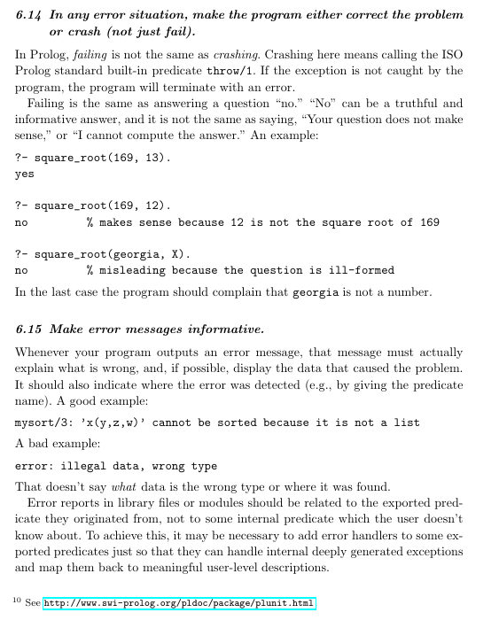

# Prolog Exceptions

## TOC

- [General reading](#general_reading)
- [Why have exceptions in Prolog?](#why_have_exceptions)
- [Excerpt from "Coding Guidelines for Prolog](#coding_guidelines_for_prolog_excerpt)
- [Throwing exceptions](#throwing_exceptions)
- ["It actually works](#it_actually_works)
- [Throwing ISO standard exceptions](#throwing_iso_standard_exception)
- [Catch with backtrace](#catch_with_backtrace)
- [Problems with the ISO standard exception terms](#problems_with_iso_standard_exception_term)
- [Good idea: Throwing in style and collecting exception texts in one place](#throwing_in_style)
- [Good idea: Selecting whether to "throw or fail" at runtime](#selecting_throw_or_fail_at_runtime)
- [Good idea: Using SWI-Prolog dict in a (non-ISO) exception term](#using_dict_in_an_exception_term)
- [More Reading](#name="more_reading)
   - [An alternative to Exceptions: Conditions](#alternative_to_exceptions_conditions)
   - [**Pages of interest in the SWI-Prolog manual**](#pages_of_interest_in_the_manual)
   - [Even more reading](#even_more_reading)

## General reading<a name="general_reading" />

Exceptions in general (there is practically zero literature on exceptions in logic prorgamming):

   - [Toward Exception-Handling Best Practices and Patterns](https://ieeexplore.ieee.org/document/1687854), Rebecca J. Wirfs-Brock.
     Appears in: IEEE Software, Volume: 23, Issue: 5, Sept.-Oct. 2006. Available at
     [ResearchGate](https://www.researchgate.net/publication/3248431_Toward_Exception-Handling_Best_Practices_and_Patterns)
   - [Understanding Exception Handling: Viewpoints of Novices and Experts](https://ieeexplore.ieee.org/document/5383375), Hina Shah, 
     Carsten Gorg, Mary Jean Harrold. Appears in: IEEE Transactions on Software Engineering (Volume: 36, Issue: 2, March-April 2010). Available at
     [ResearchGate](https://www.researchgate.net/publication/260648918_Understanding_Exception_Handling_Viewpoints_of_Novices_and_Experts)
     
## Why have exceptions in Prolog?<a name="why_have_exceptions" />

One might argue that Prolog already can do "error signaling" by the simple fact that every predicate call ends in "(constructive) success" or else "failure". In a logical setting, these two outcomes are interpreted as, respectively, "this relation could be proved true and valid variable bindings could be determined" and "there is no proof that this relation is true and the variable bindings haven't changed". The idea to cover "exceptional conditions" by the "failure" outcome presents itself. In that way. problematic cases like domain errors, type errors or other errors, possibly even errors with I/O, could all be covered by "failure".

However, that is a bad idea.

One might expect a pure theorem-prover to not make use of exceptions, in the same way as one might expect a regular-expression engine to not make use of exception (at least once the regex has been parsed successfully). These systems work in a closed and controlled, "laboratory" environment. They do their thing and return the result in a specific domain, in a specific setting.

There _are_ sections of Prolog code where restriction to "failure only" may make sense, namely those which have a "logical explanation": to solve a specific problem, find a proof of a goal. But Prolog is not about those sections only, or even _mainly_ about those. Large sections are just functional style, not doing any search, where predicates deterministically succeed, but where the possibility of processing errors arises: Prolog is - as its name says - about "programming in logic", not (only) about theorem proving. 

There are situations different from "proof failures": the input could be wrong. Programming contracts may have been violated. Files may not be available. Variables bindings may be from the wrong type or wrong domain. Network connections can go down and floating point numbers can become NaN. Pressing these into the situation of "proof failure" means they have to be handled by an "alternative search path", i.e. an additional (possibly default) clause. But what could that clause actually do except sweep the problem under the rug?

Information-carrying out-of-band errors, i.e. exceptions are especially important Prolog due to:

- Lack of static and even dynamic type checking. A lot of potential problems won't be discovered by either the compiler or even at runtime. As a expedient fix, there will be `assertion/1` calls sprinkled throughout the code to make sure the process is still "on track". Not being "on track" (bad type, bad domain etc.) should mean that one bails out to a point in the program where the situation the problem can be handled, however crudely (generally by dumping intermediate results, reinitializing or getting more information from the user or other information source, and trying again). The alternative, whereby the assertion does not throw but just fails, would mean that the program starts failing with no clear indication as to why. Worse it might even continue to apparently work but actually compute result that don't make any sense. Not a great outcome.
- Impossibility to get any good information concerning "failure". A predicate that fails becomes un-history (all the variable bindings are rolled back to the state they were in before the call). Failure tells the "upstream predicate" (the one to the left in a conjunction) only that "there was a problem with the current search path, please propose something else, a new domain to search through" (IMHO, this lack of information from the failing predicate actually a problem with Prolog and one sometimes has to awkwardly "reify the outcome", i.e. succeed the predicate but set a flag saying that the predicate actually failed instead to get any information about what went wrong). If an exceptional situation occurs, you really want to _know_ what happened and "failure" is just not fit for purpose here. 
- Finally, finding out why a Prolog program emits "fail" when one expects it to yield an answer can be frustrating at the best of times. Co-mingling error conditions into this will not help.

## Excerpt from "Coding Guidelines for Prolog"<a name="coding_guidelines_for_prolog_excerpt" />

The [Coding Guidelines for Prolog](https://arxiv.org/abs/0911.2899) (Covington et al.) offer a bit of commentary on _when_ to throw, but do not go further:



## Throwing exceptions<a name="throwing_exceptions" /> 

Predicate [`throw/1`](https://eu.swi-prolog.org/pldoc/doc_for?object=throw/1) takes a single argument, the _exception term_:

```text
throw(+Exception).
```

User predicates are free to choose the structure of their exception terms (i.e. they can define their own conventions) but _should_
adhere to the ISO-Standard if possible, in particular for libraries.

SWI-Prolog built-in predicates throw exception terms as specified by the ISO standard unless the exception does not fit any of
the ISO standard error term definitions.

In particular [`assertion/1`](https://eu.swi-prolog.org/pldoc/doc_for?object=assertion/1) throws a non ISO standard 
exception term `error(assertion_error(Reason,Culprit),Context)`. 

Another non-ISO standard exception term is thrown by [`dict_pairs/3`](https://eu.swi-prolog.org/pldoc/doc_for?object=dict_pairs/3)
(and probably other dict-handling predicates): `error(duplicate_key(Key),Context)`.

Note that the above exceptions terms use a non-standard formal term but retain the structure of the ISO standard exception term,
`error(Formal,Context)`.

## "It actually works"<a name="it_actually_works" />

As the page for [`throw/1`](https://eu.swi-prolog.org/pldoc/doc_for?object=throw/1) says:

> ISO demands that `throw/1` make a copy of `Exception`, walk up the stack to a `catch/3` call, backtrack 
> and try to unify the copy of `Exception` with `Catcher`.

A copy is made to transport the content of a variable visible at the point-of-throw to the point-of-catch 
while backtracking is performed on anything else.

Here is an example:

```
top(X) :-
   Tip=Fin,               % Create an empty "open list" structure rooted at "Tip" to which we will append
   trial(X,Tip,Fin),
   format("Tip at top/1 has been rolled back to ~q\n",[Tip]).
  
trial(X,Tip,Fin) :-
   Fin=[level1|NewFin],   % The open list grows at "Fin" but stays rooted at "Tip"
   catch(inner(X,Tip,NewFin),
         level1(Tip2,Fin2),
         format("Caught level1(~q,~q) while Tip=~q, Fin=~q\n",[Tip2,Fin2,Tip,Fin])).
   
inner(X,Tip,Fin) :-
   Fin=[level2|NewFin],   % The open list grows at "Fin" but stays rooted at "Tip"
   catch(innerer(X,Tip,NewFin),
         level2(Tip2,Fin2),
         format("Caught level2(~q,~q) while Tip=~q, Fin=~q\n",[Tip2,Fin2,Tip,Fin])).

innerer(X,Tip,Fin) :-
   Fin=[level3|NewFin],   % The open list grows at "Fin" but stays rooted at "Tip"
   catch(innerest(X,Tip,NewFin),
         level3(Tip2,Fin2),
         format("Caught level3(~q,~q) while Tip=~q, Fin=~q\n",[Tip2,Fin2,Tip,Fin])).
   
innerest(X,Tip,Fin) :-
   compound_name_arguments(T,X,[Tip,Fin]),
   format("Throwing ~q\n",[T]),  
   throw(T).
```   

Then

```
?- top(level2).
Throwing level2([level1,level2,level3|_10906],_10906)
Caught level2([level1,level2,level3|_112],_112) while Tip=[level1,level2|_108], Fin=[level2|_108]
Tip at top/1 has been rolled back to [level1,level2|_108]
true.

?- top(level1).
Throwing level1([level1,level2,level3|_1210],_1210)
Caught level1([level1,level2,level3|_1068],_1068) while Tip=[level1|_1054], Fin=[level1|_1054]
Tip at top/1 has been rolled back to [level1|_1054]
true.
```

As one can see, the open list rooted at `Tip` is `[level1,level2,level3|_]` at `innerest/3`, and this
structure is wholly communicated to the catch point (although with different unbound variables due to
copying). On the other other, the catch point only sees the rolled-back original `Tip` after the
catch: `[level1,level2|_108]` or `[level1|_1054]` instead of the whole structure reachable from 
`Tip` when the `throw/1` was performed.

See also: [Salvaging a term out of a dropped search branch](../about_salvaging_a_term_out_of_a_dropped_search_branch)

## Throwing ISO standard exceptions<a name="throwing_iso_standard_exception" />

[Throwing ISO standard exceptions](throwing_iso_standard_exceptions.md)

## Catch with backtrace<a name="catch_with_backtrace" />

[Catch with backtrace](catch_with_backtrace.md)

## Problems with the ISO standard exception terms<a name="problems_with_iso_standard_exception_term" />

[Problems with the ISO standard exception terms](problems_with_the_iso_standard_exception_terms.md)

## Good idea: Throwing in style and collecting exception texts in one place<a name="throwing_in_style" />

[Throwing in style and collecting exception texts in one place](throwing_in_style.md)

## Good idea: Selecting whether to "throw or fail" at runtime<a name="selecting_throw_or_fail_at_runtime" />

Sometimes context determines whether some code, upon encountering 
problematic situation, should fail or throw. In particular, deterministic predicates
(which always succeed) can only _throw_ to signal a problem, whereas
semi-deterministic or non-deterministic predicates may choose to _fail_ instead.

Suppose we want to use the same code in case a passed argument is found to be
outside its expected domain, but depending on a "option", the code shall:

- throw an ISO-standard compliant _domain error_ using predicate
  [`domain_error(+ValidDomain, +Culprit)`](https://eu.swi-prolog.org/pldoc/doc_for?object=domain_error/2) 
  from [`library(error)`](https://eu.swi-prolog.org/pldoc/man?section=error), or
- just fail  
  
The option shall be found in an _option list_, as expected by
[`library(option)`](https://eu.swi-prolog.org/pldoc/man?section=option). The
predicate that extract the option's value from the option list would be
[`option(?Option, +OptionList, +Default)`](https://eu.swi-prolog.org/pldoc/doc_for?object=option/3).

The predicate:

```
optional_domain_error(ValidDomain,Culprit,Options) :-
   option(throw_or_fail(What),Opts,throw),
   ((What==throw) -> existence_error(ObjectType,Culprit) ; fail).  % The "else fail" is optional
```

And so:

```
?- optional_domain_error("less than 0",10,[]).
ERROR: Domain error: `less than 0' expected, found `10'
```

```
?- optional_domain_error("less than 0",10,[throw_or_fail(throw)]).
ERROR: Domain error: `less than 0' expected, found `10'
```

```
?- optional_domain_error("less than 0",10,[throw_or_fail(fail)]).
false.
```

## Good idea: Using SWI-Prolog dict in a (non-ISO) exception term<a name="using_dict_in_an_exception_term" />

This example code concerning throwing and catching: 

[`catchy.pl`](code/catchy.pl)

demonstrates an exception term of the form `error(Dict,Context)`, where `Dict` carries information 
about the exception according to a (so far informal) convention.

The exception term is still "ISO-like" because it follows the `error(Formal,Context)` convention, 
where `Context` can stay unbound or is instantiated to a backtrace if [`catch_with_backtrace/3`]() 
is used instead of simple [`catch/3`](). 

It is however, non-ISO, in particular because it is based on a non-ISO object, the
SWI-Prolog ['dict'](https://eu.swi-prolog.org/pldoc/man?section=bidicts) (a map structure)).
It will thus not be printed correctly at the toplevel by default (unless an
appropriate handler predicate has been hooked-in ... TODO!). If code unable to deal
with non-ISO exceptions calls code that throws one of these exceptions, there may be
trouble

On the other hand, we gain a great amount of flexibility.

For example, a predicate that throws:

```
funky_2(X,false) :-
   X == 0
   -> throw(error(
         _{class    : "domain_error",
           expected : "Something different from 0",
           got      : "Got 0",
           what     : "Argument 'X'",
           where    : "funky_2/2",
           culprit  : X},
         _Context))
   ; format("funky/2 received ~d\n",[X]).
```

and the corresponding exception handler:

```
goal_of_recovery_2(error(Dict,Context)) :-
   is_dict(Dict),
   !,
   format("Oops, exception of class ~q\n",[Dict.class]),
   (get_dict(expected, Dict, V1)  -> format("Expected : ~q\n",[V1]) ; true),
   (get_dict(got, Dict, V2)       -> format("Got      : ~q\n",[V2]) ; true),
   (get_dict(where, Dict, V3)     -> format("Where    : ~q\n",[V3]) ; true),
   (get_dict(what, Dict, V4)      -> format("What     : ~q\n",[V4]) ; true),
   (get_dict(culprit, Dict, V5)   -> format("Culprit  : ~q\n",[V5]) ; true),
   % contain backtraces if "catch_with_backtrace/3" is used
   (nonvar(Context)    
```

## More Reading<a name="more_reading" />

### An alternative to Exceptions: Conditions<a name="alternative_to_exceptions_conditions" />

SWI-Prolog pack [`condition`](https://eu.swi-prolog.org/pack/list?p=condition) provides a _condition_ system as found in 
[ZetaLisp](https://en.wikipedia.org/wiki/Lisp_Machine_Lisp) and later [Common Lisp](https://en.wikipedia.org/wiki/Common_Lisp).

More on [this page](../about_conditions).
   
### Pages of interest in the SWI-Prolog manual<a name="pages_of_interest_in_the_manual" />

  - [`library(error)`](https://eu.swi-prolog.org/pldoc/man?section=error) - Has a description of exception meanings & usage
  - [Chapter 4.10: Exception handling](https://eu.swi-prolog.org/pldoc/man?section=exception)
     - [`catch/3`](https://www.swi-prolog.org/pldoc/doc_for?object=catch/3)
     - [`throw/1`](https://www.swi-prolog.org/pldoc/doc_for?object=throw/1)
     - [`catch_with_backtrace/3`](https://eu.swi-prolog.org/pldoc/doc_for?object=catch_with_backtrace/3)
     - [Urgency of exceptions](https://eu.swi-prolog.org/pldoc/man?section=urgentexceptions)
     - [Debugging and exceptions](https://eu.swi-prolog.org/pldoc/man?section=debugexceptions)
     - [The exception term](https://eu.swi-prolog.org/pldoc/man?section=exceptterm)
  - [B.6 Hooks using the exception predicate](https://eu.swi-prolog.org/pldoc/man?section=exception3)
  - [A.14 library(debug): Print debug messages and test assertions](https://eu.swi-prolog.org/pldoc/man?section=debug)
     - [assertion/1](https://eu.swi-prolog.org/pldoc/doc_for?object=assertion/1)
  - Code which translates exception terms to cleartext messages (generally on the Prolog Toplevel), via DCG:  
     - [`term_message//1`](https://www.swi-prolog.org/pldoc/doc/_SWI_/boot/messages.pl?show=src#term_message//1).
     - This is file `${DISTRO}/lib/swipl/boot/messages.pl`
     - See also this report about `jpl.pl` by Jan Burse: [Issue#59](https://github.com/SWI-Prolog/packages-jpl/issues/59)
  - [Printing messages](https://eu.swi-prolog.org/pldoc/man?section=printmsg) from exceptions, but can be used more generally. See 
    also Anne Ogborn's [Tutorial](http://www.pathwayslms.com/swipltuts/message/index.html) on printing messages
     
### Even more reading<a name="even_more_reading" />

   - [Picat](http://retina.inf.ufsc.br/picat_guide/#x1-280001.8) has exceptions but not much is said about those.
   - There is an [International Workshop on Exception Handling](https://dblp.uni-trier.de/db/conf/weh-ws/index.html)? 
     The last meeting (the 5th) was in 2012, however.
   - Springer: [Advances in Exception Handling Techniques](https://link.springer.com/book/10.1007/3-540-45407-1)  
   - [Toward Exception-Handling Best Practices and Patterns](https://ieeexplore.ieee.org/document/1687854), Rebecca J. Wirfs-Brock.
     Appears in: IEEE Software, Volume: 23, Issue: 5, Sept.-Oct. 2006. Available at
     [ResearchGate](https://www.researchgate.net/publication/3248431_Toward_Exception-Handling_Best_Practices_and_Patterns)
