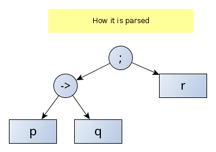
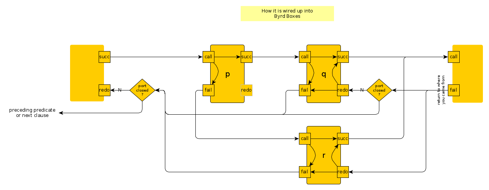

# Notes about if-then-else

Regarding the [if-then-else](https://eu.swi-prolog.org/pldoc/doc_for?object=(-%3E)/2) construct, some images:

**if-then-else as written**

**if-then-else as parsed**

**if-then-else as wired up in the [Byrd Box model](../other_notes/about_byrd_box_model)**

In case the "else" condition is missing, it is replaced by a `false` and we get:

**if-then or if-then-else-false as wired up in the Byrd Box model**

![if-then-else-false wired up in the byrd box model]if_then_as_wired_up_in_the_byrd_box_model.png)

