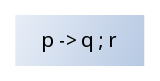
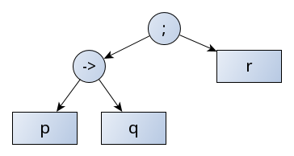
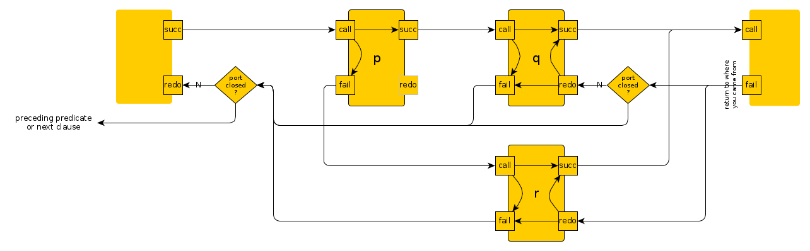
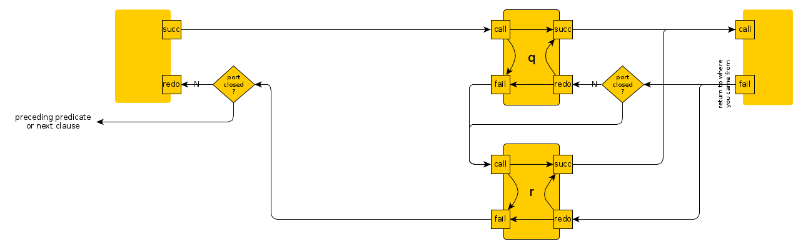
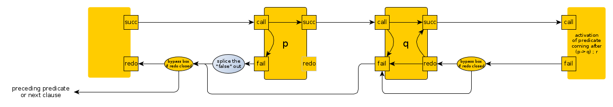

# Notes about if-then-else

## If-then-else

The construct [if-then-else](https://eu.swi-prolog.org/pldoc/doc_for?object=(-%3E)/2) construct is syntactically a bit special 
because the `->/2` operator is "helped" by `;/2` operator to yield a quasi-trinary operator:

**if-then-else as written**



**if-then-else as parsed**

`write_canonical/1` prints what it reads:

```
?- write_canonical((p->q;r)).
;(->(p,q),r)
true.

?- write_canonical((p->q);r).
;(->(p,q),r)
true.
```

In case there is no "else"

```
?- write_canonical(p->q).
->(p,q)
true.
```

So, `p->q;r` is parsed exactly the same as the "or" of `p->q` and `r`: Both expressions are indistinguishable.
As the else-less `p->q` _fails_ if `p` _fails_, this is completely correct: The if-then-else _is_ a composite of the _or_ operator `;/2` 
operator first, and an additional `->/2` operator second.



Define predicates which you can cause to succeed or fail by argument and which have several solutions:

```
p(X) :- format("[p(~q) solution 1]",[X]),call(X).
p(X) :- format("[p(~q) solution 2]",[X]),call(X).

q(X) :- format("[q(~q) solution 1]",[X]),call(X).
q(X) :- format("[q(~q) solution 2]",[X]),call(X).

r(X) :- format("[r(~q) solution 1]",[X]),call(X).
r(X) :- format("[r(~q) solution 2]",[X]),call(X).
```

Then:

```
?- 
p(true) -> q(true) ; r(true).

[p(true) solution 1][q(true) solution 1]
true ;
[q(true) solution 2]
true.
```

```
?- 
p(false) -> q(true) ; r(true).

[p(false) solution 1][p(false) solution 2][r(true) solution 1]
true ;
[r(true) solution 2]
true.
```

```
?-
p(true) -> q(false) ; r(true).

[p(true) solution 1][q(false) solution 1][q(false) solution 2]
false.
```

And with missing "else":

```
?- p(false) -> q(true).
[p(false) solution 1][p(false) solution 2]
false.
```

``` 
?- p(true) -> q(true). 
[p(true) solution 1][q(true) solution 1]
true ;
[q(true) solution 2]
true.
```

``` 
?- p(true) -> q(false).
[p(true) solution 1][q(false) solution 1][q(false) solution 2]
false.
```

And this is exactly the same as the paranthesized `->/2` subexpression with the `;` coming after:

```
?- (p(true) -> q(true)) ; r(true).

[p(true) solution 1][q(true) solution 1]
true ;
[q(true) solution 2]
true.
```

etc.

### _if-then-else_ as wired up in the Byrd Box Model

More on the Nyrd Box Model [here](../other_notes/about_byrd_box_model)



**Compare with "or"**



### _if-then_ as wired up in the Byrd Box Model

In case the "else" condition is missing, it is replaced by a `false` and we get:

**if-then or if-then-else-false as wired up in the Byrd Box model**



## Soft-cut: `*->` with `;/2`

Another construct, the [soft-cut](https://eu.swi-prolog.org/pldoc/doc_for?object=(*-%3E)/2), is built from `*->` and `;/2`, same as for `->/2` + `;/2`.
However, it backtracks over the premiss, (`p` in our case).

With the same `p/1`, `q/1`, `r/1` defined as above:

Then:

```
?- 
p(true) *-> q(true) ; r(true).

[p(true) solution 1][q(true) solution 1]
true ;
[q(true) solution 2]
true ;
[p(true) solution 2][q(true) solution 1]
true ;
[q(true) solution 2]
true.
```

```
?- 
p(false) *-> q(true) ; r(true).

[p(false) solution 1][p(false) solution 2][r(true) solution 1]
true ;
[r(true) solution 2]
true.
```

```
?- p(true) *-> q(false) ; r(true).

[p(true) solution 1][q(false) solution 1][q(false) solution 2][p(true) solution 2][q(false) solution 1][q(false) solution 2]
false.
```

And with missing "else":

```
?- p(false) *-> q(true).
[p(false) solution 1][p(false) solution 2]
false.
```

``` 
?- p(true) *-> q(true). 
[p(true) solution 1][q(true) solution 1]
true ;
[q(true) solution 2]
true ;
[p(true) solution 2][q(true) solution 1]
true ;
[q(true) solution 2]
true.
```

``` 
?- p(true) *-> q(false).
[p(true) solution 1][q(false) solution 1][q(false) solution 2][p(true) solution 2][q(false) solution 1][q(false) solution 2]
false.
```

### _soft-cut_ as wired up in the Byrd Box Model


