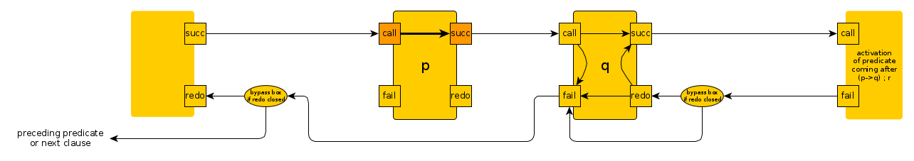
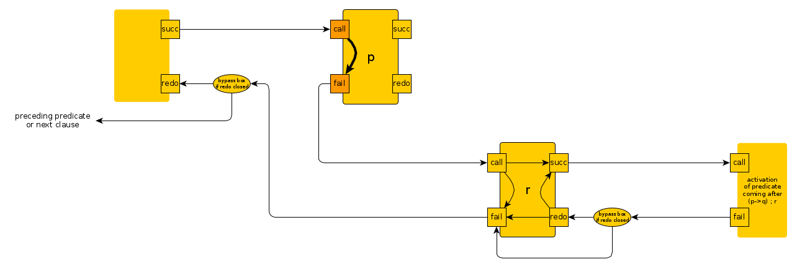
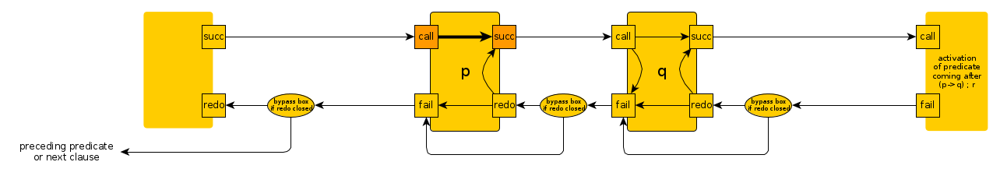

# Notes about if-then-else

## If-then-else

The construct [if-then-else](https://eu.swi-prolog.org/pldoc/doc_for?object=(-%3E)/2) construct is syntactically a bit special 
because the `->/2` operator is "helped" by `;/2` operator to yield a quasi-trinary operator:

**if-then-else as written**


**if-then-else as parsed**

`write_canonical/1` prints what it reads:

```
?- write_canonical((p->q;r)).
;(->(p,q),r)
true.

?- write_canonical((p->q);r).
;(->(p,q),r)
true.
```

In case there is no "else"

```
?- write_canonical(p->q).
->(p,q)
true.
```

So, `p->q;r` is parsed exactly the same as the "or" of `p->q` and `r`: Both expressions are indistinguishable syntactically.


However, the `;/2` immediately preceded by a `->/2` does not behave like an _or_ of two subexpressions: if the premiss
of `->/2` succeeds, then the right subexpression of `;/2`(here, `r`)  will **not** be called, unlike for a normal _or_,

Define predicates which you can cause to succeed or fail by argument and which have several solutions:

```
p(X) :- format("[p(~q) clause 1]",[X]),call(X).
p(X) :- format("[p(~q) clause 2]",[X]),call(X).

q(X) :- format("[q(~q) clause 1]",[X]),call(X).
q(X) :- format("[q(~q) clause 2]",[X]),call(X).

r(X) :- format("[r(~q) clause 1]",[X]),call(X).
r(X) :- format("[r(~q) clause 2]",[X]),call(X).
```

Then:

```
?- 
p(true) -> q(true) ; r(true).

[p(true) clause 1][q(true) clause 1]
true ;
[q(true) clause 2]
true.
```

```
?- 
p(false) -> q(true) ; r(true).

[p(false) clause 1][p(false) clause 2][r(true) clause 1]
true ;
[r(true) clause 2]
true.
```

```
?-
p(true) -> q(false) ; r(true).

[p(true) clause 1][q(false) clause 1][q(false) clause 2]
false.
```

And with missing _else_ part:

```
?- p(false) -> q(true).
[p(false) clause 1][p(false) clause 2]
false.
```

``` 
?- p(true) -> q(true). 
[p(true) clause 1][q(true) clause 1]
true ;
[q(true) clause 2]
true.
```

``` 
?- p(true) -> q(false).
[p(true) clause 1][q(false) clause 1][q(false) clause 2]
false.
```

And this is exactly the same as the paranthesized `->/2` subexpression with the `;` coming after:

```
?- (p(true) -> q(true)) ; r(true).

[p(true) clause 1][q(true) clause 1]
true ;
[q(true) clause 2]
true.
```

etc.

### _if-then-else_ as wired up in the Byrd Box Model

More on the Byrd Box Model [here](../other_notes/about_byrd_box_model)

#### If `p` succeeds

There is no way that `r` will be called:



#### If `p` fails

Then `r` is called as for a normal _or_:



#### Compare with normal _or_

For a normal _or_ it is always possible that `r` can be called:


### _if-then_ as wired up in the Byrd Box Model

In case the _else_ part is missing, it is replaced by a `false` and we get (after replacing `r` by a `false`
box and splicing it out): 

**if-then or if-then-else-false as wired up in the Byrd Box model**


## Soft-cut: `*->` with `;/2`

Another construct, the [soft-cut](https://eu.swi-prolog.org/pldoc/doc_for?object=(*-%3E)/2), is 
built from `*->` and `;/2`, same as for `->/2` + `;/2`. However, unlike _if-then-else_,
it backtracks over the premiss, (`p` in our case).

With the same `p/1`, `q/1`, `r/1` defined as above:

Then:

```
?- 
p(true) *-> q(true) ; r(true).

[p(true) clause 1][q(true) clause 1]
true ;
[q(true) clause 2]
true ;
[p(true) clause 2][q(true) clause 1]
true ;
[q(true) clause 2]
true.
```

```
?- 
p(false) *-> q(true) ; r(true).

[p(false) clause 1][p(false) clause 2][r(true) clause 1]
true ;
[r(true) clause 2]
true.
```

```
?- p(true) *-> q(false) ; r(true).

[p(true) clause 1][q(false) clause 1][q(false) clause 2][p(true) clause 2][q(false) clause 1][q(false) clause 2]
false.
```

And with missing _else_ part:

```
?- p(false) *-> q(true).
[p(false) clause 1][p(false) clause 2]
false.
```

``` 
?- p(true) *-> q(true). 
[p(true) clause 1][q(true) clause 1]
true ;
[q(true) clause 2]
true ;
[p(true) clause 2][q(true) clause 1]
true ;
[q(true) clause 2]
true.
```

``` 
?- p(true) *-> q(false).
[p(true) clause 1][q(false) clause 1][q(false) clause 2][p(true) clause 2][q(false) clause 1][q(false) clause 2]
false.
```

### _soft-cut_ as wired up in the Byrd Box Model

#### If `p` succeeds



#### If `p` fails


