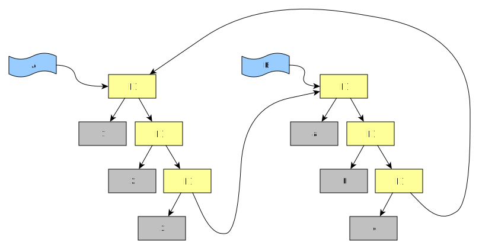

# Examples for the Prolog predicate _maplist/3_ 

- This is a companion page for the SWI-Prolog manual page on [`maplist/3`](https://eu.swi-prolog.org/pldoc/doc_for?object=maplist/3).
- For examples about `maplist/2` (1 goal, 1 list to verify) see [this page](maplist_2_examples.md)
- For examples about `maplist/4` (1 goal, 3 lists to relate) see [this page](maplist_4_examples.md)

- [About](#name)
- [Form of the two passed lists](#form_of_the_two_passed_lists)
   - [Both lists are of known length](#both_lists_are_of_known_length)
   - [One of the lists is of unspecified length](#one_of_the_lists_is_of_unspecified_length)
   - [Both lists are open lists](#both_lists_are_open_lists)
   - [How about cyclic lists?](#cyclic_lists)
- [Applications of _maplist/3_](#application_of_maplist_3)
   - [Computing a function of 1 variable](#compute_function_of_1_variable)
   - [Testing" or "Accepting" a relation between the pairwise elements of two lists](#accepting_pairwise_relation)
   - [Tagging of list elements](#tagging_of_list_elements)

## About<a name="about"></a>

Here we list a few examples for the predicate [`maplist/3`](https://eu.swi-prolog.org/pldoc/doc_for?object=maplist/3) 
from [library(apply)](https://eu.swi-prolog.org/pldoc/man?section=apply) as run with SWI-Prolog.

> `library(apply)`: _"This module defines meta-predicates that apply a predicate on all members of a list."_

We use [SWI-Prolog](https://www.swi-prolog.org/) throughout. However, `maplist/N`, while not in the [ISO standard](https://en.wikipedia.org/wiki/Prolog#ISO_Prolog), at least [not yet](http://www.complang.tuwien.ac.at/ulrich/iso-prolog/prologue), is a common predicate ([GNU Prolog](http://gprolog.org/manual/gprolog.html#sec223), [SICStus Prolog](https://sicstus.sics.se/sicstus/docs/4.3.0/html/sicstus/lib_002dlists.html), [ECLiPSe](https://eclipseclp.org/doc/bips/lib/lists/index.html)). Other Prologs _should_ work identically. 

We also use the [`library(yall)`](https://www.swi-prolog.org/pldoc/man?section=yall) lambda notation imported from [Logtalk](https://logtalk.org/). This _is_ specific to SWI-Prolog.

In SWI-Prolog, in order for structures not to be elided at with ellipses ("`|...`"), but instead printed in full, you may have to first call:

```none
?-
set_prolog_flag(answer_write_options,[max_depth(0)]).
```

The description for [`maplist/3`](https://eu.swi-prolog.org/pldoc/doc_for?object=maplist/3) says:

> `maplist(:Goal, ?List1, ?List2)`
>
> _As maplist/2, operating on pairs of elements from two lists._

Thus you have two lists, _List1_ and _List2_, and `maplist/3` will call the _Goal_ for pairwise associations of list elements:

```none
List1           :  [  L1A    ,    L1B    ,    L1C    ,    L1D    , ...  
List2           :  [  L2A    ,    L2B    ,    L2C    ,    L2D    , ...  
                        
Goal called for :  (L1A,L2A) , (L1B,L2B) , (L1C,L2C) , (L1D,L2D) , ...
```

The standard application is similar to the one corresponding to the
[`map`](https://en.wikipedia.org/wiki/Map_(higher-order_function)) operation available in functional or imperative
programming languages. Here, we apply a predicate `p/2` to the pair of list elements, thus verifying the pair
or (further) instantiating one or the other member of the pair, or further instantiating both members of the pair.

**_Goal_ must either be:**

- a predicate taking two arguments more than indicated on last position (a "Prolog closure"):
   - `foo` to be called as `foo(Element1,Element2)`
   - `foo(bar)` to be called as `foo(bar,Element1,Element2)`,
   - `foo(bar,baz)` to be called as `foo(bar,baz,Element1,Element2)`, etc... 
- a lambda expression taking two arguments
   - if one uses `library(yall)`, which comes with SWI-Prolog, this would look like the following: `[Element1,Element2]>>foo(Element1,Element2)`
   - or one can use [pack `lambda`](https://www.swi-prolog.org/pack/file_details/lambda/prolog/lambda.pl) (but I don't know anything about it)

**Additionally:**

- both lists must be the same length (or one of the list must be open, i.e. be terminated not with `[]` but with an unbound variable)
- `Goal` must succeed at every location.

This is fine:

```none
?-
maplist([X,Y]>>(true),[1,2],[1,4]).

true.
```

Unequal length of lists means failure:

```
?-
maplist([X,Y]>>(true),[1,2],[1]).

false.
```

So does a failing goal:

```
?- 
maplist([X,Y]>>(false),[1,2],[1,4]).

false.
```

Side-effects will occur before failure hits. It's not transactional (unless one buffers the output for 
later emission of course, an approach that should be supported):

```
?- 
maplist([X,Y]>>((Y is 2*X),
        format("~q\n",[(X,Y)])),
        [0,1,2,3,4,5,6,7,8,9,10],
	[0,2,A]).
	   
0,0
1,2
2,4
false.
```

**`maplist/3` does not check that list lengths are equal across all list arguments*

Instead it fails it it hits the end of one of the list. This is not very nice, but avoid having
to perform costly checks down the list backbones. Instead, `maplist/3` is optimistic and 
hopes the caller has ensured the lists are of equal length:

Define:

```
mapfun(X,Y) :- format("~q ~q\n",[X,Y]).
```

Then on can see that three pairs are processed until failure occurs:

```
?-
maplist(
   mapfun,   
   [0,1,2,3,4],
   [a,b,c]).

0 a
1 b
2 c
false.
```

This is similar to the behaviour of `foldl/5`

Define:

```
foldfun(E1,E2,FL,TR) :-
   atomic_list_concat([E1,E2,FL],TR),
   format("~q ~q ~q ~q\n",[E1,E2,FL,TR]).
```

Again, three pairs are processed until failure occurs:

```
?-
foldl(
   foldfun,
   [0,1,2,3,4],
   [a,b,c],
   start,
   Final).

0 a start '0astart'
1 b '0astart' '1b0astart'
2 c '1b0astart' '2c1b0astart'
false.
```

**`maplist/3` with a non-list argument leads to failure**

```none
?- 
maplist(
   ([X,Y]>>true,format("~w\n",[(X,Y)])),
   [a,b,c],
   1).

false.
```

```none
?- 
maplist(
   ([X,Y]>>true,format("~w\n",[(X,Y)])),
   1,
   [a,b,c]).

false.
```

Instead of lists, an integer is passed as argument 2 or argument 3. `maplist/3` _could_ throw a `domain_error` 
or `type_error` exception. Instead, it does something which is related to steadfastness (I'm not quite
sure that this _is_ steadfastness):

**Steadfastness**

A "steadfast" predicate is one that behaves _the same_ whether its argument that will take up output
is, at call time, a (partially) instantiated term or an unbound variable. A partially instantiated term
may, however lead to failure. 

An alternative view is that, if the argument for output is a (partially) instantiated term at call time,
a steadfast predicate behaves as if the argument had been uninstantiated, the output were computed 
and then that output were unified with the (partially) instantiated term when all is done.

## Form of the two passed lists<a name="form_of_the_two_passed_lists"></a>

### Both lists are of known length<a name="both_lists_are_of_known_length"></a>

```none
?- 
maplist(
   [X,Y]>>format("~q ~q\n",[X,Y]),
   [0,1,2,3],
   [a,b,c,d]).
   
0 a
1 b
2 c
3 d
true.
```

Check that a relation holds between the pairwise list elements:

```none
?- 
maplist(
   [X,Y]>>(Y is X*X),
   [0,1,2,3],
   [0,1,4,9]).
true.
```

The lists may contain unbound variables. We 
use [`#=`](https://eu.swi-prolog.org/pldoc/doc_for?object=%23%3D%20/%202) (must-be-equal constraint between variables) 
to make things interesting:

Load constraint statisfaction over finite domains:

```none
?- use_module(library(clpfd)). 
```

Then:

```none
?- 
maplist(
   [X,Y]>>(Y#=X*X),
   [0,1,2,3],
   [A,B,C,D]).

A = 0,
B = 1,
C = 4,
D = 9.
```

```none
?- 
maplist(
   [X,Y]>>(Y#=X*X),
   [0,1,C,D],
   [A,B,4,9]).

A = 0,
B = 1,
C in -2\/2,
D in -3\/3.
```

A simpler relation between between the pairs `(I1,I2)` than `(I2 = I1²)` is for example `(I1 = I2-1)`:

```none
?- 
maplist(
   [X,Y]>>(X#=Y-1), 
   [0,A,2], 
   [B,1,3]).

A = 0,
B = 1.
```

Alternatively:

```none
?- 
maplist(
   [X,Y]>>succ(X,Y), 
   [0,A,2], 
   [B,1,3]).

A = 0,
B = 1.
```

Or lambda-less (and harder to read?)

```none
?- maplist(
   succ, 
   [0,A,2],
   [B,1,3]).

A = 0,
B = 1.
```

### One of the lists is of unspecified length<a name="one_of_the_lists_is_of_unspecified_length"></a>

Create a list of integers, then use `maplist/3` to apply a function to this. If
the other list was an unbound variable (so not even known to be a list), it is set
to a list of length equal to the length of the first list:

Compute cubes, going from list argument one to list argument two, using CLP(FD):

```none
?- 
maplist(
   [X,Y]>>(Y #= X*X*X),
   [0,1,2,3,4,5],
   ListB).

ListB = [0,1,8,27,64,125].
```

Compute cubic roots, going from list argument two to list argument one:

```none
?-
maplist(
   [X,Y]>>(Y #= X*X*X),
   ListA,
   [0,1,8,27,64,125]).

ListA = [0,1,2,3,4,5].
```

### Both of the lists are unbound variables<a name="both_of_the_lists_are_unbound_variables"></a>

It is possible. Here we get a pair of ever-growing lists on backtracking:

```none
?- 
maplist(
   [X,Y]>>(random_between(1,5,X),Y is X*X),
   ListA,
   ListB).
ListA = ListB, ListB = [] ;
ListA = [4],  ListB = [16] ;
ListA = [4,5], ListB = [16,25] ;
ListA = [4,5,1], ListB = [16,25,1] ;
ListA = [4,5,1,2], ListB = [16,25,1,4] ;
...
```

We can tell `maplist/3` to stop by using `maplist/4`, giving a fixed length list as
"dummy argument":

```none
?- maplist(
       [X,Y,_]>>(random_between(1,5,X),Y is X*X),
       ListA,
       ListB,
       [_,_,_,_,_]).  % give me 5
ListA = [5,3,2,1,5],
ListB = [25,9,4,1,25].
```

If you forget the third argument to the lambda expression, which must be there because you are now 
working with `maplist/4`, the compiler says:

```
ERROR: Unknown procedure: (',')/3
ERROR:   However, there are definitions for:
ERROR:         (',')/2
```

That's confusing! This need a better syntax check before the lambda expression is replaced with base Prolog.

### One of the lists is an open list, and the other of known length<a name="one_of_the_lists_is_an_open_list"></a>

An _open list_ is a term which starts off like a list, but then ends in an unbound variable (so it may still become 
a "real list, aka. _proper_ or _closed_ list): `[1,2,3|_]`. An unbound variable itself can be regarded as an extreme
open list. 

`maplist/3` will adjust the prefix length and close the list with a `[]`:

This is not really different from the case of having unbiund variables as list. It's just that we may have list prefixes:

Exactly as before:

```none
?-
maplist(
   [X,Y]>>(random_between(1,5,X),Y is X*X),
   ListA,
   ListB).

ListA = ListB, ListB = [] ;
ListA = [5],
ListB = [25] ;
ListA = [5,4],
ListB = [25,16] ;
ListA = [5,4,5],
ListB = [25,16,25] ;
ListA = [5,4,5,4],
ListB = [25,16,25,16] ;
```

Give the first list a prefix. The second list, an unbound variable, is extended to cover that:

```none
?-
maplist(
   [X,Y]>>((var(X)->random_between(1,5,X);between(1,5,X)),Y is X*X),
   [3,2,1,4|ListA],
   ListB).
ListA = [], ListB = [9,4,1,16] ;
ListA = [3], ListB = [9,4,1,16,9] ;
ListA = [3,5], ListB = [9,4,1,16,9,25] ;
ListA = [3,5,3], ListB = [9,4,1,16,9,25,9] ;
ListA = [3,5,3,2], ListB = [9,4,1,16,9,25,9,4] ;
ListA = [3,5,3,2,5], ListB = [9,4,1,16,9,25,9,4,25] ;
...
```

### Both lists are open lists<a name="both_lists_are_open_lists"></a>

Maplist generates possible solutions with longer and longer lists on backtracking:

```none
?-
maplist(
   [X,Y]>>((var(X)->random_between(1,5,X);between(1,5,X)),Y is X*X),
   [3,2|M1],
   [9,4|M2]).
   
M1 = M2, M2 = [] ;
M1 = [3], M2 = [9] ;
M1 = [3,1], M2 = [9,1] ;
M1 = [3,1,4], M2 = [9,1,16] ;
M1 = [3,1,4,2], M2 = [9,1,16,4] ;   
...
```

When developing code as above, one may get unexpected failures. In that case, passing to `maplist/4`
and storing the reified truth values in a third list can help:

Define:

```none
reify(Goal,TruthValue) :-
   Goal -> TruthValue=true ; TruthValue=false.
```

Then one notices two problem points in the prefixes of the open lists:

```none
?-
maplist(
   [X,Y,TV]>> reify( ((var(X)->random_between(1,5,X);between(1,5,X)),Y is X*X) , TV ),
   [3,2,1,3,1,5|M1],
   [9,4,3,5,1,25|M2],
   TVs).

M1 = M2, M2 = [], TVs = [true,true,false,false,true,true] ;
M1 = [5], M2 = [25], TVs = [true,true,false,false,true,true,true] ;
M1 = [5,5], M2 = [25,25], TVs = [true,true,false,false,true,true,true,true] ;
M1 = [5,5,3], M2 = [25,25,9], TVs = [true,true,false,false,true,true,true,true,true] ;
...
```

### How about cyclic lists?<a name="cyclic_lists"></a>

`maplist/N` will go on ... forever!

Consider these mutually cyclic lists:

```none
A=[1,2,3|B],
B=[a,b,c|A]
```



Then:

```none
?- A=[1,2,3|B],
   B=[a,b,c|A],
   maplist([X,Y]>>format("~q\n",[(X,Y)]),A,B).
   
a,1
b,2
c,3
1,a
2,b
3,c
a,1
b,2
c,3
...... ad infinitum
```

## Applications of _maplist/3_<a name="application_of_maplist_3"></a>

### Computing a function of 1 variable<a name="compute_function_of_1_variable"></a>

This is rather straightforward. Just constrain the elements of the second list to the results of a 
function applied to items of the first list.

For example, apply the successor predicate [`succ/2`](https://eu.swi-prolog.org/pldoc/doc_for?object=succ/2)
to relate the pairwise items of two lists. Unlike `X is Y+1`, `succ/2` can be run "forwards" and "backwards".

Helper: Use `foldl/4` to create a list of integers

```none
create_list_of_integers(Length,Offset,List) :- 
   length(List,Length),                % "make sure" that Lout is a list of length "Length"
   foldl([Element,FromLeft,ToRight]>>(Element=FromLeft,succ(FromLeft,ToRight)),List,Offset,_). 
```

And so:

```none
?- 
create_list_of_integers(6,0,ListIn),
maplist(succ,ListIn,ListOut).

ListIn = [0,1,2,3,4,5],
ListOut = [1,2,3,4,5,6].

?- 
create_list_of_integers(6,1,ListIn),
maplist(succ,ListOut,ListIn).

?-
create_list_of_integers(6,1,ListIn),
maplist(succ,ListOut,ListIn).

ListIn = [1,2,3,4,5,6],
ListOut = [0,1,2,3,4,5].
```

Alternatively, use lambda notation from `library(yall)`; you can then rearrange arguments:

```none
?- 
create_list_of_integers(6,0,ListIn),
maplist([I,O]>>succ(I,O),ListIn,ListOut).

ListIn = [0,1,2,3,4,5],
ListOut = [1,2,3,4,5,6].

?- 
create_list_of_integers(6,1,ListIn),
maplist([I,O]>>succ(O,I),ListIn,ListOut).

ListIn = [1,2,3,4,5,6],
ListOut = [0,1,2,3,4,5].
```

### "Testing" or "Accepting" a relation between the pairwise elements of two lists<a name="accepting_pairwise_relation"></name>

```none
?- 
create_list_of_integers(6,0,ListIn),
maplist([I,O]>>succ(I,O),ListIn,ListOut),
format("Now I have two fully grounded lists ~q and ~q\n",[ListIn,ListOut]),
maplist([I,O]>>succ(I,O),ListIn,ListOut),
format("Pairwise items of those lists are indeed related by the succ/2 predicate!").

Now I have two fully grounded lists [0,1,2,3,4,5] and [1,2,3,4,5,6]
Pairwise items of those lists are indeed related by the succ/2 predicate!
ListIn = [0,1,2,3,4,5],
ListOut = [1,2,3,4,5,6].
```

### Tagging of list elements<a name="tagging_of_list_elements"></a>

A special case of "applying a function to list items" is _tagging_: adorning terms with functions symbols,
or removing the function symbols. This is done to allow better pattern matching during execution, or
carry additional information about a given term, e.g. whether it's indeed an integer.

Define:

```none
tagger(X,int(X))   :- integer(X),!.
tagger(X,var(X))   :- var(X),!.
tagger(X,atom(X))  :- atom(X),!.
tagger(X,other(X)).

list_taggger(List,TaggedList) :- 
   maplist([Element,Tagged]>>tagger(Element,Tagged),List,TaggedList).
```

Then:

```none
?- 
list_taggger([1,foo,bar,3.04,X],TaggedList).

TaggedList = [int(1), atom(foo), atom(bar), other(3.04), var(X)].
```


## REVIEW TILL HERE ##


**Here is a less simply example**

```logtalk
% This is a "defaulty" representation. There is no way to distinguish the cases by
% looking at the head if the second argument is fresh. A test must be made in the body.
% That's slow! Note the `!` to commit to the selected branch. 

tag_it(X,int(X))    :- integer(X),!.
tag_it(X,string(X)) :- string(X),!.
tag_it(X,fresh(X))  :- var(X),!.
tag_it(X,atom(X))   :- atom(X),!.
tag_it(X,alien(X)).

% Once a term has been tagged, the correct clause for `process/1` can be chosen at once.
% That's fast!

process(int(X),Y)    :- format("[integer ~q]",[X]), Y is 2*X.
process(string(X),Y) :- format("[string ~q]",[X]), string_concat(X,X,Y).
process(fresh(X),Y)  :- format("[fresh variable ~q]",[X]), Y = [X,X].
process(atom(X),Y)   :- format("[atom ~q]",[X]), atom_concat(X,X,Y).
process(alien(X),Y)  :- format("[alien ~q]",[X]), with_output_to(string(Y),format("~q~q",[X,X])).
```

And so:

```logtalk
% Use maplist to tag them and untag them again

?- maplist(tag_it,[1,2,a,V,f(b,g)],Tagged),maplist(process,Tagged,Untagged).
[integer 1][integer 2][atom a][fresh variable _6590][alien f(b,g)]
Tagged = [int(1), int(2), atom(a), fresh(V), alien(f(b, g))],
Untagged = [2, 4, aa, [V, V], "f(b,g)f(b,g)"].
```

### Verifying the contract of predicates

As for `maplist/2`, `maplist/3` can be used to check that the caller respects the predicate's
[contract](https://en.wikipedia.org/wiki/Design_by_contract) . Here is a simple check to make sure
two lists have the same length. If one of the lists is a fresh variable, it 
is constrained to a new list with as many fresh variables as are in the other:

```logtalk
some_predicate(L1, L2) :-
   ((var(L1),var(L2)) -> fail; true),
   maplist([_,_]>>true,L1,L2),
   format("Contract fulfilled on entry!").
```

And so:

```logtalk
?- some_predicate(L1,L2).
false.

?- some_predicate(L1,[1,2,3]).
Contract fulfilled on entry!
L1 = [_17306, _20144, _20222].

?- some_predicate([a,b,c],[1,2,3]).
Contract fulfilled on entry!
true.
```

### An exercise from Stack Overflow

From [How to sum up multiple lists in Prolog](https://stackoverflow.com/questions/64575128/how-to-sum-up-multiple-lists-in-prolog)

Suppose you have a list of (sub)lists of numbers. You want to sum over each (sub)list individually, obtaining a list of sums over the (sub)lists:

As done in [TDD](https://en.wikipedia.org/wiki/Test-driven_development), we can write 
the [`plunit`](https://eu.swi-prolog.org/pldoc/doc_for?object=section(%27packages/plunit.html%27)) test cases first:

```logtalk
:- begin_tests(sum_over_sublists).

test("empty list of lists",true(R == [])) :-
   sum_over_sublists([],R).

test("all sublists contain one value",true(R == [1,2,3])) :- 
   sum_over_sublists([[1],[2],[3]],R).
   
test("one sublist is empty",true(R == [1,0,3])) :- 
   sum_over_sublists([[1],[],[3]],R).
   
test("standard case #1",true(R == [6,15,24])) :- 
   sum_over_sublists([[1,2,3],[4,5,6],[7,8,9]],R).
   
test("standard case #2",true(R == [10,14,18])) :-
   sum_over_sublists([[1,2,3,4],[2,3,4,5],[3,4,5,6]],R).

:- end_tests(sum_over_sublists).
```

Here, one can apply `maplist/3` to iterate over the the list of (sub)lists. Addition for each sublist is
performed by [`foldl/4`](https://eu.swi-prolog.org/pldoc/doc_for?object=foldl/4). 
[`library(yall)`](https://eu.swi-prolog.org/pldoc/man?section=yall)
notation is used to define new predicates inline.

For good measure, we also check the passed arguments using [`must_be/2`](https://eu.swi-prolog.org/pldoc/doc_for?object=must_be/2)

```
entry_checks(ListOfSublists,ListOfSums) :-
   must_be(list(list(number)),ListOfSublists), % throws on problem
   (var(ListOfSums) -> true ; must_be(list)).  % throws on problem

sum_over_sublists(ListOfSublists,ListOfSums) :-
   entry_checks(ListOfSublists,ListOfSums), 
   maplist(
      ([Sublist,Sum]>>
          (foldl(
              [AccumIn,X,AccOut]>>(AccOut is AccumIn + X),
              Sublist,
              0,
              Sum))),
      ListOfSublists,
      ListOfSums).
```

This can be more extensively written as

```
sum_over_sublists(ListOfSublists,ListOfSums) :-
   entry_checks(ListOfSublists,ListOfSums), 
   maplist(
      p2,              % p2 will be called with 2 parameters, an element from each list
      ListOfSublists,
      ListOfSums).

p2(Sublist,Sum) :-
   foldl(
      p3,              % will be called with 3 parameters (see below)
      Sublist,
      0,
      Sum).

p3(AccumIn,X,AccOut) :-
   AccOut is AccumIn + X.
```

## TODO: maplist_relax/3

TODO: Write a maplist that can deal with lists of differing length, and stops with success after as many list pairs as possible have been processed. 

Similarly, maplist_relax/3 should not fail in it entirety if the goal fails, but just stop processing. 

(In that case, what happens on backtracking?)

## Some Software Archeology:

SWI Prolog's source for [apply.pl](https://github.com/SWI-Prolog/swipl-devel/blob/master/library/apply.pl) 
gives the following implementation:

````
%!  maplist(:Goal, ?List1, ?List2)
%
%   As maplist/2, operating on pairs of elements from two lists.

maplist(Goal, List1, List2) :-
    maplist_(List1, List2, Goal).

maplist_([], [], _).
maplist_([Elem1|Tail1], [Elem2|Tail2], Goal) :-
    call(Goal, Elem1, Elem2),
    maplist_(Tail1, Tail2, Goal).
````    
    
Picat and B-Prolog take their `maplist/3` from [Edinburgh DEC-10 Prolog](http://www.picat-lang.org/bprolog/publib/index.html), the code from mid-80s in file [applic.pl](http://www.picat-lang.org/bprolog/publib/applic.html) is:

````
%   maplist(Pred, OldList, NewList)
%   succeeds when Pred(Old,New) succeeds for each corresponding
%   Old in OldList, New in NewList.  In InterLisp, this is MAPCAR. 
%   It is also MAP2C.  Isn't bidirectionality wonderful?

maplist(_, [], []).
maplist(Pred, [Old|Olds], [New|News]) :-
	apply(Pred, [Old,New]),
	maplist(Pred, Olds, News).
```` 
 
For SICStus Prolog 4.3.0, [this page](https://sicstus.sics.se/sicstus/docs/4.3.0/html/sicstus/lib_002dlists.html)
says `maplist/3` "could be defined as":

```` 
maplist(Pred, Xs, Ys) :-
   (   foreach(X,Xs),
       foreach(Y,Ys),
       param(Pred)
      	do  call(Pred, X, Y)
   ).
```` 
