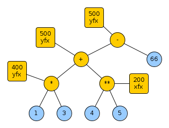

# Operators

Some accompanying notes on the pages concerning [operators](https://eu.swi-prolog.org/pldoc/man?section=operators) from the SWI-Prolog manual.

Code to list the operators currently configured in the system: [`list_ops.pl`](code/list_ops.pl)

## Intro

The goal of operators are to **support syntax**: They tune the parser so that you can write your expresssion (and read your expressions) more fluently
than would otherwise be possible:

Instead of

`+(*(4,5),6)` 

you can write

`4*5 + 6`

This brings an interesting bag of complexity to a Prolog parser: The parser must be aware of what 
operators are in effect at any current line to be able to properly parse it. This is why a "grammar for Prolog" won't do.

Operators say nothing about what they mean. What they mean depends on some processing predicate that is fed
the term that has been built from an expression featuring operators.

For example:

You may have the following expression (which is, at this point just a string) built using operators (in this case, the usual arithmetic operators):

```
1*3+4**5-66
```

As the operators `*`, `+`, `**`, `-` have been defined, the above string can be parsed into a term, and then 
printed using [`write_canonical/1`](https://eu.swi-prolog.org/pldoc/man?predicate=write_canonical%2f1).

```
?- 
read_term_from_atom('1*3+4**5-66', X, []),    % parse the text into a term, and bind the variable X to that term 
write_canonical(X).                           % write the term structure in canonical format
```

The above is just a roundabout way of doing the following, where parsing of `1*3+4**5-66` is done implicitly by the program text parser:

```
?- 
X = 1*3+4**5-66,                              % parse the text into a term, and bind the variable X to that term
write_canonical(X).                           % write the term structure in canonical format
```

In both cases, we get:

```
-(+(*(1,3),**(4,5)),66)
X = 1*3+4**5-66.
```

Which is the following parse tree written in prefix notation:


Note that the Prolog reader/parser has to make a decision on how to cut up the string `1*3+4**5-66` into distinct tokens: 

```
1*3+4**5-66  -> 1 * 3 + 4 ** 5 - 66
```

These can then be assembled into a parse tree.
Sometimes this tokenization does not do what one wants. Then parentheses need to be used or separating whitespace needs to be added:

The first token here is `-2`:

```
?- 
X = -2**66,
write_canonical(X).

**(-2,66)
X = -2**66.
```

You may want `-(2)` (the token `-`, mapped to an unary operator prefixing the parenthesized token `2`). 

```
?- 
X = -(2)**66,
write_canonical(X).

**(-(2),66)
X =  (- 2)**66.
```

Reasonably, `-(2)` reduces to the integer `-2` when passed through `is`:

```
?- 
X is  (-(2))**66.
X = 73786976294838206464.
```

You may also want to see the `-` in front of the `**` subexpression:

``` 
?- 
X = - 2**66,
write_canonical(X).

-(**(2,66))
X = - 2**66.
```

So, what do we do with the term `-(+(*(1,3),**(4,5)),66)`, which is a parse tree, with operators (and operands) 
as tree nodes? Well, for example, one can feed it to an arithmetic expression evaluation engine made available via `is`. 
But that is outside of the scope of "operators".

## The `op/3` command

The [`op/3`](https://www.swi-prolog.org/pldoc/doc_for?object=op/3) command, `op(+Precedence, +Type, :Name)` takes:

   - **Precedence**: A numeric value between 0 and 1200. For clarity let's use the designation 
     **Precedence Value** for the numeric value instead of **Precedence** because the two vary inversely: 
     _The higher the precedence value, the lower the precedence._ If you build the parse tree bottom-up, operators
     with low precedence value (and thus high precedence) glom onto their neighboring tokens first they are moved "to the leaves" 
     of the parse tree. On the other hand. operators with high precedence value are left for late
     in parse tree construction, they are moved "to the root" of the parse tree. 
   - **Name**: The atom designating the operator, which becomes the "functor name" of respective the node in the parse tree.
   - **Type**: Indication to the parser regarding:
        - Whether this is a prefix operator, a postfix operator or an infix operator ; 
        - How to disambiguate a sequence of non-parenthesized operators with the same precedence value.
     
Note that all of this is only relevant if an expression is unparenthesized and thus ambiguity arises as to how the parse
tree should be structured. Once a subtree has been built from an operator and its one or two operands, the operand's precedence
value becomes irrelevant and can be considered to be 0. Evidently if a subexpression is parenthesized, there is also no
ambiguity above that parenthesized subexpression. So it also can be given precedence value 0.

Here is a parsing example of the expression of earlier. Subtrees are created, with operators having highest
precedence (lowest precedence value) handled first. An ambiguity arises for the operators `+` and `-`, both
at precedence level 500. This is resolved by noticing that both operators have type `yfx` which means that 
these operators can indeed co-exist in expression on the same level and then shall be considered left-associative.
The final parse tree follows.



## op types explained!<a name="op_types_explained"></a>

The following types exist:   
   
   - **Postfix operator**: 
      - **yf**: This operator can appear in a sequence of unparenthesized postfix operators that have the same precedence value and also type `yf`.
              In particular, it can form unparenthesized repeats, as in `g(x) f f f`. The leftmost unparenthesized prefixed expression can
              be composed of an operator of the same precedence value. The implied parenthetization is "the leftmost subexpression is innermost".              
              Of course, the leftmost prefixed expression can always be based on a higher-precedence unary or binary operator or be a 
              subexpression of precedence value 0, in particular it can be parenthesized. There is no ambiguity to be resolved there.
      - **xf**:  This operator cannot appear in a sequence of unparenthesized postfix operators that have the same precedence value.
              In particular, it does not allow forming unparenthesized repeats. The postfixed subexpression **must be** of lower precedence value
              (which happens in particular if it is parenthesized).
   - **Prefix operator**:   
      - **fy**: This operator can appear in a sequence of unparenthesized prefix operators that have the same precedence value and also type `fy`.
              In particular, it can form unparenthesized repeats, as in `f f f g(x)`. The rightmost unparenthesized prefixed expression can
              be composed of an operator of the same precedence value. The implied parenthetization is "the rightmost subexpression is innermost".              
              Of course, the rightmost prefixed expression can always be based on a higher-precedence unary or binary operator or be a 
              subexpression of precedence value 0, in particular it can be parenthesized. There is no ambiguity to be resolved there.
      - **fx**: This operator cannot appear in a sequence of unparenthesized prefix operators that have the same precedence.
              In particular, it does not allow forming unparenthesized repeats. The prefixed subexpression **must be** of lower precedence value
              (which happens in particular if it is parenthesized).
   - **Infix operator**:   
      - **xfx**: This operator cannot appear in an expression with other operators that have the same precedence value, in particular, in 
               expression where there are several `f`. It is **non-associative**.  Add parentheses as needed.
      - **xfy**: This operator can appear in an unparenthesized expression with other operators that have the same precedence value and also type
               `xfy` (including `f` itself). The operator (and its neighboring operators) are considered **right-associative**.
               The expression is implicitly parenthesized and the parse tree built accordingly.
      - **yfx**: This operator can appear in an unparenthesized expression with other operators that have the same precedence value and also type
               `yfx` (including `f` itself). The operator (and its neighboring operators) are considered **left-associative**. 
               The expression is parenthesized and the parse tree built accordingly.              

## Examples for prefix operators

Define the following, using some interesting characters from the
[Unicode Math pages](https://en.wikipedia.org/wiki/Mathematical_operators_and_symbols_in_Unicode):

```
op(500,fy,⊓).
op(500,fy,∆).
op(400,fy,⊞).
```

### Type _fy_ 

Unparenthesized repeats are allowed for ⊓, although whitespace is needed for proper tokenization:

```
?- 
X = ⊓ ⊓ ⊓ ⊓g(x), write_canonical(X).

⊓(⊓(⊓(⊓(g(x)))))
X = ⊓ ⊓ ⊓ ⊓g(x).
```

Mixing with a prefix operator having the same precedence value and type is ok:

```
?- 
X = ⊓ ∆ ∆ ⊓g(x), write_canonical(X).

⊓(∆(∆(⊓(g(x)))))
X = ⊓ ∆ ∆ ⊓g(x).
```

Mixing with a prefix operator having lower precedence value does not work:

```
?- 
X = ⊓ ∆ ⊞ ⊓g(x), write_canonical(X).

ERROR: Syntax error: Operator priority clash
```

You need to parenthesize:

```
?- 
X = ⊓ ∆ ⊞ (⊓g(x)), write_canonical(X).

⊓(∆(⊞(⊓(g(x)))))
X = ⊓ ∆ ⊞ (⊓g(x)).
```

Try composing with `+`, which has precedence value 500 and type `yfx`:

```
?- 
X = ⊓ ⊓ 4 + 5, write_canonical(X).

+(⊓(⊓(4)),5)
X = ⊓ ⊓4+5.
```

```
?- 
X = ⊓ ⊓ (4 + 5), write_canonical(X).

⊓(⊓(+(4,5)))
X = ⊓ ⊓4+5.    % This looks like a bug though, that shouldn't be written this way
```

```
?- 
X = ⊓ ⊓4+5, write_canonical(X).

+(⊓(⊓(4)),5)
X = ⊓ ⊓4+5.
```

Try composing with `*`, which has precedence value 400 and type `yfx`: 

```
?- 
X = ⊓ ⊓ 4 * 5, write_canonical(X).

⊓(⊓(*(4,5)))
X = ⊓ ⊓4*5.
```

```
?- 
X = ⊓ ⊓ (4 * 5), write_canonical(X).

⊓(⊓(*(4,5)))
X = ⊓ ⊓4*5.
```

```
?- 
X = ⊓ ⊓4*5, write_canonical(X).

⊓(⊓(*(4,5)))
X = ⊓ ⊓4*5.
```

### Type _fx_

Let's try out `op(500,fx,⊔).`

Unparenthesized repeats are not allowed:

```
?- 
X = ⊔ ⊔ ⊔ g(x), write_canonical(X).

ERROR: Syntax error: Operator priority clash
```

Parenthesized repeats are of course ok:

```
?- 
X = ⊔(⊔(⊔ g(x))), write_canonical(X). 

⊔(⊔(⊔(g(x))))
X = ⊔ (⊔ (⊔g(x))).
```

## Examples for infix operators

Try these:

```
op(500,xfy,⊳).  % right-associative (for binary operators with the same precedence value)
op(500,yfx,⊲).  % left-associative (for binary operators with the same precedence value) 
op(500,xfx,⋂).  % non-associative
op(400,xfx,⋃).  % non-associative, lower precedence value (higher precedence)
```

### Type _xfx_

The non-associative operators work as expected:

```
?- 
X = aa ⋂ bb, write_canonical(X).

⋂(aa,bb)
X = aa⋂bb.
```

The ambinguity of several non-associative operators with the same precedence cannot be resolved:

```
?- 
X = aa ⋂ bb ⋂ cc.

ERROR: Syntax error: Operator priority clash
```

Parenthesize as needed then:

```
?- X = aa ⋂ (bb ⋂ cc), write_canonical(X).

⋂(aa,⋂(bb,cc))
X = aa⋂(bb⋂cc).


?- X = (aa ⋂ bb) ⋂ cc, write_canonical(X).

⋂(⋂(aa,bb),cc)
X =  (aa⋂bb)⋂cc.
```

It always works if the neighboring operators have lower precedence value:

```
?- X = aa ⋂ bb ⋃ cc, write_canonical(X).

⋂(aa,⋃(bb,cc))
X = aa⋂bb⋃cc.
```

```
?-
X = dd ⋃ aa ⋂ bb ⋃ cc, write_canonical(X).

⋂(⋃(dd,aa),⋃(bb,cc))
X = dd⋃aa⋂bb⋃cc.
```

### Type _xfy_

The right-associative operator works as expected:

```
?- 
X = aa ⊳ bb ⊳ cc ⊳ dd, write_canonical(X).

⊳(aa,⊳(bb,⊳(cc,dd)))
X = aa⊳bb⊳cc⊳dd.
```

Force it to associate on the left:

```
?- 
X = ((aa ⊳ bb) ⊳ cc) ⊳ dd, write_canonical(X).

⊳(⊳(⊳(aa,bb),cc),dd)
X =  ((aa⊳bb)⊳cc)⊳dd.
```

### Type _yfx_

Similarly for the left-associative operator:

```
?- 
X = aa ⊲ bb ⊲ cc ⊲ dd, write_canonical(X).

⊲(⊲(⊲(aa,bb),cc),dd)
X = aa⊲bb⊲cc⊲dd.
```

Force it to associate on the right:

```
?- 
X = aa ⊲ (bb ⊲ (cc ⊲ dd)), write_canonical(X).

⊲(aa,⊲(bb,⊲(cc,dd)))
X = aa⊲(bb⊲(cc⊲dd)).
```


