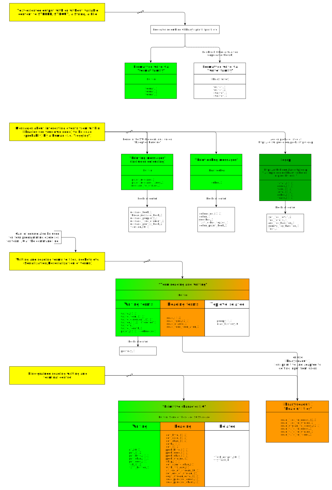

# Relevant predicates for generating output in Prolog (by order of importance)

_Work in progress_

- Some predicates are SWI-Prolog specific.
- Most of the text comes directly from the [SWI Prolog manual](https://www.swi-prolog.org/pldoc/doc_for?object=manual).
- There is one I missed writing details about: [library(debug): Print debug messages and test assertions](https://www.swi-prolog.org/pldoc/man?section=debug).
- This page is referenced from the comment section of [`format/2`](https://eu.swi-prolog.org/pldoc/doc_for?object=format/2)
- "I/O Commands" i.e. instructions that do not perform I/O when they are encountered but accumulate a sequence of operations in an
  accumulator, where the accumulator can be executed by some toplevel predicate later are extremely useful. This is often
  described as a Monad Structure (colloquially, "a monad") from Category Theory. I wonder whether it has ever been described
  as an application of [linear logic](https://plato.stanford.edu/entries/logic-linear/)? Would it help in this context? 🤔.
  Imlementation-wise, one should try to add it. 
- The fact that there are two version of output predicates, one taking a (mode +) stream and one not taking a stream, indicates that 
  there is something wrong in the approach. One should be able to associate a stream to a clause maybe. 🤔
  - There is [`with_output_to/2`](https://eu.swi-prolog.org/pldoc/doc_for?object=with_output_to/2) and the less
    generic [`with_output_to_chars/2`](https://eu.swi-prolog.org/pldoc/doc_for?object=with_output_to_chars/2)
    which captures all that is being written to the "current output" in the context of a goal and
    builds a list of chars or codes, a string or atom as result. Nice!
- Functionality for [here documents](https://en.wikipedia.org/wiki/Here_document) is provided by  
  SWI-Prolog's [`library(strings)`](https://www.swi-prolog.org/pldoc/man?section=strings) which is based on 
  [`library(quasi_quotations)`](https://eu.swi-prolog.org/pldoc/man?section=quasiquotations). 
- Some functionality can be found in [`library(lynx)`](https://www.swi-prolog.org/pldoc/doc/_SWI_/library/lynx/index.html), 
  but that library cannot be found directly via the manual (It think). I found it via Google. Maybe it's being retired?
- I wrote some simple predicates to justify text left/right/centrally too (doesn't
  everybody?): [justify.pl](https://github.com/dtonhofer/prolog_notes/blob/master/code/heavycarbon/strings/justify.pl).

# TL;DR

.

## Formatted write: "format family"

See chapter "[4.32.2 Format](https://eu.swi-prolog.org/pldoc/man?section=format-predicates)" of the SWI-Prolog documentation.

Corresponds to the C-library's `printf`, `fprintf`, etc.

The "format family" is not standardized nor mentioned in the Prolog ISO Standard!

We read:

> The format family of predicates is the most versatile and portable way to produce textual output
> (unfortunately not covered by any standard.)

> The "format family" was defined by [Quintus Prolog](https://quintus.sics.se/) and currently available 
> in many Prolog systems, although the details vary.

### Predicates

| Predicate | Description |
| :-------- | :---------- |
| [`format/1`](https://eu.swi-prolog.org/pldoc/doc_for?object=format/1) | Takes no arguments, just the format string, which must not contain any placeholders.<br>Actually calls `format/2` with the empty argument list. |
| [`format/2`](https://eu.swi-prolog.org/pldoc/doc_for?object=format/2) | Takes a list of arguments, or a single argument that is not a list and will be wrapped into a list.<br>**`format/x` is not "lenient"!**, that is:<br>If the number of arguments and the number of placeholders differ, an error is thrown.<br>(Until recently, more arguments than placeholders was accepted).<br>Additionally, an error is thrown if the type of the argument is such that the argument cannot be meaningfully used for a given placeholder. |
| [`format/3`](https://eu.swi-prolog.org/pldoc/doc_for?object=format/3) | Takes a list of arguments and an output target (which can be anything accepted by [`with_output_to/2`](https://eu.swi-prolog.org/pldoc/doc_for?object=with_output_to/2), in particular atoms or code-lists). |
  
Earlier versions defined `sformat/3` instead of `format/3`. These predicates have been moved to the library [`library(backcomp)`](https://www.swi-prolog.org/pldoc/doc/_SWI_/library/backcomp.pl).

### Placeholders

This family supports in-text 
["format placeholders"](https://en.wikipedia.org/wiki/Printf_format_string#Format_placeholder_specification) aka
"format specifiers". The SWI-Prolog documentation calls them "special sequences". 

They are introduced with the tilde character: `~n`, `~w` etc. 

_(For C-library `printf` and friends and Prolog's "writef family", placeholders are introduced
with the `%` character. Why and where did that particular change in convention from using `%` to using `~` arise?)_

Placeholders of the C-library `printf` are more extensive and feature-rich than those of `format/x`, in particular for formatting of numeric data. See these:

- [Java formatter string: java.util.Formatter of Java 13](https://docs.oracle.com/en/java/javase/13/docs/api/java.base/java/util/Formatter.html#syntax)
- [C library printf format specification](https://pubs.opengroup.org/onlinepubs/9699919799/functions/printf.html) (or at [Wikipedia](https://en.wikipedia.org/wiki/Printf_format_string))

The placeholders of the "format family" look as follows `~[numeric][:]flag` 

For a complete list of placeholders, see the description of [`format/2`](https://eu.swi-prolog.org/pldoc/doc_for?object=format/2).


| Placeholder | Description |
| ----------- | ----------- |
| `~` | Output the tilde itself.<br>`format("~~").` ▷ `~` |
| `a` | Output the next argument, which must be convertible to atom.<br>Strings and numerics are ok, a compound term causes an exception to be raised.<br>`format("~a",[a]).` ▷ `a`<br>`format("~a",["s"]).` ▷ `s` |
| `c` | Interpret the next argument as a character code and add it to the output. This argument must be a valid Unicode character code. Note that the actually emitted bytes are defined by the character encoding of the output stream and an exception may be raised if the output stream is not capable of representing the requested Unicode character. See [section 2.20.1](https://eu.swi-prolog.org/pldoc/man?section=encoding) for details. | `format("~c~c",[2020,0x2020]).` ▷ `ߤ†` |
| `d` | Output next argument as a decimal number. *It should be an integer*. If a numeric argument is specified, a dot is inserted "argument positions" from the right (useful for doing fixed point arithmetic with integers, such as handling amounts of money) (**Nah, not really**, for money a fixed-point decimal notation is needed. Prolog doesn't have that, but the non-standard [rational number atomic type](https://eu.swi-prolog.org/pldoc/man?section=syntax-rational-numbers) is a good fit). The colon modifier (e.g., `~:d`) causes the number to be printed according to the locale of the output stream. |

(TODO: More to follow)

### Escape sequences

C-style "backslash escapes" (commonly called "[escape sequences](https://en.wikipedia.org/wiki/Escape_sequences_in_C)") 
are supported. These are not the escapes sequences of the "writef family" but the ones understood by the C-library's
`printf` procedure. `format/x` likely calls the C library `printf` more or less directly, so one would expect this to be the case. However...

#### What exactly performs the escaping?

I'm not sure what the Prolog lexer does with the in-String escape sequences. Does `\uhhhh` in a String mean that:

- the codepoint for that character appears the resulting String in the compiled code (as is done in Java) or that
- the character sequence `\uhhhh` appears "as is" in the resulting String in the compiled code, to be interpreted by `format/2`? 

There is ambiguity here, and for some (all? most?) it seems to be the former, so these "escape sequences" are a
feature of the Prolog lexer, not of `format/x`. 

Let's test what happens with a String with escape sequences is transformed into an atom:

````
% Test unicode

?- S=">\u2200<", string(S), atom_string(A,S), atom(A), string_codes(S,C).
S = ">∀<",
A = >∀<,
C = [62, 8704, 60].

% Test hexadecimal

?- S=">\x5E<", string(S), atom_string(A,S), atom(A), string_codes(S,C).
S = ">^<",
A = >^<,
C = [62, 94, 60].

% Test apostrophe

?- S=">\'<", string(S), atom_string(A,S), atom(A), string_codes(S,C).
S = ">'<",
A = '>\'<',
C = [62, 39, 60].

% Test double quote

?- S=">\"<", string(S), atom_string(A,S), atom(A), string_codes(S,C).
S = ">\"<",
A = '>"<',
C = [62, 34, 60].

% Test newline

?- S=">\n<", string(S), atom_string(A,S), atom(A), string_codes(S,C).
S = ">\n<",
A = '>\n<',
C = [62, 10, 60].

````

So we should divide the "escape sequences" into two blocks:

- Those handled by Prolog lexer.
- Those handled by `format/x`.

#### Those handled by Prolog lexer

Here interpretation happens when you try it in code unrelated to `format/x`, as shown above.

|Seq.   | Outputs | Description |
| ------- | ------ |:--------------- |
|`\'` 	| 0x27 | Apostrophe or single quotation mark `'` | 
|`\"` 	| 0x22 | Double quotation mark `"` (but the target for this would be the Prolog source lexer, not `format/2`) | 
|`\\` 	| 0x5C | Backslash itself `\` | 
|`\a`   | 0x07 | BEL aka "beep" | 
|`\b`   | 0x08 | Backspace; erase previous character |
|`\e`   | 0x1B | Escape; should probably be followed by a special sequence that can be interpreted by the terminal emulation to set color for example |
|`\f`   | 0x0C | Formfeed page break |
|`\n` 	| 0x0A | Newline (see also [`nl/x`](https://www.swi-prolog.org/pldoc/doc_for?object=nl/0)) | 
|`\r` 	| 0x0D | Carriage return | 
|`\t` 	| 0x09 | Horizontal Tab | 
|`\v` 	| 0x09 | Vertical Tab | 
|`\`*n* |      | where *n* is a sequence of digits between 0 and 7; the character with *octal* code *n* is output (`\0` yields the NUL character). This escape sequence reads octal digits until it encounters a non-octoal-digit. Weird. |
| `\x`*h* |    | where *h* is a sequence of uppercase/lowercase hexdigits; the character with hexadecimal code *h* is output. This escape sequence reads hexdigits until it encounters a non-hexdigit. Weird. |
| `\u`*h* |    | where *h* is a sequence of exactly 4 hexdigits, a [16-bit UCS-2/UTF-16](https://en.wikipedia.org/wiki/Universal_Coded_Character_Set) code point; `\u2200` outputs the "forall sign", `∀`, for example. |
| `\U`*h* |    | where *h* is a sequence of exactly 8 hexdigits, a [32-bit UCS-4/UTF-32](https://en.wikipedia.org/wiki/UTF-32) code point. |
|`\?` NO! | 0x3F | Prints the `?` for C-library `printf` (it is used to avoid trigraphs), but SWI Prolog's lexer throws an error when it sees it. | 

**Those handled by `format/x`:**

It turns out there are none. Let's try to give to `format/1` the sequence `\n` "as is", by drilling through
the lexer level:

````
?- S=">\\n<", string(S), atom_string(A,S), atom(A), string_codes(S,C).
S = ">\\n<",
A = '>\\n<',
C = [62, 92, 110, 60].
````

So, here `format/1` actually sees `\n` ... but outputs it unmodified:

````
?- format(">\\n<").
>\n<
true.
````

#### "Escape sequences in atoms"

There is an additional page which explains the above in the context of atoms, as opposed to strings, but apparently 
is valid for both cases (which wouldn't be surprising):

[2.17.1.3 Character Escape Syntax](https://eu.swi-prolog.org/pldoc/man?section=charescapes)

> Within quoted atoms (using single quotes: `'<atom>'`), special characters are represented using escape sequences. 
> An escape sequence is led in by the backslash `\` character. The list of escape sequences is compatible with the
> ISO standard but contains some extensions, and the interpretation of numerically specified characters is slightly
> more flexible to improve compatibility.
> 
> Undefined escape characters raise a `syntax_error` exception.
>  
> Character escaping is only available if `current_prolog_flag(character_escapes, true)` is active (default).
>  See [`current_prolog_flag/2`](https://eu.swi-prolog.org/pldoc/man?predicate=current_prolog_flag/2).

And this paragraph alludes to the difference between what the lexer does and what `writef/2` would expect as escape sequences. Confusingly, `read/x` is introduced.

> Character escapes conflict with [`writef/2`](https://eu.swi-prolog.org/pldoc/man?predicate=writef/2) in two ways:
> 
> - `\40` (for example) is interpreted as "decimal 40" by
>   [`writef/2`](https://eu.swi-prolog.org/pldoc/man?predicate=writef/2), but as "octal 40" (decimal 32)
>   by [`read/x`](https://eu.swi-prolog.org/pldoc/man?predicate=read/1).
> - Also, the `writef/2` sequence `\l` is illegal. It is advised to use the more widely supported `format/[2,3]`
>   predicate instead. If you insist upon using `writef/2`, either switch character_escapes to false, or use
>   double `\\`, as in `writef('\\l')`.

#### Formatting hook triggered by "~"

See [4.32.3 Programming Format](https://eu.swi-prolog.org/pldoc/man?section=format-hook).

If a sequence `~c` (tilde, followed by some character) is found, the [`format/3`](https://eu.swi-prolog.org/pldoc/doc_for?object=format/3) and friends first check whether the user has defined a predicate to handle the format.

If not, the built-in formatting rules described by `format/x`, `writef/x` are used.

| Predicate | Description |
| :-------- | :---------- |
| [`format_predicate/2`](https://eu.swi-prolog.org/pldoc/doc_for?object=format_predicate/2) |  |
| [`current_format_predicate/2`](https://eu.swi-prolog.org/pldoc/doc_for?object=current_format_predicate/2) |  |


## Formatted write: "writef family" 

N.B.: **writef/x**, not **write/x**, which is the predicate for serializing out terms (see further below).

See chapter "[4.32.1 Writef](https://eu.swi-prolog.org/pldoc/man?section=writef)" of the SWI-Prolog documentation.

The "writef family" is not standardized nor mentioned in the Prolog ISO Standard!

We read:

> The "writef family" is compatible with [Edinburgh C-Prolog](http://www.softwarepreservation.org/projects/prolog/edinburgh/) and should be considered **deprecated**.

### writef family predicates

| Predicate | Description |
| :-------- | :---------- |
| [`writef/1`](https://eu.swi-prolog.org/pldoc/doc_for?object=writef/1)   |  |  
| [`writef/2`](https://eu.swi-prolog.org/pldoc/doc_for?object=writef/2)   | (page contains details)  |
| [`swritef/2`](https://eu.swi-prolog.org/pldoc/doc_for?object=swritef/2) |  |
| [`swritef/3`](https://eu.swi-prolog.org/pldoc/doc_for?object=swritef/3) |  |

### writef family escape sequences

As above, escape sequences are interpreted by the Prolog lexer first. Any escape sequences appearing in the string
of `writef/2` have already been interpreted when `writef/2` sees them, and they are those used by the C-library
(except for `\?`). The escape sequences used in practice are thus exactly the same as for `format/x`. 

In particular, at that level, `\%` is an unknown escape sequence and leads to an error:

````
?- writef("\%").
ERROR: Syntax error: Unknown character escape in quoted atom or string: `\%'
````

To drill through the Prolog lexer, one has to escape the backslash with a backslash:

````
?- writef(">\\%<").
>%<
true.
````

Does `writef/1` actually care about a sequence like `\n`?

````
?- writef(">\\n<").
>
<
true.
````

Contrary to `format/x`, it does!

So the escape sequences listed on the page of [writef/2](https://eu.swi-prolog.org/pldoc/doc_for?object=writef/2) 
may well be meaningful. In practice, it doesn't look they will be used much (but suppose the string comes in over
the network, not the terminal. Then they _will_ be used.)

### writef family placeholders

Placeholders are introduced with `%`, as is the C tradition.

For a list, see [writef/2](https://eu.swi-prolog.org/pldoc/doc_for?object=writef/2).

## Printing messages (logging)

See [4.11.4 Printing messages](https://eu.swi-prolog.org/pldoc/man?section=printmsg).

Anne Ogborn has a tutorial on [printing messages](http://www.pathwayslms.com/swipltuts/message/).

Corresponds to a logging library like [SLF4J](http://www.slf4j.org/) + [logback](http://logback.qos.ch/) or
[Apache log4j](https://logging.apache.org/log4j/2.x/) or
[java.util.logging](https://docs.oracle.com/en/java/javase/13/docs/api/java.logging/java/util/logging/package-summary.html).

(Note sure whether there is a "logging hierarchy" (a a tree of loggers that can be set to log or filter
messages or not by entire subtrees), "loggers" (configurable sinks attached to the nodes of the logging hierarchy) 
and "formatters" (specific formatting rules applicable to logger subtrees)).

The predicate [print_message/2](https://eu.swi-prolog.org/pldoc/man?predicate=print_message/2) is used to print 
a message term in a human-readable format.

The other predicates from this section allow the user to refine and extend the message system. A common usage
of [`print_message/2`](https://eu.swi-prolog.org/pldoc/man?predicate=print_message/2) is to print error messages
regarding exceptions.

- [print_message/2](https://eu.swi-prolog.org/pldoc/doc_for?object=print_message/2)
- [print_message_lines/3](https://eu.swi-prolog.org/pldoc/doc_for?object=print_message_lines/3)
- [message_hook/3](https://eu.swi-prolog.org/pldoc/doc_for?object=message_hook/3)
- [thread_message_hook/3](https://eu.swi-prolog.org/pldoc/doc_for?object=thread_message_hook/3)
- [message_property/2](https://eu.swi-prolog.org/pldoc/doc_for?object=message_property/2)
- [message_line_element/2](https://eu.swi-prolog.org/pldoc/doc_for?object=prolog%3Amessage_line_element/2)
- [message_prefix_hook/2](https://eu.swi-prolog.org/pldoc/doc_for?object=prolog%3Amessage_prefix_hook/2)
- [message_to_string/2](https://eu.swi-prolog.org/pldoc/doc_for?object=message_to_string/2)
- [version/0](https://eu.swi-prolog.org/pldoc/doc_for?object=version/0)
- [version/1](https://eu.swi-prolog.org/pldoc/doc_for?object=version/1)

In particular:

**[Printing from libraries](https://eu.swi-prolog.org/pldoc/man?section=libprintmsg)**

> Libraries should not use [`format/3`](https://eu.swi-prolog.org/pldoc/man?predicate=format/3) or other output
> predicates directly. Libraries that print informational output directly to the console are hard to use from 
> code that depend on your textual output, such as a CGI script. The predicates in
> "[Printing messages](https://eu.swi-prolog.org/pldoc/man?section=printmsg)"
> define the API for dealing with messages. The idea behind this is that a library that wants to provide information
> about its status, progress, events or problems calls
> [`print_message/2`](https://eu.swi-prolog.org/pldoc/man?predicate=print_message/2).
> The first argument is the level. The supported levels are described with
> [`print_message/2`](https://eu.swi-prolog.org/pldoc/man?predicate=print_message/2).
> Libraries typically use `informational` and `warning`, while libraries should use exceptions for errors
> (see [`throw/1`](https://eu.swi-prolog.org/pldoc/doc_for?object=throw/1),
> [`type_error/2`](https://eu.swi-prolog.org/pldoc/doc_for?object=type_error/2), etc.).

### Package "log4p"

Package [`log4p`](https://www.swi-prolog.org/pack/list?p=log4p) implements 

> a simple logging library for Prolog, inspired by log4j.

## Term reading and writing (serialization)

...see [4.20 Term reading and writing](https://eu.swi-prolog.org/pldoc/man?section=termrw)

Corresponds to [serialization](https://en.wikipedia.org/wiki/Serialization)/Deserialization of objects (see also 
[Comparison of data-serialization formats](https://en.wikipedia.org/wiki/Comparison_of_data-serialization_formats)).

The following predicates are listed in the ISO standard for Prolog, chapter 8.14: 
`read_term/(2,3)`, `read/(1,2)`, `write_term/(2,3)`, `write/(1,2)`, `writeq/(1,2)`, `write_canonical/(1,2)`.

Note that reading is sensitive to the Prolog `flag character_escapes`, which controls the interpretation of
the `\` character in quoted atoms and strings.

Example:

````
?- with_output_to(
      string(Buf),
      write_term(a(b,c,[1,2,3],var(ZZ)),[])), 
   read_term_from_atom(Buf, T, []).
   
Buf = "a(b,c,[1,2,3],var(_7256))",
T = a(b, c, [1, 2, 3], var(_7848)).
````

For fast binary I/O, there is [this](https://eu.swi-prolog.org/pldoc/man?section=fast-term-io).

Hmmm....

1. ... How do I check terms received from the network against a specification? (As in "XML Schema"). 
[Langsec](http://langsec.org/) is important! I suppose DCGs can be deployed to advantage here. (TODO: Write example code).
2. ... Is the underlying reader (i.e. the implementation underneath `read/n`) robust? (as in, it's probably not been implemented using [Hammer](https://github.com/sergeybratus/HammerPrimer). Time for fuzzing tests? Such fun!

Notable predicates:

| Predicate | Description |
| :-------- | :---------- |
| [`write_term/2`](https://eu.swi-prolog.org/pldoc/doc_for?object=write_term/2) | The predicate `write_term/2` is the generic form of all Prolog term-write predicates. |
| [`write_canonical/1`](https://eu.swi-prolog.org/pldoc/doc_for?object=write_canonical/1) | Write Term on the current output stream using standard parenthesised prefix notation (i.e., ignoring operator declarations). |
| [`write/1`](https://eu.swi-prolog.org/pldoc/doc_for?object=write/1) | Write a term to the current output, using brackets and operators where appropriate. |
| [`writeq/1`](https://eu.swi-prolog.org/pldoc/doc_for?object=writeq/1) | ("with quoted atoms"). Write term to the current output, using brackets and operators where appropriate. Atoms that need quotes are quoted. |
| [`writeln/1`](https://eu.swi-prolog.org/pldoc/doc_for?object=writeln/1) | Equivalent to `write(Term), nl.`. The output stream is locked, which implies no output from other threads can appear between the term and newline. |
| [`print/1`](https://eu.swi-prolog.org/pldoc/doc_for?object=print/1) | Print a term for debugging purposes. The `print/1` predicate is used primarily through the `~p` escape sequence of `format/2`, which is commonly used in the recipies used by `print_message/2` to emit messages. |
| [`portray/1`](https://eu.swi-prolog.org/pldoc/doc_for?object=portray/1) | A dynamic predicate, which can be defined by the user to change the behaviour of `print/1` on (sub)terms. |
| [`read/1`](https://eu.swi-prolog.org/pldoc/doc_for?object=read/1) | Read the next Prolog term from the current input stream and unify it with Term. On reaching end-of-file Term is unified with the atom `end_of_file`. This is the same as `read_term/2` using an empty option list. |
| [`read_clause/3`](https://eu.swi-prolog.org/pldoc/doc_for?object=read_clause/3) | Equivalent to `read_term/3`, but sets options according to the current compilation context and optionally processes comments. |
| [`read_term/2`](https://eu.swi-prolog.org/pldoc/doc_for?object=read_term/2) | Read a term from the current input stream and unify the term with the first argument. The reading is controlled by options from the list of the second argument. |
| [`read_term_from_atom/3`](https://eu.swi-prolog.org/pldoc/doc_for?object=read_term_from_atom/3) | Use `read_term/3` to read the next term from Atom. Atom is either an atom or a string object (see section 5.2) |
| [`read_history/6`](https://eu.swi-prolog.org/pldoc/doc_for?object=read_history/6) | Similar to `read_term/2` using the option `variable_names`, but allows for history substitutions. |
| [`prompt/2`](https://eu.swi-prolog.org/pldoc/doc_for?object=prompt/2) | Set prompt associated with `read/1` and its derivatives. |
| [`prompt1/1`](https://eu.swi-prolog.org/pldoc/doc_for?object=prompt1/1) | Sets the prompt for the next line to be read. |
    
## Miscellaneous

### Primitive character I/O

...see [4.19 Primitive character I/O](https://eu.swi-prolog.org/pldoc/man?section=chario).

Notable predicates:

- [`nl/0`](https://eu.swi-prolog.org/pldoc/doc_for?object=nl/0) - Write a newline character to the current
  output stream. On Unix systems `nl/0` is equivalent to `put(10)`.
- [`put_char/1`](https://eu.swi-prolog.org/pldoc/doc_for?object=put_char/1) - Write a character to the current 
  output, obeying the encoding defined for the current output stream. Note that this may raise an exception if
   the encoding of the output stream cannot represent Char.
    
### Less primitive character reading: `library(readutil)`

This exists in SWI Prolog: [`library(readutil)`](https://www.swi-prolog.org/pldoc/man?section=readutil)

Not sure yet about other implementations. 

This is adapted to getting input from users. For example, using [`read_line_to_string/2`](https://www.swi-prolog.org/pldoc/doc_for?object=read_line_to_string/2):

````
?- format("Answer me!\n"), 
   read_line_to_string(user_input,S1), 
   string_lower(S1,S2), 
   (member(S2,["yes","1","ok","y","ja","oui"]) -> format("OK!") ; (format("NOK"), fail)).
   
Answer me!
|: YES
OK!
````

### Analyzing and constructing atoms

...see [4.22 Analysing and Constructing Atoms](https://eu.swi-prolog.org/pldoc/man?section=manipatom)

These predicates convert between Prolog constants and lists of character codes (which are not Strings in SWI Prolog).

### Libraries to read stuff

`library(readutil)`, `library(pure_input)` or libraries from the extension packages to read XML, JSON, YAML, etc.

### Write unto atoms, code-lists, etc.	

...see [4.17.6 Write onto atoms, code-lists, etc.](https://eu.swi-prolog.org/pldoc/man?section=write-on-atom)

**[`with_output_to(+Output, :Goal)`](https://eu.swi-prolog.org/pldoc/doc_for?object=with_output_to/2)**

> Run Goal as [`once/1`](https://eu.swi-prolog.org/pldoc/man?predicate=once/1), while characters written to the
> current output are sent to Output. The predicate is SWI-Prolog-specific, inspired by various posts to the
> mailinglist. It provides a flexible replacement for predicates such as `sformat/3` ,
> [`swritef/3`](https://eu.swi-prolog.org/pldoc/man?predicate=swritef/3),
> [`term_to_atom/2`](https://eu.swi-prolog.org/pldoc/man?predicate=term_to_atom/2),
> [`atom_number/2`](https://eu.swi-prolog.org/pldoc/man?predicate=atom_number/2) converting numbers to atoms, etc. 
> The predicate [`format/3`](https://eu.swi-prolog.org/pldoc/man?predicate=format/3) accepts the same terms as
> output argument.

### Character representation and Wide Character support

...see [4.2 Character representation](https://eu.swi-prolog.org/pldoc/man?section=chars) and 
[2.20 Wide character support](https://eu.swi-prolog.org/pldoc/man?section=widechars).

In SWI-Prolog, character codes are *always* the Unicode equivalent of the encoding.

That is, if [`get_code/1`](https://eu.swi-prolog.org/pldoc/man?predicate=get_code/1) reads from a stream encoded as
(for example) KOI8-R (used for the Cyrillic alphabet), it returns the corresponding Unicode code points.
Similarly, assembling or disassembling atoms using 
[`atom_codes/2`](https://eu.swi-prolog.org/pldoc/doc_for?object=atom_codes/2)
interprets the codes as Unicode points. 
See "[wide character encoding on streams](https://eu.swi-prolog.org/pldoc/man?section=encoding)" for details.

### The "lynx" library

The [lynx library](https://www.swi-prolog.org/pldoc/doc/_SWI_/library/lynx/index.html) provides some good stuff.

TODO: Try it!

In `swipl/lib/swipl/library/lynx`, we find:

- File `format.pl` exporting predicate `text_format:format_paragraph/2`.
- File `html_style.pl` exporting predicates `format_style:element_css/3`,
`format_style:css_block_options/5`,
`format_style:css_inline_options/3`,
`format_style:attrs_classes/2`,
`format_style:style_css_attrs/2`.
- File `html_text.pl` exporting predicates `html_text:html_text/1`, `html_text::html_text/2`.
- File `pldoc_style.pl` with module `pldoc_style`, exporting nothing but extending `html_text:style`.

#### Loading the "lynx" library

The "lynx" subdirectory of the SWI Prolog `library` directory is probably not in your library search path. 
The files won't be found automatically, even though the `library` directory itself is on the search path:

````
?- bagof(X,file_search_path(library,X),L).
L = ['/usr/local/logic/swipl/lib/swipl/library',
     '/usr/local/logic/swipl/lib/swipl/library/clp',
     '/home/paquette/.local/share/swi-prolog/pack/sldnfdraw/prolog',
     pce('prolog/lib')].
````

So add it, then load whatever is in _file_ `format.pl` (not _module_ `format`)

````
assertz(file_search_path(library,'/usr/local/logic/swipl/lib/swipl/library/lynx')).
use_module(library(format)).
````

Alternatively, one could use full paths, as in:

````
use_module('/usr/local/logic/swipl/lib/swipl/library/lynx/format.pl').
````

or even

````
use_module(library(lynx/format)).
````

After that:

````
?- text_format:format_paragraph("hello, world",[width(50),text_align(center)]).
                   hello, world
````

## Updates

### Update 1

Jan Wielemaker says in https://swi-prolog.discourse.group/t/too-many-arguments-to-format-2/1715/14

> (SWI-)Prolog’s I/O indeed has some old flavor to it. It isn’t too bad though:
>
> For quick and dirty output for debugging purposes, use [`debug/3`](https://www.swi-prolog.org/pldoc/doc_for?object=debug/3). That is by default silent, so your application won’t crash. If you enable a message channel you probably want to see the output. Still, `debug/3` ultimately uses `print_message/2`, which is lenient (see below). In general though, use almost invariably use `~p` as this prints anything for debug purposes and thus only the number of arguments must match the format.
>
> For printing messages to the user, use [`print_message/2`](https://www.swi-prolog.org/pldoc/doc_for?object=print_message/2). The `print_message/2` predicate is lenient (in recent versions) in the sense that it it prints the exception that occurred without propagating the exception.
>
> Proper printing of text is a bit rare these days, but [`format/3`](https://www.swi-prolog.org/pldoc/doc_for?object=format/3) can be used for that. This indeed suffers from positional arguments. We can use [`format_types/2`](https://www.swi-prolog.org/pldoc/doc_for?object=prolog_format%3Aformat_types/2) to realise a lint-like checker:
>
> ````
> ?- format_types('~w: ~d', Types).
> Types = [any, integer].
> ````
>
> In most cases it is probably nicer to output HTML, for which we do have a quite clean infrastructure. There is even a quite reasonable html-to-text renderer that is used by [`help/1`](https://www.swi-prolog.org/pldoc/doc_for?object=help/1) and available in the [lynx directory of the library](https://www.swi-prolog.org/pldoc/doc/_SWI_/library/lynx/index.html).
>
> If you want text templating, quasi quotations would be the way to go in SWI-Prolog. One day we should add a nice quasi quotation rule for plain text. As is, only a few lines of code should suffice to connect the HTML quasi quoter to the above lynx library and enjoy nice paragraphs, underline, bold, color, lists and simple tables being rendered on your console.

More on quasi-quotation: [quasi_quotations.pl -- Define Quasi Quotation syntax](https://eu.swi-prolog.org/pldoc/doc/_SWI_/library/quasi_quotations.pl)

> None of this provides good support for logging. The HTTP server provides logging infra structure. The idea is to use [library(broadcast)](https://www.swi-prolog.org/pldoc/man?section=broadcast) which implements a publish/subscribe interface. Now the application broadcasts events as Prolog terms and a subscriber can send these events somewhere (write to a file, send over the network, add to a database, …).

This would be something like a [Log4J JMS Appender](https://logging.apache.org/log4j/1.2/apidocs/org/apache/log4j/net/JMSAppender.html). 

## Inline function call 

SWI-Prolog has [dicts](https://eu.swi-prolog.org/pldoc/man?section=bidicts). Predicates can be associated to those, and they behave like function calls. This gives us function calls beyond the arithmetic evaluation of is/2. In particular, for strings you can do things like this:

Define a module called `string` to associate functions to dicts with tag `string` (there is a problem in that modules are not hierarchical so you may end up with a name clash in the unique global module space, but, let's disregard this for now):

```
:- module(string,[]).

% This is a predicate format/3 written as a function format/2 (maybe there
% needs to be a new descriptor syntax: format///2 ?) taking a dict tagged as
% "string" and two arguments which evaluates to the value of variable Text.

S.format(Msg,Args) := Text :- with_output_to(string(Text),format(Msg,Args)).
```

Once the above module has been loaded, you can do things like these, which 
behave like a Java "static" method call (you can move args into the dict
too of course):

```
?- X=string{}.format("Hello, ~q\n",["World"]).
X = "Hello, \"World\"\n".
```

```
?- debug(foo),debug(foo,string{}.format("Hello, ~q\n",["World"]),[]).
% Hello, "World"
```

## Defensive programming around format calls

`format/2` is **precise in the arguments it expects**. If you want to make sure a call to `format/2` won't generate further exceptions in situations where you are already handling an error for example:

```Logtalk
textize(Msg,Args,Text) :-
   (is_list(Args) -> ListyArgs = Args ; ListyArgs = [Args]),
   catch(
      % happy path
      with_output_to(string(Text),format(Msg,ListyArgs)),
      _,
      catch(
         % we end up here if format/2 doesn't like what it sees; finagle something!
         (maplist([X,Buf]>>with_output_to(string(Buf),format("~q",[X])),[Msg|ListyArgs],L),atomic_list_concat(["SPROING!"|L]," & ",Text)),
         _,
         "WTF,MAN!")).
```

Then 

```  
% Happy path

?- textize("This is a ~q test: ~q ~d",[cute,"Hello, World",15],Text).
Text = "This is a cute test: \"Hello, World\" 15".

% Saves your bacon because "foo" is not a ~d:

?- textize("This is a ~q test: ~q ~d",[cute,"Hello, World", foo],Text).
Text = 'SPROING! & "This is a ~q test: ~q ~d" & cute & "Hello, World" & foo'.
```

## Multiline/Long strings and atoms in SWI-Prolog

Multiline strings can be written in SWI-Prolog by putting the `\c` escape sequence at the end of a line.
This concatenates the current line with the next one, minus any indenting whitespace.

`\c` is not in the ISO Standard but stems from Quintus Prolog, see the
[Quintus Prolog Manual](https://quintus.sics.se/isl/quintus/html/quintus/ref-syn-ces.html#ref-syn-ces)
under "The Prolog Language" > Syntax > Compound Terms > Character Escaping"). 

This is not quite as a [here document](https://en.wikipedia.org/wiki/Here_document), but close.

For example:

```prolog
:- begin_tests(long_atoms).

test("long atom without newlines",true(TXT == 'this is a long atom that is written over several lines of source code')) :-
    TXT = 'this is a long atom \c
                    that is written over \c
               several lines of \c
                    source code',
    format("Written with writeq/1: ~q\n",TXT),
    format("Written with write/1:  ~w\n",TXT).

test("long atom with newlines",true(TXT == 'this is a long atom\nthat actually involves newlines and\nthe famous longcat')) :-
    TXT = 'this is a long atom\n\c
           that actually involves \c
           newlines and\n\c
           the famous longcat',
    format("Written with writeq/1: ~q\n",TXT),
    format("Written with write/1:  ~w\n",TXT).

test("data atom is 9*32 characters exactly") :-
   TXT = '5765206172652070726f756420746f20\c
          616e6e6f756e63652074686174206120\c
          68756d616e206578706c6f726174696f\c
          6e20636f6d70616e792066726f6d2053\c
          747261756d6c69205265616c6d206861',
   Length is 5*32,
   format("Written with writeq/1: ~q\n",TXT),
   atom_length(TXT,Length).

% Another way of getting multiline strings.
% atomic_list_concat/2 is not ISO though, but neither is \c

test("data atom is 9*32 characters exactly, with atomic_list_concat/2") :-
   atomic_list_concat(
      ['5765206172652070726f756420746f20',
       '616e6e6f756e63652074686174206120',
       '68756d616e206578706c6f726174696f',
       '6e20636f6d70616e792066726f6d2053',
       '747261756d6c69205265616c6d206861'],TXT),
   Length is 5*32,
   format("Written with writeq/1: ~q\n",TXT),
   atom_length(TXT,Length).

:- end_tests(long_atoms).
```

(A note concerning this has been added to the SWI-Prolog manual page for [Syntax Changes](https://eu.swi-prolog.org/pldoc/man?section=ext-syntax)).

## Actual "here documents" using `library(strings)`

[`library(strings)`](https://eu.swi-prolog.org/pldoc/man?section=strings), provides full 
functionality for [here documents](https://en.wikipedia.org/wiki/Here_document) (and some additional predicates)

It is based on [`library(quasi_quotations)`](https://eu.swi-prolog.org/pldoc/man?section=quasiquotations) 
which provides quasi-quotation syntax as in [Haskell](https://wiki.haskell.org/Quasiquotation),
[Racket](https://docs.racket-lang.org/guide/qq.html) and others.
    
For the theory on quasi-quotations, see [Quasi-quotation](https://en.wikipedia.org/wiki/Quasi-quotation).

Here is a test case:

```
:- use_module(library(strings)).
  
:- begin_tests(here_document).

test("generate greeting",true(TXT == 'Dear Perl Developer,\n\nI\'m happy to announce a \nstring interpolation quasi quoter\nfor Prolog!\n')) :-
    [To,Lang] = ["Perl Developer","Prolog"],
    with_output_to(atom(TXT),
       write({|string(To,Lang)||
              | Dear {To},
              |
              | I'm happy to announce a 
              | string interpolation quasi quoter
              | for {Lang}!
              |})),
    format("~w\n",[TXT]).
    
:- end_tests(here_document).
```
