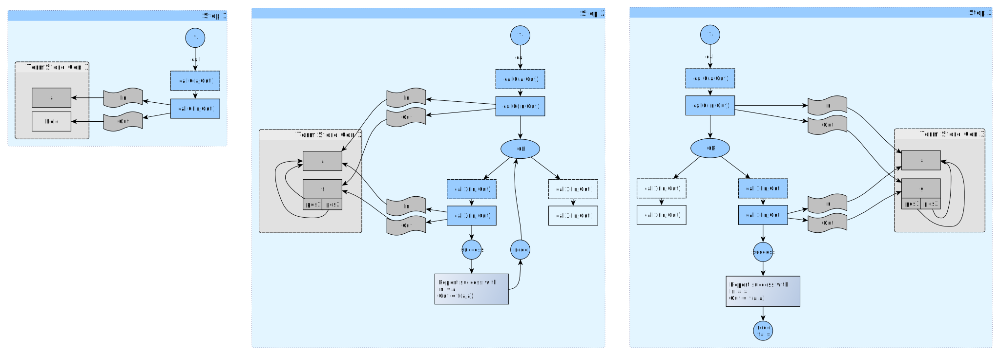

# Salvaging a term out of a dropped search branch

In a normal situation ending in a successful call, one gets to see terms assigned to variables as the computation succeeds and "drops out"
at the bottom of the depth-first search tree (unlike in other programming languages, where one is trained to see a call as coming "back up"
from nested calls, here, the tree stays instantiated, ready to provide a next solution, and we are really "dropping out" at the bottom).



Normal call:

```prolog
call0(In,Out) :- 
   call1(In,Out).
   
call1(In,Out) :-
   Out = f(In,In).
call1(In,Out) :-
   Out = g(In,In).
```

Then the second argument is normally instantiated when the Prolog Processor reports to the Toplevel. Nothing surprising here.

```text
?- call0(a,Out).
Out = f(a, a) ;
Out = g(a, a).
```

## Discard the computation beyond the call of `call1(In,Out)` using _not-not_

```
call0(In,Out) :- 
   \+ \+ call1(In,Out).
   
call1(In,Out) :-
   Out = f(In,In).
call1(In,Out) :-
   Out = g(In,In).
```   

Then the second argument remains uninstantiated and alternative solutions are not attempted. Anything beyond `\+ \+` is 
really executed in a context that is dropped and disappears forever once the computation ends (either succeeds or fails).

```   
?- call0(a,Out).
true.
```   

## Discard the computation beyond the call of `call1(In,Out)` using _throw-catch_

```
call0(In,Out) :- 
   catch(call1(In,Out),_,true).
   
call1(In,Out) :-
   Out = f(In,In), % not a NOP as this might fail if Out is set
   throw("when I say the word, you will forget everything").

call1(In,Out) :-
   Out = g(In,In), % not a NOP as this might fail if Out is set
   throw("when I say the word, you will forget everything").
```   

Then the second argument remains uninstantiated and alternative solutions are not attempted, same as for `\+ \+`.

```   
?- call0(a,Out).
true.
```   

## Salvage a term from the computation beyond the call of `call1(In,Out)` using _throw-catch_

```
call0(In,Out) :- 
   catch(call1(In,Out),portal(_Msg,Out),true).
   
call1(In,Out) :-
   Out = f(In,In), 
   throw(portal("when I say the word, you will salvage a term through the portal",Out)).
   
call1(In,Out) :-
   Out = g(In,In), 
   throw(portal("when I say the word, you will salvage a term through the portal",Out)).
```   

Then we get to keep `Out`. Note how very "un-Prolog-y" this actually is - the term survived backtracking to the catch point!

```   
?- call0(a,Out).
Out = f(a, a).
```   

## Can we perform the portal feat without throwing an exception?

### Serialize it to the outside

One can evidently serialize-out the term to salvage using [`write/2`](https://eu.swi-prolog.org/pldoc/doc_for?object=write/2)
and seralize it back in later using [`read/2`](https://eu.swi-prolog.org/pldoc/doc_for?object=read/2) but is there another way?

### Maybe copying?

[`copy_term/2`](https://eu.swi-prolog.org/pldoc/doc_for?object=copy_term/2) alone won't do, unsurprisingly:

```
call0(In,Out) :- 
   catch(call1(In,Out),_,true).
   
call1(In,Out) :-
   copy_term(f(In,In),Out),
   throw("when I say the word, you will forget everything").
```  

Nope:

```
?- call0(a,Out).
true.
```

### Use `bagof/3` or `findall/3`

You can use [`bagof/3`](https://eu.swi-prolog.org/pldoc/doc_for?object=bagof/3)
(which fails if the memoryholed branch has no solutions) 
or [`findall/3`](https://eu.swi-prolog.org/pldoc/doc_for?object=findall/3)
(which succeeds with an empty bag if the memoryholed branch has no solutions):

```
call0(In,Bag,AnotherOut) :- 
   bagof(X,AnotherOut^call1(In,X,AnotherOut),Bag).

call1(In,Out,AnotherOut) :-
   AnotherOut = "staying invisible 1",
   Out = f(In,In).
   
call1(In,Out,AnotherOut) :-
   AnotherOut = "staying invisible 2",
   Out = g(In,In).   
```

Then `AnotherOut` _stays_ memoryholed, but we recuperate all solutions in `Bag`:

```
?- call0(a,Bag,AnotherOut).
Bag = [f(a, a), g(a, a)].
```

Note the "existential quantification" of `AnotherOut` (`AnotherOut` followed by a caret character `^`)  which indicates
that the `AnotherOut` in the goal given to `bagof/3` shall not be considered the same as the `AnotherOut` in the header:

```
call0(In,Bag,AnotherOut) :- 
   bagof(X,call1(In,X,AnotherOut),Bag).

call1(In,Out,AnotherOut) :-
   AnotherOut = "staying invisible 1",
   Out = f(In,In).
   
call1(In,Out,AnotherOut) :-
   AnotherOut = "staying invisible 2",
   Out = g(In,In).   
```

Then we recuperate 2x1 solutions:

```
?- call0(a,Bag,AnotherOut).
Bag = [f(a, a)],
AnotherOut = "staying invisible 1" ;
Bag = [g(a, a)],
AnotherOut = "staying invisible 2".
```

### Use the Prolog dynamic database.

Another way of doing it (but don't do it this way) is storing the term to salvage in the Prolog dynamic database (see also
[the wiki entry](https://www.swi-prolog.org/howto/database.txt)).

```
:- dynamic salvage/2.

call0(In,Out) :- 
   catch(call1(In,Out),_,true),
   salvage(foo,Out).
   
call1(In,_Out) :-
   assertz(salvage(foo,f(In,In))),
   throw("when I say the word, you will forget everything").
```   

It certainly works:

```
?- call0(a,Out).
Out = f(a, a).

?- salvage(X,Y).
X = foo,
Y = f(a, a).
```
