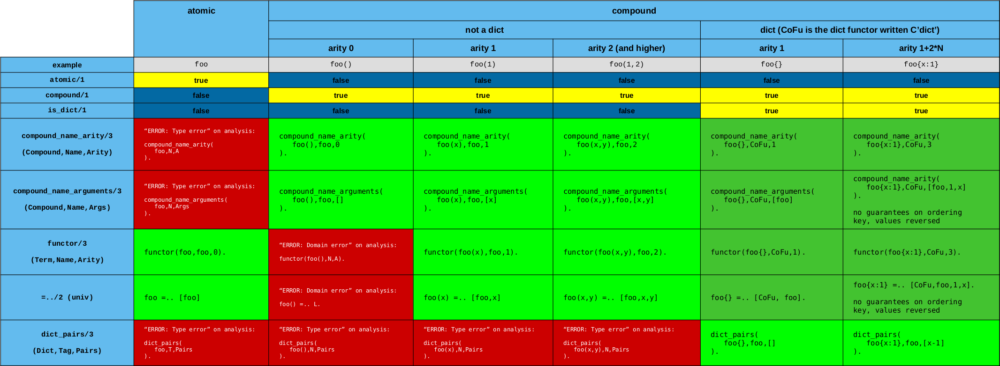

# Predicates for Analyzing/Constructing a Term

## Vocabulary

- *Analyzing/Constructing* a term or 
- *Disassembling/Assembling* a term or maybe
- *Decomposing/Composing* a term
- Is seem to gravitate towards *Analyzing/Assembling*. OK!
- In Clojure there is also ["Destructuring"](https://clojure.org/guides/destructuring), which is pattern-matching a term and disassembling it into parts
  like one-way unification. In Prolog this would by copy_term, followed by unification.
  - This is also how calls work in [Erlang](https://en.wikipedia.org/wiki/Erlang_(programming_language))
  - The [Picat](http://picat-lang.org/) language both has both unification and pattern matching in the head of clauses.

Note these definitions from the Prolog ISO standard's glossary on pages 2-10 (as listed [here for example](https://stackoverflow.com/questions/49898738/is-this-prolog-terminology-correct-fact-rule-procedure-predicate)):

- *arity*: The number of arguments of a compound term. Syntactically, a non-negative integer associated with a functor or predicate.
- *functor*: An identifier together with an arity.
- *predicate*: An identifier together with an arity.
- *predicate indicator*: A compound term A/N, where A is an atom and N is a non-negative integer, denoting one particular procedure
- *procedure*: A control construct, a built-in predicate, or a user-defined procedure. A procedure is either static or dynamic. A procedure is either private or public.

So, _functor_ and _predicate_ are used the same way: to designate a particular program construct which is implemented by a
_procedure_ ... whereas _predicate indicator_ is a concrete structure used by a program, with a certain form: `Name/Arity`.
Although I feel that *functor* is more a syntactic concept, whereas a *predicate* comes with a specification, though not
necessarily the code of a *procedure*.

_functor_ is now a [concept in Category Theory](https://en.wikipedia.org/wiki/Functor) (since '45 actually) which has nothing
to do with the Prolog functor. It's also used in [linguistics](https://en.wikipedia.org/wiki/Function_word); maybe it got into Prolog from there?

## Predicates

These are predicates found in the section [Analysing and Constructing Terms](https://eu.swi-prolog.org/pldoc/man?section=manipterm) of the SWI-Prolog manual.

- [`compound_name_arity/3`](https://eu.swi-prolog.org/pldoc/doc_for?object=compound_name_arity/3) (_non_ ISO standard)
- [`compound_name_arguments/3`](https://eu.swi-prolog.org/pldoc/doc_for?object=compound_name_arguments/3) (_non_ ISO standard)
   - ... and the related [`arg/3`](https://eu.swi-prolog.org/pldoc/doc_for?object=arg/3) (ISO standard)
- [`functor/3`](https://eu.swi-prolog.org/pldoc/doc_for?object=functor/3) (ISO standard)
- [`=../`](https://eu.swi-prolog.org/pldoc/doc_for?object=(%3D..)/2) (ISO standard)

And this is one is for distinguishing _compound_ terms from _atomic_ terms. Both are complements of each other: Anything that
is not a fresh variable is either _compound_ or _atomic_ (at least in the current implementation). Atoms are a sublcass
of the atomic terms and are tested with [`atom/1`](https://eu.swi-prolog.org/pldoc/doc_for?object=atom/1).

- [`compound/1`](https://eu.swi-prolog.org/pldoc/doc_for?object=compound/1) (ISO standard)
- [`atomic/1`](https://eu.swi-prolog.org/pldoc/doc_for?object=atomic/1) (ISO standard)

For dicts, it is best to use 

- [`dict_pairs/3`](https://eu.swi-prolog.org/pldoc/doc_for?object=dict_pairs/3)

Which is more elegant than `compound_name_arguments/3`

## Overview 



**Other formats**

- [Analyzing and Constructing Terms: LibreOffice Calc](term_analysis_construction.ods) 
- [Analyzing and Constructing Terms: PDF](term_analysis_construction.pdf)

## A note from O'Keefe's "Tha Craft of Prolog"

In O'Keefe's **"The Craft of Prolog"** (MIT Press, 1990), we read on p. 145:

The first is the meta-logical operations `functor/3` and `arg/3`, particularly the latter. A word of warning here: 
it is almost always a bad idea to use `=../2`. Do not use `=../2` to locate a particular argument of some term. 

For example, instead of 

```text
Term =.. [_F,_,ArgTwo|_]
```

you should write

```text
arg(2, Term, ArgTwo)
```

You will find it easier to get the explicit number "2" right than to write the correct 
number of "don't care" variables in the call to `=../2`.

Other people reading your program will find the call to `arg/3` a much clearer expression of your intent.
Your program will also be more efficient. Even if you need to locate several arguments of a term, it is 
clearer and more efficient to write

```text
arg(1, Term, First),
arg(3, Term, Third),
arg(4, Term, Fourth)
```

than to write

```text
Term =.. [_,First,_,Third,Fourth|_]
```

Do not use `../2` when you know the functor. (That is, when you know both the function symbol and the arity.)

For example, one Prolog programmer actually wrote the following code:

```text
add_date(OldItem, Date, NewItem) :- 
   OldItem =.. [item, Type, Ship, Serial],
   NewItem =.. [item,Type,Ship,Serial,Date].
```

This could have been expressed more clearly and more efficiently as

```text
add_date(OldItem, Date, NewItem) :-
   OldItem = item(Type,Ship,Serial),
   NewItem = item(Type,Ship,Serial,Date).
```

or, even better, as

```text
add_date(item(Type,Ship,Serial),Date,item(Type,Ship,Serial,Date)).
```

