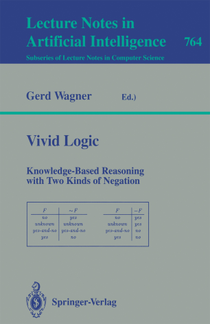

# Vivid Logic

Some notes based on the book:

**Vivid Logic: Knowledge-Based Reasoning with Two Kinds of Negation**

- Gerd Wagner
- Lecture Notes in Artificial Intelligence 764
- Springer Verlag Berlin Heidelberg 1994
- https://www.springer.com/gp/book/9783540576044

For some reason I got ahold of the copy of the Universitätsbibliothek Paderborn. A historical artifact!

The following paper is a chapter of the above:

[Logic programming with strong negation and inexact predicates](http://citeseerx.ist.psu.edu/viewdoc/summary?doi=10.1.1.975.3445&rank=1)

- Gerd Wagner
- 1991
- 2do. Congreso Argentino de Ciencias de la Computación

